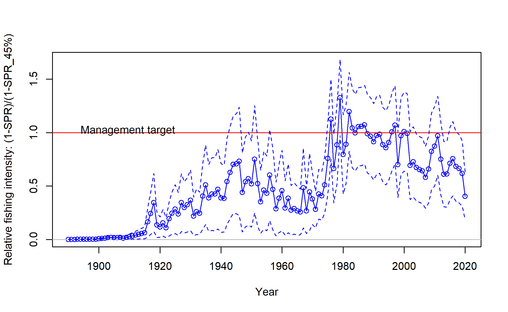

# Executive Summary{-}

## Stock{-}

This assessment reports the status of `r spp`, (_`r spp.sci`_) off the US West coast using data through 2020. The resource is modeled as a single stock; however, sablefish disperse to and from offshore seamounts along the coastal waters of the continental U.S., Canada, and Alaska and across the Aleutian Islands to the western Pacific. Their movement is not explicitly accounted for in this analysis.

## Landings{-}

A variety of sources were used to reconstruct state-specific historical sablefish landings (i.e., fish brought to market), creating a series of landings from 1890 to present. In general, these reconstructions are more reliable than those for many other groundfish species because of the consistent identification of sablefish to the species level. Historical-landings reconstructions for sablefish have been completed for California, Oregon, and Washington, extending landings to the beginning of the U.S. West Coast sablefish fishery (Figures \ref{fig:removals} and \ref{fig:catch_comparison}).
Fishery discard rates and weights were fit within the assessment model, i.e., simultaneous estimation of total catches and other model parameters. This internal estimation can result in model estimates of total mortality that differ between stock assessments even when the landings inputs remain unchanged due to changes in fixed and estimated parameter values, priors, or parameterizations. Model estimates of fishery discards resulted in model estimated total dead catches that were an average of `r paste0(round(model$catch %>% select(Yr, Fleet, Obs, kill_bio   ) %>% filter(Fleet !=2 & Yr > 2010) %>% mutate(pd = (kill_bio-Obs)/Obs) %>%summarise(mean(pd))*100,2),"%")` larger than the landings input into the stock assessment model over the last decade.
Historically, sablefish landings were just below recent landings (<4,000 mt) until the end of the 1960s and were primarily harvested by fixed gear (Figure \ref{fig:removals}). Large catches (24,395 mt) by foreign vessels fishing pot gear in 1976 resulted in the largest landings reported in a single-year. A rapid rise in domestic pot and trawl landings followed this peak removal, such that, on average, nearly 8,400 mt of sablefish were landed per year between 1976 and 1990. Subsequently, annual landings have remained below 9,000 mt and been divided approximately 67%/33% between fixed and trawl gears, respectively, during the most recent decade. An Individual Fishing Quota (IFQ) program, referred to as "catch shares", was implemented for the U.S. West Coast trawl fleet beginning in 2011. Gear switching is allowed within the program such that fixed gear can be used to catch sablefish under trawl IFQ. This has resulted in changes in fleet behavior, the distribution of fishing effort, and discarding rates for both fisheries. Complete observer coverage on all vessels fishing IFQ quota became mandatory at the start of the program, while coverage in the other sectors remained stratified by port. The lack of historical observer coverage, and consequently information on total catch and age and length compositions, thus contributes to uncertainty regarding selectivity and retention during the historical period.

\begingroup\fontsize{10}{12}\selectfont
\begingroup\fontsize{10}{12}\selectfont

\begin{longtable}[t]{r>{\centering\arraybackslash}p{1.83cm}>{\centering\arraybackslash}p{1.83cm}>{\centering\arraybackslash}p{1.83cm}>{\centering\arraybackslash}p{1.83cm}>{\centering\arraybackslash}p{1.83cm}}
\caption{Recent landings by fleet, total landings summed across fleets, and the total mortality including discards.\label{tab:removalsES}}\\
\toprule
Year & Fixed-gear & Trawl & Total Landings & Total Dead\\
\midrule
\endfirsthead
\caption[]{Recent landings by fleet, total landings summed across fleets, and the total mortality including discards. \textit{(continued)}}\\
\toprule
Year & Fixed-gear & Trawl & Total Landings & Total Dead\\
\midrule
\endhead

\endfoot
\bottomrule
\endlastfoot
2011 & 4420.85 & 1728.40 & 6149.25 & 6253.97\\
2012 & 3670.22 & 1514.58 & 5184.80 & 5283.60\\
2013 & 2585.07 & 1402.13 & 3987.20 & 4050.48\\
2014 & 2924.26 & 1292.20 & 4216.46 & 4294.90\\
2015 & 3554.94 & 1470.29 & 5025.23 & 5105.52\\
2016 & 3829.86 & 1475.95 & 5305.81 & 5401.39\\
2017 & 3680.67 & 1669.97 & 5350.64 & 5465.76\\
2018 & 3648.68 & 1478.26 & 5126.94 & 5220.22\\
2019 & 3568.27 & 1625.44 & 5193.71 & 5372.81\\
2020 & 2660.03 & 1102.72 & 3762.75 & 3882.69\\*
\end{longtable}
\endgroup{}
\endgroup{}

{width=100% height=100% alt="Catches by Fleet, all years"}

\clearpage

## Data and Assessment{-}

The last benchmark stock assessment for sablefish took place during 2019 (@Haltuch2019b), preceded by an update assessment during 2015 (@johnson2016sablefish).  The present (2021) update assessment used the most recent version of the Stock Synthesis modeling platform (3.30), and bridged between the sub-version used in the benchmark (v3.30.09, released 2019-03-09) and the latest release (v3.30.16, released 2020-09-03). Primary data sources include landings and age-composition data from the retained catch (Figure \ref{fig:data-plot}). For recent years, data on the discarded portion of commercial catch are available, including discard lengths, rates, and mean observed individual body weight of the discarded catch. The relative index of abundance estimated from the National Marine Fisheries Service (NMFS) Northwest Fisheries Science Center (NWFSC) West Coast Groundfish Bottom Trawl (WCGBT) Survey, which includes depths from 55 - 1,280 m, represents the primary source of information on the stock’s trend and was updated to include the most recent data, covering the period 2003-2019 (Figure \ref{fig:WCGBTindexest}); the updated index was consistent with the previous (Figures \ref{fig:WCGBTQQ} and \ref{fig:WCGBTindexcompare}). Note that the WCGBT Survey does not access the closed Cowcod Conservation areas in southern California, and was not performed in 2020 due to the global SARS-CoV-2 pandemic. Other, discontinued, survey indices contribute information on trend and sablefish demographics: (a) NWFSC Slope Survey conducted from 1998-2002, (b) Alaska Fisheries Science Center (AFSC) Slope Survey (1997-2001), and (c) AFSC/NWFSC Triennial Shelf Survey (1980-2004). Additionally, an environmental time-series of sea level was used as a survey index of recruitment in the base model; this time-series was updated with the latest tide gauge data (Figures \ref{fig:ssh-plot} and \ref{fig:ssh-df}).

All externally estimated model parameters, (a) weight-length relationship, (b) maturity schedule, and (c) fecundity relationships remained unchanged from the 2019 benchmark assessment. As in previous assessments, growth and natural mortality were estimated using sex-specific relationships. Uncertainty in recruitment was included by estimating a full time-series of deviations from the stock-recruitment curve. The ‘one-way-trip’ nature of the time-series does not facilitate estimation of the steepness parameter (h) of the stock-recruitment relationship. Therefore, h was fixed at 0.7, similar to values used on other groundfish stock assessments, and was explored via sensitivity analysis in 2019; we explore information regarding h via likelihood profiles.
During the 2019 assessment, a vast number of historical management actions were evaluated and condensed to a subset that were most likely to have had a direct influence on fishery behavior (either sorting and retention, selectivity, or both). These time periods were used to define time blocks to reduce the complexity of selectivity and retention parameterizations. The 2019 benchmark assessment utilized the same general structure as the 2011 assessment, with the addition of full retention for the trawl fishery after the implementation of the IFQ program in 2011. 

During the addition of new data for this update assessment, modelers identified a large influx of younger, small fish observable in the age compositions of commercially landed catch, which was also visible in the discard length compositions of those commercial fleets (Figure \ref{fig:discard_lencomps}). This latter dataset was not used in the 2019 benchmark, nor were any commercial length compositions, due to conflicts between the age and length data. Absent the data or flexibility to account for increased discarding, a model which conformed to the Terms of Reference for an update assessment was unable to satisfactorily fit to the composition data from the two commercial fleets (Figures \ref{fig:torafleet1agecomps} and \ref{fig:torafleet3agecomps}) nor the WCGBTS survey (Figure \ref{fig:torafleet8lencomps}), and greatly overestimated the 2019 index (Figure \ref{fig:torapanel}). We rectify this issue by re-introducing the discard length compositions and time-blocking the retention curve to include a new block for the final two years of the model period (2019-2020; the benchmark model's terminal period for retention selectivity ran from 2011-2017). This adjustment resolved the aforementioned model fit issues (Figures   \ref{fig:torcfleet8lencomps}-\ref{fig:basepanel}). 

{width=100% height=100% alt="TWL Discard Lcomps"}

Aging error, both precision and accuracy, was extensively investigated during the 2011 assessment but remains unresolved given the lack of an age validation study for sablefish. The age error analysis for this assessment used the same software and methods as the 2019 assessment, and the 2015 update and 2011 assessment before it. The larger number of between-lab reads from the AFSC and the NWFSC available for the 2019 assessment showed a small amount of variability between laboratories. Therefore, this analysis uses the between-lab reads as well as the double reads from the NWFSC, treating them both as unbiased but potentially non-linearly variable. The age imprecision was such that by age 50 observed ages could differ from true ages by up to 16-17 years. The potential for underestimating or overestimating the age of the oldest fish still remains, and thus, the potential for aging bias remains a source of uncertainty.

## Stock Biomass{-}
During the first half of the 20th century it is estimated that sablefish were exploited at relatively modest levels. Modest catches continued until the 1960s, along with a higher frequency of above average, but uncertain, estimates of recruitment through the 1970s. The spawning stock biomass increased during the 1940s to 1970s. Subsequently, biomass is estimated to have declined between the mid-1970s and the early 2010s, with the largest peaks in harvests during the 1970s followed by harvests that were, on average, higher than pre-1970s harvest through the 2000s. At the same time, there were a higher frequency of generally lower than average recruitments from the 1980s forward. Despite estimates of harvest rates that were largely below overfishing rates from the 1990s forward and a few high recruitments from the 1980s forward, the spawning biomass has only recently begun to increase. This stock assessment does suggest spawner per recruitment rates higher than the target during some years from the 1990s forward for two reasons. First, there have been many years with lower than expected recruitment. Second, stock assessment estimates of unfished spawning biomass have been steadily declining in each subsequent assessment since 2007. Estimates of unfished biomass scale catch advice.

Although the relative trend in spawning biomass is robust to uncertainty in the leading model parameters, the productivity of the stock is uncertain due to confounding of natural mortality, absolute stock size, and productivity. The estimates of uncertainty around the point estimate of unfished stock size are large, suggesting that the unfished spawning biomass could range from just under `r round(derived_quants[derived_quants$Label == "SSB_unfished", "lci"])` mt to `r round(derived_quants[derived_quants$Label == "SSB_unfished", "uci"])` mt. The point estimate of `r model$endyr+1` spawning biomass from the base model is `r round(derived_quants[derived_quants$Label == "SSB_2021", "Value"])`, however, the ∼95% interval ranges broadly from `r noquote(ssbes$Interval[nrow(ssbes)])` mt. The point estimate of `r model$endyr+1` spawning biomass relative to an unfished state (i.e., depletion) from the base model is `r  round(derived_quants[grep('Bratio_2021',model$derived_quants$Label),'Value']*100,2)`% of unexploited levels (∼95\% interval: `r derived_quants[grep('Bratio_2021',derived_quants$Label),'lci']*100`%-`r derived_quants[grep('Bratio_2021',derived_quants$Label),'uci']*100`%).

\begingroup\fontsize{10}{12}\selectfont
\begingroup\fontsize{10}{12}\selectfont
\begin{longtable}[t]{r>{\centering\arraybackslash}p{1.57cm}>{\centering\arraybackslash}p{1.57cm}>{\centering\arraybackslash}p{1.57cm}>{\centering\arraybackslash}p{1.57cm}>{\centering\arraybackslash}p{1.57cm}>{\centering\arraybackslash}p{1.57cm}}
\caption{\label{tab:ssbES}Estimated recent trend in spawning biomass and the fraction unfished and the 95 percent intervals.}\\
\toprule
Year & Spawning Biomass (mt) & Lower Interval & Upper Interval & Fraction Unfished & Lower Interval & Upper Interval\\
\midrule
\endfirsthead
\caption[]{Estimated recent trend in spawning biomass and the fraction unfished and the 95 percent intervals. \textit{(continued)}}\\
\toprule
Year & Spawning Biomass (mt) & Lower Interval & Upper Interval & Fraction Unfished & Lower Interval & Upper Interval\\
\midrule
\endhead

\endfoot
\bottomrule
\endlastfoot
2011 & 80351.5 & 32648.13 & 128054.9 & 0.48 & 0.32 & 0.63\\
2012 & 79223.0 & 31838.52 & 126607.5 & 0.47 & 0.31 & 0.63\\
2013 & 79605.1 & 32059.90 & 127150.3 & 0.47 & 0.31 & 0.63\\
2014 & 80187.9 & 32563.52 & 127812.3 & 0.47 & 0.31 & 0.64\\
2015 & 79676.1 & 32447.44 & 126904.8 & 0.47 & 0.31 & 0.63\\
2016 & 78633.2 & 31824.56 & 125441.8 & 0.47 & 0.31 & 0.62\\
2017 & 79326.7 & 31972.79 & 126680.6 & 0.47 & 0.31 & 0.63\\
2018 & 80687.2 & 32503.64 & 128870.8 & 0.48 & 0.31 & 0.64\\
2019 & 83925.1 & 33936.02 & 133914.2 & 0.50 & 0.33 & 0.67\\
2020 & 90756.5 & 37136 & 144377.0 & 0.54 & 0.35 & 0.72\\
2021 & 97801.9 & 40802.42 & 154801.4 & 0.58 & 0.38 & 0.77\\*
\end{longtable}
\endgroup{}
\endgroup{}

{width=100% height=100% alt="Relative SPR vs B Ratio"}

\quad

## Recruitment{-}
Sablefish recruitment is estimated to be quite variable with large amounts of uncertainty in individual recruitment events. A period with generally higher frequencies of strong recruitments spans from the early 1950s through the 1970s, followed by a lower frequency of large recruitments during 1980 forward, contributing to stock declines. The period with a higher frequency of high recruitments contributed to a large increase in stock biomass that has subsequently declined throughout much of the 1970s forward. Less frequent large recruitments during the mid-1980s through 1990 slowed the rate of stock decline, with another series of large recruitments during 1999 and 2000 leading to a leveling off in the stock decline. The above-average cohorts from 2008, 2010, 2013, and 2016 are contributing to a slightly increasing spawning stock size. 

{width=100% height=70% alt="Recruitment Deviates with Uncertainty"}
\newline

{width=100% height=70% alt="Age 0 Recruits"}

\clearpage

## Reference Points{-}

\textrefpt

\quad

\begingroup\fontsize{10}{12}\selectfont
\begingroup\fontsize{10}{12}\selectfont

\begin{longtable}[t]{r>{\centering\arraybackslash}p{2cm}>{\centering\arraybackslash}p{2cm}>{\centering\arraybackslash}p{2cm}}
\caption{\label{tab:referenceES}Summary of reference points and management quantities, including estimates of the  95 percent intervals.}\\
\toprule
 & Estimate & Lower Interval & Upper Interval\\
\midrule
\endfirsthead
\caption[]{Summary of reference points and management quantities, including estimates of the  95 percent intervals. \textit{(continued)}}\\
\toprule
 & Estimate & Lower Interval & Upper Interval\\
\midrule
\endhead

\endfoot
\bottomrule
\endlastfoot
Unfished Spawning Biomass (mt) & 168875 & 107749 & 230001\\
Unfished Age 4+ Biomass (mt) & 393647 & 242084 & 545209\\
Unfished Recruitment (R0) & 16392 & 6585 & 26197\\
Spawning Biomass (mt) (2021) & 97802 & 40801 & 154802\\
Fraction Unfished (2021) & 0.58 & 0.38 & 0.77\\
Proxy Spawning Biomass (mt) SB40 Percent & 67550 & 43099 & 92001\\
SPR Resulting in SB40 Percent & 0.464286 &  & \\
Exploitation Rate Resulting in SB40 Percent & 0.043 & 0.04 & 0.05\\
Yield with SPR Based On SB40 Percent (mt) & 8209 & 3857 & 12562\\
Proxy Spawning Biomass (mt) (SPR45) & 64848 & 41376 & 8832\\
Exploitation Rate Corresponding to SPR45 & 0.045 & 0.04 & 0.05\\
Yield with SPR45 at SB SPR (mt) & 8350 & 3924 & 12776\\
Spawning Biomass (mt) at MSY (SB MSY) & 41701 & 26527 & 56876\\
SPR MSY & 0.327 & 0.32 & 0.33\\
Exploitation Rate Corresponding to SPR MSY & 0.07 & 0.06 & 0.08\\
MSY (mt) & 9024 & 4242 & 13806\\*
\end{longtable}
\endgroup{}
\endgroup{}

{width=100% height=70% alt="RelSBnoforecast"}

\clearpage

## Exploitation Status{-}

\textexplstatus

\begingroup\fontsize{10}{12}\selectfont
\begingroup\fontsize{10}{12}\selectfont

\begin{longtable}[t]{r>{\centering\arraybackslash}p{0.92cm}>{\centering\arraybackslash}p{0.92cm}>{\centering\arraybackslash}p{0.92cm}>{\centering\arraybackslash}p{0.92cm}>{\centering\arraybackslash}p{0.92cm}>{\centering\arraybackslash}p{0.92cm}>{\centering\arraybackslash}p{0.92cm}}
\caption{Estimates of total dead catch (mt), relative 1-spawning potential ratio (SPR; 1-SPR/1-
SPRTarget=0.45\%), and exploitation rate (catch/biomass of age-4+) from the base model. Approximate
95\% intervals follow in parentheses.}\\

\toprule
Year & Total Catch & Rel 1-SPR & Lower Interval & Upper Interval & Exploitation Rate & Lower Interval & Upper Interval\\
\midrule
\endfirsthead
\caption[]{Estimated recent trend in age-0 recruitment (1000s), and recruitment deviations and the 95 percent intervals. \textit{(continued)}}\\
\toprule
Year & Total Catch & Rel 1-SPR & Lower Interval & Upper Interval & Exploitation Rate & Lower Interval & Upper Interval\\
\midrule
\endhead

\endfoot
\bottomrule
\endlastfoot
2011 & 6149.25 & 0.97 & 0.60 & 1.34 & 0.03 & 0.01 & 0.05\\
2012 & 5184.8 & 0.75 & 0.41 & 1.09 & 0.02 & 0.01 & 0.04\\
2013 & 3987.2 &0.61 & 0.31 & 0.92 & 0.02 & 0.01 & 0.03\\
2014 & 4216.46 & 0.61 & 0.30 & 0.92 & 0.02 & 0.01 & 0.03\\
2015 & 5025.23 & 0.71 & 0.37 & 1.05 & 0.02 & 0.01 & 0.04\\
2016 & 5305.81 & 0.76 & 0.41 & 1.10 & 0.03 & 0.01 & 0.04\\
2017 & 5350.64 & 0.68 & 0.36 & 1.01 & 0.02 & 0.01 & 0.04\\
2018 & 5126.94 & 0.66 & 0.34 & 0.98 & 0.02 & 0.01 & 0.04\\
2019 & 5193.71 & 0.62 & 0.31 & 0.92 & 0.02 & 0.01 & 0.04\\
2020 & 3762.75 & 0.40 & 0.18 & 0.63 & 0.01 & 0.01 & 0.02\\*
\end{longtable}
\endgroup{}
\endgroup{}

{width=100% height=50% alt="Relative SPR vs B Ratio"}

{width=100% height=50% alt="Relative SPR vs B Ratio"}

\clearpage

## Management Performance{-}

Sablefish management includes a rich history of seasons, size-limits, trip-limits, and a complex permit system. Managers divide coast-wide yield targets from sablefish stock assessment among the fleets, fishery sectors (including both limited entry and open access), as well as north and south of 36◦ N latitude. Peak catches occurred during the late 1970s just prior to the imposition of the first catch limits. Over the last decade, the total estimated dead catch has been 55% of the sum of the overfishing limits (previously termed ABCs) and 65% of the annual catch limits (previously termed OYs).

\begingroup\fontsize{10}{12}\selectfont
\begingroup\fontsize{10}{12}\selectfont

\begin{longtable}[t]{r>{\centering\arraybackslash}p{1.83cm}>{\centering\arraybackslash}p{1.83cm}>{\centering\arraybackslash}p{1.83cm}>{\centering\arraybackslash}p{1.83cm}>{\centering\arraybackslash}p{1.83cm}}
\caption{Recent trend in the overfishing limits (OFL), the annual catch limits (ACLs), the total landings, and total mortality (mt). Note that the Acceptable Biological Catches (ABCs) and ACLs are equal because the stock is estimated to be above 40\% of the unfished spawning biomass.}\\
\toprule
Year & OFL & ACL & Landings & Total Mortality\\
\midrule
\endfirsthead
\caption[]{Recent trend in the overfishing limits (OFL), the acceptable biological catches (ABC \textit{(continued)}}\\
\toprule
Year & OFL & ACL & Landings & Total Mortality\\
\midrule
\endhead

\endfoot
\bottomrule
\endlastfoot
2011 & 8,808 & 6,813 & 6,149.25 & 6,253.97\\
2012 & 8,623 & 6,605 & 5,184.80 & 5,283.59\\
2013 & 6,621 & 5,451 & 3,987.20 & 4,050.48\\
2014 & 7,158 & 5,909 & 4,216.46 & 4,294.90\\
2015 & 7,857 & 6,512 & 5,025.23 & 5,105.53\\
2016 & 8,526 & 7,121 & 5,305.81 & 5,401.39\\
2017 & 8,050 & 7,117 & 5,350.64 & 5,465.75\\
2018 & 8,239 & 7,419 & 5,126.94 & 5,220.23\\
2019 & 8,489 & 7,750 & 5,193.71 & 5,372.81\\
2020 & 8,648 & 7,896  & 3,762.75 & 3,882.70\\*
2021 & 9,402 & 8,791 &  - & -\\*
2022 & 9,005 & 8,375 &  - & -\\*
\end{longtable}
\endgroup{}
\endgroup{}

\clearpage

## Unresolved Problems and Major Uncertainties{-}
The data available for sablefish off the U.S. West Coast are not informative with respect to absolute size and productivity. This is, in part, due to the one-way-trip nature of the historical series (i.e., a slow and steady decline in spawning biomass), which can be consistent with a larger less productive stock, a smaller more productive stock, or many combinations in between. While the historical catches provide some information about the minimum stock size necessary to remove the catches from the population, there is limited information in the data regarding the upper limit of the stock size. The above factors are also confounded by movement of sablefish between the region included in this assessment and regions to the north. Likelihood profiles, parameter estimates, and general model behavior illustrate that small changes in many parameters can result in different management reference points. However, because leading model parameters, such as natural mortality, selectivity, and historical recruitments, are estimated within the stock assessment model, the uncertainty about these estimates remains large and typically overlapped among the investigated models. 
The uncertainty will remain until a more informative time-series, better quality demographic and biological information are accumulated, or a range-wide analysis is completed for sablefish.

Uncertainty in the current aging methods (both bias and imprecision), as well as relatively sparse fishery sampling, result in age data that potentially variable. Furthermore, because sablefish grow rapidly, nearing asymptotic length in their first decade of life, length data is not particularly inFormative about historical patterns in recruitment. The patterns observed in historical sablefish recruitment suggest that the stock trajectory (via shifts in recruitment strength) is closely linked to productivity regimes in the California Current. Uncertainty in future environmental conditions, changes in the timing, dynamics, and productivity of the California Current ecosystem via cli- mate change or cycles similar to the historical period should be considered a significant source of uncertainty in all projections of stock status.
The ongoing WCGBT Survey is a fairly precise relative index of abundance over a broad demo- graphic component of the stock, but it does not survey the entire stock as sablefish reside in waters deeper than 1280 m, the survey limit, and to the north. Therefore, a portion of the stock is unobserved. This index has the potential to inform future stock assessments about the scale of the population relative to catches being removed, however such information will require contrast in the observed survey trend.

## Harvest Projections{-}
Previous sablefish stock assessments have been designated as Category 1 stock assessments. Thus, projections and decision tables are based on $P^*$=0.45 and the values of $\sigma$ adopted by the Pacific Fisheries Management Council for stock projections. The time series of multiplicative buffer fractions that are a function of $P^*$ and the time series of $\sigma$s provide the multipliers on the overfishing limit; these values are all less than 1. The multipliers are combined with the 40-10 harvest control rule to calculate overfishing limits, acceptable biological catches, and annual catch limits. The total catches in `r model$endyr+1` and `r model$endyr+2` were set at the Pacific Fisheries Management Council Groundfish Management Team requested values, below that Pacific Fisheries Management Council annual catch limits for sablefish. The average ratio between GMT-specified `r paste0(range(model$endyr+1, model$endyr+2), collapse = "-")` catches were used to distribute catches among the fisheries for forecasted years.

\textprojections

\begingroup\fontsize{10}{12}\selectfont
\begingroup\fontsize{10}{12}\selectfont

\begin{longtable}[t]{r>{\centering\arraybackslash}p{1.83cm}>{\centering\arraybackslash}p{1.83cm}>{\centering\arraybackslash}p{1.83cm}>{\centering\arraybackslash}p{1.83cm}>{\centering\arraybackslash}p{1.83cm}}
\caption{Projections of potential OFLs (mt), ABCs (mt), estimated spawning biomass and fraction unfished. The total catches in 2021 and 2022 were set at the PFMC Groundfish Management Team requested values of 7,405 mt for 2021 and 7,055 mt for 2022 and are therefore lower than the ACL or ABC for those years. Similarly, the predicted OFLs presented here for 2021 and 2022 are not the same as those used by the GMT to define fixed catches in 2021-2022; see Table \ref{tab:manageES} for GMT-defined ACLs and OFLs in 2021 and 2022.}\\
\toprule
Year & Predicted OFL (mt) & ABC Catch (mt) & Age 4+ Biomass (mt) & Spawning Biomass (mt) & Fraction Unfished\\
\midrule
\endfirsthead
\caption[]{Projections of potential OFLs (mt), ABCs (mt), estimated spawning biomass and fraction unfished. \textit{(continued)}}\\
\toprule
Year & Predicted OFL (mt) & ABC Catch (mt) & Age 4+ Biomass (mt) & Spawning Biomass (mt) & Fraction Unfished\\
\midrule
\endhead

\endfoot
\bottomrule
\endlastfoot
2021 & 13117.00 & 7405.00 & 265655 & 97801.9 & 0.58\\
2022 & 12515.20 & 7055.00 & 261481 & 99956.5 & 0.59\\
2023 & 11577.10 & 10824.60 & 253540 & 99449.9 & 0.59\\
2024 & 10669.80 & 9922.92 & 246090 & 95943.8 & 0.57\\
2025 & 10120.60 & 9371.67 & 241976 & 93063.3 & 0.55\\
2026 & 9837.41 & 9070.09 & 238823 & 90925.0 & 0.54\\
2027 & 9742.34 & 8933.73 & 236280 & 89290.8 & 0.53\\
2028 & 9735.24 & 8888.27 & 234037 & 87941.5 & 0.52\\
2029 & 9747.17 & 8860.17 & 231955 & 86743.8 & 0.51\\
2030 & 9746.00 & 8810.38 & 229993 & 85644.5 & 0.51\\
2031 & 9725.92 & 8753.33 & 228162 & 84634.2 & 0.50\\
2032 & 9691.91 & 8683.95 & 226462 & 83707.8 & 0.50\\*
\end{longtable}
\endgroup{}
\endgroup{}

\clearpage

## Decision Table{-}
The decision table reports 12-year projections for alternate states of nature (columns) and management options (rows). The results of this table are conditioned on the Groundfish Management Team specified catches for `r model$endyr+1` and `r model$endyr+2`, which are below the already-specified annual catch limits approved by the Pacific Fisheries Management Council.
Uncertainty in management quantities for the decision table was characterized using the asymptotic standard deviation for the `r model$endyr+1` spawning biomass from the base model. Specifically, the `r model$endyr+1` spawning biomass for the high and low states of nature are given by the base model mean ±1.15·standard deviation (i.e., the 12.5th and 87.5th percentiles). A search across fixed values of $R_0$ was used to attain the `r model$endyr+1` spawning biomass values for the high and low states of nature. The base catch streams were based on the 40-10 harvest control rule and a $P^*= 0.45$ buffer vector. This is presented as the middle row of the decision table to be consistent with the central panel being the base case run at the agreed-upon buffer level. To replicate a request of the Groundfish Management Team representative at the 2019 STAR panel, the additional catch streams were set using the Category 1 values of $P^*$ = 0.35 and $P^*$ = 0.40; these are presented as the first and third rows of the decision table, respectively.

Spawning stock biomass in `r model$endyr+1` ranges across the three states of nature from 64,916 to 131,513 mt, with corresponding stock status ranging from 51% to 63% of the unfished stock size using the Category 1 P* = 0.45 catch stream. The decision table suggests that all catch scenarios under both the base and high state of nature result in increases in stock size such that the stock remains either at or above the target stock size at the end of the projection period. However, all catch scenarios under the low state of nature result in declines in stock size throughout the projection period, driving the stock into the precautionary zone in all low-state catch scenarios by year 2029.

\clearpage

\begingroup\fontsize{9}{11}\selectfont
\begingroup\fontsize{9}{11}\selectfont
\begin{longtable}{lll|ll|ll|ll}
\caption{Decision table of 12-year projections of spawning stock biomass (SSB) and \% unfished (depletion) for alternative states of nature (columns) and management options (rows) beginning in 2021. Low and high states of nature are based on the 2021 SSB $\pm$ 1.15$\cdot$base model SSB standard deviation and the resulting unfished recruitment was used for the projections. Results are conditioned on the 2021 and 2022 catches, provided by the Pacific Fisheries Management Council Groundfish Management Team (GMT), being achieved exactly. The alternative catch streams are based on the GMT's requested P$^*$ values of 0.35 and 0.40. Note that values for the agreed-upon buffer level of P* = 0.45  is presented as the middle row of the decision table to be consistent with the central panel being the base case run at the correct buffer level. Catches are total dead biomass, i.e., dead discard plus catch.} \\ 
  \hline
Year&Catch&Total& \multicolumn{2}{c}{Low state (0.25)} & \multicolumn{2}{c}{Base (0.5)} & \multicolumn{2}{c}{High state (0.25)} \\ 
scenario & &catch& SSB & Depletion & SSB & Depletion & SSB & Depletion \\ 
\hline \endfirsthead
\multicolumn{9}{l}{\footnotesize Decision table continued from previous page.} \\
\hline \endhead
\hline
\multicolumn{9}{l}{\footnotesize Continued on next page.} \\
\endfoot
\endlastfoot
\hline
P$^*$=0.35
& 2021 & 7,405 & 64,916 & 0.51 & 97,802& 0.58 & 131,513 & 0.63 \\ 
&  2022 & 7,055 & 66,222 & 0.52 & 99,957 & 0.59 & 134,550 & 0.65 \\ 
&  2023 & 9,412 & 65,396 & 0.51 & 99,450 & 0.59 & 134,266 & 0.64 \\ 
&  2024 & 8,608 & 62,150 & 0.49 & 96,661 & 0.57 & 131,626 & 0.63 \\ 
&  2025 & 8,101 & 59,177 & 0.46 & 94,436 & 0.56 & 129,680 & 0.62 \\ 
&  2026 & 7,796 & 56,750 & 0.44 & 92,909 & 0.55 & 128,548 & 0.62 \\ 
&  2027 & 7,649 & 54,732 & 0.43 & 91,867 & 0.54 & 127,974 & 0.61 \\ 
&  2028 & 7,570 & 52,951 & 0.41 & 91,099 & 0.54 & 127,714 & 0.61 \\ 
&  2029 & 7,504 & 51,310 & 0.40 & 90,483 & 0.54 & 127,626 & 0.61 \\ 
&  2030 & 7,437 & 49,770 & 0.39 & 89,967 & 0.53 & 127,646 & 0.61 \\ 
&  2031 & 7,342 & 48,316 & 0.38 & 89,530 & 0.53 & 127,742 & 0.61 \\ 
&  2032 & 7,247 & 46,956 & 0.37 & 89,175 & 0.53 & 127,911 & 0.61 \\ 
\hline
P$^*$=0.45
& 2021 & 7,405 & 64,916 & 0.51 & 97,802 & 0.58 & 131,513 & 0.63 \\ 
& 2022 & 7,055 & 66,222 & 0.52 & 99,957 & 0.59 & 134,550 & 0.65 \\ 
& 2023 & 10,825 & 65,396 & 0.51 & 99,450 & 0.59 & 134,266 & 0.64 \\ 
& 2024 & 9,923 & 61,426 & 0.48 & 95,935 & 0.57 & 130,908 & 0.63 \\ 
& 2025 & 9,372 & 57,787 & 0.45 & 93,014 & 0.55 & 128,302 & 0.62 \\ 
&  2026 & 9,070 & 54,742 & 0.43 & 90,821 & 0.54 & 126,550 & 0.61 \\ 
& 2027 & 8,934 & 52,126 & 0.41 & 89,130 & 0.53 & 125,375 & 0.60 \\ 
&  2028 & 8,888 & 49,760 & 0.39 & 87,727 & 0.52 & 124,528 & 0.60 \\ 
& 2029 & 8,860 & 47,532 & 0.37 & 86,483 & 0.51 & 123,858 & 0.59 \\ 
& 2030 & 8,810 & 45,402 & 0.36 & 85,346 & 0.51 & 123,298 & 0.59 \\ 
&  2031 & 8,753 & 43,364 & 0.34 & 84,304 & 0.50 & 122,829 & 0.59 \\ 
& 2032 & 8,684 & 41,415 & 0.32 & 83,351 & 0.49 & 122,438 & 0.59 \\ 
\hline
P$^*$=0.40
&  2021 & 7,405 & 64,916 & 0.51 & 97,802 & 0.58 & 131,513 & 0.63 \\ 
&  2022 & 7,055 & 66,222 & 0.52 & 99,957 & 0.59 & 134,550 & 0.65 \\ 
& 2023 & 10,107 & 65,396 & 0.51 & 99,450 & 0.59 & 134,266 & 0.64 \\ 
&  2024 & 9,252 & 61,794 & 0.48 & 96,308 & 0.57 & 131,273 & 0.63 \\ 
&  2025 & 8,722 & 58,494 & 0.46 & 93,761 & 0.56 & 129,004 & 0.62 \\ 
& 2026 & 8,421 & 55,765 & 0.44 & 91,935 & 0.54 & 127,568 & 0.61 \\ 
& 2027 & 8,282 & 53,451 & 0.42 & 90,602 & 0.54 & 126,699 & 0.61 \\ 
& 2028 & 8,218 & 51,380 & 0.40 & 89,546 & 0.53 & 126,149 & 0.60 \\
& 2029 & 8,168 & 49,449 & 0.39 & 88,643 & 0.52 & 125,774 & 0.60 \\ 
& 2030 & 8,117 & 47,616 & 0.37 & 87,840 & 0.52 & 125,509 & 0.60 \\ 
& 2031 & 8,039 & 45,869 & 0.36 & 87,117 & 0.52 & 125,324 & 0.60 \\ 
& 2032 & 7,950 & 44,214 & 0.35 & 86,479 & 0.51 & 125,215 & 0.60 \\
   \hline
\end{longtable}
\endgroup{}
\endgroup{}

## Research and Data Needs{-}
Most of the research needs listed below entail investigations that need to take place outside of the routine assessment cycle and require additional resources to be completed.

1. Not all of the available sablefish otoliths were aged for this stock assessment because of time constraints resulting from the federal government furlough, and, in some cases, the sample sizes of aged fish are lower than what would be ideal. Resources should be provided to age otolith samples from years with missing age data or small sample sizes.

2. A transboundary stock assessment and the management framework to support such assessments would be beneficial given the migratory nature and broad distribution of sablefish along the Pacific Rim. A transboundary assessment would likely improve the ability to estimate the scale of the population, particularly during the early modeled period.

3. Investigation of environmental covariates for recruitment on a stock-wide, northeast Pacific scale.

4. Continuation of the annual WCGBT Survey will provide information on stock trends and incoming recruitments. A longer survey time series may improve the precision of estimates of absolute stock size and productivity into the future.

5. Age validation is needed to verify the level of age bias present in the data, if any.

6. Investigate aging methods that could prove more precise than current break-and-burn methods. More accurate age data would facilitate tracking cohorts to older ages, improving estimates of historical year-class strengths.

7. Research on understanding the interactions between spatial patterns in sablefish growth, fishery size selectivity, and movement across the Northeast Pacific began during 2019 and are ongoing. The results of this research should be considered in future benchmark stock assessments.

8. Anecdotal information, such as the large 1947 recruitment reported by central California sport fisherman, along with historical records could be investigated to provide additional information on historical patterns of recruitment.

