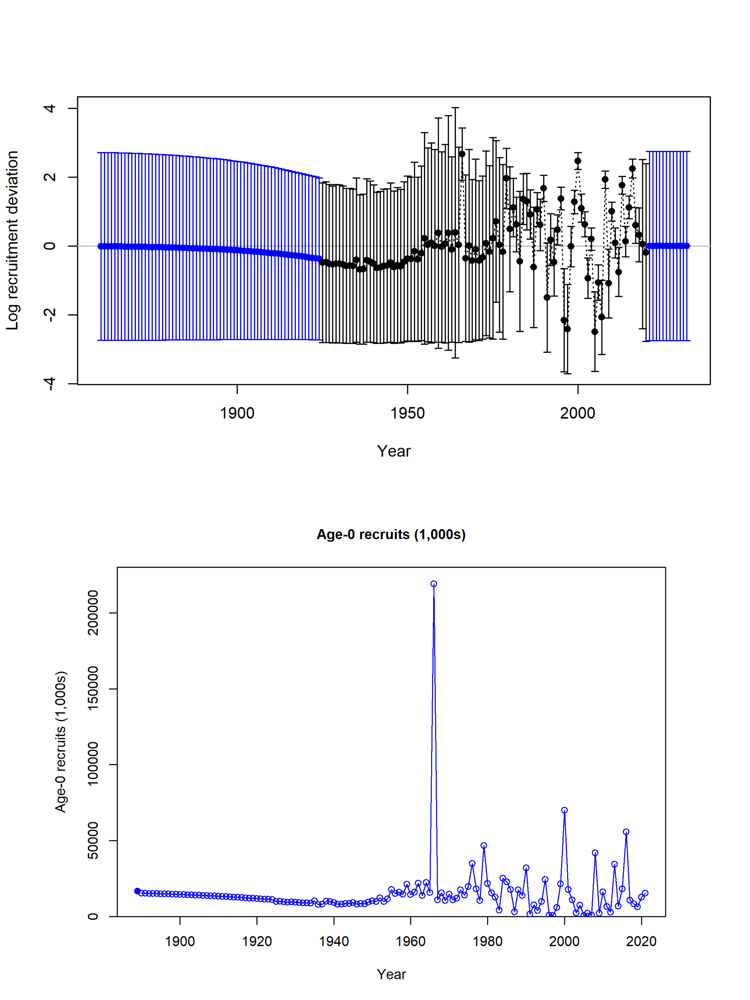

# Executive Summary{-}

## Stock{-}

This update assessment reports the status of `r spp` (_`r spp.sci`_) off the US West coast using data through 2020. The resource is modeled as a single stock; however, sablefish disperse to and from offshore seamounts along the coastal waters of the `r coast` Coast, Canada, and Alaska and across the Aleutian Islands to the western Pacific. Their movement is not explicitly accounted for in this analysis.

## Catches{-}

For the 2019 benchmark assessment, a variety of sources were used to reconstruct state-specific historical sablefish landings (i.e., fish brought to market), creating a series of landings from 1890 to present. In general, these reconstructions are more reliable than those for many other groundfish species because of the consistent identification of sablefish to the species level. Historical-landings reconstructions for sablefish have been completed for California, Oregon, and Washington, extending landings to the beginning of the `r coast` Coast sablefish fishery (Figures \ref{fig:removals} and \ref{fig:catch_comparison}).
Fishery discard rates and weights were fit within the assessment model, i.e., simultaneous estimation of total catches and other model parameters. This internal estimation can result in model estimates of total mortality that differ between stock assessments, even when the input landings remain unchanged, due to changes in fixed and estimated parameter values, priors, or parameterizations. Model estimates of fishery discards in this update assessment resulted in model estimated total dead catches that were an average of `r paste0(round(model$catch %>% select(Yr, Fleet, Obs, kill_bio   ) %>% filter(Fleet !=2 & Yr > 2010) %>% mutate(pd = (kill_bio-Obs)/Obs) %>%summarise(mean(pd))*100,2),"%")` larger than the landings input into the stock assessment model over the last decade.

Historically, sablefish landings were just below recent landings (<4,000 mt) until the end of the 1960s and were primarily harvested by fixed gear (Figure \ref{fig:removals}). Large catches (24,395 mt) by foreign vessels fishing pot gear in 1976 resulted in the largest landings reported in a single year. A rapid rise in domestic pot and trawl landings followed this peak removal, such that, on average, nearly 8,400 mt of sablefish were landed per year between 1976 and 1990. Subsequently, annual landings have remained below 9,000 mt and been divided approximately 67%/33% between fixed and trawl gears, respectively, during the most recent decade. An Individual Fishing Quota (IFQ) program, referred to as "catch shares", was implemented for the U.S. West Coast trawl fleet beginning in 2011. Gear switching is allowed within the program such that fixed gear can be used to catch sablefish under trawl IFQ. This has resulted in changes in fleet behavior, the distribution of fishing effort, and discarding rates for both fisheries. Complete observer coverage on all vessels fishing IFQ quota became mandatory at the start of the program, while coverage in the other sectors remained stratified by port. The lack of historical observer coverage, and consequently information on total catch and age and length compositions, thus contributes to uncertainty regarding selectivity and retention during the historical period.

\clearpage

\begingroup\fontsize{10}{11}\selectfont
\begingroup\fontsize{10}{11}\selectfont

\begin{longtable}[t]{r>{\centering\arraybackslash}p{1.83cm}>{\centering\arraybackslash}p{1.83cm}>{\centering\arraybackslash}p{1.83cm}>{\centering\arraybackslash}p{1.95cm}>{\centering\arraybackslash}p{1.83cm}}
\caption{Recent landings by fleet, total landings summed across fleets, and the total mortality including discards.\label{tab:removalsES}}\\
\toprule
Year & Fixed-gear & Trawl & Total Landings & Model-Estimated Total Dead Catch\\
\midrule
\endfirsthead
\caption[]{Recent landings by fleet, total landings summed across fleets, and the total mortality including discards. \textit{(continued)}}\\
\toprule
Year & Fixed-gear & Trawl & Total Landings & Model-Estimated Total Dead Catch\\
\midrule
\endhead

\endfoot
\bottomrule
\endlastfoot
2011 & 4,420.85 & 1,728.40 & 6,149.25 & 6,253.97\\
2012 & 3,670.22 & 1,514.58 & 5,184.80 & 5,283.60\\
2013 & 2,585.07 & 1,402.13 & 3,987.20 & 4,050.48\\
2014 & 2,924.26 & 1,292.20 & 4,216.46 & 4,294.90\\
2015 & 3,554.94 & 1,470.29 & 5,025.23 & 5,105.52\\
2016 & 3,829.86 & 1,475.95 & 5,305.81 & 5,401.39\\
2017 & 3,680.67 & 1,669.97 & 5,350.64 & 5,465.76\\
2018 & 3,648.68 & 1,478.26 & 5,126.94 & 5,220.22\\
2019 & 3,568.27 & 1,625.44 & 5,193.71 & 5,372.81\\
2020 & 2,660.03 & 1,102.72 & 3,762.75 & 3,882.69\\*
\end{longtable}
\endgroup{}
\endgroup{}

{width=100% height=100% alt="Catches by Fleet, all years"}

\clearpage

## Data and Assessment{-}

The last benchmark stock assessment for sablefish took place during 2019 (@Haltuch2019b), preceded by an update assessment during 2015 (@johnson2016sablefish).  The present (2021) update assessment used the most recent version of the Stock Synthesis modeling platform (3.30), and bridged between the sub-version used in the benchmark (v3.30.09, released 2019-03-09) and the latest release (v3.30.16, released 2020-09-03). Primary data sources include landings and age-composition data from the retained catch (Figure \ref{fig:data-plot}). For recent years, data on the discarded portion of commercial catch are available, including discard lengths, rates, and mean observed individual body weight of the discarded catch. The relative index of abundance estimated from the National Marine Fisheries Service (NMFS) Northwest Fisheries Science Center (NWFSC) West Coast Groundfish Bottom Trawl (WCGBT) Survey, which includes depths from 55 - 1,280 m, represents the primary source of information on the stock’s trend and was updated and re-analyzed to include the most recent data, covering the period 2003-2019 (Figure \ref{fig:WCGBTindexest}); the updated index was consistent with the previous (Figures \ref{fig:WCGBTQQ} and \ref{fig:WCGBTindexcompare}). Note that the WCGBT Survey does not access the closed Cowcod Conservation areas in southern California, and was not performed in 2020 due to the global SARS-CoV-2 pandemic. Other, discontinued, survey indices contribute information on trend and sablefish demographics: (a) NWFSC Slope Survey conducted from 1998-2002, (b) Alaska Fisheries Science Center (AFSC) Slope Survey (1997-2001), and (c) AFSC/NWFSC Triennial Shelf Survey (1980-2004). Additionally, an environmental time-series of sea level was used as a survey index of recruitment in the base model; this time-series was updated and re-analyzed using the latest tide gauge data (Figures \ref{fig:ssh-plot} and \ref{fig:ssh-df}).

All externally estimated model parameters, (a) weight-length relationship, (b) maturity schedule, and (c) fecundity relationships remained unchanged from the 2019 benchmark assessment. As in previous assessments, growth and natural mortality were estimated using sex-specific relationships. Uncertainty in recruitment was included by estimating a full time-series of deviations from the stock-recruitment curve. The ‘one-way-trip’ nature of the time-series does not facilitate estimation of the steepness parameter (h) of the stock-recruitment relationship. Therefore, h was fixed at 0.7, similar to values used on other groundfish stock assessments, and was explored via sensitivity analysis in 2019; we explore information regarding $h$ via likelihood profiles.
During the 2019 assessment, a vast number of historical management actions were evaluated and condensed to a subset that were most likely to have had a direct influence on fishery behavior (either sorting and retention, selectivity, or both). These time periods were used to define time blocks to reduce the complexity of selectivity and retention parameterizations. The 2019 benchmark assessment utilized the same general structure as the 2011 assessment, with the addition of full retention for the trawl fishery after the implementation of the IFQ program in 2011. 

During the exploration of recent data for this update assessment, modelers identified a large influx of younger, small fish observable in the age compositions of commercially landed catch, which was also visible in the discard length compositions of those commercial fleets (Figure \ref{fig:discard_fit}). This latter dataset was not used in the 2019 benchmark, nor were any commercial length compositions, due to conflicts between the age and length data. Absent the data or structural flexibility to account for increased discarding, a model that conformed to the Terms of Reference (TOR) for an update assessment was unable to satisfactorily fit to the composition data from the two commercial fleets (Figures \ref{fig:torafleet1agecomps} and \ref{fig:torafleet3agecomps}) nor the WCGBTS survey (Figure \ref{fig:torafleet8lencomps}), and greatly overestimated the 2019 index (Figure \ref{fig:torapanel}). This misfit was driven by increases in discard ratios in recent years, particularly in the trawl survey, for which the discard ratio nearly quadrupled between 2018 and 2019 (Figure \ref{fig:discard_fit}). Because the TOR model estimates retention for both fisheries in a single timeblock from 2011 onward, the discard data forced the model to generate many small fish, thus overestimating the index of abundance, the frequency of young and/or small individuals, and distorting the recruitment pattern.

We rectify the lack of fit to the data found in the TOR model by re-introducing the discard length compositions and time-blocking the retention curve to include a new block for the final two years of the model period (2019-2020; the benchmark model's terminal period for retention selectivity ran from 2011-2017). This adjustment resolved the aforementioned model fit issues (Figures   \ref{fig:torcfleet8lencomps}-\ref{fig:basepanel}), and is hereafter presented as the "base model".

Aging error, both precision and accuracy, was extensively investigated during the 2011 assessment but remains unresolved given the lack of an age validation study for sablefish. The age error analysis for this assessment used the same software and methods as the 2019 assessment, and the 2015 update and 2011 assessment before it. The larger number of between-lab reads from the AFSC and the NWFSC available for the 2019 assessment showed a small amount of variability between laboratories. Therefore, the analysis used the between-lab reads as well as the double reads from the NWFSC, treating them both as unbiased but potentially non-linearly variable. The age imprecision was such that by age 50 observed ages could differ from true ages by up to 16-17 years. The potential for underestimating or overestimating the age of the oldest fish still remains, and thus, the potential for aging bias remains a source of uncertainty.

## Stock Biomass and Dynamics{-}
During the first half of the 20th century it is estimated that sablefish were exploited at relatively modest levels. Modest catches continued until the 1960s, along with a higher frequency of above average, but uncertain, estimates of recruitment through the 1970s. The spawning stock biomass increased during the 1940s to 1970s. Subsequently, biomass is estimated to have declined between the mid-1970s and the early 2010s, with the largest peaks in harvests during the 1970s followed by harvests that were, on average, higher than pre-1970s harvest through the 2000s. At the same time, there were a higher frequency of generally lower than average recruitments from the 1980s forward. Despite estimates of harvest rates that were largely below overfishing rates from the 1990s forward and a few high recruitments from the 1980s forward, the spawning biomass has only recently begun to increase. This stock assessment does suggest spawner per recruitment rates higher than the target during some years from the 1990s forward for two reasons. First, there have been many years with lower than expected recruitment. Second, stock assessment estimates of unfished spawning biomass have been steadily declining in each subsequent assessment since 2007. Estimates of unfished biomass scale catch advice.

Although the relative trend in spawning biomass is robust to uncertainty in the leading model parameters, the productivity of the stock is uncertain due to confounding of natural mortality, absolute stock size, and productivity. The estimates of uncertainty around the point estimate of unfished stock size are large, suggesting that the unfished spawning biomass could range from just under `r round(derived_quants[derived_quants$Label == "SSB_unfished", "lci"])` mt to `r round(derived_quants[derived_quants$Label == "SSB_unfished", "uci"])` mt. The point estimate of `r model$endyr+1` spawning biomass from the base model is `r round(derived_quants[derived_quants$Label == "SSB_2021", "Value"])`, however, the ∼95% interval ranges broadly from `r noquote(ssbes$Interval[nrow(ssbes)])` mt. The point estimate of `r model$endyr+1` spawning biomass relative to an unfished state (i.e., depletion) from the base model is `r  round(derived_quants[grep('Bratio_2021',model$derived_quants$Label),'Value']*100,2)`% of unexploited levels (∼95\% interval: `r derived_quants[grep('Bratio_2021',derived_quants$Label),'lci']*100`%-`r derived_quants[grep('Bratio_2021',derived_quants$Label),'uci']*100`%).

\begingroup\fontsize{10}{12}\selectfont
\begingroup\fontsize{10}{12}\selectfont
\begin{longtable}[t]{r>{\centering\arraybackslash}p{1.57cm}>{\centering\arraybackslash}p{1.57cm}>{\centering\arraybackslash}p{1.57cm}>{\centering\arraybackslash}p{1.57cm}>{\centering\arraybackslash}p{1.57cm}>{\centering\arraybackslash}p{1.57cm}}
\caption{\label{tab:ssbES}Estimated recent trend in spawning biomass and the fraction unfished and the 95 percent intervals.}\\
\toprule
Year & Spawning Biomass (mt) & Lower Interval & Upper Interval & Fraction Unfished & Lower Interval & Upper Interval\\
\midrule
\endfirsthead
\caption[]{Estimated recent trend in spawning biomass and the fraction unfished and the 95 percent intervals. \textit{(continued)}}\\
\toprule
Year & Spawning Biomass (mt) & Lower Interval & Upper Interval & Fraction Unfished & Lower Interval & Upper Interval\\
\midrule
\endhead

\endfoot
\bottomrule
\endlastfoot
2011 & 80,351.5 & 32,648.1 & 128,054.9 & 0.48 & 0.32 & 0.63\\
2012 & 79,223.0 & 31,838.5 & 126,607.5 & 0.47 & 0.31 & 0.63\\
2013 & 79,605.1 & 32,059.9 & 127,150.3 & 0.47 & 0.31 & 0.63\\
2014 & 80,187.9 & 32,563.5 & 127,812.3 & 0.47 & 0.31 & 0.64\\
2015 & 79,676.1 & 32,447.4 & 126,904.8 & 0.47 & 0.31 & 0.63\\
2016 & 78,633.2 & 31,824.6 & 125,441.8 & 0.47 & 0.31 & 0.62\\
2017 & 79,326.7 & 31,973.0 & 126,680.6 & 0.47 & 0.31 & 0.63\\
2018 & 80,687.2 & 32,503.6 & 128,870.8 & 0.48 & 0.31 & 0.64\\
2019 & 83,925.1 & 33,936.0 & 133,914.2 & 0.50 & 0.33 & 0.67\\
2020 & 90,756.5 & 37,136.0 & 144,377.0 & 0.54 & 0.35 & 0.72\\
2021 & 97,801.9 & 40,802.4 & 154,801.4 & 0.58 & 0.38 & 0.77\\*
\end{longtable}
\endgroup{}
\endgroup{}

{width=100% height=100% alt="Relative SPR vs B Ratio"}

\quad

## Recruitment{-}
Sablefish recruitment is estimated to be quite variable with large amounts of uncertainty in individual recruitment events. A period with generally higher frequencies of strong recruitments spans from the early 1950s through the 1970s, followed by a lower frequency of large recruitments during 1980 forward, contributing to stock declines. The period with a higher frequency of high recruitments contributed to a large increase in stock biomass that has subsequently declined throughout much of the 1970s forward. Less frequent large recruitments during the mid-1980s through 1990 slowed the rate of stock decline, with another series of large recruitments during 1999 and 2000 leading to a leveling off in the stock decline. The above-average cohorts from 2008, 2010, 2013, and 2016 are contributing to a slightly increasing spawning stock size. 

{width=100% height=100% alt="Age 0 Recruits"}

\clearpage

## Exploitation Status{-}

\textexplstatus

\begingroup\fontsize{9}{10}\selectfont
\begingroup\fontsize{9}{10}\selectfont

\begin{longtable}[t]{r>{\centering\arraybackslash}p{2.5cm}>{\centering\arraybackslash}p{2.5cm}>{\centering\arraybackslash}p{1.2cm}>{\centering\arraybackslash}p{2.5cm}>{\centering\arraybackslash}p{1.2cm}>{\centering\arraybackslash}p{2cm}>{\centering\arraybackslash}p{1.2cm}}
\caption{Estimates of total dead catch (mt), relative 1-spawning potential ratio (SPR; 1-SPR/1-SPRTarget=0.45\%), and exploitation rate (catch/biomass of age-4+) from the base model. Approximate
95\% intervals follow in parentheses.}\\

\toprule
Year & Model-Estimated Total Dead Catch & Rel 1-SPR & Interval  & Exploitation Rate & Interval \\
\midrule
\endfirsthead
\caption[]{Estimated recent trend in age-0 recruitment (1000s), and recruitment deviations and the 95 percent intervals. \textit{(continued)}}\\
\toprule
Year & Model-Estimated Total Dead Catch & Rel 1-SPR & Interval  & Exploitation Rate &  Interval \\
\midrule
\endhead

\endfoot
\bottomrule
\endlastfoot
2011 & 6,253.97 & 0.97 & 0.60–1.34 & 0.0316 & 0.0138–0.0494\\
2012 & 5,283.60 & 0.75 & 0.41–1.09 & 0.0240 & 0.0106–0.0375\\
2013 & 4,050.48 & 0.61 & 0.31–0.92 & 0.0192 & 0.0084–0.0300\\
2014 & 4,294.90 & 0.61 & 0.30–0.92 & 0.0200 & 0.0088–0.0311\\
2015 & 5,105.52 & 0.71 & 0.37–1.05 & 0.0243 & 0.0108–0.0379\\
2016 & 5,401.39 & 0.76 & 0.41–1.10 & 0.0270 & 0.0119–0.0421\\
2017 & 5,465.76 & 0.68 & 0.36–1.01 & 0.0250 & 0.0110–0.0389\\
2018 & 5,220.22 & 0.66 & 0.34–0.98 & 0.0243 & 0.0107–0.0379\\
2019 & 5,372.81 & 0.62 & 0.31–0.92 & 0.0244 & 0.0107–0.0381\\
2020 & 3,882.69 & 0.40 & 0.18–0.63 & 0.0149 & 0.0066–0.0231\\*
\end{longtable}
\endgroup{}
\endgroup{}

{width=100% height=50% alt="Relative SPR vs B Ratio"}

{width=100% height=50% alt="Relative SPR vs B Ratio"}

## Ecosystem Considerations{-}

The National Oceanic and Atmospheric Administration (NOAA) document titled 'Implementing a Next Generation Stock Assessment Enterprise, An update to the NOAA Fisheries Stock Assessment Improvement Plan' (@lynch2018) calls for bringing an ecosystem perspective into the assessment process. Moreover, introducing this perspective to the assessment process is a key component of the NOAA Fisheries Ecosystem-Based Fisheries Management (EBFM) Policy (@noaa2016), which calls for incorporation of ecosystem considerations into the management of living marine resources. Uptake of EBFM principles and tools into the assessment process can be accomplished through including ecosystem information in assessments, harvest control rules, and management decisions that are coordinated across species-specific management plans and account for diverse trade-offs (@noaa2016, @lynch2018). Guidelines for incorporating ecosystem considerations into fisheries management advice form the core of Guiding Principle 5 for implementing the NOAA EBFM Policy.

This assessment includes ecological factors based on the idea that research focused on the linkages within a social-ecological system (SES) and how they increase or decrease sustainability can help inform the management of natural resources (@ostrom2009). The SES framework requires consideration of extractive goals and human activities at a level that allows for ecological sustainability while also considering human well-being. Thus, the SES framework facilitates the consideration of environmental and human impacts on  `r spp` as well as `r spp` impacts on the ecosystem and humans (e.g., @levin2016). 

The `r spp` CVA @mcclure2020} suggests that processes affecting recruitment are sensitive to climatic and, therefore, oceanic drivers. Given high climate vulnerability, changes in the abundance, productivity, and spatial distribution of `r spp` are likely, and these changes are likely to impact fishing fleets and communities because of the high value of this fishery. The CVA also suggests that `r spp` are likely to shift their distribution in response to climate variability.
Strong coast-wide recruitment appears to be associated with good recruitment north of Cape Mendocino ($\sim 40^{\circ}$N). Modeling work shows that strong recruitment is correlated with transport and temperature in the northern portion ($40^{\circ}-48^{\circ}$N) of the U.S. West Coast, specifically with the northern transport of yolk-sac larvae (@tolimieri2018). A re-analysis of the relationship between sea level and recruitment found that variation around the stock-recruitment curve was negatively correlated with sea level north of Cape Mendocino. Reliable sea-level data are available back to 1925; the ability to produce an environment-recruitment index with this time series may allow for both hindcasting to better represent stock dynamics during data-poor time periods and nowcasting of recruitment with robust estimates of uncertainty.

The `r spp` stock has experienced latitudinal shifts in the center of the distribution of stock biomass along the `r coast` Coast, which has affected fishing opportunities to individual ports (@selden2020). The population centroid shifted to the north from 1980 to 1992 then south by 2013. More recently, the distribution of stock biomass shifted north, illustrated by an increase in trawl survey biomass in the north, but not as far north as in the 1990s.

Whale entanglements with pot gear has the potential to limit effort in the pot-gear sectors due to protections for marine mammals. The estimated fleet-wide entanglements were consistently above the 5-year running average threshold during 2002 to 2017 in the combined Limited Entry `r spp` and Open Access Fixed Gear pot sectors (@hanson2019). This result was largely due to the Open Access Fixed Gear pot sector, which had entanglements consistently above the 5-year running average threshold, while entanglements in the Limited Entry `r spp` pot sector were consistently below the threshold.

A detailed description of social-ecological system (SES) analyses, the Climate Vulnerability Assessment, and environmental drivers of sablefish recruitment is available in the 2019 Benchmark Assessment report (@Haltuch2019b), and truncated from this update document.

## Reference Points{-}

\textrefpt

\quad

\begingroup\fontsize{10}{12}\selectfont
\begingroup\fontsize{10}{12}\selectfont

\begin{longtable}[t]{r>{\centering\arraybackslash}p{2cm}>{\centering\arraybackslash}p{2cm}>{\centering\arraybackslash}p{2cm}}
\caption{\label{tab:referenceES}Summary of reference points and management quantities, including estimates of the  95 percent intervals.}\\
\toprule
 & Estimate & Lower Interval & Upper Interval\\
\midrule
\endfirsthead
\caption[]{Summary of reference points and management quantities, including estimates of the  95 percent intervals. \textit{(continued)}}\\
\toprule
 & Estimate & Lower Interval & Upper Interval\\
\midrule
\endhead

\endfoot
\bottomrule
\endlastfoot
Unfished Spawning Biomass (mt) & 168,875 & 107,749 & 230,001\\					
Unfished Age 4+ Biomass (mt) & 393,647 & 242,084 & 545,210\\					
Unfished Recruitment (R0) & 16,392 & 6,586 & 26,198\\					
Spawning Biomass (mt) (2021) & 97,802 & 40,802 & 154,801\\					
Fraction Unfished (2021) & 0.579 & 0.384 & 0.775\\					
Proxy Spawning Biomass (mt) SB40 Percent & 67,550 & 43,100 & 92,000\\					
SPR Resulting in SB40 Percent & 0.464 &  & \\					
Exploitation Rate Resulting in SB40 Percent & 0.043 & 0.035 & 0.051\\					
Yield with SPR Based On SB40 Percent (mt) & 8,209 & 3,857 & 12,562\\					
Proxy Spawning Biomass (mt) (SPR45) & 64,848 & 41,376 & 88,320\\					
Exploitation Rate Corresponding to SPR45 & 0.045 & 0.037 & 0.053\\					
Yield with SPR45 at SB SPR (mt) & 8,350 & 3,924 & 12,777\\					
Spawning Biomass (mt) at MSY (SB MSY) & 41,702 & 26,527 & 56,876\\					
SPR MSY & 0.328 & 0.324 & 0.331\\					
Exploitation Rate Corresponding to SPR MSY & 0.070 & 0.057 & 0.083\\					
MSY (mt) & 9,024 & 4,242 & 13,807\\*
\end{longtable}
\endgroup{}
\endgroup{}

{width=100% height=70% alt="RelSBnoforecast"}

{width=100% height=100% alt="Yield Curve"}

\clearpage

## Management Performance{-}

Sablefish management includes a rich history of seasons, size-limits, trip-limits, and a complex permit system. Managers divide coast-wide yield targets among the fleets, fishery sectors (including both limited entry and open access), as well as north and south of 36$^\circ$N latitude. Peak catches occurred during the late 1970s just prior to the imposition of the first catch limits. Over the last decade, the total estimated dead catch has been 55% of the sum of the overfishing limits  and 65% of the annual catch limits.

\begingroup\fontsize{10}{12}\selectfont
\begingroup\fontsize{10}{12}\selectfont

\begin{longtable}[t]{r>{\centering\arraybackslash}p{1.83cm}>{\centering\arraybackslash}p{1.83cm}>{\centering\arraybackslash}p{1.83cm}>{\centering\arraybackslash}p{1.83cm}>{\centering\arraybackslash}p{1.83cm}}
\caption{Recent trend in the overfishing limits (OFL), the annual catch limits (ACLs), the total landings, and model-estimated total dead catch ("total mortality", mt). Note that the Acceptable Biological Catches (ABCs) and ACLs are equal because the stock is estimated to be above 40\% of the unfished spawning biomass, and the PFMC has not seen fit to lower the ACLs for other reasons.}\\
\toprule
Year & OFL & ACL & Landings & Total Mortality\\
\midrule
\endfirsthead
\caption[]{Recent trend in the overfishing limits (OFL), the acceptable biological catches (ABC \textit{(continued)}}\\
\toprule
Year & OFL & ACL & Landings & Total Mortality\\
\midrule
\endhead

\endfoot
\bottomrule
\endlastfoot
2011 & 8,808 & 6,813 & 6,149.25 & 6,253.97\\
2012 & 8,623 & 6,605 & 5,184.80 & 5,283.59\\
2013 & 6,621 & 5,451 & 3,987.20 & 4,050.48\\
2014 & 7,158 & 5,909 & 4,216.46 & 4,294.90\\
2015 & 7,857 & 6,512 & 5,025.23 & 5,105.53\\
2016 & 8,526 & 7,121 & 5,305.81 & 5,401.39\\
2017 & 8,050 & 7,117 & 5,350.64 & 5,465.75\\
2018 & 8,239 & 7,419 & 5,126.94 & 5,220.23\\
2019 & 8,489 & 7,750 & 5,193.71 & 5,372.81\\
2020 & 8,648 & 7,896  & 3,762.75 & 3,882.70\\*
2021 & 9,402 & 8,791 &  - & -\\*
2022 & 9,005 & 8,375 &  - & -\\*
\end{longtable}
\endgroup{}
\endgroup{}

\clearpage

## Unresolved Problems and Major Uncertainties{-}
The data available for sablefish off the U.S. West Coast are not informative with respect to absolute stock size and productivity. This is, in part, due to the one-way-trip nature of the historical series (i.e., a slow and steady decline in spawning biomass), which can be consistent with a larger less productive stock, a smaller more productive stock, or many combinations in between. While the historical catches provide some information about the minimum stock size necessary to remove the catches from the population, there is limited information in the data regarding the upper limit of the stock size. The above factors are also confounded by movement of sablefish between the region included in this assessment and regions to the north, which is ignored in the stock assessment. Likelihood profiles, parameter estimates, and general model behavior illustrate that small changes in any of a suite of parameters can result in different management reference points. However, because leading model parameters, such as natural mortality, selectivity, and historical recruitments, are estimated within the stock assessment model, the uncertainty about these estimates remains large and uncertainty intervals typically overlapped among the investigated models. 
The uncertainty will remain high until a more informative time-series, better quality demographic and biological information are accumulated, or a range-wide analysis is completed for sablefish.

There is no age validation for sablefish. Validation is complicated by the fact that most known-age fish from Alaska are aged at less than 20 years while there are very few ages from the `r coast` Coast, particularly in recent decades. Uncertainty in the current aging methods (both bias and imprecision), as well as relatively sparse fishery sampling, result in age data that potentially variable. Furthermore, because sablefish grow rapidly, nearing asymptotic length in their first decade of life, length data is not particularly informative about historical patterns in recruitment. The patterns observed in historical sablefish recruitment suggest that the stock trajectory (via shifts in recruitment strength) is closely linked to productivity regimes in the `r coast` Coast. Uncertainty in future environmental conditions, changes in the timing, dynamics, and productivity of the California Current ecosystem via climate change or cycles similar to the historical period should be considered a significant source of uncertainty in all projections of stock status.
The ongoing WCGBT Survey is a fairly precise relative index of abundance over a broad demo- graphic component of the stock, but it does not survey the entire stock as sablefish reside in waters deeper than 1280 m, the survey depth limit, and to the north of the Washington/British Columbia border. To the modelers' knowledge there is no information from the Pacific coast of Mexico. Therefore, a portion of the stock is unobserved. This index has the potential to inform future stock assessments about the scale of the population relative to catches being removed, however such information will require contrast in the observed survey trend.

## Decision Table and Harvest Projections{-}
### Decision Table{-}

The decision table reports 12-year projections for alternate states of nature (columns) and management options (rows). The results of this table are conditioned on the Groundfish Management Team specified catches for `r model$endyr+1` and `r model$endyr+2`, which are below the already-specified annual catch limits approved by the Pacific Fisheries Management Council. he time series of multiplicative buffer fractions that are a function of $P^*$ and the time series of $\sigma$s provide the multipliers on the overfishing limit; these values are all less than 1 for category 1 stocks.  $\sigma$ for sablefish is the time-varying category 1 value, which starts at 0.5 in the year after the (update) assessment and increases throughout the projection period. The uncertainty around the OFL value for the first forecast year (2022) is `r round(sqrt(log((model$derived_quants[model$derived_quants$Label == 'OFLCatch_2022','StdDev']/model$derived_quants[model$derived_quants$Label == 'OFLCatch_2022','Value'])^2+1)),3)`; the uncertainty around relative spawning output in that same year is `r round(model$derived_quants[model$derived_quants$Label == 'Bratio_2022','StdDev'],3)`, both less than 0.5.

Uncertainty in management quantities for the decision table was characterized using the asymptotic standard deviation for the `r model$endyr+1` spawning biomass from the base model. Specifically, the `r model$endyr+1` spawning biomass for the high and low states of nature are given by the base model mean ±1.15·standard deviation (i.e., the 12.5th and 87.5th percentiles). A search across fixed values of $R_0$ was used to attain the `r model$endyr+1` spawning biomass values for the high and low states of nature. The base catch streams were based on the 40-10 harvest control rule and a $P^*= 0.45$ buffer vector. This is presented as the bottom row of the decision table as it represents the highest exploitation level among the three catch streams. To replicate a request of the Groundfish Management Team representative at the 2019 STAR panel, the additional catch streams were set using the Category 1 values of $P^*$ = 0.35 and $P^*$ = 0.40; these are presented as the first and second rows of the decision table, respectively.

Spawning stock biomass in `r model$endyr+1` ranges across the three states of nature from 64,916 to 131,513 mt, with corresponding stock status ranging from 51% to 63% of the unfished stock size. The decision table suggests that all catch scenarios under across all states of nature result in decreases in stock size. Under both the base and high states of nature and across all catch scenarios, the stock remains either at or above the target stock size at the end of the projection period. The reason that depletion does not decline as substaintally as suspected in the base case at the 12-year time horizon is the emergence of recent, large recruitment events into the fishery; this is reflected in a disproportionate increase in summary biomass (Figure \ref{fig:ts1_4}). However, all catch scenarios under the low state of nature drive the stock into the precautionary zone by 2030, where it remains in 2032. 

\clearpage

\begingroup\fontsize{9}{11}\selectfont
\begingroup\fontsize{9}{11}\selectfont
\begin{longtable}{lll|ll|ll|ll}
\caption{Decision table of 12-year projections of spawning stock biomass (SSB) and \% unfished (depletion) for alternative states of nature (columns) and management options (rows) beginning in 2021. Low and high states of nature are based on the 2021 SSB $\pm$ 1.15$\cdot$base model SSB standard deviation and the resulting unfished recruitment was used for the projections. Results are conditioned on the 2021 and 2022 catches, provided by the Pacific Fisheries Management Council Groundfish Management Team (GMT), being achieved exactly. The alternative catch streams are based on the GMT's requested P$^*$ values of 0.35 and 0.40. Note that values for the agreed-upon buffer level of P* = 0.45 is presented as the third row of the decision table as it represents the highest exploitation level among the three catch streams. Catches are total dead biomass, i.e., dead discard plus catch.} \\ 
  \hline
&Year&Total& \multicolumn{2}{c}{Low state (0.25)} & \multicolumn{2}{c}{Base (0.5)} & \multicolumn{2}{c}{High state (0.25)} \\
scenario & &catch& SSB & Depletion & SSB & Depletion & SSB & Depletion \\ 
\hline \endfirsthead
\multicolumn{9}{l}{\footnotesize Decision table continued from previous page.} \\
\hline \endhead
\hline
\multicolumn{9}{l}{\footnotesize Continued on next page.} \\
\endfoot
\endlastfoot
\hline
P$^*$=0.35
& 2021 & 7,405 & 64,916 & 0.51 & 97,802& 0.58 & 131,513 & 0.63 \\ 
&  2022 & 7,055 & 66,222 & 0.52 & 99,957 & 0.59 & 134,550 & 0.65 \\ 
&  2023 & 9,412 & 65,396 & 0.51 & 99,450 & 0.59 & 134,266 & 0.64 \\ 
&  2024 & 8,608 & 62,150 & 0.49 & 96,661 & 0.57 & 131,626 & 0.63 \\ 
&  2025 & 8,101 & 59,177 & 0.46 & 94,436 & 0.56 & 129,680 & 0.62 \\ 
&  2026 & 7,796 & 56,750 & 0.44 & 92,909 & 0.55 & 128,548 & 0.62 \\ 
&  2027 & 7,649 & 54,732 & 0.43 & 91,867 & 0.54 & 127,974 & 0.61 \\ 
&  2028 & 7,570 & 52,951 & 0.41 & 91,099 & 0.54 & 127,714 & 0.61 \\ 
&  2029 & 7,504 & 51,310 & 0.40 & 90,483 & 0.54 & 127,626 & 0.61 \\ 
&  2030 & 7,437 & 49,770 & 0.39 & 89,967 & 0.53 & 127,646 & 0.61 \\ 
&  2031 & 7,342 & 48,316 & 0.38 & 89,530 & 0.53 & 127,742 & 0.61 \\ 
&  2032 & 7,247 & 46,956 & 0.37 & 89,175 & 0.53 & 127,911 & 0.61 \\ 
\hline
P$^*$=0.40
&  2021 & 7,405 & 64,916 & 0.51 & 97,802 & 0.58 & 131,513 & 0.63 \\ 
&  2022 & 7,055 & 66,222 & 0.52 & 99,957 & 0.59 & 134,550 & 0.65 \\ 
& 2023 & 10,107 & 65,396 & 0.51 & 99,450 & 0.59 & 134,266 & 0.64 \\ 
&  2024 & 9,252 & 61,794 & 0.48 & 96,308 & 0.57 & 131,273 & 0.63 \\ 
&  2025 & 8,722 & 58,494 & 0.46 & 93,761 & 0.56 & 129,004 & 0.62 \\ 
& 2026 & 8,421 & 55,765 & 0.44 & 91,935 & 0.54 & 127,568 & 0.61 \\ 
& 2027 & 8,282 & 53,451 & 0.42 & 90,602 & 0.54 & 126,699 & 0.61 \\ 
& 2028 & 8,218 & 51,380 & 0.40 & 89,546 & 0.53 & 126,149 & 0.60 \\
& 2029 & 8,168 & 49,449 & 0.39 & 88,643 & 0.52 & 125,774 & 0.60 \\ 
& 2030 & 8,117 & 47,616 & 0.37 & 87,840 & 0.52 & 125,509 & 0.60 \\ 
& 2031 & 8,039 & 45,869 & 0.36 & 87,117 & 0.52 & 125,324 & 0.60 \\ 
& 2032 & 7,950 & 44,214 & 0.35 & 86,479 & 0.51 & 125,215 & 0.60 \\
\hline
P$^*$=0.45
& 2021 & 7,405 & 64,916 & 0.51 & 97,802 & 0.58 & 131,513 & 0.63 \\ 
& 2022 & 7,055 & 66,222 & 0.52 & 99,957 & 0.59 & 134,550 & 0.65 \\ 
& 2023 & 10,825 & 65,396 & 0.51 & 99,450 & 0.59 & 134,266 & 0.64 \\ 
& 2024 & 9,923 & 61,426 & 0.48 & 95,935 & 0.57 & 130,908 & 0.63 \\ 
& 2025 & 9,372 & 57,787 & 0.45 & 93,014 & 0.55 & 128,302 & 0.62 \\ 
&  2026 & 9,070 & 54,742 & 0.43 & 90,821 & 0.54 & 126,550 & 0.61 \\ 
& 2027 & 8,934 & 52,126 & 0.41 & 89,130 & 0.53 & 125,375 & 0.60 \\ 
&  2028 & 8,888 & 49,760 & 0.39 & 87,727 & 0.52 & 124,528 & 0.60 \\ 
& 2029 & 8,860 & 47,532 & 0.37 & 86,483 & 0.51 & 123,858 & 0.59 \\ 
& 2030 & 8,810 & 45,402 & 0.36 & 85,346 & 0.51 & 123,298 & 0.59 \\ 
&  2031 & 8,753 & 43,364 & 0.34 & 84,304 & 0.50 & 122,829 & 0.59 \\ 
& 2032 & 8,684 & 41,415 & 0.32 & 83,351 & 0.49 & 122,438 & 0.59 \\ 
   \hline
\end{longtable}
\endgroup{}
\endgroup{}

### Harvest Projections{-}

\textprojections

\begingroup\fontsize{10}{12}\selectfont
\begingroup\fontsize{10}{12}\selectfont

\begin{longtable}[t]{r>{\centering\arraybackslash}p{1.83cm}>{\centering\arraybackslash}p{1.83cm}>{\centering\arraybackslash}p{1.83cm}>{\centering\arraybackslash}p{1.83cm}>{\centering\arraybackslash}p{1.83cm}}
\caption{Projections of potential OFLs (mt), ABCs (mt), estimated spawning biomass and fraction unfished. The total catches in 2021 and 2022 were set at the PFMC Groundfish Management Team requested values of 7,405 mt for 2021 and 7,055 mt for 2022 which are about 20\% lower than the ACL = ABC for those years; see Table \ref{tab:manageES} for GMT-defined ACLs and OFLs in 2021 and 2022.}\\
\toprule
Year & Predicted OFL (mt) &  \textit{Catches} (2021-22) or ABCs (2023+) (mt) & Age 4+ Biomass (mt) & Spawning Biomass (mt) & Fraction Unfished\\
\midrule
\endfirsthead
\caption[]{Projections of potential OFLs (mt), ABCs (mt), estimated spawning biomass and fraction unfished. \textit{(continued)}}\\
\toprule
Year & Predicted OFL (mt) &  \textit{Catches} (2021-22) or ABCs (2023+) (mt) & Age 4+ Biomass (mt) & Spawning Biomass (mt) & Fraction Unfished\\
\midrule
\endhead

\endfoot
\bottomrule
\endlastfoot
2021 & - &  \textit{7,405.00} & 265,655 & 97,801.9 & 0.58\\
2022 & - &  \textit{7,055.00} & 261,481 & 99,956.5 & 0.59\\
2023 & 11,577.1 & 10,824.6 & 253540 & 99,449.9 & 0.59\\
2024 & 10,669.8 & 9,922.9 & 246090 & 95,943.8 & 0.57\\
2025 & 10,120.6 & 9,371.7 & 241976 & 93,063.3 & 0.55\\
2026 & 9,837.4 & 9,070.1 & 238823 & 90,925.0 & 0.54\\
2027 & 9,742.3 & 8,933.7 & 236280 & 89,290.8 & 0.53\\
2028 & 9,735.2 & 8,888.3 & 234037 & 87,941.5 & 0.52\\
2029 & 9,747.2 & 8,860.2 & 231955 & 86,743.8 & 0.51\\
2030 & 9,746.0 & 8,810.4 & 229993 & 85,644.5 & 0.51\\
2031 & 9,725.9 & 8,753.3 & 228162 & 84,634.2 & 0.50\\
2032 & 9,691.9 & 8,684.0 & 226462 & 83,707.8 & 0.50\\*
\end{longtable}
\endgroup{}
\endgroup{}

\clearpage

## Research and Data Needs{-}
Most of the research needs listed below entail investigations that need to take place outside of the routine assessment cycle and require additional resources to be completed.

1. Not all of the available sablefish otoliths were aged for this stock assessment update because of time constraints resulting from Covid-19, exacerbated by the the federal government furlough in 2019, and, in some cases, the sample sizes of aged fish are lower than what would be ideal. Resources should be provided to age otolith samples from years with missing age data or small sample sizes.

2. A transboundary stock assessment and the management framework to support such assessments would be beneficial given the migratory nature and broad distribution of sablefish along the Pacific Rim. A transboundary assessment would likely improve the ability to estimate the scale of the population, particularly during the early modeled period.

3. Investigation of environmental covariates for recruitment on a stock-wide, northeast Pacific scale.

4. Continuation of the annual WCGBT Survey will provide information on stock trends and incoming recruitments. A longer survey time series may improve the precision of estimates of absolute stock size and productivity into the future.

5. Age validation is needed to verify the level of age bias present in the data, if any.

6. Investigate aging methods that could prove more precise and/or rapid than current break-and-burn methods. More accurate age data would facilitate tracking cohorts to older ages, improving estimates of historical year-class strengths.

7. Research on understanding the interactions between spatial patterns in sablefish growth, fishery size selectivity, and movement across the Northeast Pacific began during 2019 and are ongoing. The results of this research should be considered in future benchmark stock assessments.

8. Anecdotal information, such as the large 1947 recruitment reported by central California sport fisherman, along with historical records could be investigated to provide additional information on historical patterns of recruitment.

