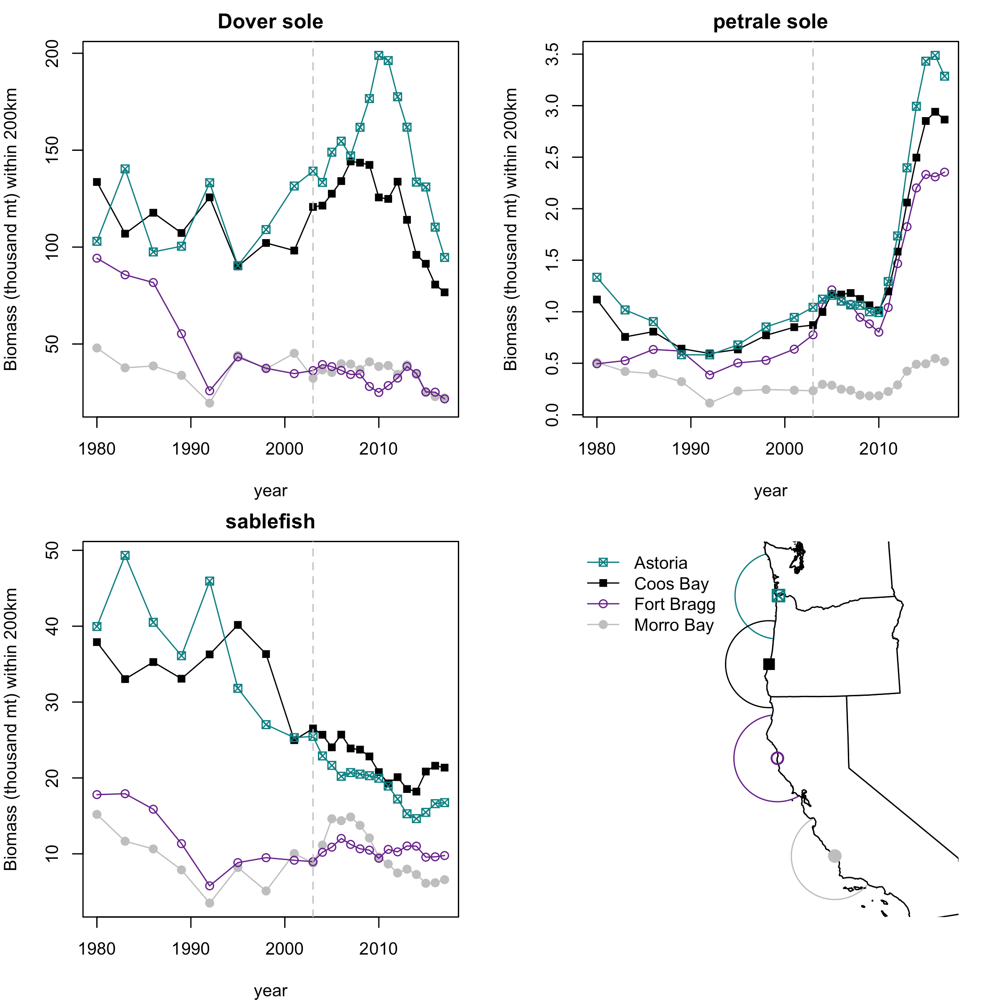
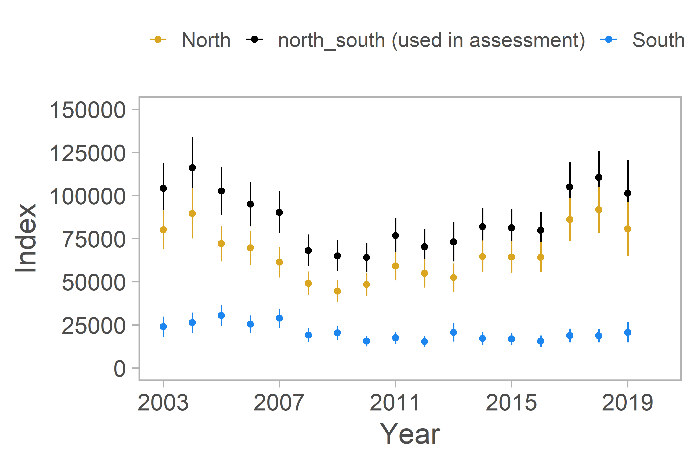
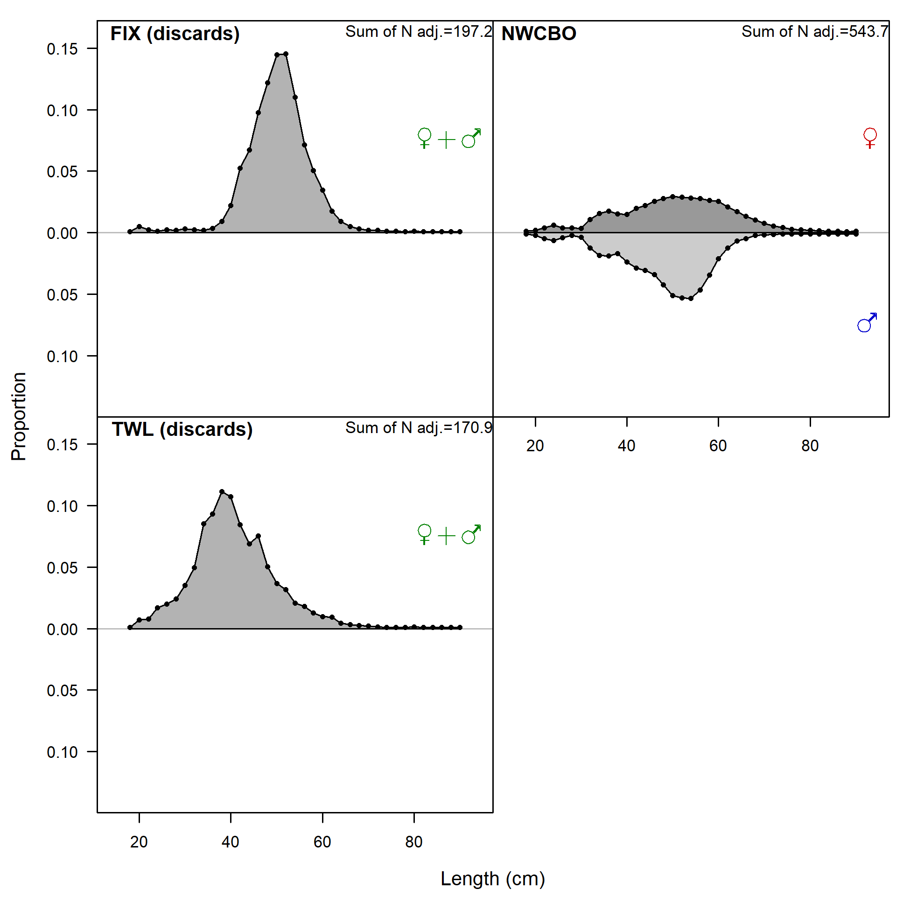

\clearpage

{width=100% height=100% alt="Spatial Footprint of Trawl Gear"}

{width=100% height=100% alt="Spatial Footprint of HKL Gear"}

{width=100% height=100% alt="Spatial Footprint of Pot Gear"}

{width=50% height=50% alt="Survey age-0 abundance through time"}

{width=50% height=50% alt="Time series of dover sole, petrale sole, and sablefish landings"}

{width=50% height=50% alt="Whale entanglements in US Fishing Gear, 2000-2019."}

{width=100% height=100% alt="Catches by Fleet, all years"}

{width=100% height=100% alt="Comparison of observed landings between previous and current models, 1982-2020"}

{width=100% height=100% alt="Summary of data sources used in the base model"}

{width=50% height=50% alt="Density of Natural Mortality Prior and Estimated Values"}

{width=100% height=100% alt="Comparison of 2019 and 2021 SSH trends used as input"}

{width=100% height=100% alt="WCGBTS Index by Region"}
{width=100% height=100% alt="Encounter Probability Diagnostic"}

{width=100% height=100% alt="comp_lendat__aggregated_across_time"}

{width=100% height=100% alt="Spawner steepness (h) profile by data type"}

