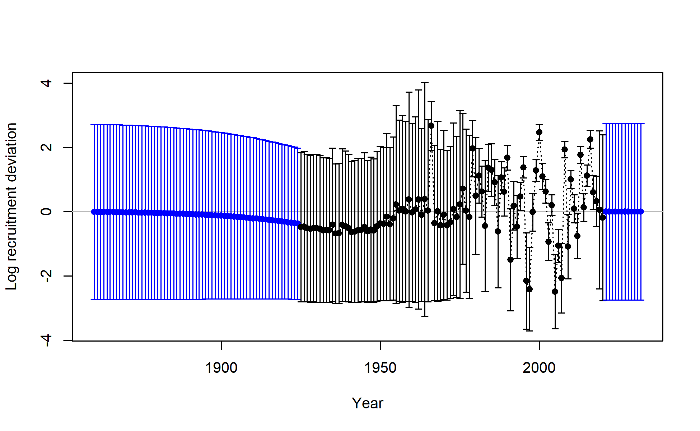
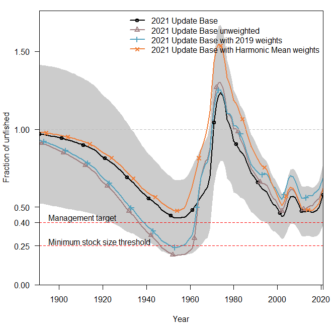
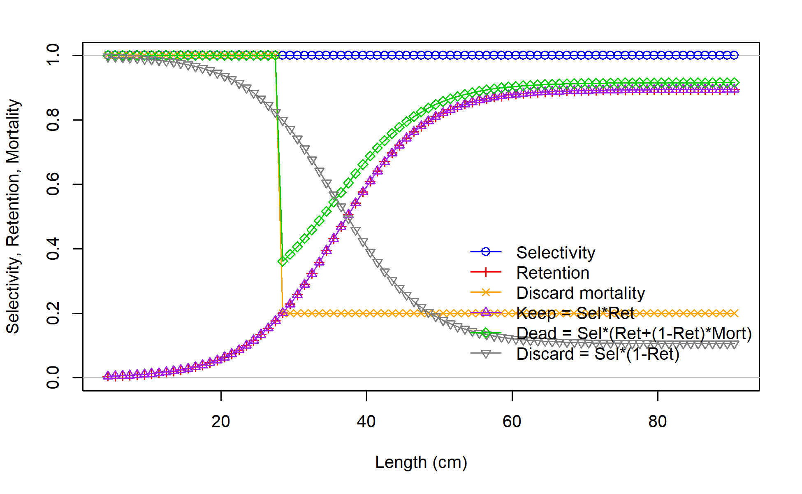
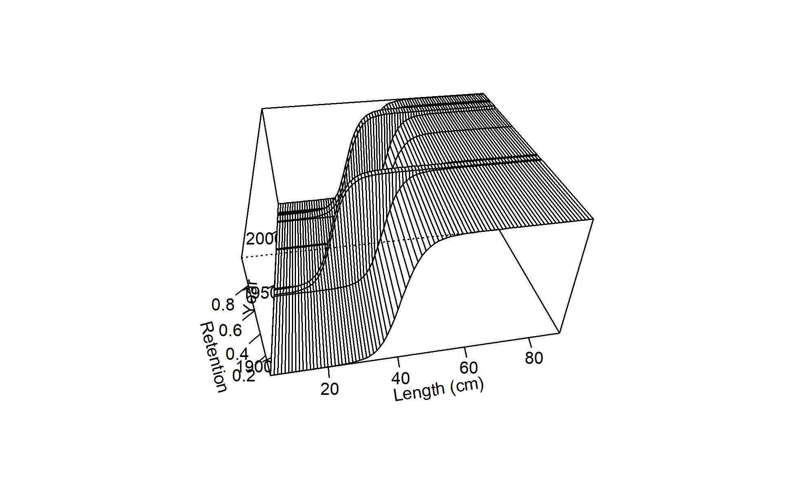
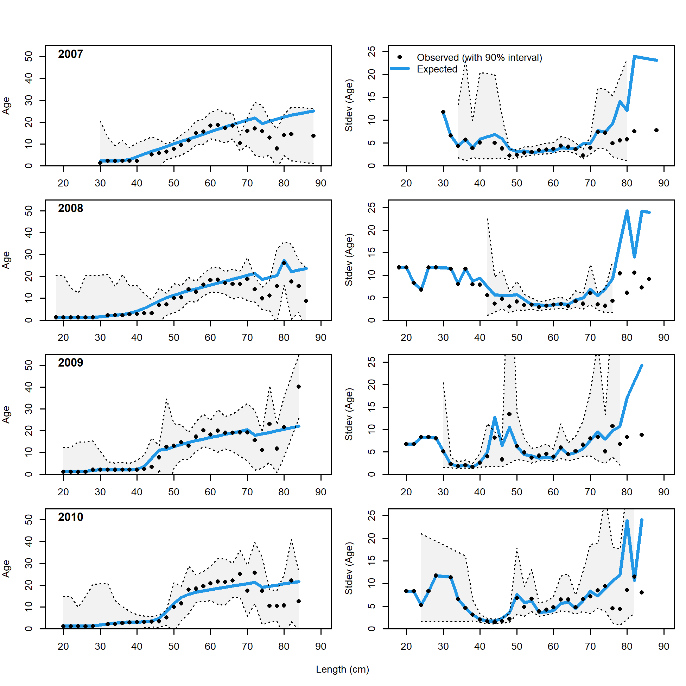
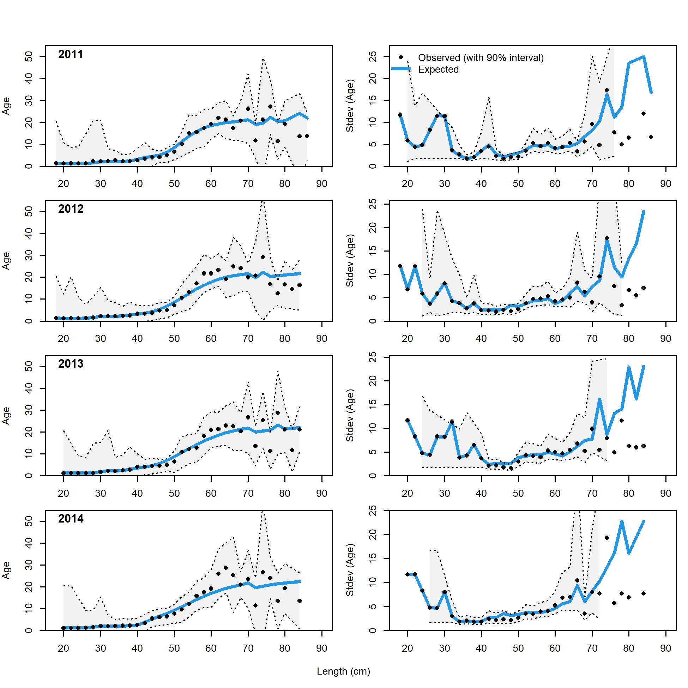
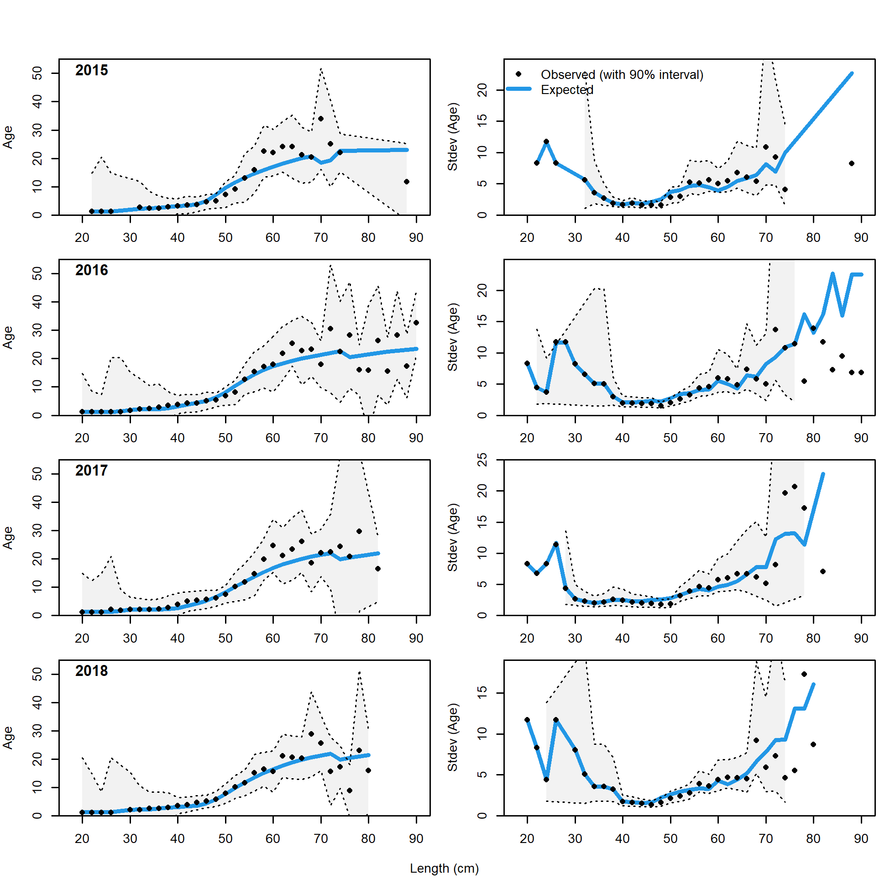
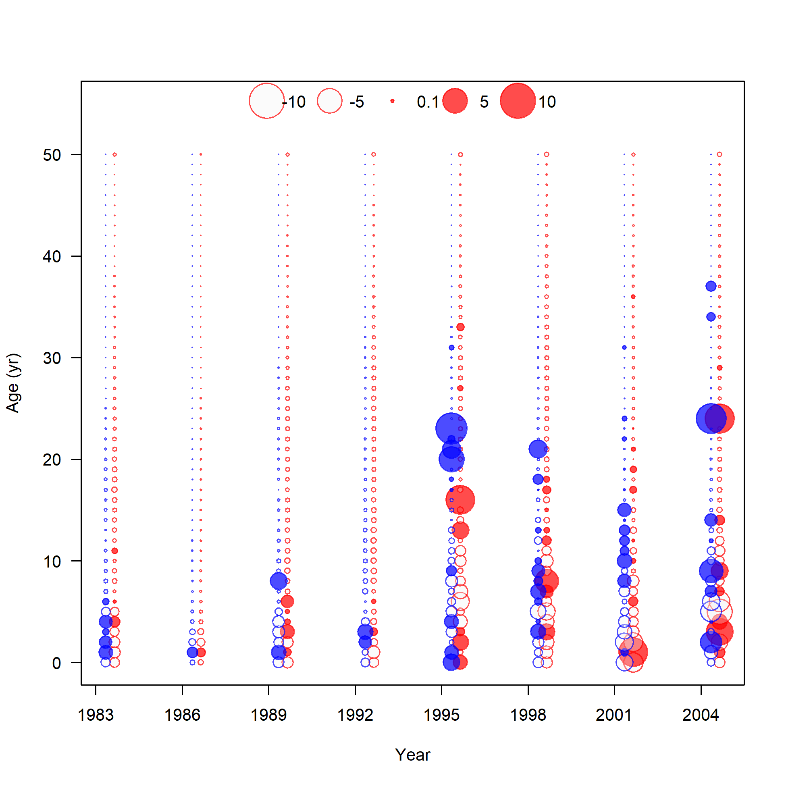

\clearpage
# Figures

{width=100% height=100% alt="Catches by Fleet, all years"}

{width=100% height=100% alt="Comparison of observed landings between previous and current models, 1982-2020"}

{width=100% height=100% alt="Summary of data sources used in the base model"}

{width=75% height=75% alt="WCGBTS Index by Region"}

{width=100% height=100% alt="Encounter Probability Diagnostic"}

{width=100% height=100% alt="WCGBTS Index Overlay"}

{width=100% height=100% alt="Comparison of 2019 and 2021 SSH trends used as input"}

{width=100% height=100% alt="SSH_dfts"}

{width=100% height=100% alt="TWL Discard Lcomps"}

{width=100% height=100% alt="TOR Model FIX Age Composition Fits"}

{width=100% height=100% alt="TOR Model TWL Age Composition Fits"}

{width=100% height=100% alt="TOR Model WCGBTS Len Composition Fits"}

{width=90% height=90% alt="Derived quantities in bridged and TOR model"}

{width=100% height=100% alt="Base Model WCGBTS Len Composition Fits"}

{width=100% height=100% alt="Base FIX Age Composition Fits"}

{width=100% height=100% alt="Base TWL Age Composition Fits"}

{width=90% height=90% alt="Select derived quantities in base model"}

\clearpage

{width=100% height=100% alt="RecDevs with Bars"}

{width=100% height=50% alt="Age 0 Recruits"}

\clearpage

{width=100% height=70% alt="RelSBnoforecast"}

{width=100% height=100% alt="Yield Curve"}

{width=100% height=90% alt="SPR Phase"}

{width=75% height=75% alt="SPR Phase 3"}

{width=100% height=100% alt="Summary F"}

{width=90% height=90% alt="Spatial Footprint of Trawl Gear"}

{width=90% height=90% alt="Spatial Footprint of HKL Gear"}

{width=90% height=90% alt="Spatial Footprint of Pot Gear"}

{width=90% height=90% alt="Derived quantities in bridged and TOR model"}

{width=100% height=100% alt="Data Weighting"}

{width=100% height=100% alt="Growth Curve"}

{width=100% height=100% alt="Density of Natural Mortality Prior and Estimated Values"}

{width=100% height=100% alt="Selex age survy"}

\clearpage

{width=100% height=100% alt="Flt1RetFem"}

{width=100% height=100% alt="Flt1RetFem"}

\clearpage

{width=100% height=100% alt="Flt3RetFem"}

{width=100% height=100% alt="Flt3RetFem"}

\clearpage

{width=100% height=100% alt="Flt3TVMal"}

{width=100% height=100% alt="Flt3TVMal"}

{width=100% height=100% alt="NWCBO Fit"}

{width=100% height=100% alt="NWSLP Fit"}

{width=100% height=100% alt="AKSLP Fit"}

{width=100% height=100% alt="Triennial AKSHLF Fit"}

{width=100% height=100% alt="Triennial AKSHLF Fit"}

{width=100% height=100% alt="comp_lendat__aggregated_across_time"}

{width=100% height=100% alt="Len Fits"}

{width=100% height=100% alt="Triennial Age Composition Resid"}

{width=100% height=100% alt="WCGBTS CAAL Resids"}

{width=100% height=100% alt="WCGBTS CAAL Resids"}

{width=100% height=100% alt="WCGBTS CAAL Resids"}

{width=100% height=100% alt="WCGBTS CAAL Resids"}

{width=100% height=100% alt="Triennial Age Composition Resid"}

{width=100% height=100% alt="Base FIX Age Composition Resids"}

{width=100% height=100% alt="Base FIX Age Composition Resids"}

{width=100% height=100% alt="AKSLP Age Composition Resid"}

{width=100% height=100% alt="NWSLP Age Composition Resid"}

{width=100% height=100% alt="Triennial Age Composition Resid"}

\clearpage

{width=100% height=75% alt="Discard Mean Weight fits FIX"}

{width=100% height=75% alt="Discard Mean Weight Fits TWL"}

\clearpage

{width=100% height=100% alt="Discard Fits FIX"}

{width=100% height=75% alt="Discard Fits TWL"}

\clearpage

{width=100% height=100% alt="Recruit Dev Bias Adj"}

{width=100% height=100% alt="SR Curve"}

{width=100% height=100% alt=""}

{width=100% height=100% alt=""}

{width=100% height=100% alt=""}

{width=100% height=50% alt="Retrospective Analysis"}

{width=100% height=50% alt="Retrospective Analysis"}

{width=100% height=50% alt="Retrospective Analysis"}

{width=100% height=50% alt="Retrospective Analysis"}

{width=100% height=50% alt="Retrospective Analysis"}

{width=100% height=75% alt="Historical Analysis"}

**UPDATE PLOT BASED ON OSH COMMENTS**

{width=100% height=100% alt="Spawner steepness (M) profile by data type"}

{width=100% height=100% alt="Spawner steepness (M) profile by data type"}

{width=100% height=100% alt="M SSB"}

{width=100% height=100% alt="Spawner steepness (M) profile by data type"}

{width=100% height=100% alt="M SSB"}

{width=100% height=100% alt="M SSB"}

**UPDATE H INTERPOLATED FIG**

{width=100% height=100% alt="Spawner steepness (h) profile by data type"}

{width=100% height=100% alt="SSB vs various Spawner steepness (h)"}

\clearpage

