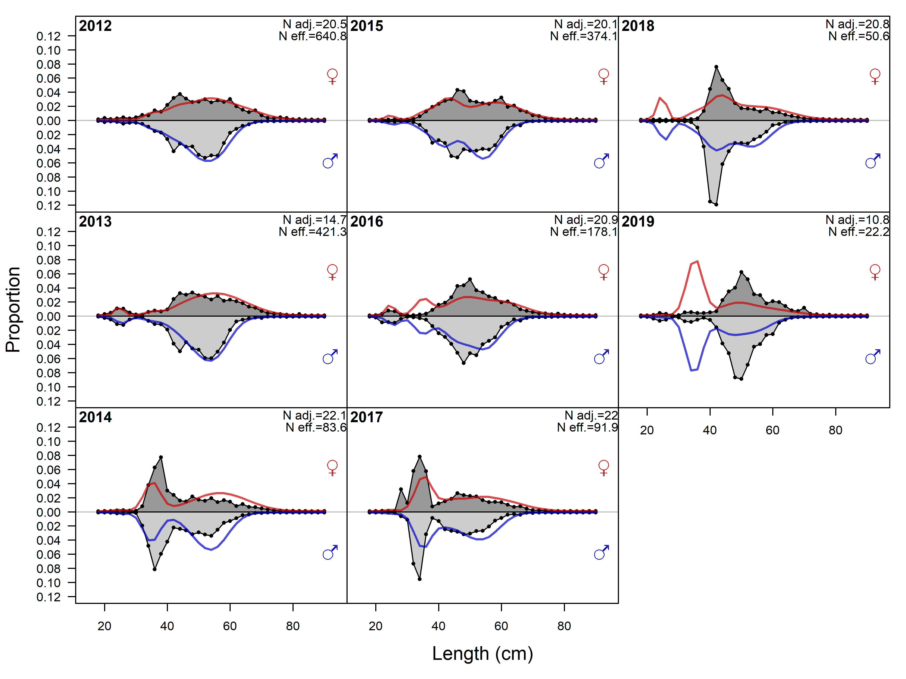
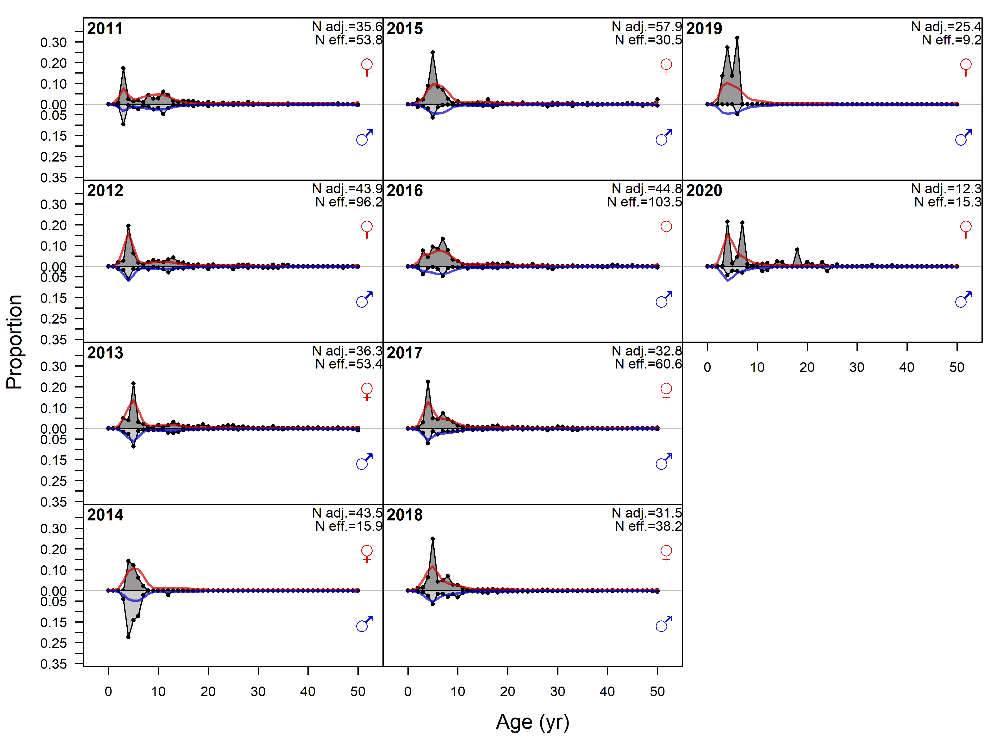
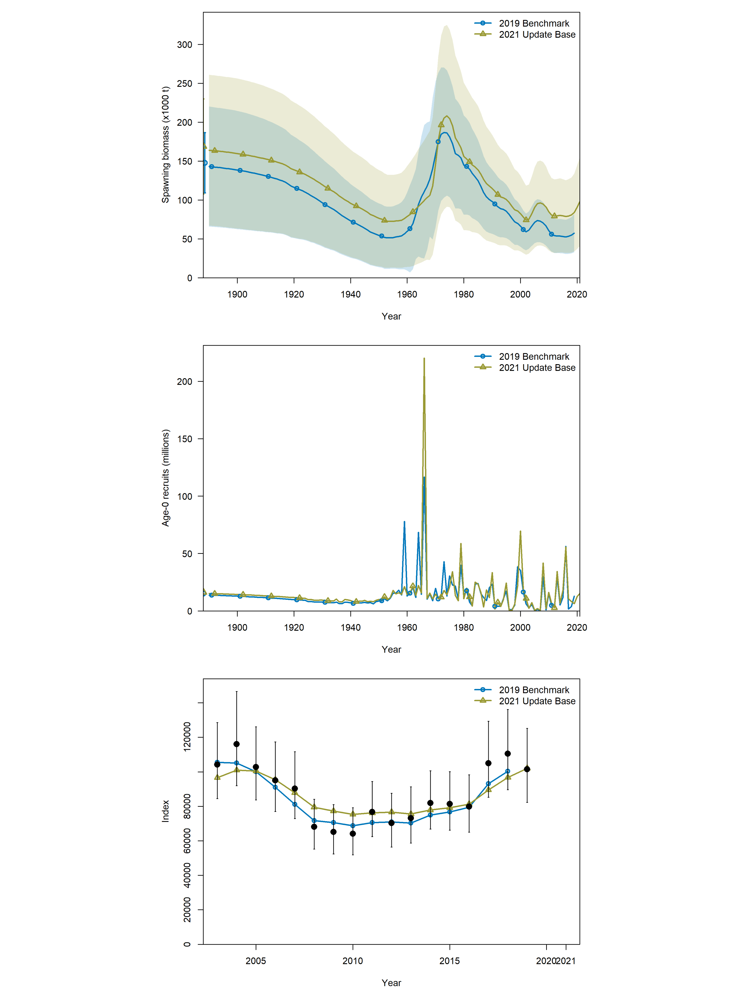
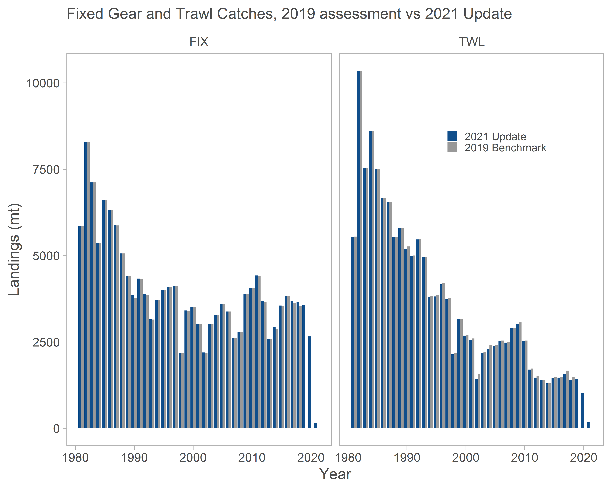
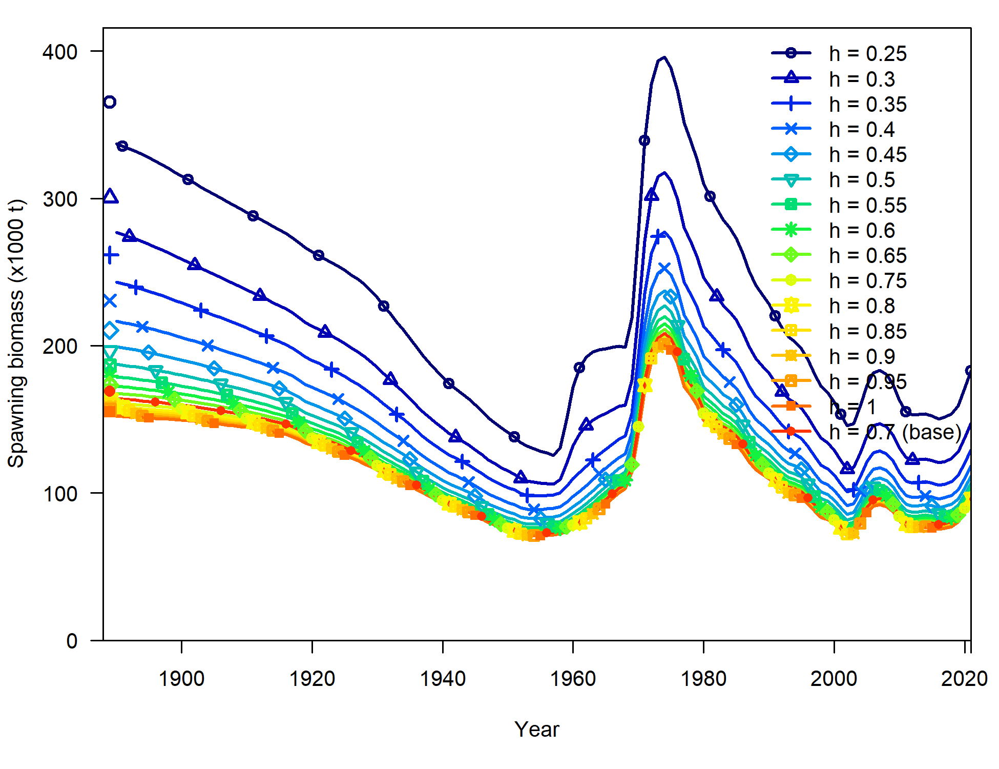
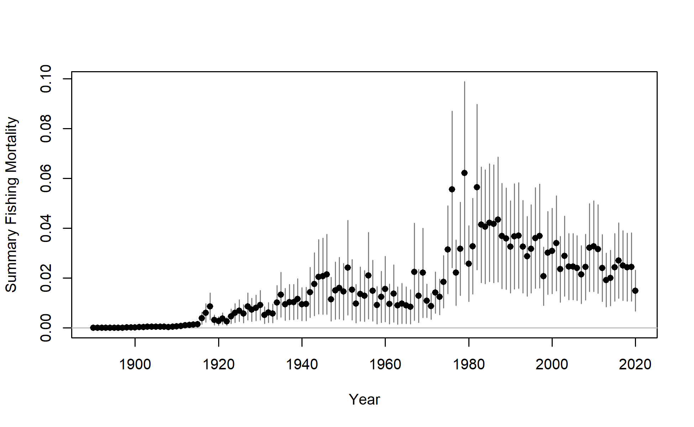
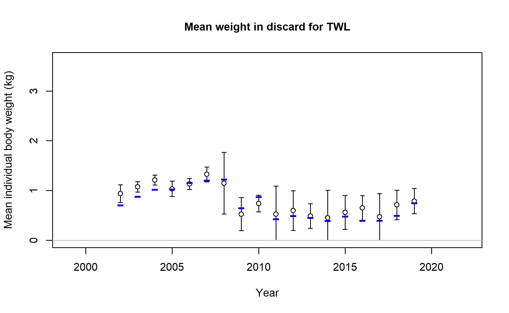

```{r opts, include = FALSE}
knitr::opts_chunk$set(echo = FALSE, warning = FALSE, message = FALSE)
knitr::knit_hooks$set(plot = function(x,options) {
      base = knitr::opts_knit$get('base.url')
      if (is.null(base)) base = ''
      alt = ifelse (is.null(options$alt),"",options$alt)
      cap = ifelse (is.null(options$caption),"",options$caption)
      if (alt != ""){
        sprintf('', cap, base, x, alt)
      } else {
        sprintf('', cap, base, x)  
        }
  })

load("00opts.Rdata")

if(file.exists("00mod.Rdata")){
  load("00mod.Rdata")
} else {
  print("Model output not being read. Please run the read_model() function.")
}

```

<!--chapter:end:00a.Rmd-->

---
author:
  - name: Maia S. Kapur
    code: 1
    first: M
    middle: S
    family: Kapur
  - name: Lee Qi
    code: 1
    first: Qi
    middle: 
    family: Lee
  - name: Giancarlo Moron-Correa
    code: 2
    first: Giancarlo
    middle: 
    family: Moron-Correa
  - name: Melissa A. Haltuch
    code: 1
    first: Melissa
    middle: A
    family: Haltuch
  - name: Owen Hamel
    code: 2
    first: Owen
    middle: S
    family: Hamel
author_list: Kapur, M. S., Lee, Q., Moron-Correa, G., Haltuch, M., Gertseva, V., and Hamel, O.
affiliation:
  - code: 1
    address: School of Aquatic and Fisheries Sciences, University of Washington, 1122 NE Boat St, Seattle, WA 98105
  - code: 2
    address: Northwest Fisheries Science Center, U.S. Department of Commerce, National
      Oceanic and Atmospheric Administration, National Marine Fisheries Service, 2725
      Montlake Boulevard East, Seattle, Washington 98112
  - code: 3
    address: College of Earth, Ocean and Atmospheric Sciences, Oregon State University, 104 CEOAS Admin. Bldg. Corvallis, OR 97331-5503
address:
  - ^1^School of Aquatic and Fisheries Sciences, 1122 NE Boat St, Seattle, WA 98105
  - ^2^Northwest Fisheries Science Center, U.S. Department of Commerce, National Oceanic
    and Atmospheric Administration, National Marine Fisheries Service, 2725 Montlake
    Boulevard East, Seattle, Washington 98112
  - ^3^College of Earth, Ocean and Atmospheric Sciences, Oregon State University, 104 CEOAS Admin. Bldg. Corvallis, OR 97331-5503
---

<!--chapter:end:00authors.Rmd-->

---
title: '00'
output: html_document
---


```{r  include = FALSE}

# I added the cache = TRUE to try to speed up but not sure if this is right
knitr::opts_chunk$set(echo = FALSE, warning = FALSE, message = FALSE)
knitr::knit_hooks$set(plot = function(x,options) {
      base = knitr::opts_knit$get('base.url')
      if (is.null(base)) base = ''
      alt = ifelse (is.null(options$alt),"",options$alt)
      cap = ifelse (is.null(options$caption),"",options$caption)
      if (alt != ""){
        sprintf('', cap, base, x, alt)
      } else {
        sprintf('', cap, base, x)  
        }
  })
load("00opts.Rdata")
# changing what I used in the draft function
spp = 'sablefish'
Spp = 'Sablefish'


if(file.exists("00mod.Rdata")){
  load("00mod.Rdata") ## model
  load("benchmod.rdata") ## o19
} else {
  ## r4ss failed with the changes in May 7 caused by SPR. There's something wrong with exec summary
  ## in a time crunch so reverting r4ss
  # remotes::install_git('r4ss/r4ss@b0974690e1367a8b92cfaf7d9968cc9a697806ba')
  ## extract base case into doc and save as model
  # model <- read_model(mod_loc = "C:/Users/mkapur/Dropbox/UW/assessments/sab-2021/council_runs/torc-lq-base-bnds-hess/", save_loc  = getwd())
  # save(model, file = here('00mod.Rdata'))
  
#   print("Model output not being read. Please run the read_model() function.")
}
# data_fig_loc = "//nwcfile/FRAM/Assessments/CurrentAssessments/DataModerate_2021/copper_rockfish/data/biology/plots"
```

```{r, echo = FALSE}
require(dplyr)
options(scipen = 999)
derived_quants <- model$derived_quants %>% mutate(lci = round(Value - 1.96*StdDev),
                                                  uci =round(Value + 1.96*StdDev),
                                                  Value = ifelse(Value > 100, round(Value), round(Value,2))) 


cpueyearrange<- model$cpue %>% select(Fleet_name, Yr) %>%
  group_by(Fleet_name) %>%
  summarise(miny = min(Yr), maxy = max(Yr)) %>%
  mutate(yrrange = paste(miny,maxy, sep = "-")) %>%
  select(Fleet_name, yrrange) %>%
  tidyr::pivot_wider(., names_from = Fleet_name, values_from = yrrange)
```

\newcommand{\referenceES}{\begingroup\fontsize{10}{12}\selectfont
\begingroup\fontsize{10}{12}\selectfont

\begin{longtable}[t]{r>{\centering\arraybackslash}p{2cm}>{\centering\arraybackslash}p{2cm}>{\centering\arraybackslash}p{2cm}}
\caption{\label{tab:referenceES}Summary of reference points and management quantities, including estimates of the  95 percent intervals.}\\
\toprule
 & Estimate & Lower Interval & Upper Interval\\
\midrule
\endfirsthead
\caption[]{Summary of reference points and management quantities, including estimates of the  95 percent intervals. \textit{(continued)}}\\
\toprule
 & Estimate & Lower Interval & Upper Interval\\
\midrule
\endhead

\endfoot
\bottomrule
\endlastfoot
Unfished Spawning Biomass (mt) & 168875 & 107749 & 230000\\
Unfished Age 4+ Biomass (mt) & 393647 & 242084 & 545209\\
Unfished Recruitment (R0) & 16391.8 & 6585 & 26197\\
Spawning Biomass (mt) (2021) & 97801.9 & 40802 & 154801\\
Fraction Unfished (2021) & 0.579137 & 0.38 & 0.77\\
Proxy Spawning Biomass (mt) SB40 Percent & 67550 & 43099 & 92000\\
SPR Resulting in SB40 Percent & 0.464286 &  & \\
Exploitation Rate Resulting in SB40 Percent & 0.043 & 0.04 & 0.05\\
Yield with SPR Based On SB40 Percent (mt) & 8209& 3857.20317521005 & 12562\\
Proxy Spawning Biomass (mt) (SPR45) & 64848 & 41376 & 8832\\
Exploitation Rate Corresponding to SPR45 & 0.045 & 0.04 & 0.05\\
Yield with SPR45 at SB SPR (mt) & 8350.01 & 3924 & 12776\\
Spawning Biomass (mt) at MSY (SB MSY) & 41701 & 26527.3844367331 & 56876\\
SPR MSY & 0.327 & 0.32 & 0.33\\
Exploitation Rate Corresponding to SPR MSY & 0.07 & 0.06 & 0.08\\
MSY (mt) & 9024 & 4242 & 13806\\*
\end{longtable}
\endgroup{}
\endgroup{}
}
\newcommand{\exploitES}{\begingroup\fontsize{10}{12}\selectfont
\begingroup\fontsize{10}{12}\selectfont

\begin{longtable}[t]{r>{\centering\arraybackslash}p{1.57cm}>{\centering\arraybackslash}p{1.57cm}>{\centering\arraybackslash}p{1.57cm}>{\centering\arraybackslash}p{1.57cm}>{\centering\arraybackslash}p{1.57cm}>{\centering\arraybackslash}p{1.57cm}}
\caption{\label{tab:exploitES}Estimated recent trend in the (1-SPR)/(1-SPR_45\%) where SPR is the spawning potential ratio the exploitation rate, and the  95 percent intervals.}\\
\toprule
Year & (1-SPR)/(1-SPR 45\%) & Lower Interval & Upper Interval & Exploitation Rate & Lower Interval & Upper Interval\\
\midrule
\endfirsthead
\caption[]{Estimated recent trend in the (1-SPR)/(1-SPR_45\%) where SPR is the spawning potential ratio the exploitation rate, and the  95 percent intervals. \textit{(continued)}}\\
\toprule
Year & (1-SPR)/(1-SPR 45\%) & Lower Interval & Upper Interval & Exploitation Rate & Lower Interval & Upper Interval\\
\midrule
\endhead

\endfoot
\bottomrule
\endlastfoot
2011 & 0.97 & 0.60 & 1.34 & 0.03 & 0.01 & 0.05\\
2012 & 0.75 & 0.41 & 1.09 & 0.02 & 0.01 & 0.04\\
2013 & 0.61 & 0.31 & 0.92 & 0.02 & 0.01 & 0.03\\
2014 & 0.61 & 0.30 & 0.92 & 0.02 & 0.01 & 0.03\\
2015 & 0.71 & 0.37 & 1.05 & 0.02 & 0.01 & 0.04\\
2016 & 0.76 & 0.41 & 1.10 & 0.03 & 0.01 & 0.04\\
2017 & 0.68 & 0.36 & 1.01 & 0.02 & 0.01 & 0.04\\
2018 & 0.66 & 0.34 & 0.98 & 0.02 & 0.01 & 0.04\\
2019 & 0.62 & 0.31 & 0.92 & 0.02 & 0.01 & 0.04\\
2020 & 0.40 & 0.18 & 0.63 & 0.01 & 0.01 & 0.02\\*
\end{longtable}
\endgroup{}
\endgroup{}
}

\newcommand{\removalsES}{

\begingroup\fontsize{10}{12}\selectfont
\begingroup\fontsize{10}{12}\selectfont

\begin{longtable}[t]{r>{\centering\arraybackslash}p{1.83cm}>{\centering\arraybackslash}p{1.83cm}>{\centering\arraybackslash}p{1.83cm}>{\centering\arraybackslash}p{1.83cm}>{\centering\arraybackslash}p{1.83cm}}
\caption{\label{tab:removalsES}Recent landings by fleet, total landings summed across fleets, and the total mortality including discards.}\\
\toprule
Year & Fixed-gear & Trawl & Total Landings & Total Dead\\
\midrule
\endfirsthead
\caption[]{Recent landings by fleet, total landings summed across fleets, and the total mortality including discards. \textit{(continued)}}\\
\toprule
Year & Fixed-gear & Trawl & Total Landings & Total Dead\\
\midrule
\endhead

\endfoot
\bottomrule
\endlastfoot
2011 & 4420.85 & 1728.40 & 6149.25 & 6253.97\\
2012 & 3670.22 & 1514.58 & 5184.80 & 5283.60\\
2013 & 2585.07 & 1402.13 & 3987.20 & 4050.48\\
2014 & 2924.26 & 1292.20 & 4216.46 & 4294.90\\
2015 & 3554.94 & 1470.29 & 5025.23 & 5105.52\\
2016 & 3829.86 & 1475.95 & 5305.81 & 5401.39\\
2017 & 3680.67 & 1669.97 & 5350.64 & 5465.76\\
2018 & 3648.68 & 1478.26 & 5126.94 & 5220.22\\
2019 & 3568.27 & 1625.44 & 5193.71 & 5372.81\\
2020 & 2660.03 & 1102.72 & 3762.75 & 3882.69\\*
\end{longtable}
\endgroup{}
\endgroup{}
}

\newcommand{\ssbES}{\begingroup\fontsize{10}{12}\selectfont
\begingroup\fontsize{10}{12}\selectfont

\begin{longtable}[t]{r>{\centering\arraybackslash}p{1.57cm}>{\centering\arraybackslash}p{1.57cm}>{\centering\arraybackslash}p{1.57cm}>{\centering\arraybackslash}p{1.57cm}>{\centering\arraybackslash}p{1.57cm}>{\centering\arraybackslash}p{1.57cm}}
\caption{\label{tab:ssbES}Estimated recent trend in spawning biomass and the fraction unfished and the 95 percent intervals.}\\
\toprule
Year & Spawning Biomass (mt) & Lower Interval & Upper Interval & Fraction Unfished & Lower Interval & Upper Interval\\
\midrule
\endfirsthead
\caption[]{Estimated recent trend in spawning biomass and the fraction unfished and the 95 percent intervals. \textit{(continued)}}\\
\toprule
Year & Spawning Biomass (mt) & Lower Interval & Upper Interval & Fraction Unfished & Lower Interval & Upper Interval\\
\midrule
\endhead

\endfoot
\bottomrule
\endlastfoot
2011 & 80351.5 & 32648.13 & 128054.9 & 0.48 & 0.32 & 0.63\\
2012 & 79223.0 & 31838.52 & 126607.5 & 0.47 & 0.31 & 0.63\\
2013 & 79605.1 & 32059.90 & 127150.3 & 0.47 & 0.31 & 0.63\\
2014 & 80187.9 & 32563.52 & 127812.3 & 0.47 & 0.31 & 0.64\\
2015 & 79676.1 & 32447.44 & 126904.8 & 0.47 & 0.31 & 0.63\\
2016 & 78633.2 & 31824.56 & 125441.8 & 0.47 & 0.31 & 0.62\\
2017 & 79326.7 & 31972.79 & 126680.6 & 0.47 & 0.31 & 0.63\\
2018 & 80687.2 & 32503.64 & 128870.8 & 0.48 & 0.31 & 0.64\\
2019 & 83925.1 & 33936.02 & 133914.2 & 0.50 & 0.33 & 0.67\\
2020 & 90756.5 & 37136.00 & 144377.0 & 0.54 & 0.35 & 0.72\\
2021 & 97801.9 & 40802.42 & 154801.4 & 0.58 & 0.38 & 0.77\\*
\end{longtable}
\endgroup{}
\endgroup{}
}


\newcommand{\textrefpt}{Unfished spawning biomass was estimated to be `r round(derived_quants[derived_quants$Label == "SSB_unfished", "Value"])` mt (`r round(derived_quants[derived_quants$Label == "SSB_unfished", "lci"])`-`r round(derived_quants[derived_quants$Label == "SSB_unfished", "uci"])`, $\sim$95\% interval). The abundance of sablefish was estimated to have declined to near the target during the period 1980-2000. The estimate of the target spawning biomass was `r derived_quants[derived_quants$Label == "SSB_Btgt", "Value"]`, `r derived_quants[derived_quants$Label == "SSB_Btgt", "lci"]`-`r derived_quants[derived_quants$Label == "SSB_Btgt", "uci"]`, $\sim$95\%  interval). The stock was estimated to be just `r ifelse(derived_quants[derived_quants$Label == paste0("SSB_", model$endyr), "Value"]<derived_quants[derived_quants$Label == "Dead_Catch_Btgt", "Value"],"below","above")` the target stock size in the beginning of `r model$endyr` at `r derived_quants[derived_quants$Label == paste0("SSB_", model$endyr), "Value"]` mt `r derived_quants[derived_quants$Label == paste0("SSB_", model$endyr), "lci"]`-`r derived_quants[derived_quants$Label == paste0("SSB_", model$endyr), "uci"]`, $\sim$95\% interval). The stock was estimated to be `r ifelse(derived_quants[derived_quants$Label == "Bratio_2020", "Value"]<derived_quants[derived_quants$Label == "B_MSY/SSB_unfished", "Value"],'below','above')` the depletion level that would lead to maximum yield `r round(derived_quants[derived_quants$Label == "B_MSY/SSB_unfished", "Value"], 2)`; Figures \ref{yield1} and \ref{SPR4_phase}). The estimate of the stock's current level of depletion was `r round(derived_quants[derived_quants$Label == "Bratio_2020", "Value"], 2)`.}

\newcommand{\textexplstatus}{Equilibrium yield at the fishing mortality that leads to the maximum sustainable yield ($F_{MSY}$) is `r round(derived_quants[derived_quants$Label == "Dead_Catch_MSY", "Value"])` mt (`r round(derived_quants[derived_quants$Label == "Dead_Catch_MSY", "lci"])`-`r round(derived_quants[derived_quants$Label == "Dead_Catch_MSY", "uci"])`, $\sim$95\% interval). Although the estimated productivity and absolute scale of the stock are poorly informed by the available data and are, therefore, sensitive to changes in model structure and treatment of data, all sensitivity or alternate models evaluated showed a declining trend in biomass since the 1970s followed by a recent increase in biomass (Figures \ref{SPR3} and \ref{ts_summaryF}). The spawner potential ratio ($SPR$)  exceeded the fishing mortality target or overfishing level ($SPR_{45\%}$) that stabilizes the stock at the target (i.e., $(1-SPR)/[1-SPR_{45\%}]$) during the late 2000s and early 2010s, and was between `r paste0(round(range(derived_quants[derived_quants$Label %in% paste0("SPRratio_", 2015:2019), "Value"])*100, 0 ), collapse = " and ")`\% from 2015-2019, descending to `r round(derived_quants[derived_quants$Label %in% paste0("SPRratio_", 2020), "Value"]*100, 0)`\% in 2020. }


<!--chapter:end:00presets.Rmd-->

---
title: DRAFT Status of Sablefish (_Anoplopoma fimbria_) along the US West coast in 2021. \newline \newline \newline These materials do not constitute a formal publication and are for information only. They are in a pre-review, pre-decisional state and should not be formally cited (or reproduced). They are to be considered provisional and do not represent any determination or policy of NOAA or the Department of Commerce.
---

<!--chapter:end:00title.Rmd-->

\pagebreak
\pagenumbering{roman}
\setcounter{page}{1}

\renewcommand{\thetable}{\roman{table}}
\renewcommand{\thefigure}{\roman{figure}}

<!--chapter:end:01a.Rmd-->

```{r executive, echo = FALSE}
executive <- list()
executive[["stock"]] <- paste0("This assessment reports the status of ",
  spp, " (_", spp.sci, "_) off the ", coast," coast using data through 2020.  The resource is modeled as a single stock; however, sablefish disperse to and from offshore seamounts along the coastal waters of the continental U.S., Canada, and Alaska and across the Aleutian Islands to the western Pacific. Their movement is not explicitly accounted for in this analysis.")
```
# Executive Summary{-}
## Stock{-}
`r executive[["stock"]]`

## Landings{-}
A variety of sources were used to reconstruct state-specific historical sablefish landings (i.e., fish brought to market), creating a series of landings from 1890 to present. In general, these reconstructions are more reliable than those for many other groundfish species because of the consistent identification of sablefish to the species level. Historical-landings reconstructions for sablefish have been completed for California, Oregon, and Washington, extending landings to the beginning of the U.S. West Coast sablefish fishery.
Fishery discard rates and weights were fit within the assessment model, i.e., simultaneous estimation of total catches and other model parameters. This internal estimation can result in model estimates of total mortality that differ between stock assessments even when the landings inputs remain unchanged due to changes in fixed and estimated parameter values, priors, or parameterizations. Model estimates of fishery discards resulted in model estimated total dead catches that were an average of `r paste0(round(model$catch %>% select(Yr, Fleet, Obs, kill_bio   ) %>% filter(Fleet !=2 & Yr > 2010) %>% mutate(pd = (kill_bio-Obs)/Obs) %>%summarise(mean(pd))*100,2),"%")` larger than the landings input into the stock assessment model over the last decade.
Historically, sablefish landings were just below recent landings (<4,000 mt) until the end of the 1960s and were primarily harvested by fixed gear. Large catches (24,395 mt) by foreign vessels fishing pot gear in 1976 resulted in the largest landings reported in a single-year. A rapid rise in domestic pot and trawl landings followed this peak removal, such that, on average, nearly 8,400 mt of sablefish were landed per year between 1976 and 1990. Subsequently, annual landings have remained below 9,000 mt and been divided approximately 67%/33% between fixed and trawl gears, respectively, during the most recent decade. An Individual Fishing Quota (IFQ) program, referred to as catch shares, was implemented for the U.S. West Coast trawl fleet beginning in 2011. Gear switching is allowed within the program such that fixed gear can be used to catch sablefish under trawl IFQ. This has resulted in changes in fleet behavior, the distribution of fishing effort, and discarding rates. Complete observer coverage on all vessels fishing IFQ quota became mandatory at the start of the program, while coverage in the other sectors remained stratified by port. The lack of historical observer coverage, and consequently information on total catch and age and length compositions, thus contributes to uncertainty regarding selectivity and retention during the historical period.


{width=100% height=100% alt="Catches by Fleet, all years"}

\removalsES

\clearpage

## Data and Assessment{-}

The last benchmark stock assessment for sablefish took place during 2019 (@Haltuch2019b), preceded by an update assessment during 2015 (@johnson2016sablefish).  The present (2021) update assessment used the most recent version of the Stock Synthesis modeling platform (3.30), and bridged between the sub-version used in the benchmark (v3.30.09, released 2019-03-09) and the latest release (v3.30.16, released 2020-09-03). Primary data sources include landings and age-composition data from the retained catch. For recent years, data on the discarded portion of commercial catch are available, including discard lengths, rates, and mean observed individual body weight of the discarded catch. The relative index of abundance estimated from the National Marine Fisheries Service (NMFS) Northwest Fisheries Science Center (NWFSC) West Coast Groundfish Bottom Trawl (WCGBT) Survey, which includes depths from 55 - 1,280 m, represents the primary source of information on the stock’s trend and was updated to include the most recent data, covering the period 2003-2019. Note that the WCGBT Survey does not access the closed Cowcod Conservation areas in southern California, and was not performed in 2020 due to the global SARS-CoV-2 pandemic. Other, discontinued, survey indices contribute information on trend and sablefish demographics: (a) NWFSC Slope Survey conducted from 1998-2002, (b) Alaska Fisheries Science Center (AFSC) Slope Survey (1997-2001), and (c) AFSC/NWFSC Triennial Shelf Survey (1980-2004). Additionally, an environmental time-series of sea level was used as a survey index of recruitment in the base model.
All externally estimated model parameters, (a) weight-length relationship, (b) maturity schedule, and (c) fecundity relationships remained unchanged from the 2019 benchmark assessment. As in previous assessments, growth and natural mortality were estimated using sex-specific relationships. Uncertainty in recruitment was included by estimating a full time-series of deviations from the stock-recruitment curve. The ‘one-way-trip’ nature of the time-series does not facilitate estimation of the steepness parameter (h) of the stock-recruitment relationship. Therefore, h was fixed at 0.7, similar to values used on other groundfish stock assessments, and was explored via sensitivity analysis in 2019; we explore information regarding h via likelihood profiles.
During the 2019 assessment, a vast number of historical management actions were evaluated and condensed to a subset that were most likely to have had a direct influence on fishery behavior (either sorting and retention, selectivity, or both). These time periods were used to define time blocks to reduce the complexity of selectivity and retention parameterizations. The 2019 Benchmark assessment utilized the same general structure as the 2011 assessment, with the addition of full retention for the trawl fishery after the implementation of the IFQ program. 

During the addition of new data for this update assessment, modelers identified a large influx of younger, small fish observable in the age compositions of commercially landed catch, which was also visible in the discard length compositions of those commercial fleets (Figure \ref{discard_lencomps}). This latter dataset was not used in the benchmark, nor were any commercial length compositions due to conflicts between the age and length data. Absent the data or flexibility to account for increased discarding, a model which conformed to the Terms of Reference was unable to satisfactorily fit to the composition data from the two commercial fleets nor the WCGBTS survey, and greatly overestimated the 2019 index. We rectify this issue by re-introducing the discard length compositions and time-blocking the retention curve to include a new block for the final two years of the model period (2019-2020; the benchmark model's terminal period for retention selectivity ran from 2011-2017). This adjustment resolved the aforementioned model fit issues.

Aging error, both precision and accuracy, was extensively investigated during the 2011 assessment but remains unresolved given the lack of an age validation study for sablefish. The age error analysis for this assessment used the same software and methods as the 2019 assessment, and the 2011 assessment and 2015 update before it. The larger number of between-lab reads from the AFSC and the NWFSC available for this assessment showed a small amount of variability between laboratories. Therefore, this analysis uses the between-lab reads as well as the double reads from the NWFSC, treating them both as unbiased but potentially non-linearly variable. The age imprecision was such that by age 50 observed ages could differ from true ages by up to 16-17 years. Therefore, the potential for underestimating or overestimating the age of the oldest fish still remains, and thus, the potential for aging bias remains a source of uncertainty.

## Stock Biomass{-}
During the first half of the 20th century it is estimated that sablefish were exploited at relatively modest levels. Modest catches continued until the 1960s, along with a higher frequency of above average, but uncertain, estimates of recruitment through the 1970s. The spawning stock biomass increased during the 1940s to 1970s. Subsequently, biomass is estimated to have declined between the mid-1970s and the early 2010s, with the largest peaks in harvests during the 1970s followed by harvests that were, on average, higher than pre-1970s harvest through the 2000s. At the same time, there were a higher frequency of generally lower than average recruitments from the 1980s forward. Despite estimates of harvest rates that were largely below overfishing rates from the 1990s forward and a few high recruitments from the 1980s forward, the spawning biomass has only recently begun to increase. This stock assessment does suggest spawner per recruitment rates higher than the target during some years from the 1990s forward for two reasons. First, there have been many years with lower than expected recruitment. Second, stock assessment estimates of unfished spawning biomass have been steadily declining in each subsequent assessment since 2007. Estimates of unfished biomass scale catch advice.

Although the relative trend in spawning biomass is robust to uncertainty in the leading model parameters, the productivity of the stock is uncertain due to confounding of natural mortality, absolute stock size, and productivity. The estimates of uncertainty around the point estimate of unfished stock size are large across, suggesting that the unfished spawning biomass could range from just under `r round(derived_quants[derived_quants$Label == "SSB_unfished", "lci"])` mt to `r round(derived_quants[derived_quants$Label == "SSB_unfished", "uci"])` mt. The point estimate of `r model$endyr+1` spawning biomass from the base model is `r round(derived_quants[derived_quants$Label == "SSB_2021", "Value"])`, however, the ∼95% interval ranges broadly from `r round(derived_quants[derived_quants$Label == "SSB_2021", "lci"])` to  `r round(derived_quants[derived_quants$Label == "SSB_2021", "uci"])` mt. The point estimate of `r model$endyr+1` spawning biomass relative to an unfished state (i.e., depletion) from the base model is `r  round(derived_quants[grep('Bratio_2021',model$derived_quants$Label),'Value']*100,2)`% of unexploited levels (∼95\% interval: `r round(derived_quants[grep('Bratio_2021',derived_quants$Label),'lci']*100)`%-`r round(derived_quants[grep('Bratio_2021',derived_quants$Label),'uci']*100)`%).


{width=100% height=100% alt="Relative SPR vs B Ratio"}
\newpage

\ssbES

\quad

## Recruitment{-}
Sablefish recruitment is estimated to be quite variable with large amounts of uncertainty in individual recruitment events. A period with generally higher frequencies of strong recruitments spans from the early 1950s through the 1970s, followed by a lower frequency of large recruitments during 1980 forward, contributing to stock declines. The period with a higher frequency of high recruitments contributed to a large increase in stock biomass that has subsequently declined throughout much of the 1970s forward. Less frequent large recruitments during the mid-1980s through 1990 slowed the rate of stock decline, with another series of large recruitments during 1999 and 2000 leading to a leveling off in the stock decline. The above-average cohorts from 2008, 2010, 2013, and 2016 are contributing to a slightly increasing spawning stock size. 


{width=80% height=50% alt="Recruitment Deviates with Uncertainty"}


{width=80% height=50% alt="Age 0 Recruits"}

\clearpage

\begingroup\fontsize{10}{12}\selectfont
\begingroup\fontsize{10}{12}\selectfont

\begin{longtable}[t]{r>{\centering\arraybackslash}p{1.57cm}>{\centering\arraybackslash}p{1.57cm}>{\centering\arraybackslash}p{1.57cm}>{\centering\arraybackslash}p{1.57cm}>{\centering\arraybackslash}p{1.57cm}>{\centering\arraybackslash}p{1.57cm}}
\caption{\label{tab:recrES}Estimated recent trend in recruitment and recruitment deviations and the 95 percent intervals.}\\
\toprule
Year & Recruitment & Lower Interval & Upper Interval & Recruitment Deviations & Lower Interval & Upper Interval\\
\midrule
\endfirsthead
\caption[]{Estimated recent trend in age-0 recruitment (1000s), and recruitment deviations and the 95 percent intervals. \textit{(continued)}}\\
\toprule
Year & Recruitment & Lower Interval & Upper Interval & Recruitment Deviations & Lower Interval & Upper Interval\\
\midrule
\endhead

\endfoot
\bottomrule
\endlastfoot
2011 & 6445.91 & 2238.00 & 10653.82 & 0.09 & -0.34 & 0.52\\
2012 & 2759.31 & 353.79 & 5164.83 & -0.76 & -1.47 & -0.04\\
2013 & 34307.60 & 15326.03 & 53289.17 & 1.76 & 1.51 & 2.02\\
2014 & 6708.58 & 2238.47 & 11178.69 & 0.13 & -0.31 & 0.57\\
2015 & 18010.90 & 7329.57 & 28692.23 & 1.12 & 0.79 & 1.45\\
2016 & 55594.50 & 24621.97 & 86567.03 & 2.25 & 1.98 & 2.52\\
2017 & 10688.70 & 3033.88 & 18343.52 & 0.60 & 0.08 & 1.12\\
2018 & 8151.38 & 518.63 & 15784.13 & 0.32 & -0.45 & 1.10\\
2019 & 6274.11 & -9844.16 & 22392.38 & 0.05 & -2.41 & 2.51\\
2020 & 12455.30 & -21008.34 & 45918.94 & -0.19 & -2.77 & 2.39\\
2021 & 15207.70 & -27593.80 & 58009.20 & 0.00 & -2.74 & 2.74\\*
\end{longtable}
\endgroup{}
\endgroup{}


## Reference Points{-}

\textrefpt

\quad

{width=100% height=100% alt="RelSBnoforecast"}
{width=100% height=100% alt="Relative SPR vs B Ratio"}

\clearpage

## Exploitation Status{-}

\textexplstatus


{width=100% height=100% alt="Relative SPR vs B Ratio"}
\exploitES


## Management Performance{-}
Sablefish management includes a rich history of seasons, size-limits, trip-limits, and a complex permit system. Managers divide coast-wide yield targets from sablefish stock assessment among the fleets, fishery sectors (including both limited entry and open access), as well as north and south of 36◦ N latitude. Peak catches occurred during the late 1970s just prior to the imposition of the first catch limits. Over the last decade, the total estimated dead catch has been 55% of the sum of the overfishing limits (previously termed ABCs) and 65% of the annual catch limits (previously termed OYs).


\referenceES

## Unresolved Problems and Major Uncertainties{-}
The data available for sablefish off the U.S. West Coast are not informative with respect to absolute size and productivity. This is, in part, due to the one-way-trip nature of the historical series (i.e., a slow and steady decline in spawning biomass), which can be consistent with a larger less productive stock, a smaller more productive stock, or many combinations in between. While the historical catches provide some information about the minimum stock size necessary to remove the catches from the population, there is limited information in the data regarding the upper limit of the stock size. The above factors are also confounded by movement of sablefish between the region included in this assessment and regions to the north. Likelihood profiles, parameter es- timates, and general model behavior illustrate that small changes in many parameters can result in different management reference points. However, because leading model parameters, such as natural mortality, selectivity, and historical recruitments, are estimated within the stock assessment model, the uncertainty about these estimates remains large and typically overlapped among the in- vestigated models. The uncertainty will remain until a more informative time-series, better quality demographic and biological information are accumulated, or a range-wide analysis is completed for sablefish.
Uncertainty in the current aging methods (both bias and imprecision), as well as relatively sparse fishery sampling, result in age data that potentially variable. Furthermore, because sablefish grow rapidly, nearing asymptotic length in their first decade of life, length data is not particularly inFormative about historical patterns in recruitment. The patterns observed in historical sablefish recruitment suggest that the stock trajectory (via shifts in recruitment strength) is closely linked to productivity regimes in the California Current. Uncertainty in future environmental conditions, changes in the timing, dynamics, and productivity of the California Current ecosystem via cli- mate change or cycles similar to the historical period should be considered a significant source of uncertainty in all projections of stock status.
The ongoing WCGBT Survey is a fairly precise relative index of abundance over a broad demo- graphic component of the stock, but it does not survey the entire stock as sablefish reside in waters deeper than 1280 m, the survey limit, and to the north. Therefore, a portion of the stock is unobserved. This index has the potential to inform future stock assessments about the scale of the population relative to catches being removed, however such information will require contrast in the observed survey trend.

## Harvest Projections{-}
Previous sablefish stock assessments have been designated as Category 1 stock assessments. Thus, projections and decision tables are based on P∗=0.4 and the values of sigma adopted by the Pacific Fisheries Management Council for stock projections. The time series of multiplicative buffer fractions that are a function of P∗ and the time series of sigmas provide the multipliers on the over- fishing limit, these values are all less than 1. The multipliers are combined with the 40-10 harvest control rule to calculate overfishing limits, acceptable biological catches, and annual catch limits. The total catches in `r model$endyr+1` and `r model$endyr+2` were set at the Pacific Fisheries Management Council Groundfish Management Team requested values, just below that Pacific Fisheries Management Council annual catch limits for sablefish. The average `r paste0(range(model$endyr-3, model$endyr), collapse = "-")` catches were used to distribute catches among the fisheries.
Current medium-term projections from the base model under the Pacific Fisheries Management Council 40-10 harvest control rule estimate that the stock will remain above the target stock size of 40% of the estimated unfished spawning biomass during the projection period. Projections are provided through `r model$nforecastyears+model$endyr` (Table \ref{referenceES}).
Forecasts from the `r o19$endyr+1` benchmark assessment projected the spawning biomass to increase by `r paste0(round((o19$timeseries$SpawnBio[o19$timeseries$Yr == model$endyr+1]-o19$timeseries$SpawnBio[o19$timeseries$Yr == model$endyr-3])/o19$timeseries$SpawnBio[o19$timeseries$Yr == model$endyr-3]*100,2),"%")`
from `r model$endyr-3` to `r model$endyr+1`given specified harvests, whereas the current assessment estimated the increase at `r paste0(round((model$timeseries$SpawnBio[model$timeseries$Yr == model$endyr+1]-model$timeseries$SpawnBio[model$timeseries$Yr == model$endyr-3])/model$timeseries$SpawnBio[model$timeseries$Yr == model$endyr-3]*100,2),"%")`. Estimates of unexploited spawning biomass are `r paste0(round((model$derived_quants[grep('SSB_Virgin',model$derived_quants$Label),'Value']-o19$derived_quants[grep('SSB_Virgin',o19$derived_quants$Label),'Value'])/model$derived_quants[grep('SSB_Virgin',model$derived_quants$Label),'Value']*100,2),"%")` higher than that estimated in `r o19$endyr+1` and 19% lower than the 2011 estimate. Percent of unfished biomass in `r model$endyr+1` was estimated at `r round(model$derived_quants[grep('Bratio_2021',model$derived_quants$Label),'Value'],2)`, while the `r o19$endyr+1` benchmark assessment forecasted it to be  `r round(o19$derived_quants[grep('Bratio_2021',o19$derived_quants$Label),'Value'],2)`.

\begingroup\fontsize{10}{12}\selectfont
\begingroup\fontsize{10}{12}\selectfont

\begin{longtable}[t]{r>{\centering\arraybackslash}p{1.83cm}>{\centering\arraybackslash}p{1.83cm}>{\centering\arraybackslash}p{1.83cm}>{\centering\arraybackslash}p{1.83cm}>{\centering\arraybackslash}p{1.83cm}}
\caption{\label{tab:projectionES}Projections of potential OFLs (mt), ABCs (mt), estimated spawning biomass and fraction unfished.}\\
\toprule
Year & Predicted OFL (mt) & ABC Catch (mt) & Age 4+ Biomass (mt) & Spawning Biomass (mt) & Fraction Unfished\\
\midrule
\endfirsthead
\caption[]{Projections of potential OFLs (mt), ABCs (mt), estimated spawning biomass and fraction unfished. \textit{(continued)}}\\
\toprule
Year & Predicted OFL (mt) & ABC Catch (mt) & Age 4+ Biomass (mt) & Spawning Biomass (mt) & Fraction Unfished\\
\midrule
\endhead

\endfoot
\bottomrule
\endlastfoot
2021 & 13117.00 & 7405.00 & 265655 & 97801.9 & 0.58\\
2022 & 12515.20 & 7055.00 & 261481 & 99956.5 & 0.59\\
2023 & 11577.10 & 10824.60 & 253540 & 99449.9 & 0.59\\
2024 & 10669.80 & 9922.92 & 246090 & 95943.8 & 0.57\\
2025 & 10120.60 & 9371.67 & 241976 & 93063.3 & 0.55\\
2026 & 9837.41 & 9070.09 & 238823 & 90925.0 & 0.54\\
2027 & 9742.34 & 8933.73 & 236280 & 89290.8 & 0.53\\
2028 & 9735.24 & 8888.27 & 234037 & 87941.5 & 0.52\\
2029 & 9747.17 & 8860.17 & 231955 & 86743.8 & 0.51\\
2030 & 9746.00 & 8810.38 & 229993 & 85644.5 & 0.51\\
2031 & 9725.92 & 8753.33 & 228162 & 84634.2 & 0.50\\
2032 & 9691.91 & 8683.95 & 226462 & 83707.8 & 0.50\\*
\end{longtable}
\endgroup{}
\endgroup{}

## Decision Table{-}
The decision table reports 12-year projections for alternate states of nature (columns) and management options (rows). The results of this table are conditioned on the Groundfish Management Team specified catches for `r model$endyr+1` and `r model$endyr+2`, which are below the already-specified annual catch limits approved by the Pacific Fisheries Management Council.
Uncertainty in management quantities for the decision table was characterized using the asymptotic standard deviation for the `r model$endyr+1` spawning biomass from the base model. Specifically, the `r model$endyr+1` spawning biomass for the high and low states of nature are given by the base model mean ±1.15·standard deviation (i.e., the 12.5th and 87.5th percentiles). A search across fixed values of $R_0$ was used to attain the `r model$endyr+1` spawning biomass values for the high and low states of nature. The mid-level catch streams were based on the 40-10 harvest control rule. At the request of the Groundfish Management Team representative at the STAR panel, the high and low catch streams were set using the Category 1 values of P∗ = 0.45 and P∗ = 0.35, respectively.
**UPDATE ME ** Spawning stock biomass in `r model$endyr+1` ranges across the three states of nature from 42,968 to 71,915 mt, with corresponding stock status between 38% to 41% of the unfished stock size. The decision table suggests that all catch scenarios under both the base and high state of nature result in increases in stock size such that the stock remains either at or above the target stock size at the end of the projection period. However, all catch scenarios under the low state of nature result in declines in stock size throughout the projection period, maintaining the stock within the precautionary zone.

## Research and Data Needs{-}
Most of the research needs listed below entail investigations that need to take place outside of the routine assessment cycle and require additional resources to be completed.

1. Not all of the available sablefish otoliths were aged for this stock assessment because of time constraints resulting from the federal government furlough, and, in some cases, the sample sizes of aged fish are lower than what would be ideal. Resources should be provided to age otolith samples from years with missing age data or small sample sizes.

2. A transboundary stock assessment and the management framework to support such assess- ments would be beneficial given the migratory nature and broad distribution of sablefish along the Pacific Rim. A transboundary assessment would likely improve the ability to estimate the scale of the population, particularly during the early modeled period.

3. Investigation of environmental covariates for recruitment on a stock-wide, northeast Pacific scale.

4. Continuation of the annual WCGBT Survey will provide information on stock trends and incoming recruitments. A longer survey time series may improve the precision of estimates of absolute stock size and productivity into the future.

5. Age validation is needed to verify the level of age bias present in the data, if any.

6. Investigate aging methods that could prove more precise than current break-and-burn methods. More accurate age data would facilitate tracking cohorts to older ages, improving estimates of historical year-class strengths.

7. Research on understanding the interactions between spatial patterns in sablefish growth, fishery size selectivity, and movement across the Northeast Pacific began during 2019 and are ongoing. The results of this research should be considered in future benchmark stock assessments.

8. Anecdotal information, such as the large 1947 recruitment reported by central California sport fisherman, along with historical records could be investigated to provide additional information on historical patterns of recruitment.


<!--chapter:end:01executive.Rmd-->

\pagebreak
\setlength{\parskip}{5mm plus1mm minus1mm}
\pagenumbering{arabic}
\setcounter{page}{1}
\renewcommand{\thefigure}{\arabic{figure}}
\renewcommand{\thetable}{\arabic{table}}
\setcounter{table}{0}
\setcounter{figure}{0}

<!--chapter:end:10a.Rmd-->

# Introduction
## Basic Information
`r Spp` (*`r spp.sci`*, or 'black cod') are distributed in the northeastern Pacific Ocean from the southern tip of Baja California northward to the north-central Bering Sea and in the northwestern Pacific Ocean from Kamchatka southward to the northeastern coast of Japan @hart1973, @eschmeyer1983. U.S. West Coast `r spp` are modeled as a single stock. Thus, this stock assessment does not explicitly account for movement between offshore sea mounts {@shaw1997, @morita2012envbiofishsex, @hanselman2015cjfasmove, @rogers2020, regions to the north of the U.S. west coast, or to the western Pacific @fujioka1988docdescription, @heifetz1991fishresmovement, @hanselman2015cjfasmove, @rogers2020}.
While previous analyses suggest the existence of several stocks of `r spp` in the eastern Pacific Ocean that are largely delineated by management boundaries (@schirripa2007sablefish); and earlier assessments), more recent genetic analyses found that `r spp` in the northeastern Pacific Ocean are a single panmictic population @jasonowicz2017cjfaslove). Additional support for a panmictic population stems from tag recoveries that show `r spp` move between the regions currently used for management (@hanselman2015cjfasmove, @sogard2017, @rogers2020). Analyses of length-at-age data has found spatial variation in von Bertalanffy growth parameters across the northeastern Pacific Ocean (@mcdevitt1987sablefish, @echave2012fishbullinterdecadal, @head2014fishres, @gertseva2017icesjmsspatial, @kapur2020). While geographic break points at approximately 1. $36^{\circ}$N between Point Conception and Monterey, California at the start of the southern California Bight and 2. $50^{\circ}$N where the North Pacific Current bifurcates suggest zones of growth variation, generally with increasing maximum body size and decreasing growth rates with increasing latitude, they do not indicate regions with separate populations.
Smaller `r spp` are generally found in shallower waters, but the demographics appears to be fully mixed (adult and juvenile) near the shelf-slope break (i.e., 100-300 m). Beyond the shelf-slope break, the adult population is dominated by older individuals @methot1994  and younger fish become increasingly rare \begin{comment}(see Section \ref{data:surveys})\end{comment}. Fish in the deepest areas sampled tend to be the oldest individuals, but not the largest individuals, suggesting that age rather than size dictates depth distribution. However, the interaction between environmental conditions and seasonal movements that produce an increase in age with depth are largely unknown. The stock is distributed beyond the greatest depth sampled by any of the surveys and beyond the deepest commercial fishing areas. Research in these deeper habitats occupied by `r spp` is potentially difficult because they extend across the boundary of the exclusive economic zone and sea mounts and ridges around the Pacific. There are relatively fewer `r spp` in the Puget Sound and the Strait of Georgia than in coastal U.S. waters. Therefore, connectivity among these areas and the open coast is likely of less importance to this stock assessment than movement along the coast.

## Life History
@tolimieri2018 provide a thorough review of the literature on spawning and early life history of `r spp` in the California Current. Briefly, `r spp` off the U.S. West Coast exhibit a protracted spawning period from December through March, with peak in February @guzman2017. This winter-time spawning may result in reduced availability to the commercial fishery during the winter months. Spawning occurs along the continental shelf-slope break in waters deeper than 300 m. Eggs ($\sim$ 2.1 mm in diameter) are buoyant and rise in the water column before hatching and sinking to deeper waters. Pelagic juveniles are present in off-shore surface waters and settle to the benthos as age-0 recruits during the late summer to fall, with most newly settled fish at depths of less than 250 m. 
`r spp` reach full size and maturity in their first decade of life, reaching nearly asymptotic size and beginning to mature after 5-7 years. Female `r spp` generally reach larger sizes than males. However, the sex-ratio tends to be skewed toward males at the oldest ages implying a lower natural mortality rate for males relative to females. The oldest `r spp` on record was captured in 2006 off Washington and aged (with observation error) at 102 years. This female was only 68 cm long, nowhere near the longest individual (117 cm).
Adult `r spp` are fast-swimming and capable of feeding on a diverse array of prey species including fishes, cephalopods, and crustaceans @low1976. The cohabitation of adult and juvenile `r spp` may result in some cannibalism, and large changes in predator biomass (such as the recent rebuilding of lingcod, \emph{Ophiodon elongatus}) could have a feedback on juvenile survival and, therefore, stock productivity.

## Ecosystem Considerations
\begin{comment}
The National Oceanic and Atmospheric Administration (NOAA) document titled 'Implementing a Next Generation Stock Assessment Enterprise, An update to the NOAA Fisheries Stock Assessment Improvement Plan' (@lynch2018) calls for bringing an ecosystem perspective into the assessment process. Moreover, introducing this perspective to the assessment process is a key component of the NOAA Fisheries Ecosystem-Based Fisheries Management (EBFM) Policy @noaa2016, which calls for incorporation of ecosystem considerations into the management of living marine resources. Uptake of EBFM principles and tools into the assessment process can be accomplished through including ecosystem information in assessments, harvest control rules, and management decisions that are coordinated across species-specific management plans and account for diverse trade-offs (@noaa2016, @lynch2018). Guidelines for incorporating ecosystem considerations into fisheries management advice form the core of Guiding Principle 5 for implementing the NOAA EBFM Policy.
This assessment includes ecological factors based on the idea that research focused on the linkages within a social-ecological system (SES) and how they increase or decrease sustainability can help inform the management of natural resources (@ostrom2009). The SES framework requires consideration of extractive goals and human activities at a level that allows for ecological sustainability while also considering human well-being. Thus, the SES framework facilitates the consideration of environmental and human impacts on  `r spp` as well as `r spp` impacts on the ecosystem and humans (e.g., @levin2016). \end{comment}
A detailed summary of SES analyses, the Climate Vulnerability Assessment, and environmental drivers of sablefish recruitment is available in the 2019 Benchmark Assessment report {@Haltuch2019b}, and truncated from this update document.
\begin{comment}
### Summary of SES analysis
The `r spp` CVA @mcclure2020} suggests that processes affecting recruitment are sensitive to climatic and, therefore, oceanic drivers. Given high climate vulnerability, changes in the abundance, productivity, and spatial distribution of `r spp` are likely, and these changes are likely to impact fishing fleets and communities because of the high value of this fishery. The CVA also suggests that `r spp` are likely to shift their distribution in response to climate variability.
Strong coast-wide recruitment appears to be associated with good recruitment north of Cape Mendocino ($\sim 40^{\circ}$N). Modeling work shows that strong recruitment is correlated with transport and temperature in the northern portion ($40^{\circ}-48^{\circ}$N) of the U.S. West Coast, specifically with the northern transport of yolk-sac larvae @tolimieri2018}. A re-analysis of the relationship between sea level and recruitment found that variation around the stock-recruitment curve was negatively correlated with sea level north of Cape Mendocino. Reliable sea-level data are available back to 1925; the ability to produce an environment-recruitment index with this time series may allow for both hindcasting to better represent stock dynamics during data-poor time periods and nowcasting of recruitment with robust estimates of uncertainty.
The `r spp` stock has experienced latitudinal shifts in the center of the distribution of stock biomass within the California Current, which has affected fishing opportunities to individual ports @selden2020}. The population centroid shifted to the north from 1980 to 1992 then south by 2013. More recently, the distribution of stock biomass shifted north, illustrated by an increase in trawl survey biomass in the north, but not as far north as in the 1990s.
Whale entanglements with pot gear has the potential to limit effort in the pot-gear sectors due to protections for marine mammals. The estimated fleet-wide entanglements were consistently above the 5-year running average threshold during 2002 to 2017 in the combined Limited Entry `r spp` and Open Access Fixed Gear pot sectors @hanson2019}. This result was largely due to the Open Access Fixed Gear pot sector, which had entanglements consistently above the 5-year running average threshold, while entanglements in the Limited Entry `r spp` pot sector were consistently below the threshold.

### Climate Vulnerability Assessment
`r spp` appear to be a good candidate for the analysis of the ecological and socioeconomic conditions relevant to their ecology and management @mcclure2020}. Overall, they have moderate biological sensitivity to climate variability but high climate exposure (Figure \ref{ecocons1}). `r spp` showed sensitivity to factors affecting early life history and settlement requirements, population growth rate, and the spawning cycle. `r spp` ranked very high in their likelihood of experiencing distributional shifts due to climate effects. That is, high adult mobility, high dispersal of early life stages, and lack of habitat specificity suggest that `r spp` may respond to climate variability by shifting distribution, which may affect the fishery's access to the stock.

### Environmental drivers of recruitment
Year-class strength plays a fundamental role in marine species setting age structure and abundance trends. Strong year classes in `r spp` appear to be associated with ecosystem processes occurring in the northern portion of the U.S. West Coast (north of Cape Mendocino, $\sim 40^{\circ}$N; {@schirripa2006, tolimieri2018}). This conclusion is supported by the following three lines of evidence: 
1. the distribution of age-0 recruits, 
2. results from stage-specific and spatiotemporal models using oceanic variables to predict recruitment, and 
3. a reanalysis of the relationship between sea level and recruitment.

### Distribution and abundance of age-0 recruits
Age-0 `r spp` captured by the Northwest Fisheries Science Center (NWFSC) West Coast Groundfish Bottom Trawl (WCGBT) Survey were most abundant in shelf and upper-slope waters around San Francisco Bay and from Cape Mendocino to the mouth of the Columbia River (Figure \ref{ecocons2}). The abundance of age-0 recruits varied through time with peaks in recruitment in 2004, 2008, 2010, 2013, and 2016. However, most strong recruitment years, with the exception of 2010, were associated with high recruitment north of Cape Mendocino. Recent modeling work suggests that strong age-0 recruitment is associated, in part, with the northerly transport of yolk-sac larvae at depths between 1000-1200 m @tolimieri2018}, which may lead to better overlap between feeding larvae and copepod prey than when the larvae transport is not as defined.

### Oceanographic drivers of recruitment
Recent stage-specific and spatiotemporal modeling @tolimieri2018} using Regional Ocean Modeling System (ROMS) output for the northern California Current area ($40-48^{\circ}$N) was able to predict 57\% of the of the variation in age-0 recruitment not accounted for by the stock-recruitment relationship (i.e., residuals around the stock-recruitment curve) for years 1981 to 2010. Residuals around the stock-recruitment relationship were correlated with 
1. colder conditions at 50-1200 m during the spawner preconditioning period, 
2. warmer water temperatures at 300-825 m during the egg stage, 
3. stronger cross-shelf transport at 300-825 m to near-shore nursery habitats during the egg stage, 
4. stronger long-shore transport at 1000-1200 m to the north during the yolk-sac stage, and 
5. cold surface-water temperatures during the larval stage (Appendix \ref{app:env}).
Cooler temperatures (quantified as degree days) during the pre-spawning period may result in lower metabolic costs for females, allowing the availability of more energy for reproduction or may be indicative of good feeding conditions. Onshore transport during the egg stage averts advection of eggs and larvae and maintains them near settlement habitat, while warmer water leads to faster development. Transport to the north during the yolk-sac stage likely moves larvae to better feeding conditions once they rise to the surface, and cold water during the larval stage may be associated with both better feeding conditions and reduced starvation risk due to lowered metabolic costs. Likewise, transport to the north may give age-0 fish access to a larger region of shelf habitat. In conjunction with the analysis of the distribution of age-0 fish, this work suggests that oceanic processes in the northern portion of the California Current are important for determining recruitment success.

### Sea level and recruitment
Research and assessments during recent decades have examined the relationship between sea level, measured via tide gauges, and `r spp` recruitment @schirripa2001sablefish, schirripa2005sablefish, schirripa2006, schirripa2007sablefish, schirripa2009icesjms, stewart2011sablefish, johnson2016sablefish}. Prior to sea level, relationships between copepods and `r spp` were investigated because copepods are an important food source for `r spp` larvae and juveniles @grover1986, grover1987, grover1990, mcfarlane1990}. Changes in sea level serve as a proxy for large-scale climate forcing that drives regional changes in alongshore and cross-shelf ocean transport. These changes directly impact the transport of water masses, nutrients, and organisms @schirripa2006, dilorenzo2013}. Historically, the sea-level index evaluated within the stock assessment modeling context consisted of a spatiotemporal (April, May, and June) average using data from four tide-gauge stations in the northern California Current. During early research, a number of covariates at several temporal and regional aggregations were tested, resulting in a total of almost 900 unique combinations @stewart2011sablefish}. Not all of these time series were independent. Sea level was selected, in part, as a replacement for the copepod index because their correlation and the increased temporal coverage of the sea-level data. The 2011 assessment @stewart2011sablefish} suggested there is little chance of selecting a randomly generated time-series with the observed $R^2$ between recruitment and sea level, supporting the hypothesis that the relationship between `r spp` recruitment and sea level is not spurious, but noted that repeated testing of these types of relationships remains necessary.

While biologically meaningful, the sea level-recruitment relationship is weak ($\sim R^2=0.35$), and use of the index in recent years has not had a large effect on assessments because much of the variation in recruitment is captured in the age-structure data @stewart2011sablefish. Additionally, previous analyses (e.g., @schirripa2007sablefish) have selected tide-gauge locations based on the strength of the resulting relationship with recruitment, potentially biasing the results. ROMS models have had some success explaining `r spp` recruitment @tolimieri2018}, but the available time-series cover a limited period (1980-2010). While the ROMS models can be updated, limited environmental-forcing data means that the models cannot necessarily be projected back in time with much confidence. Thus, ROMS-based indicators cannot be used to hindcast recruitment to better incorporate recruitment dynamics for early periods.

The ROMS-based recruitment analysis showed higher recruitment with stronger poleward transport at depth, while the sea-level analysis showed more successful recruitment with lower sea level in the northern California Current. This lower sea level is typically correlated with stronger upwelling and southern alongshore surface flow @connolly2014}. However, lower sea level in the northern California Current is also related to a stronger alongshore sea-level/pressure gradient (higher in the south, lower in the north), which drives a stronger poleward deep current. This undercurrent is strongest between 100 m and 500 m, but poleward flows extend deeper. Thus the ROMS analysis and the sea level analysis corroborate each other.

Section \ref{chap:data} and Appendix \ref{app:env} contain a re-analysis of the relationship between sea level and recruitment conducted for and used in this assessment. This relationship has been modeled in the `r spp` stock assessment both via the internal population dynamics as a direct offset to the expected value for recruitment @maunder2003, schirripa2005sablefish} and as a survey index of age-0 recruitment deviations @schirripa2007sablefish, stewart2011sablefish, johnson2016sablefish}. The former method makes it difficult to determine the appropriate degree of recruitment variability for the deviations themselves and requires that the environmental series be treated as if it is known without error. The latter method, which was used in this assessment, allows for observation error in the environmental series.

The topic of model-selection, robustness, and validation for the relationship between sea level and recruitment was a recurrent theme in STAR panels and with the Pacific Fisheries Management Council (PFMC) Science and Statistical Committee between 2002 and 2007. Prior to 2011, the use of the sea-level index was contentious. During 2011, the sea-level data were used as an index of recruitment in a sensitivity analysis using the data from 1970 forward, although the sea-level data start in 1925. Using only the data from 1970 forward did not influence model results because the information in the length- and age- composition data largely agreed with the information in the sea-level data @stewart2011sablefish, @johnson2016sablefish.

### Distributional shifts in stock biomass and availability to ports

Shifting stock biomass may affect the availability of `r spp` to fishers operating out of specific ports (adapted from @selden2020) conditioned on the idea that `r spp` landings largely reflect local stock availability, such that more `r spp` are caught when local availability is high than when it is low. `r Spp` biomass has declined by 
`r paste0(100*(model$timeseries$Bio_all[model$timeseries$Yr == model$endyr] / model$timeseries[which(model$timeseries$Yr == 1972), "Bio_all"]) %>% round(.,2) ,"%")`
since its high in 1972, contributing to varying `r spp` availability to ports across the coast. The population centroid first shifted north during 1980 to 1992 then south by 2013. The centroid of biomass then began shifting north, as illustrated in the trawl-survey data, but has not moved as far north as in the 1990s. Declines in `r spp` biomass in conjunction with northward distribution shifts during 1980-1992 led to particularly strong losses in availability to southern ports like Morro Bay and Fort Bragg, California, while availability was maintained at more northern ports like Coos Bay and Astoria, Oregon (Figure \ref{ecocons5}). Southward shifts of `r spp` from 1992-2013, coincident with further declines in biomass, led to dramatic declines in availability for northern ports and a stabilization or increase in availability to southern ports.

### Whale entanglements

Whale entanglements in fisheries using pot gears have the potential to limit effort due to protections for marine mammals. Coincident with the anomalous warming of the California Current in 2014-2016, observations of whales entangled in fishing gear occurred at levels far greater than that observed in the preceding decade (Figure \ref{ecocons6}). Observed entanglements were most numerous in 2015 and 2016, with the majority involving humpback whales (\emph{Megaptera novaeangliae}). Based on preliminary data, observed entanglements appear to have declined in 2017 but were still greater than those observed during 2000 to 2013. Of the portion of whale entanglements that can be identified by fishery in California Current waters, most entanglements appear to be with gear targeting Dungeness crab (\emph{Metacarcinus magister}).
There have been two documented takes of humpback whales in the `r spp` fisheries, one in the Limited Entry `r spp` pot sector in 2014 and one in the Open Access Fixed Gear pot sector in 2016. However, model estimated fleet-wide entanglements were consistently above the 5-year running average threshold from 2002-2017 in the combined Limited Entry `r spp` and Open Access Fixed Gear pot sectors @hanson2019}. This result was largely due to the Open Access Fixed Gear pot sector, while entanglements in the Limited Entry `r spp` pot sector were consistently below the threshold.


\end{comment}

## Historical and Current Fishery Information
Historical `r spp` landings, beginning in 1890, have been reconstructed by the states (Washington, Oregon, and California) using a variety of sources. Generally, historical `r spp` landings were more reliable than those for many other groundfish species because of their consistent species-level identification. While `r spp` landings were recorded back to the beginning of the 20th century, appreciable quantities were not landed until 1916-1919, with landings remaining below 5,000 mt through the late 1960s (Table \ref{XX}; Figure \ref{catches}). 
Landings prior to 1960 were primarily harvested by hook-and-line gear. The peak around World War II was likely due to a relaxed degree of species sorting rather than a dramatic increase in fishing effort (grey literature notes a decrease in manpower with the onset of the war), where increases in demand were fueled by the need for domestic sources of protein @browning1980.
The `r spp` fishery increased dramatically during the 1970s, first from a combination of foreign vessels @lynde1986, @mcdevitt1987sablefish, followed by an increase in the domestic fleet. Increases correspond to the introduction of a pot fishery followed by an increase in the catch coming from the trawl sector, with only minor increases in the hook-and-line sector until the mid-1980s, after the peak removals from the other sectors. Large catches by foreign vessels, fishing pot gear, in 1976 resulted in the largest single-year removal of over 25,000 mt from U.S. West Coast waters. A rapid rise in domestic pot and trawl landings followed this peak removal, such that on average, nearly 14,000 mt of `r spp` were landed per year between 1976 and 1990. During the most recent decade, annual landings have remained below 10,000 mt, composed of approximately `r round(mean(model$catch[model$catch$Fleet == 1,"Obs"]))` from fixed gear and `r round(mean(model$catch[model$catch$Fleet == 3,"Obs"]))` from trawl gear during the most recent decade. The decline in domestic landings through the 1980s was likely due to a combination of declining stock size, many years with below average recruitment, reduced Asian-market strength, and increasing fishery regulations.

## Summary of Management History and Performance
Between 2003 and 2010 the trawl logbook and WCGOP observer data show the fishery was distributed widely across the continental shelf from approximately 40$^{\circ}$N to the U.S. Canadian border, with fishing effort distributed towards deeper waters south of the 40$^{\circ}$ line and limited effort south of the 36$^{\circ}$ management line (Figure \ref{footprint_twl}). With the beginning of the catch shares program in 2011, the trawl logbook and WCGOP data show the fishery shifted its distribution towards deeper waters with greatly decreased effort in California.
During 2003 through 2017 WCGOP observer program data show the non-catch shares fixed-gear fishery had a more patchy distribution compared to the trawl fishery (data from logbooks), with hook-and-line fishing effort extending into waters south of Point Conception while pot fishing effort was largely concentrated off of the coasts of Washington and Oregon (Figures \ref{footprint_hkl} and \ref{footprint_pot}). Since the inception of the catch shares program in 2011, the WCGOP observer program data show that catch shares vessel fishing with hook-and-line gears are distributed to the north and focused on limited spatial regions with little effort in waters south of 40$^{\circ}$N, while catch shares vessels fishing with pots have expanded into waters south of 36$^{\circ}$N. Note that the catch shares sectors, and the pre-catch shares bottom trawl sectors are the only ones were data are near complete. Maps for  the hook-and-line and pot gears, show catch shares (right panel) and non-catch shares (left panel) sectors separately. Non-catch shares trips continue into the more recent period, but in contrast to catch shares, the non-catch shares trips are not all observed. The West Coast Groundfish Observer Program data, 2003-2019, was downloaded on 2/26/2021. Coverage rates of all sectors can be found at https://www.nwfsc.noaa.gov/research/divisions/fram/observation/data\_products/sector\_products.cfm.
\begin{comment}
In 2018, the ex-vessel value of the `r spp` fishery was estimated at 25.3 million dollars (pers. comm., E. Steiner). This represents a five-year low, where the previous year, 2017, represented the five-year high at 35.0 million dollars.\end{comment}
From the early 1900s to the early 1980s, management of the `r spp` fishery was the responsibility of the individual coastal states (California, Oregon, and Washington). Since the adoption of the Groundfish Fishery Management Plan by the Pacific Fisheries Management Council in 1982, responsibility has rested with the federal government and the Council. From 1977 to the mid-1980s, U.S. commercial fishermen took advantage of their newly protected fishing grounds (i.e., the enactment of the 'Fishery Conservation and Management Act', which occurred in in 1976, later to be renamed 'Magnuson Stevens Fishery Conservation and Management Act') recording high catches of `r spp` to meet the demands of flourishing export (primarily Asian countries) and domestic markets.
The first coast-wide regulations off the U.S. Pacific Coast for the `r spp` fishery were implemented as trip limits in October 1982, followed by a rich history of management via seasons, size-limits, trip-limits, and a complex permit system (Table \ref{management}; See Appendix \ref{appman} for a comprehensive list of management actions). Beginning in 1983, additional trip limits were imposed on landings of `r spp` less than 22 in in length, considered incidental catch. In 1987, allocations between the trawl and non-trawl fleets were implemented.
Beginning in the late-1980s, the fixed-gear `r spp` fishery was managed as a 'derby' fishery, characterized by increasing reductions in season lengths. In 1991, the fully open season lasted seven weeks, from April 1 through May 23. In 1992, approximately 1,300 mt were landed under early season trip limits of up to 1,500 lb/day, and the fully open season lasted from May 12 through May 26. In 1993, there was a 250 lb/day trip limit prior to the open season which extended from May 12 through June 1. In 1994, the fully open season was shorted to May 15 through June 3. In 1995, the open season lasted one week, from August 3 to August 13. The open season spanned only six days in 1996, from September 1 to September 6. In 1997, nine days (August 25 to September 3) were set aside for the open season, with a mop-up period from October 1-15. In the more recent period, the Limited Entry Fixed Gear sector has been managed primarily through the use of tiered cumulative limits (allocated on the basis of historical landings) which can be landed throughout the 7-month season. The remaining open-access fishery and some limited-entry non-trawl vessels are allowed to make smaller landings that are subject to daily/weekly limits and two-month cumulative caps.
Additionally, `r spp` are harvested by the trawl fishery in association with a variety of other species that are distributed to domestic and foreign markets. Prior to 2011, the trawl fishery was managed primarily through the use of trip limits. These evolved from simple per-trip limits in the 1980s to cumulative periodic (monthly or bi-monthly) limits by the mid-1990s. In addition to `r spp`-specific limits, various limits were in place for the overall landings of deep-water complex species @stewart2011sablefish}.
Coast-wide yield-targets are divided among the different gears, fishery sectors (including both limited entry and open access) as well as north and south of 36$^{\circ}$ latitude. The overfishing level (OFL, formerly the allowable biological catch, i.e., ABC) for `r spp` has ranged from 6621
to 9914 during the last decade (Table \ref{mantable}).
Catch targets (ACLs, formerly OYs) ranged from 5451 to 8423 mt over the same period. Landings were estimated to be below the ACLs in all years. Total mortality (including discards predicted to not survive) in the context of management limits and targets is discussed in Section \ref{rp} below.(Table \ref{removalsES}).

## Foreign Fisheries (Canada and Alaska)
Similarly to the U.S. West Coast, `r spp` fisheries in Alaska and British Columbia waters began in the late 1800s, with generally low catches until after World War II. Foreign fisheries began exploiting `r spp` in the northeastern Pacific Ocean during the late 1950s in the Bering Sea leading to rapidly increasing catches in the region through the 1980s. 
Historically, Alaskan landings were much larger than those off the U.S. West Coast, rising to over 20,000 mt during the early 1960s, with many years above this level until the mid 1990s. In the most recent decade, Alaskan landings, including those taken from inside waters under the management of the Alaska Department of Fish and Game, have averaged just over 12,000 mt \begin{comment}(pers. comm., B. Williams; see Table \ref{akcatches} and @hanselman2018 for a full account of `r spp` fisheries in Alaska).\end{comment}
The `r spp` fishery in British Columbian waters has a similar history to those in U.S. waters (Table \ref{akcatches}). The fishery primarily uses pots, with a lesser amount landed using long lines and trawls. Landings ranged up to just over 7,000 mt during the mid-1970s, followed by a variable but generally declining trend through the present (@kronlund2010}; pers. comm., B. Connors). In the most recent decade, average landings have been just over 2,100 mt, with the 2014 landings representing the lowest since the the mid 1960s (pers. comm., B. Connors).

<!--chapter:end:11introduction.Rmd-->

## Fishery-Dependent Data

<!--chapter:end:21f-.Rmd-->

## Fishery-Independent Data

<!--chapter:end:21s-.Rmd-->

### \acrlong{s-aslope}

The \gls{s-aslope} operated during the months of October to November aboard the R/V _Miller Freeman_.
Partial survey coverage of the US west coast occurred during the years 1988-1996 and complete coverage (north of 34\textdegree 30\textquotesingle S) during the years 1997 and 1999-2001.
Typically, only these four years that are seen as complete surveys are included in assessments.

<!--chapter:end:21s-aslope.Rmd-->

### \acrlong{s-ccfrp}

Since 2007, the \Gls{s-ccfrp} has monitored several areas in California to evaluate the performance of \Gls{mpa}s
and understand nearshore fish populations
[@Wendt2009; @Starr2015].
In 2017, the survey expanded beyond the four \Gls{mpa}s in central California
(A&ntilde;o Nuevo, Point Lobos, Point Buchon, and Piedras Blancas)
to include the entire California coast.
Fish are collected by volunteer anglers aboard \Gls{cpfv}s guided by one of the following academic institutions based on proximity to fishing location:
Humboldt State University;
Bodega Marine Laboratories;
Moss Landing Marine Laboratories;
Cal Poly San Luis Obispo;
University of California, Santa Barbara; and
Scripps Institution of Oceanography.

Surveys consist of fishing with hook-and-line gear for 30-45 minutes within randomly chosen 500 by 500 m grid cells within and outside \Gls{mpa}s.
Prior to 2017, all fish were measured for length and release or descended to depth;
since then, some were sampled for otoliths and fin clips.


<!--chapter:end:21s-ccfrp.Rmd-->

### \acrlong{s-tri}

The \gls{s-tri} was first conducted by the \gls{afsc} in 1977, and the survey continued until 2004 [@weinberg_2001_2002].
Its basic design was a series of equally-spaced east-to-west transects across the continential shelf from which searches for tows in a specific depth range were initiated.
The survey design changed slightly over time.
In general, all of the surveys were conducted in the mid summer through early fall.
The 1977 survey was conducted from early July through late September.
The surveys from 1980 through 1989 were conducted from mid-July to late September.
The 1992 survey was conducted from mid July through early October.
The 1995 survey was conducted from early June through late August.
The 1998 survey was conducted from early June through early August.
Finally, the 2001 and 2004 surveys were conducted from May to July.

Haul depths ranged from 91-457 m during the 1977 survey with no hauls shallower than 91 m.
Due to haul performance issues and truncated sampling with respect to depth, the data from 1977 were omitted from this analysis.
The surveys in 1980, 1983, and 1986 covered the US West Coast south to 36.8\textdegree N latitude and a depth range of 55-366 m.
The surveys in 1989 and 1992 covered the same depth range but extended the southern range to 34.5\textdegree N (near Point Conception).
From 1995 through 2004, the surveys covered the depth range 55-500 m and surveyed south to 34.5\textdegree N.
In 2004, the final year of the \gls{s-tri} series, the \gls{nwfsc} \gls{fram} conducted the survey following similar protocols to earlier years.

<!--chapter:end:21s-tri.RMd-->

### \acrlong{s-wcgbt}

The \Gls{s-wcgbt} is based on a random-grid design;
covering the coastal waters from a depth of 55-1,280 m [@bradburn_2003_2011].
This design generally uses four industry-chartered vessels per year assigned to a roughly equal number of randomly selected grid cells and divided into two 'passes' of the coast.
Two vessels fish from north to south during each pass between late May to early October.
This design therefore incorporates both vessel-to-vessel differences in catchability,
as well as variance associated with selecting a relatively small number (approximately 700) of possible cells from a very large set of possible cells spread from the Mexican to the Canadian borders.

<!--chapter:end:21s-wcgbts.Rmd-->

# Assessment Model 

## General model specifications
The 2019 update stock assessment model was transitioned into SS version `r noquote(strsplit(o19$SS_version,";")[[1]][1])`, released 2019/03/09. Our transitioned model matched the time series of spawning biomass and stock depletion estimated in the 2019 stock assessment (Figure \ref{bridgingpanel}). The likelihoods between models were identical only when the natural mortality parameter for both sexes, and the descending standard error for both AKSLP and NWSLP survey age-based selectivities, were fixed to the values in the 2019 benchmark assessment (Table \ref{bridgelike}). All models presented here estimate parameters in the manner done in 2019, with the same priors.

After sequentially adding all new data, we freed the aforementioned parameters to produce a model which conformed to the Terms of Reference. The uncertainty in this model (which otherwise matches the structure of the 2019 benchmark assessment) was larger than the benchmark, which was not the case when the values for natural mortality were fixed. Importantly, this model was unable to satisfactorily fit to the composition data from the trawl fleet nor the WCGBTS survey (Figures \ref{torafleet1agecomps}, \ref{torafleet3agecomps}, and \ref{torafleet8lencomps}), greatly overestimated the 2019 index, and distorted the recruitment patterns to suggest two large recruitment events since 2016 (Figure \ref{torapanel}). 
During the addition of new data for this update assessment, modelers identified a large influx of younger, small fish observable in the age compositions of commercially landed catch, which was also visible in the discard length compositions of those commercial fleets (Figure \ref{discard_lencomps}). This latter dataset was not used in the benchmark, nor were any commercial length compositions, due to conflicts between the age and length data. We rectify this issue by re-introducing the discard length compositions and time-blocking the retention curve to include a new block for the final two years of the model period (2019-2020; the benchmark model's terminal period for retention selectivity ran from 2011-2017). This adjustment resolved the aforementioned model fit issues (Figure \ref{basepanel}). The proposed base model presented here otherwise estimates parameters in the manner done in 2019, with the same priors.
This stock assessment uses SS version `r noquote(strsplit(model$SS_version,";")[[1]][1])`, released on 2020/09/03. SS has a broad suite of structural options available for each application. There are no true `default' settings for most of these options; each application must be customized to best represent the life-history, dynamics, data-complexity, and estimation approach (Bayesian or maximum likelihood) most appropriate.
This stock assessment encompasses the U.S. West Coast and assumes a closed population. The first modeled year is 1890, the start of `r spp` landings in Washington. The population is assumed to be at equilibrium at the start of the modeling period because data from a full catch reconstruction for `r spp` back to the inception of the fishery is used to fit the model.
Fishery removals were divided among two fleets, (1) fixed gears and (2) trawl gears. Selectivity schedules are treated separately for each fleet. In the base model, retention parameters were fixed at values estimated from earlier exploratory model runs. Each trawl survey is treated as a separate survey with independently estimated selectivity parameters reflecting differences in depth and latitudinal coverage, survey design, methods, and equipment.
This assessment is sex-specific with growth curves for males and females but only tracks the spawning biomass of females for calculating management quantities (Table \ref{priors}). Growth parameters describing the von Bertalanffy growth equation, as well as the spread of lengths for a given age, were estimated for each sex. The parameterization used for the estimation of growth by SS allows the user to specify the age for the two growth parameters (rather than the length at age zero and the implied length at infinite age). Ages 0.5 and 30 were selected to be close to the ranges found in the observed data. Sex-specific $M$ was estimated, with the informative priors based on the maximum aged fish in the composition data (102 years old for females from the fishery in 2006 and 91 years old for males from the survey in 2016).
Ages bins for the internal population dynamics range from 0-70 years, with the accumulator age of 70 specifying the plus group. This age was necessary to ensure that the plus group did not have a large number of fish.
Recruitment dynamics are governed by a Beverton-Holt stock-recruitment function. This relationship is parameterized to include two estimated quantities, the log of unexploited equilibrium recruitment ($R_0$) and $h$. A full time-series of recruitment deviations, including the initial age-structure at the start of the model are estimated to adequately propagate uncertainty in the historical period and avoid imparting the perception of information through overly rigid conditions prior to the most recent time-period informed by length- and age-composition data.
The model calculates quantities using an annual time step. Thus, data collection is assumed to be relatively continuous throughout the year. Fishery removals occur instantaneously at the mid-point of each year and recruitment occurs on the 1st of January. The sex-ratio at birth is fixed at 1:1. Although, sex-specific $M$ and selectivity can result in significant departures from equality due to differential $M$ over age and sex.
Model files including the SS executable, data, control, starter, and forecast files are archived with the Pacific Fisheries Management Council.

### Priors
Uniform (non-informative) priors were applied to all estimated parameters in the base model with the following exceptions: (a) male and female $M$ and (b) $h$.Parameter bounds were identical to those used in 2019, which were selected to be sufficiently wide to avoid truncating the search procedure during maximum likelihood estimation   The base model fixed $h$ at `r model$parameters[grep('steep',model$parameters$Label),'Value']`. Like many assessments, this assessment is unable to estimate $h$, likely due to the largely one-way trip nature of the time-series during the period with good data collections and the high degree of confounding between population scale (via equilibrium recruitment), $M$, and $h$. Likelihood profiles for $h$ in past `r spp` assessments suggest that there is little information in the data to determine $h$. The use of a fixed value under estimates the uncertainty in $MSY$ and equilibrium yield. However, the importance of this reduced uncertainty is somewhat reduced because both and $F$ and $SB_{proxy}$ are used for management rather than $MSY$.
### Data weighting 

Sample weighting was used to achieve consistency between the degree of uncertainty in each data set and the fit of model estimates to those data. Variances and sample sizes were first derived from the raw data sources and then re-weighted using the Francis method ensure consistency between the input sample sizes (or standard errors) and the effective sample sizes (root mean square error, RMSE) based on model fit. This approach reduces the potential for particular data sources to have a disproportionate effect on total model fit, while creating estimates of uncertainty that are commensurate with the uncertainty inherent in the data.

In 2019, added variances for discard rates and mean body weights were set using values calculated iteratively using the RMSE of differences between input and estimated values derived from SS. Variances were parameterized in terms of standard deviation and coefficient of variation, respectively. We did not adjust nor re-calculate these values for the update assessment.

For comparison, re-weighting using the Harmonic Mean method was applied to the length and age compositions (Figure \ref{harmonicandfrancis}). Input sample sizes were based on the number of port-side samples, the number of observed trips, or the number of tows. Input sample sizes were multiplied by either a constant or an estimated parameter specific to each combination of data type (i.e., age or length) and fleet/survey. Multipliers enabled the mean input sample size to roughly equal the effective sample size based on model fit.

Variance estimates from the standardization of abundance information from the trawl surveys can be reasonably considered minimum estimates at best. Thus, an additive constant was freely estimated for each survey. Estimating additional variance components speeds the process of iterative re-weighting among data sources and propagates the uncertainty about the true survey index variance into the model results.

\begin{comment}
For comparison, re-weighting using both the Harmonic Mean and Dirichlet-Multinomial methods was applied to the length and age compositions (Figure \ref{harmonicandfrancis}). For all methods, input sample sizes were based on the number of port-side samples, the number of observed trips, or the number of tows. Input sample sizes were multiplied by either a constant or an estimated parameter specific to each combination of data type (i.e., age or length) and fleet/survey. Multipliers enabled the mean input sample size to roughly equal the effective sample size based on model fit.

Added variances for discard rates and mean body weights were set using values calculated iteratively using the RMSE of differences between input and estimated values derived from SS. Variances were parameterized in terms of standard deviation and coefficient of variation, respectively. 


### Recruitment variation
Data on $\sigma_R$ will never be precise, even in years with data. Therefore, the estimation of recruitment deviations exhibits a compromise between fitting information in the data and the central tendency to pull estimates of log(recruitment) deviations towards zero. Simulation results show that utilizing a bias-adjustment procedure can improve estimates of $\sigma_R$ (@MethotTaylor2011). Here, first the bias adjustment procedure within SS was updated to include the most recent data. Second, the RMSE of recruitment deviations was used to inform the $\sigma_R$, making the model internally consistent. $\sigma_R$ was capped at a value of 1.4, the point at which the bias correction is no longer expected to perform well (@MethotTaylor2011).
\end{comment}
### Estimated and fixed parameters
A total of `r nrow(model$parameters)` parameters were specified in the base model and `R  max(model$parameters$Active_Cnt, na.rm = T)` of them were estimated (Table \ref{priors}). Female and male $M$ were estimated, as is commonly done for groundfish stocks that exhibit dimorphic growth such as `r spp`. Time-invariant, sex-specific growth was also estimated.
The log of the unexploited recruitment level, $ln(R_0)$, for the Beverton-Holt stock-recruitment function was estimated, as were annual recruitment deviations beginning at the model start, `r model$startyr`. The main period of recruitment deviation estimation was chosen based on the first year of available sea-level data (i.e., `r min(model$cpue[model$cpue$Fleet_name == "ENV", "Yr"])`. The years in which mean bias was corrected for was based on methods developed by @MethotTaylor2011 that estimate the residual variability in the recruitment deviations for years in which data are available to inform the stock-recruitment curve. Survey catchability parameters were calculated analytically (set as scaling factors) such that the estimate is median unbiased, which is how $q$ is treated in most groundfish assessments approved by the Pacific Fisheries Management Council. Age selectivities were estimated using a double normal parameterization (SS pattern 24) for all fleets and surveys. The double normal allows for either dome-shaped or logistic selectivity, allowing for easy exploration of alternative selectivity assumptions. Sex-specific age selectivity was estimated for the fixed-gear fishery and the Triennial Shelf Survey because females are more selected to the gear than males. A single set of age selectivity parameters was estimated for females and males for the trawl fleet and all other surveys. Initially, parameters for the width at the peak (P2) and initial selectivity (P5) were fixed at values that fit the data to allow for the estimation of dome-shaped selectivity. Dome-shaped selectivity was estimated by estimating the final selectivity parameters (P6) for all patterns except for the selectivities associated with the fixed-gear fleet and the WCGBT Survey, which was fixed based on a likelihood profile. The width of the descending limb parameters (P4) were estimated for all fleets except for the trawl fleet, which was fixed at a value that fit the data. Surveys covering the shelf depths (WCGBT Survey and Triennial Shelf Survey) captured a large fraction of age-0 and age-1 `r spp`, with peak ages of the catch less at young ages ($\sim$\textless 2 years). Selectivity was lower for older individuals.
Time blocks for fishery selectivity and retention schedules were based on previous research with respect to influential management `milestones' and the recent introduction of catch shares within the trawl fishery (Table \ref{tab:tvretentionslxdates}). Milestones include
  (a) full retention of age-1$^+$ `r spp` during WWII, rapid post-war fishery development, and introduction of trip-limit induced discarding (not just size-sorting) for the trawl fleet in 1982 and for fixed-gear fleets in 1997;
  (b) a change in selectivity during the post-war groundfish fishery development in 2003 resulting from large scale movements of all fleets in response to large spatial closures (Rockfish Conservation Areas; RCAs); and
  (c) full retention all `r spp` within the trawl fishery with the implementation of the 2011 catch share program.
  (d) *new to this update assessment*: A time block in commercial retention for the final two years of the model (2019-2020) reflecting a change in discarding rates, responsive to a large influx of small recruits (particularly in the trawl fishery).
Parameters and time periods that indicated little change over time upon initial evaluation were not included in the base model. Length-based retention is defined for the commercial fishing fleets via a length-based logistic curve defined by an inflection, slope, and asymptote. The main retention curve parameters in the base model main were fixed at values estimated in using models that fit to the discard length data. Ultimately, time-varying retention was implemented for the inflection and asymptote parameters for the fisheries to enable fitting of the discard-rate data. Full retention of small fish during World War II was assumed by fixing the inflection at 25 cm, implying retention of all fish greater than age-0, then this inflection parameter was permitted to vary through time. Full fishery retention was assumed prior to the institution of fishery trip limits (by fixing the asymptote parameter), then was permitted to vary until the most recent time period in the trawl fishery. Full retention in the most recent time period was assumed in the trawl fishery due to the requirement of full catch accounting with the implementation of the catch shares program. Peak fishery selectivity and the ascending limb of selectivity was permitted to vary among the time blocks for the fixed-gear fleet. The width of the descending limb of the trawl fleet was permitted to vary among the time blocks. Finally, time-varying selectivity was estimated using P4 of the Triennial Shelf Survey from 1995 forward to allow for changes in survey design.
Discarded mortality was assumed to be 100% for age-0 (less than 28 cm) `r spp` and decline rapidly to 20% for the fixed-gear fleet and 50% for the trawl fleet (for 29 cm and above, while splitting the difference at 28 cm). These values are consistent with those used by the Pacific Fisheries Management Council for management purposes.

## Base model selection and evaluation
All structural choices for stock assessment models are likely to be important under some circumstances. Therefore, these choices are generally made to
(1) be as objective as possible and
(2) follow generally accepted methods of approaching similar models and data.
Sources of structural uncertainty in this assessment include:
(1) the fixed value used for $h$,
(2) the fixed parameter values for the descending limb of dome shaped age selectivity in the fixed gear fleet (fixed by using likelihood profiles),
(3) the assumption of a closed stock within the U.S. California Current, and
(4) the use of a time- and age-invariant (but sex-specific) $M$.

In reality, unmodeled spatiotemporal variation in $M$, growth, and movement may impact `r spp` and the perception of the stock size and status. Predation, availability of food resources, or environmental factors may have directional instead of random effects on survival, growth, or movement during the modeled period. However, this degree of complexity is beyond the information content of the available data. Residual patterns in the length data could be due to unmodeled time-varying processes or reflect different growth trajectories among cohorts. `r spp` in the California Current do not exist independently of the population that occurs in British Columbia and Alaskan waters to the north. The degree to which recruitment linkages and adult movement may be contributing to the observed dynamics of the U.S. West Coast stock is unknown. Potential shifts in spatial distribution in response to changes in density outside our waters or climate impacts could substantially reduce our ability to model and predict current and future trends. Efforts to synthesize existing data for northeast Pacific `r spp` with the aim of stock-wide modeling are underway.


<!--chapter:end:30model.Rmd-->

## Base Model Results
## Convergence status
To test for convergence, 100 trials of the base model were ran using randomly generated alternative initial values for each estimated parameter. A value of 0.1 was used to define the uniform distribution that is transformed into cumulative normal space and subsequently used to calculate these initial values based on the parameter bounds. Thus, each trial perturbs the initial values used for minimization with the intention of causing the search to traverse a broader region of the likelihood surface {@MethotWetzel2013}. The same (i.e., difference in likelihood of less than or equal to 0.5) or worse likelihood was found for *FROM LEE QI* and *FROM LEE QI*} trials, respectively. The trial with a lower negative log likelihood was unstable. Thus, none of the trial runs were used to replace the base model.

```{r basecaseresults, echo = FALSE}
mf <- model$parameters[model$parameters$Label == "NatM_p_1_Fem_GP_1", ]
mm <- model$parameters[model$parameters$Label == "NatM_p_1_Mal_GP_1", ]
omf <- o19$parameters[o19$parameters$Label == "NatM_p_1_Fem_GP_1", ]
omm <- o19$parameters[o19$parameters$Label == "NatM_p_1_Mal_GP_1", ]

lmaxf <- model$parameters[model$parameters$Label == "L_at_Amax_Fem_GP_1", ]
lmaxm <- model$parameters[model$parameters$Label == "L_at_Amax_Mal_GP_1", ]
```

The biological parameters (growth and $M$) estimated using the base model and alternate models were reasonable. Growth parameters were consistent with those from previous `r spp` stock assessments and commensurate with the raw data (Table \ref{bioparest}). Female and male `r spp` showed similar rapid growth trajectories; with females growing to a slightly larger size at age 30 `r round(lmaxf$Init,2)` cm) than males `r round(lmaxm$Init,2)` cm) and showing a broader distribution of length at a given age (Figure \ref{bio_53}). $M$ for females (`r round(mf$Init,2)`) and males (`r round(mm$Init,2)`) were similar to values estimated in previous assessments (2011: 0.08 and 0.065 respectively; 2015: 0.076 and 0.062, 2019: `r round(omf$Init,2)` and  `r round(omm$Init,2)`, respectively; Figure \ref{naturalmortalityprior}).

This assessment did not include time-varying growth. Differences were seen in the estimated weight-at-age compared to empirical weight at age collected by the WCGBT Survey (Figure \ref{fig:weightatageWCGBT}). These differences were more prominent in the most recent years, which might be a cohort effect. Future research could investigate methods for modeling time varying growth. 

```{r echo = FALSE}
fixret <- model$parameters[model$parameters$Label == "Retain_L_infl_FIX(1)", ]
twlret <- model$parameters[model$parameters$Label == "Retain_L_width_TWL(3)", ]
q7 <- model$parameters[model$parameters$Label == "Q_extraSD_NWSLP(7)", ]
q6 <- model$parameters[model$parameters$Label == "Q_extraSD_AKSLP(6)", ]
q5 <- model$parameters[model$parameters$Label == "Q_extraSD_AKSHLF(5)", ]
c5 <- model$parameters[model$parameters$Label == "LnQ_base_AKSHLF(5)", ]
index5 <- model$cpue[model$cpue$Fleet_name == "AKSHLF", "Eff_Q"][1]
index6 <- model$cpue[model$cpue$Fleet_name == "AKSLP", "Eff_Q"][1]
index7 <- model$cpue[model$cpue$Fleet_name == "NWSLP", "Eff_Q"][1]
index8 <- model$cpue[model$cpue$Fleet_name == "NWCBO", "Eff_Q"][1]
```

Estimated selectivity curves for the trawl surveys varied, with the surveys that sample the continental slope sampling the broadest demographic of the `r spp` population and the Triennial Shelf Survey the most limited (Tables \ref{qparest} and \ref{selparest}; Figure \ref{selectivityatage}). The proportion of the spawning output that is unavailable to the surveys and fleets, which are all modeled using dome-shaped selectivity, has slightly decreased over time (Figure \ref{fig:unavailablessb}). The fixed gear fisheries showed males were less selected than females, individuals of approximately age 20 and older were much less available to the fishery on a relative basis (Figure \ref{selectivityatage}). The trawl fishery selected younger fish than the fixed gear fleet and showed little difference between males and females (Figure \ref{selectivityatage}). Retention schedules (Table \ref{selparest}) showed rapidly increasing retention of age-1 fish for the fixed gear fishery but less than full retention of the largest individuals, likely due to some trip-limit based discarding or depredation of large fish during gear retrieval (Figure \ref{sel_HKL}). Full retention of the largest individuals was assumed since the beginning of the 2011 catch-shares program for the trawl fishery (Figure \ref{sel_TWL}).

The base model fit the trend (decline, then stabilization, and increase) in the WCGBT Survey well (Figure \ref{ind_NWFSC}), such that the added variance parameter was set to zero. Fits to the NWFSC Slope Survey were generally flat (Figure \ref{ind_NWFSCslope}), as might be expected for such short time-series. Fits to the AFSC Slope Survey suggest a decreasing trend during the late 1990s followed by and increase into the early 2000s (Figure \ref{ind_AFSCslope}). Estimates of added variance were `r round(model$parameters[model$parameters$Label =="Q_extraSD_NWSLP(7)","Value"],2)` and `r round(model$parameters[model$parameters$Label =="Q_extraSD_AKSLP(6)","Value"],2)`, respectively (Table \ref{selparest}). Given the time change in the estimate of $q$ for the Triennial Shelf Survey beginning in 1995, predicted survey values were also relatively flat over this period until the last two years of the survey (Figure \ref{ind_AFSC}), although the estimated extra variance of `r round(q5$Value,2)` suggested a relatively poor fit to these data compared to other surveys. 
\begin{comment}
% I think that we should leave this out, the information can be found in a table. Catchability values for the most fully selected ages ($\sim$0.33-3 years old) in each survey ranged from `r round(index5,2)`(early Triennial Shelf Survey) to `r round(index7,2)` (NWFSC Slope). 
\end{comment}

The fit to the sea-level index of recruitment was noisy, as expected, due to the relatively weak but persistent sea-level recruitment relationship, showing periods where the model was able to fit the data well, as well as periods with a lack of fit. The estimated added standard deviation was`r  round(as.numeric(model$index_variance_tuning_check$New_VarAdj[model$index_variance_tuning_check$Fleet == 4]),2)`, thus the sea-level index provided limited information regarding historical recruitment during model periods without other data.

The base model fit the length distributions from the WCGBT Survey well given that selectivity was modeled as age based, with residual patterns (Figures \ref{comp_lenfit_8} and \ref{comp_lenfit_8_resid}) primarily generated through small mismatches in the model structure, likely due differences in growth, environmental conditions, or timing rather than misspecification of year-classes. The fits to the WCGBT Survey conditional-age-at-length distributions were good (Figures \ref{acomp_resid_caal1}-\ref{acomp_resid_caal3}). The slope survey fits to the marginal-age distributions also showed no glaring residual patterns in the age data (Figures \ref{acomp_resid_6} and \ref{acomp_resid_7}). The selection of younger `r spp` was evident for the Triennial Shelf Survey, with a larger residuals from 1995 forward (Figure \ref{acomp_resid_5}).

Fits to the marginal age compositions for the fisheries were good (Figure \ref{acaggregate}). All fisheries show relatively small residuals, with patterns of large cohorts moving through the population at some point (Figures \ref{acomp_resid_1} and \ref{acomp_resid_3}). Residual patterns might partially be the result of spatial differences in fishing, growth or movement. As requested by the STAR panel, spatially explicit composition data north and south of $36^{\circ}$ N lat is provded in Appendix \ref{app:comp}.

The model was able to fit the mean body weights of the fishery discards and discard fractions well (Figures \ref{bodywtfit} and \ref{discard_fit}).

```{r, echo = FALSE}
bias <- model$breakpoints_for_bias_adjustment_ramp
biasmax <- bias$max_bias_adj
aa <- subset(model$derived_quants, Label == paste0("SSB_", model$endyr))
bb <- subset(model$derived_quants, Label == paste0("Bratio_", model$endyr))
```
Deviations about the estimated stock-recruitment function generally had high uncertainty prior to the mid-1970s, when the age-composition data first become informative about cohort strengths (Figure \ref{recdevs_bias}). This stock assessment was able to estimate cohort strengths further back in time due to the increased plus group, extended to 50 years. The NWFSC and AFSC Slope Surveys, as well as the WCGBT Survey, all catch older fish that provided some information with respect to recruitment prior to the mid-1970s (the informative period for recruitment in past assessments). Including the sea level as a survey index of recruitment strength informs recruitment estimates in a limited fashion prior to the mid-1970s. The recruitment bias adjustment was set as recommended by {@MethotTaylor2011}.

`r Spp` recruitment was estimated to be highly variable with large amounts of uncertainty in individual recruitment events. Within this variability, there were sets of years with recruitment estimated consistently higher or lower than the long term mean (Figure \ref{ts11}), with both the lowest and highest estimates occurring during the past 20 years.  Given a relatively high degree of recruitment variability, the estimated stock-recruitment function predicted a wide range of cohort sizes over the observed range of spawning biomass (Figure \ref{SR_curve}).

Catches were estimated from the beginning of the time series (Table \ref{tssummaryFtable}). The estimates of uncertainty around the point estimate of unfished biomass are large across the range of models explored within this assessment, suggesting that the unfished spawning biomass could range from just under 100,000 mt to over 200,000 mt. This uncertainty is largely due to the confounding of natural mortality, absolute stock size, and productivity. The point estimate of `r model$endyr` spawning biomass from the base model is `r round(aa$Value)` mt; however, the $\sim$95% interval ranges broadly from `r round(aa$Value - 1.96 * aa$StdDev)` to `r round(aa$Value + 1.96 * aa$StdDev)` mt. The relative trend in spawning biomass is robust to uncertainty in the leading model parameters. The `r model$endyr` point estimate of spawning stock biomass is `r round(bb$Value,2) * 100`% of the unfished state ($\sim$95% interval: `r paste0(round(bb$Value - 1.96 * bb$StdDev,2)*100,"%")` to `r paste0(round(bb$Value +1.96 * bb$StdDev,2)*100,"%")`. Estimates indicate that the spawning biomass was near the target (Figure \ref{ts9}). The estimated time-series of total, age-4+ (Figure \ref{ts1_4}), and spawning biomass (Figure \ref{ts7}) track one another closely (Table \ref{tssummarybiotable}). 

\begin{comment}
Forecasts from the 2015 assessment update projected the spawning biomass to increase by 9.3% from 2015 to 2019 given specified harvests, whereas the current assessment estimated the increase at \Sexpr{pnt(abs(spbdecline), sigdiffs = 1)}%. Estimates of unexploited spawning biomass are \Sexpr{pnt(ssb0belowlastyear[1], 0)}% lower than that estimated in 2015 and \Sexpr{pnt(ssb0belowlastyear[2], 0)}% lower than the 2011 estimate. Percent of unfished biomass in 2019 was estimated at \Sexpr{pnt(depl, 0)}%, while the 2015 stock assessment forecasted it to be 38%.
\end{comment}

## Data weighting
```{r echo = FALSE, eval = FALSE}
fleetnames <- as.character(factor(unique(model$catch$Fleet_Name), 
  labels = c("Fixed-gear", "Pot", "Trawl")))[c(1, 3)]

# effn <- model$Dirichlet_Multinomial_pars
# effn$Type <- rep(c("length", "age"), each = max(model$fleet_ID) - 1)
# effn$Fleet <- c(
#   rownames(model$len_data_info)[model$len_data_info$CompError == 1],
#   rownames(model$age_data_info)[model$age_data_info$CompError == 1])
# effn$Fleet <- gsub("NWCBO", "WCGBT", effn$Fleet)
# effn$Fleet <- gsub("AKSHLF", "Triennial", effn$Fleet)
# colnames(effn) <- gsub("\\Theta", "$\\Theta$", colnames(effn))

varadj <- getvars(file.path(dir.basemodel, "control.ss_new"))
varadj <- varadj[varadj[, "fleet"] %in% c(1, 3), ]
discardmnad <- tapply(model$discard$Std_use, model$discard$Fleet, mean)
discardrmse <- tapply(model$discard$Dev, model$discard$Fleet,
  function(x) sqrt(sum(x^2) / length(x)))

meanbdwtmnad <- tapply(model$mnwgt$CV, model$mnwgt$Fleet, mean)
meanbdwtrmse <- tapply(model$mnwgt$Dev, model$mnwgt$Fleet,
  function(x) sqrt(sum(x^2) / length(x)))

fleetvar <- data.frame(
  "Fleet" = c("\\emph{Discard ratio}:", fleetnames,
              "\\emph{Mean body weight}:", fleetnames),
  "SD adj." = c(
    NA, varadj[varadj[, "type"] == 2, "oldvar"], 
    NA, varadj[varadj[, "type"] == 3, "oldvar"]),
  "Mean input SD (log) after adj." = c(NA, discardmnad, NA, meanbdwtmnad),
  "RMSE" = c(NA, discardrmse, NA, meanbdwtrmse))
colnames(fleetvar) <- c("Fleet", "SD adj.", "Mean SD after adj.", "RMSE")
```

Indices of relative abundance all had variance estimates generated as part of the analysis of raw catch data. These variances were converted to standard deviations in log space for use in the model; additional variances for the indices of abundance were estimated inside the model. Estimated variances for the surveys were within reasonable ranges, except for the WCGBT Survey, for which the estimated added variance near zero, so it was fixed at zero.
Additional variances were added to mean body weight of the fishery discard data as well as to the discard rates  in a manner identical to those used in the 2019 assessment. The weighting of age- and length-composition data attempted to reduce the potential for particular data sources to have a disproportionate effect on total model fit, while creating estimates of uncertainty that were commensurate with the uncertainty inherent in the input data. 
Input age- and length-composition data were weighted via the Francis method (Table \ref{torctorcw1}). Sensitivity to the iterative re-weighting approaches for developing consistency between the input composition sample sizes (or standard errors) and the effective sample sizes based on model fit using the Harmonic Mean (@McAllisterIanelli1997) and (@Francis2011) methods was completed. The Harmonic Mean method consisted of comparing the mean input sample size for compositional data with the mean effective sample size based on model fit. The Francis method considers the influence of compositional weights on fits to average lengths or average lengths-at-age. Generally, the Harmonic method suggested similar weights for the commercial length composition data, but placed more weight on the survey length data. It also indicated a downweighting of commercial age composition data compared to the 2019 benchmark, but to a lesser degree than the Francis approach. The model weighted using the Harmonic method was 350 likelihood points worse than that using the Francis method.
During the Francis weighting process, several distinctions between this update and the weights used in the 2019 benchmark became apparent. Firstly, the 2019 benchmark assessment fixed both commercial fleet age composition weights to a maximum of one, whereas in this update (in the presence of commercially discard length composition) they were downweighted by 90\% and 81\% (for fixed gear and trawl fleets, respectively). In addition, the WCGBTS length compositions were downweighted in the update by a factor of about 10 (from 0.29 in the benchmark to 0.033 in the present model), whereas the Triennial age compositions were upweighted by a factor of 10 (from 0.10 in the benchmark to a cap at 1.0 in the present model). **Based on R0 profile...**
The value of the parameter controlling recruitment variability was determined in 2019 using an iterative procedure with the aim of ensuring that the value of assumed by the assessment model and the empirical variance in recruitment were self-consistent. This involved setting to an initial value, fitting the model and calculating the variance of the recruitment deviations for the years for which recruitments are estimated, then replacing the assumed value of by the calculated value. The recruitment variability was tuned up to and capped at a value of 1.4, the maximum value at which the bias correction was expected to provide reliable results. This value was unchanged in this update assessment.

## Uncertainty and Sensitivity Analyses
Sensitivity analyses were performed to determine the sensitivity of the model results to a range of alternative assumptions. While the recent stock trend and estimates of stock depletion were similar among model sensitivities, a common theme is that the size of the unfished spawning biomass was highly uncertain. The available data for `r spp` were largely uninformative about the absolute stock size and productivity. This stock assessment model, given the data, was unable to discriminate between a larger, less productive stock and a smaller more productive stock, or many combinations in between. This could be due to the largely 'one-way-trip' during the period with the most informative data or the fact that northeast Pacific `r spp` are a single stock that exhibit movement throughout their range. In addition, the inclusion of new data from the same sources as the 2019 benchmark resulted in greater uncertainty around the derived quantities, a pattern which emerged as soon as natural mortality was freed and most pronounced in the slighly increased uncertainty around growth parameters.
Historical catches provide some information about the minimum stock size needed to have supported the observed time-series but there is less information about the upper bound on stock size. Likelihood profiles, parameter estimates, and general model behavior illustrate that small changes in many parameters can result in differing point estimates for management reference points, however the uncertainty about these estimates remains large unless leading model parameters, such as $M$ and $h$, are fixed. This uncertainty will remain until a more informative time-series and better quality demographic and biological information are accumulated for the stock, and potentially until a range wide northeast Pacific `r spp` analysis is available.
\begin{comment}
Uncertainty in the properties of current aging methods (both potential bias and imprecision), as well as relatively sparse fishery sampling, result in potentially noisy age data. Similarly, because `r spp` grow very rapidly and reach near-asymptotic length in their first decade of life, length-composition data were not particularly informative about historical patterns in recruitment. The patterns observed in historical `r spp` recruitment suggest that the stock trajectory (via shifts in recruitment strength) was linked to productivity regimes in the California Current. Uncertainty in future environmental conditions, changes in the timing, dynamics, and productivity of the California current ecosystem, via climate change or cycles similar to the historical period, should be considered as a significant source of uncertainty in projections of stock status.
\end{comment}
The WCGBT Survey was an excellent relative index of abundance over a broad demographic component of the `r spp` stock (although not the entire stock, as some of it occurs in deep water and was therefore unobserved).  This index, as well as stock assessments that better capture the dynamics of `r spp` across the NE Pacific, may inform future stock assessments about the scale of the `r spp` population relative to the catches being removed. 

A small set of sensitivity analyses were chosen to provide more information about potential information in the data, and potentially conflicting signals among data sources.
\begin{comment}relatively obvious questions for any stock assessment such as sensitivity to key structural choices, potential information in the data, and potentially conflicting signals among data sources. The order in which they are presented was not intended to reflect their importance; each run included here provided important information for developing or evaluating the base model and alternate states of nature. \end{comment} The results are by no means meant to be a comprehensive comparison of all possible aspects of model uncertainty, nor do they reflect even the full range of models considered in developing the base model.
\begin{enumerate}
\item Use of the McAllister-Ianelli (Harmonic Mean) data weighting method as an alternative to the Francis method.
\item Inclusion of the At-Sea Hake Observer Program data (landings and length compositions).
\end{enumerate}


\begin{comment}
The following model changes to data or parameter estimation had little impact on
the base model.
\begin{enumerate}
\item Parameter phasing.
\item Estimating autocorrelation in the recruitment deviations.
\end{enumerate}

Removing the sea level index of recruitment from the base model resulted in a stock trajectory that was highly similar to, and within, the range of uncertanty estimated in the base model (Table \ref{tab:sensitivity_nosealevel}; Figure \ref{sensitivity_nosealevel}).   Small differences in model estimates were driven by differences in recruitment estimates, largely those prior to 1980 before age-composition data are available (Figure \ref{sensitivity_nosealevel})
Results from a model run using the 2015 selectivity patterns were within the range of uncertainty estimated in the base model, although estimates of both unfished spawing biomass and stock status were lower (Table \ref{tab:sensitivity_nosealevel}; Figure \ref{sensitivity_nosealevel_rec}).
Removing the WCGBT Survey index resulted in greater estimates of uncertainty around time series of spawning biomass and stock status, but more optimistic estimates of stock size and status at the end of the time series (Table \ref{tab:sensitivity_nosealevel}; Figure \ref{sensitivity_nosealevel}). 

A model runs implementing the following changes were largely withing the range of uncertainty estimated in the base model: 1) adding a hake bycatch fleet, 2) beginning the model in 1970 (a STAR panel request), and 3) estimating a single sex combined value for natural mortality (Table \ref{tab:ashop} and Figure \ref{fig:ashop}). 
In the pre-STAR model draft adding information about `r spp` abundance gained from the Pacific hake (\emph{Merluccius productus}) fishery did not lead to significant changes relative to the base model. In the post-STAR model adding a hake bycatch fleet resulted in a lower estimate of unfished spawning biomass. This difference is likely due to the removal of all other length composition data except for the WCGBTS data and, in this sensitivity run, the hake discard length compositions. Young (i.e., age-0) fish are caught in this mid-water trawl fishery as bycatch and it was hypothesized that including `r spp` lengths sampled by the hake fishery would be informative about recruitment. However, the time series does not appear to be long enough relative to the modeled period to be informative and the ongoing WCGBT Survey samples age-0 `r spp`. Estimates of unfished spawning biomass and stock status in the single M run were lower than the base model value, while the estimate of unfished biomass and stock status were higher in the run that began during 1970.
The scale of the estimated unfished spawning biomass is uncertain. To get a ball-park estimate of the scale of the northeast Pacific `r spp` population, conditioned on the California Current assumptions and biology, a model run adding all northeast Pacific landings was completed. This model run suggests a northeast Pacific `r spp` population that follows a similar stock trajectory and results in a similar stock status compared to the base model, but that unfished spawning biomass could have ranged from about 250,000 mt to about 1,500,000 mt (Table \ref{tab:sensitivity_nepacific}; Figure \ref{sensitivity_nepacific}). This model sensitivity addresses, in a limited way, the long standing request for investigations into transboundary stock issues.
Models with a range of specifications for the age that defines the beginning of the plus group for the age data agreed regarding the strong increase in the spawning biomass during the 1960s to mid-1970s, followed by stock declines until recent years (Figures \ref{modelcomparison_dataage_ssb} and \ref{modelcomparison_dataage_rec}). The ages largely agreed regarding a period of high recruitments that drive this stock increase. This pattern was evident but less extreme in the 2011 and 2015 models due to the plus group being set at age 35. A similar pattern in spawning biomass trends was present in the AFSC stock assessment {@hanselman2018}. Extending the plus group to age 50 allows for fish aged 35 to 50 to better inform what historical recruitment may have been during periods that previous models assumed there was no information regarding recruitment as well as provides the potential to track truncation or expansion of the 'old growth' population age structure due to changes in fishing pressure or recruitment. 
In aggregate, these sensitivity analyses reflect the uncertainty in absolute stock size in this `r spp` assessment. Hopefully, they also provide a basis for future investigations, as well as a method for prioritizing potential research studies.
\end{comment}
## Retrospective analysis
A retrospective analysis was conducted by running the base model with
data removed for the past 5 years. All retrospective model runs fall within the uncertainty estimates from the base model. There was limited evidence of a
retrospective pattern in estimates of spawning biomass and stock status, such that the view of the stock becomes more pessimistic as data are removed (Figure \ref{retro}). The retrospective pattern in stock status is largely driven by some of the largest recruitments observed for `r spp` during 2013 and 2016. 
\begin{comment}
## Historical analysis
Estimates of the current stock size and relative depletion were highly consistent with prior stock assessments, particlarly from the 1970s forward, the period of time with good data for sablefish (Figure \ref{histassess}). Estimates of stock size prior to the mid-1970s are greater in the 2005 and 2007 assessments, however there were limited data to inform the pre-1970 model period. 
\end{comment}
## Likelihood profiles
Likelihood profiles were used to elucidate conflicting information among various data sources, to determine how asymmetric the likelihood surfaces surrounding point estimates may be, and to provide an additional evaluation of how precisely parameters are being estimated. Likelihood profiles were completed for three key model parameters: female $M$, unexploited equilibrium recruitment ($R_0$), and $h$. For a single parameter (loosely interpreting an iteratively re-weighted stock assessment objective function in terms of true likelihood) an increase in negative log-likelihood of more than two units indicates a statistically significant degradation in fit.
Female $M$ (male mortality is highly correlated with female mortality, so it is not included in this discussion) was found to be moderately informed across a relatively wide range of values. Data from the surveys appears to be the most influential for this parameter. Differences in total negative log likelihood was less than two across approximately 0.060-0.095 for female `r spp` $M$ (Table \ref{profile_table_M}; Figures \ref{sens_m_like}-\ref{sens_m_like_surv}). However, this is not a trivial parameter range and the assessment results vary considerably among these values in absolute scale (Figures \ref{sens_m_ssb} and \ref{sens_m_depl}).
Unexploited equilibrium recruitment ($R_0$) was found to be insignificantly different over 9.2-10.2, values which led to a broad range of stock sizes (Table \ref{profile_table_R0}; Figures \ref{sens_R0_like}-\ref{sens_R0_ssb}). The range of values explored led to little differences in the current level of depletion the stock is facing but large differences in depletion from 1935 to 1970 where there is little information during a period with fishing (Figure \ref{sens_R0_depl}).
In the base model, $h$ is fixed at `r model$parameters[grep("steep", model$parameters$Label), "Value"]`, making it an important profile to evaluate as its uncertainty is not explicitly included in the base-model results. In 2011, the maximum likelihood estimate for $h$ was 0.2, which implies zero surplus production, which is biologically implausible. This assessment found no support in the data over a broad range of explored values (Table \ref{profile_table_h}). 
\begin{comment}
Most of the values included in the profile led to similar trajectories of spawning biomass (Figure \ref{sens_h_ssb}). The relative strengths of recent cohorts were also not strongly influenced by the value for $h$ (Figure \ref{sens_h_rec}), and the relative depletion level is quite robust as well (Figure \ref{sens_h_depl}). Uncertainty from $h$ was well inside the global estimation uncertainty captured via the asymptotic intervals about the maximum likelihood estimates.
\end{comment}
In aggregate, these profiles explain why the asymptotic uncertainty about historical and current stock size is so broad and underscore the lack of information in the data regarding scale for this stock assessment.

# Reference points{#rp}
\textrefpt

\textexplstatus
The phase plot shows the interaction of fishing intensity and biomass targets (Figure \ref{SPR4_phase}).

# Harvest projections and decision tables
Previous `r spp` stock assessments have been designated as Category 1 stock assessments. Thus, projections and decision tables are based on $P^*$=0.4 and the values of sigma adopted by the Pacific Fisheries Management Council for stock projections. The time series of multiplicative buffer fractions that are a function of $P^*$ and the time series of sigmas provide the multipliers on the overfishing limit, these values are all less than 1. The multipliers are combined with the 40-10 harvest control rule to calculate overfishing limits, acceptable biological catches, and annual catch limits. The total catches in 2019 and 2020 were set at the Pacific Fisheries Management Council Groundfish Management Team requested values, just below that Pacific Fisheries Management Council annual catch limits for `r spp`. The average `r paste0(range(model$endyr - 3,model$endyr), collapse = '-')` catches were used to distribute catches among the fisheries. All forecasts of catches are of total dead biomass, i.e., dead discard plus catch.}
Current medium-term projections from the base model under the Pacific Fisheries Management Council 40-10 harvest control rule estimate that the stock will remain above the target stock size of 40% of the estimated unfished spawning biomass during the projection period.

# Regional management considerations

Recent `r spp` management has relied upon apportionment of the ACL north and south of $36^\circ$ N latitude using the average estimated differences in biomass from the WCGBT Survey. This historical management line corresponds with a recent data-driven analysis of `r spp` growth that suggests a difference in growth rates north and south of $36^\circ$ N latitude {@kapur2020}. The estimates represent the relative distribution of the `r spp` population observed by the survey, not the entire population. Additionally, it is likely that fish from more northerly regions are migrating into U.S. West Coast waters (pers. comm., L. Rogers), which may bias the survey estimates of the distribution of fish in each region. Thus, these results should be interpreted with caution.

```{r, include = FALSE}
split36 <- read.table("Table_for_SS3.csv", comment = "^", sep = ",", header = TRUE) %>%
  filter(Year<2019)
splits <- aggregate(Estimate_metric_tons ~ Year, 
  data = split36[split36$Fleet %in% c("north", "south"), ], prop.table)
colnames(splits)[2] <- ""
colnames(splits[, 2]) <- c("south", "north")
splits.use <- apply(splits[, 2], 2, mean)
```
\begin{comment}
%MK is not sure why the 2021 VAST run seems to have very different N/S distributions. This doesn't affect the assessment as the coastwide biomass is identical, but omitting this section for now. Looking at the 2019 Table_For_SS3.csv, the individual n/s values are quite different from what the newest run did. Suspect a change in the strata setup in nwfscAssess.

The average survey biomass, from 2003 to `r last(model$cpue$Yr)`, that has been distributed south of $36^\circ$N, is `r round(splits.use["south"]*100, 2)`%. The average survey biomass, from 2003 to 2019, that has been distributed north of $36^\circ$N, is`r round(splits.use["north"]*100, 2)`%. The 2015 and 2019 assessments estimated that  26.2% and 26.3%  of the biomass was found south of Point Conception and 73.8% and 73.7% of the biomass was found to the north, respectively. The estimates from the WCGBT Survey show that the spatial distribution of `r spp` along the U.S. West Coast appears to be relatively stable, particularly from 2008 to 2014 (Table \ref{splitstable}).
\end{comment}


<!--chapter:end:33results.Rmd-->

# Acknowledgments
This assessment draws heavily on the text and analyses in the 2015 and earlier assessments, and has benefited greatly from the efforts of all authors contributing to those analyses. Additionally, the text you see here was improved by reviews provided by R1, R2.

This assessment would not have been possible without the help of many people at various state and federal agencies who assisted in assembling the included data sources. Particularly, Beth Horness who provided survey data and Chantel Wetzel who wrote the data processing routine. Chantel Wetzel and Andi Stephens provided information regarding discard data. John Wallace provided assistance in extracting and processing various data sources. Richard Methot and Ian Taylor provided ongoing programming support and technical guidance in the use of Stock Synthesis. Ali Whitman, Tien-Shui Tsou, Melissa Mandrup, Ted Calavan, and Mark Freeman provided data and prompt responses to questions regarding its collection. Finally, we thank the STAR panel participants, John Field, Robin Cook, Yong Chen, Jim Ianelli, Patrick Mirick, Gerry Richter, John DeVore, and Stacey Miller, for their rigourous reviews and for facilitating the process.

<!--chapter:end:41acknowledgments.Rmd-->

\clearpage

# References
<!-- If you want to references to appear somewhere before the end, add: -->
<div id="refs"></div>
<!-- where you want it to appear -->
<!-- The following sets the appropriate indentation for the references
  but it cannot be used with bookdown and the make file because it leads
  to a bad pdf.
\noindent
\vspace{-2em}
\setlength{\parindent}{-0.2in}
\setlength{\leftskip}{0.2in}
\setlength{\parskip}{8pt}
 -->

<!--chapter:end:49bibliography.Rmd-->

\clearpage
# Tables


\begingroup\fontsize{10}{12}\selectfont
\begingroup\fontsize{10}{12}\selectfont

\begin{longtable}[t]{r>{\centering\arraybackslash}p{1.83cm}>{\centering\arraybackslash}p{1.83cm}>{\centering\arraybackslash}p{1.83cm}>{\centering\arraybackslash}p{1.83cm}>{\centering\arraybackslash}p{1.83cm}}
\caption{\label{tab:bridgelike}Comparison of likelihoods by type across bridged model runs.}\\
\toprule
Label & 2019 Benchmark (v3.30.09) & 2019 Benchmark (v3.30.16), estimate & 2019 Benchmark (v3.30.16), fix M \& 2 Selex Pars \\ 
\\\midrule
\endfirsthead
\caption[]{Comparison of likelihoods by type across bridged model runs.}\\
\toprule
Label & 2019 Benchmark (v3.30.09) & 2019 Benchmark (v3.30.16), estimate & 2019 Benchmark (v3.30.16), fix M \& 2 Selex Pars \\ 
\midrule
\endhead
  \hline
 
\endfoot
\bottomrule
\endlastfoot
TOTAL\_like & 3306.51 & 3306.81 & 3306.51 \\ 
Survey\_like & -4.99 & -4.41 & -4.99 \\ 
Length\_comp\_like & 334.59 & 334.63 & 334.59 \\ 
Age\_comp\_like & 2995.95 & 2995.88 & 2995.95 \\ 
Parm\_priors\_like & 0.45 & 0.47 & 0.45 \\*
\end{longtable}
\endgroup{}
\endgroup{}

\begingroup\fontsize{10}{12}\selectfont
\begingroup\fontsize{10}{12}\selectfont

\begin{longtable}[t]{r>{\centering\arraybackslash}p{1.22cm}>{\centering\arraybackslash}p{1.22cm}>{\centering\arraybackslash}p{1.22cm}>{\centering\arraybackslash}p{1.22cm}>{\centering\arraybackslash}p{1.22cm}>{\centering\arraybackslash}p{1.22cm}>{\centering\arraybackslash}p{1.22cm}>{\centering\arraybackslash}p{1.22cm}}
\caption{\label{tab:timeseries}Time series of population estimates from the base model.}\\
\toprule
Year & Total Biomass (mt) & Spawning Biomass (mt) & Total Biomass 4+ (mt) & Fraction Unfished & Age-0 Recruits & Total Mortality (mt) & (1-SPR)/(1-SPR 45\%) & Exploitation Rate\\
\midrule
\endfirsthead
\caption[]{Time series of population estimates from the base model. \textit{(continued)}}\\
\toprule
Year & Total Biomass (mt) & Spawning Biomass (mt) & Total Biomass 4+ (mt) & Fraction Unfished & Age-0 Recruits & Total Mortality (mt) & (1-SPR)/(1-SPR 45\%) & Exploitation Rate\\
\midrule
\endhead

\endfoot
\bottomrule
\endlastfoot
1890 & 405749 & 163972.0 & 382012 & 0.97 & 15122.00 & 2.14 & 0.00 & 0.00\\
1891 & 404869 & 163640.0 & 381233 & 0.97 & 15055.50 & 6.16 & 0.00 & 0.00\\
1892 & 403935 & 163290.0 & 380417 & 0.97 & 14986.20 & 6.84 & 0.00 & 0.00\\
1893 & 402950 & 162923.0 & 379566 & 0.96 & 14914.00 & 10.18 & 0.00 & 0.00\\
1894 & 401911 & 162533.0 & 378633 & 0.96 & 14838.90 & 12.41 & 0.00 & 0.00\\
1895 & 400820 & 162119.0 & 377653 & 0.96 & 14760.70 & 16.87 & 0.00 & 0.00\\
1896 & 399677 & 161680.0 & 376625 & 0.96 & 14679.30 & 18.92 & 0.00 & 0.00\\
1897 & 398483 & 161219.0 & 375550 & 0.95 & 14594.40 & 20.97 & 0.00 & 0.00\\
1898 & 397237 & 160738.0 & 374430 & 0.95 & 14505.90 & 23.03 & 0.00 & 0.00\\
1899 & 395939 & 160235.0 & 373262 & 0.95 & 14413.60 & 25.08 & 0.00 & 0.00\\
1900 & 394588 & 159711.0 & 372045 & 0.95 & 14317.30 & 50.55 & 0.01 & 0.00\\
1901 & 393158 & 159152.0 & 370757 & 0.94 & 14217.10 & 78.76 & 0.01 & 0.00\\
1902 & 391645 & 158555.0 & 369392 & 0.94 & 14113.00 & 106.98 & 0.01 & 0.00\\
1903 & 390049 & 157920.0 & 367949 & 0.94 & 14005.40 & 135.19 & 0.02 & 0.00\\
1904 & 388368 & 157248.0 & 366428 & 0.93 & 13894.50 & 163.41 & 0.02 & 0.00\\
1905 & 386602 & 156537.0 & 364827 & 0.93 & 13780.00 & 147.20 & 0.02 & 0.00\\
1906 & 384792 & 155813.0 & 363189 & 0.92 & 13661.90 & 145.72 & 0.02 & 0.00\\
1907 & 382924 & 155069.0 & 361497 & 0.92 & 13539.60 & 154.06 & 0.02 & 0.00\\
1908 & 380986 & 154296.0 & 359740 & 0.91 & 13413.60 & 98.56 & 0.01 & 0.00\\
1909 & 379037 & 153534.0 & 357980 & 0.91 & 13285.00 & 155.97 & 0.02 & 0.00\\
1910 & 376966 & 152712.0 & 356102 & 0.90 & 13154.50 & 213.39 & 0.03 & 0.00\\
1911 & 374772 & 151831.0 & 354106 & 0.90 & 13022.60 & 270.80 & 0.03 & 0.00\\
1912 & 372457 & 150890.0 & 351993 & 0.89 & 12887.00 & 328.21 & 0.04 & 0.00\\
1913 & 370023 & 149890.0 & 349764 & 0.89 & 12745.10 & 385.62 & 0.05 & 0.00\\
1914 & 367472 & 148831.0 & 347423 & 0.88 & 12595.60 & 443.03 & 0.06 & 0.00\\
1915 & 364804 & 147715.0 & 344973 & 0.87 & 12442.90 & 499.93 & 0.06 & 0.00\\
1916 & 362021 & 146545.0 & 342416 & 0.87 & 12291.80 & 1332.62 & 0.17 & 0.00\\
1917 & 358368 & 144861.0 & 338999 & 0.86 & 12132.20 & 2019.33 & 0.24 & 0.01\\
1918 & 354001 & 142821.0 & 334914 & 0.85 & 11972.90 & 2884.82 & 0.34 & 0.01\\
1919 & 348777 & 140221.0 & 329931 & 0.83 & 11807.30 & 1042.42 & 0.14 & 0.00\\
1920 & 345374 & 138705.0 & 326759 & 0.82 & 11644.10 & 894.55 & 0.12 & 0.00\\
1921 & 342093 & 137334.0 & 323747 & 0.81 & 11479.00 & 1196.99 & 0.16 & 0.00\\
1922 & 338474 & 135808.0 & 320406 & 0.80 & 11317.70 & 809.73 & 0.11 & 0.00\\
1923 & 335206 & 134441.0 & 317359 & 0.80 & 11152.40 & 1454.23 & 0.19 & 0.00\\
1924 & 331274 & 132710.0 & 313676 & 0.79 & 10980.10 & 1864.84 & 0.25 & 0.01\\
1925 & 326912 & 130764.0 & 309597 & 0.77 & 9775.53 & 2133.67 & 0.28 & 0.01\\
1926 & 322007 & 128637.0 & 305222 & 0.76 & 9913.06 & 1718.98 & 0.24 & 0.01\\
1927 & 317324 & 126714.0 & 301233 & 0.75 & 9490.01 & 2563.45 & 0.34 & 0.01\\
1928 & 311579 & 124330.0 & 296474 & 0.74 & 9250.06 & 2148.15 & 0.30 & 0.01\\
1929 & 306056 & 122070.0 & 291145 & 0.72 & 9450.82 & 2330.49 & 0.33 & 0.01\\
1930 & 300310 & 119643.0 & 285821 & 0.71 & 9365.17 & 2592.41 & 0.37 & 0.01\\
1931 & 294348 & 116972.0 & 279971 & 0.69 & 9151.94 & 1428.12 & 0.22 & 0.01\\
1932 & 289605 & 114916.0 & 275158 & 0.68 & 8771.19 & 1681.62 & 0.26 & 0.01\\
1933 & 284630 & 112733.0 & 270447 & 0.67 & 8755.94 & 1558.89 & 0.24 & 0.01\\
1934 & 279822 & 110717.0 & 266021 & 0.66 & 8658.74 & 2699.73 & 0.41 & 0.01\\
1935 & 273950 & 108134.0 & 260520 & 0.64 & 10284.20 & 3461.88 & 0.51 & 0.01\\
1936 & 267870 & 105171.0 & 254136 & 0.62 & 7799.76 & 2397.82 & 0.39 & 0.01\\
1937 & 262816 & 102708.0 & 248888 & 0.61 & 7874.64 & 2570.53 & 0.43 & 0.01\\
1938 & 257597 & 100260.0 & 243652 & 0.59 & 10039.40 & 2517.45 & 0.42 & 0.01\\
1939 & 252975 & 98068.9 & 240312 & 0.58 & 9666.47 & 2793.34 & 0.47 & 0.01\\
1940 & 248579 & 95759.2 & 234837 & 0.57 & 9075.17 & 2222.78 & 0.39 & 0.01\\
1941 & 245103 & 93820.3 & 230069 & 0.56 & 7995.19 & 2190.67 & 0.38 & 0.01\\
1942 & 241652 & 92209.0 & 227525 & 0.55 & 8079.23 & 3232.16 & 0.54 & 0.01\\
1943 & 237063 & 90368.4 & 224049 & 0.54 & 8369.40 & 3926.95 & 0.63 & 0.02\\
1944 & 231729 & 88490.8 & 219698 & 0.52 & 8436.82 & 4489.45 & 0.70 & 0.02\\
1945 & 225805 & 86382.8 & 213876 & 0.51 & 9173.28 & 4422.03 & 0.71 & 0.02\\
1946 & 220201 & 84072.2 & 207920 & 0.50 & 8036.47 & 4459.84 & 0.73 & 0.02\\
1947 & 214666 & 81397.8 & 202028 & 0.48 & 8430.11 & 2315.08 & 0.44 & 0.01\\
1948 & 211623 & 79776.1 & 198523 & 0.47 & 8133.39 & 2972.18 & 0.54 & 0.01\\
1949 & 208171 & 78138.8 & 195683 & 0.46 & 9241.07 & 3115.87 & 0.57 & 0.02\\
1950 & 205059 & 76595.5 & 192187 & 0.45 & 10081.00 & 2793.47 & 0.52 & 0.01\\
1951 & 202939 & 75366.8 & 189512 & 0.45 & 9833.75 & 4577.88 & 0.75 & 0.02\\
1952 & 199603 & 73531.2 & 185189 & 0.44 & 12292.90 & 2830.29 & 0.52 & 0.02\\
1953 & 199096 & 72658.0 & 183489 & 0.43 & 9740.28 & 1779.62 & 0.35 & 0.01\\
1954 & 199998 & 72562.4 & 183775 & 0.43 & 11544.70 & 2495.70 & 0.46 & 0.01\\
1955 & 200861 & 72539.4 & 183660 & 0.43 & 17909.70 & 2347.03 & 0.43 & 0.01\\
1956 & 204001 & 72962.9 & 186119 & 0.43 & 14912.80 & 3893.23 & 0.60 & 0.02\\
1957 & 206785 & 73214.9 & 185470 & 0.43 & 15735.10 & 2764.61 & 0.47 & 0.01\\
1958 & 211813 & 74003.2 & 186954 & 0.44 & 14423.00 & 1694.82 & 0.29 & 0.01\\
1959 & 218398 & 76205.1 & 195332 & 0.45 & 21143.40 & 2424.23 & 0.39 & 0.01\\
1960 & 226149 & 78746.6 & 201417 & 0.47 & 14240.00 & 3140.20 & 0.46 & 0.02\\
1961 & 233028 & 81279.2 & 207679 & 0.48 & 15711.80 & 1977.31 & 0.29 & 0.01\\
1962 & 241012 & 84605.0 & 213725 & 0.50 & 21605.50 & 2938.96 & 0.39 & 0.01\\
1963 & 249214 & 88139.9 & 224918 & 0.52 & 13503.50 & 2006.92 & 0.28 & 0.01\\
1964 & 257333 & 91854.2 & 230920 & 0.54 & 22161.90 & 2254.89 & 0.29 & 0.01\\
1965 & 266341 & 95449.0 & 237401 & 0.57 & 15609.70 & 2142.02 & 0.27 & 0.01\\
1966 & 274829 & 99285.2 & 249075 & 0.59 & 220342.00 & 2106.05 & 0.26 & 0.01\\
1967 & 335666 & 103099.0 & 253644 & 0.61 & 10773.30 & 5700.44 & 0.48 & 0.02\\
1968 & 390908 & 105801.0 & 262983 & 0.63 & 15509.40 & 3359.94 & 0.27 & 0.01\\
1969 & 442934 & 117917.0 & 268474 & 0.70 & 10284.10 & 5925.45 & 0.44 & 0.02\\
1970 & 478308 & 146379.0 & 459427 & 0.87 & 14552.60 & 4982.18 & 0.38 & 0.01\\
1971 & 500821 & 176229.0 & 480207 & 1.04 & 10793.70 & 4170.52 & 0.28 & 0.01\\
1972 & 511625 & 196299.0 & 493717 & 1.16 & 11886.90 & 6991.06 & 0.42 & 0.01\\
1973 & 510472 & 205308.0 & 491151 & 1.22 & 18010.40 & 6068.19 & 0.41 & 0.01\\
1974 & 505429 & 208275.0 & 486834 & 1.23 & 14144.00 & 8995.28 & 0.51 & 0.02\\
1975 & 494039 & 204892.0 & 472486 & 1.21 & 20931.80 & 14811.57 & 0.76 & 0.03\\
1976 & 476917 & 195746.0 & 451149 & 1.16 & 34095.80 & 25045.64 & 1.13 & 0.06\\
1977 & 454316 & 179811.0 & 424521 & 1.06 & 13566.60 & 9370.43 & 0.66 & 0.02\\
1978 & 446967 & 173568.0 & 410828 & 1.03 & 8843.33 & 13006.32 & 0.88 & 0.03\\
1979 & 433933 & 166961.0 & 400110 & 0.99 & 58709.10 & 24879.21 & 1.33 & 0.06\\
1980 & 419557 & 155984.0 & 390342 & 0.92 & 10638.40 & 10058.19 & 0.80 & 0.03\\
1981 & 418078 & 152668.0 & 379433 & 0.90 & 19929.80 & 12432.86 & 0.89 & 0.03\\
1982 & 414289 & 149051.0 & 362284 & 0.88 & 12137.20 & 20442.89 & 1.20 & 0.06\\
1983 & 399415 & 144988.0 & 378975 & 0.86 & 4137.94 & 15680.69 & 1.04 & 0.04\\
1984 & 384154 & 142381.0 & 363082 & 0.84 & 25175.50 & 14734.11 & 1.00 & 0.04\\
1985 & 370974 & 138846.0 & 353853 & 0.82 & 23427.50 & 14914.46 & 1.05 & 0.04\\
1986 & 359298 & 133034.0 & 337711 & 0.79 & 15929.10 & 14104.25 & 1.06 & 0.04\\
1987 & 348846 & 126423.0 & 315440 & 0.75 & 3419.76 & 13716.47 & 1.07 & 0.04\\
1988 & 335756 & 121081.0 & 310605 & 0.72 & 18219.90 & 11456.30 & 0.99 & 0.04\\
1989 & 325473 & 117897.0 & 307837 & 0.70 & 11615.70 & 11015.77 & 0.96 & 0.04\\
1990 & 314813 & 114731.0 & 300195 & 0.68 & 33468.50 & 9759.06 & 0.91 & 0.03\\
1991 & 310687 & 110981.0 & 283270 & 0.66 & 1399.02 & 10392.76 & 0.97 & 0.04\\
1992 & 303048 & 106863.0 & 277625 & 0.63 & 7433.31 & 10281.74 & 0.98 & 0.04\\
1993 & 293824 & 103876.0 & 267656 & 0.62 & 3850.08 & 8730.70 & 0.89 & 0.03\\
1994 & 283168 & 102757.0 & 277423 & 0.61 & 9836.95 & 7968.20 & 0.86 & 0.03\\
1995 & 272436 & 100679.0 & 262596 & 0.60 & 24339.50 & 8318.36 & 0.91 & 0.03\\
1996 & 265014 & 96752.6 & 250938 & 0.57 & 704.37 & 9042.94 & 1.01 & 0.04\\
1997 & 254933 & 91619.2 & 235548 & 0.54 & 541.30 & 8673.40 & 1.07 & 0.04\\
1998 & 243067 & 87304.8 & 225432 & 0.52 & 5894.78 & 4673.20 & 0.70 & 0.02\\
1999 & 234111 & 85897.0 & 231783 & 0.51 & 21514.70 & 6974.06 & 0.97 & 0.03\\
2000 & 226417 & 82606.6 & 217407 & 0.49 & 69677.30 & 6697.35 & 1.01 & 0.03\\
2001 & 235580 & 78017.1 & 202295 & 0.46 & 17570.60 & 6871.87 & 0.99 & 0.03\\
2002 & 247510 & 74104.0 & 192151 & 0.44 & 10865.10 & 4513.93 & 0.69 & 0.02\\
2003 & 260995 & 75410.6 & 198234 & 0.45 & 2277.30 & 5703.88 & 0.73 & 0.03\\
2004 & 267813 & 82490.0 & 248499 & 0.49 & 7243.73 & 6092.07 & 0.67 & 0.02\\
2005 & 269384 & 90497.0 & 258167 & 0.54 & 499.96 & 6337.75 & 0.66 & 0.02\\
2006 & 264799 & 95212.3 & 259196 & 0.56 & 2107.05 & 6210.87 & 0.64 & 0.02\\
2007 & 256132 & 96184.2 & 249884 & 0.57 & 768.18 & 5341.24 & 0.58 & 0.02\\
2008 & 245042 & 94814.0 & 243353 & 0.56 & 41725.60 & 5928.94 & 0.66 & 0.02\\
2009 & 241872 & 91041.9 & 229030 & 0.54 & 2029.67 & 7367.34 & 0.82 & 0.03\\
2010 & 236498 & 85111.8 & 213797 & 0.50 & 16187.40 & 7003.45 & 0.87 & 0.03\\
2011 & 234090 & 80351.5 & 197753 & 0.48 & 6445.91 & 6253.97 & 0.97 & 0.03\\
2012 & 231379 & 79223.0 & 219764 & 0.47 & 2759.31 & 5283.60 & 0.75 & 0.02\\
2013 & 227296 & 79605.1 & 210986 & 0.47 & 34307.60 & 4050.48 & 0.61 & 0.02\\
2014 & 230136 & 80187.9 & 214890 & 0.47 & 6708.58 & 4294.90 & 0.61 & 0.02\\
2015 & 231760 & 79676.1 & 210057 & 0.47 & 18010.90 & 5105.52 & 0.71 & 0.02\\
2016 & 234433 & 78633.2 & 200261 & 0.47 & 55594.50 & 5401.39 & 0.76 & 0.03\\
2017 & 247736 & 79326.7 & 218814 & 0.47 & 10688.70 & 5465.76 & 0.68 & 0.02\\
2018 & 260117 & 80687.2 & 214801 & 0.48 & 8151.38 & 5220.22 & 0.66 & 0.02\\
2019 & 270037 & 83925.1 & 220274 & 0.50 & 6274.11 & 5372.81 & 0.62 & 0.02\\
2020 & 275029 & 90756.5 & 261038 & 0.54 & 12455.30 & 3882.69 & 0.40 & 0.01\\
2021 & 278378 & 97801.9 & 265655 & 0.58 & 15207.70 & 7405.00 & 0.68 & 0.03\\
2022 & 276698 & 99956.5 & 261481 & 0.59 & 15264.20 & 7055.00 & 0.68 & 0.03\\
2023 & 274881 & 99449.9 & 253540 & 0.59 & 15251.10 & 10824.59 & 0.96 & 0.04\\
2024 & 269477 & 95943.8 & 246090 & 0.57 & 15157.40 & 9922.92 & 0.96 & 0.04\\
2025 & 265341 & 93063.3 & 241976 & 0.55 & 15076.00 & 9371.67 & 0.95 & 0.04\\
2026 & 262107 & 90925.0 & 238823 & 0.54 & 15012.80 & 9070.10 & 0.95 & 0.04\\
2027 & 259435 & 89290.8 & 236280 & 0.53 & 14962.90 & 8933.73 & 0.95 & 0.04\\
2028 & 257087 & 87941.5 & 234037 & 0.52 & 14920.60 & 8888.28 & 0.95 & 0.04\\
2029 & 254921 & 86743.8 & 231955 & 0.51 & 14882.10 & 8860.17 & 0.94 & 0.04\\
2030 & 252891 & 85644.5 & 229993 & 0.51 & 14846.00 & 8810.38 & 0.94 & 0.04\\
2031 & 251001 & 84634.2 & 228162 & 0.50 & 14812.20 & 8753.33 & 0.94 & 0.04\\
2032 & 249245 & 83707.8 & 226462 & 0.50 & 14780.60 & 8683.96 & 0.93 & 0.04\\*
\end{longtable}
\endgroup{}
\endgroup{}


\begingroup\fontsize{10}{12}\selectfont
\begingroup\fontsize{10}{12}\selectfont

\begin{longtable}[t]{r>{\centering\arraybackslash}p{2cm}}
\caption{\label{tab:likes}Likelihood components by source.}\\
\toprule
Label & Total\\
\midrule
\endfirsthead
\caption[]{Likelihood components by source. \textit{(continued)}}\\
\toprule
Label & Total\\
\midrule
\endhead

\endfoot
\bottomrule
\endlastfoot
TOTAL & 3432.67\\
Catch & 0.00\\
Equil catch & 0.00\\
Survey & -18.74\\
Discard & -77.89\\
Mean body wt & -23.40\\
Length comp & 140.35\\
Age comp & 3376.93\\
Recruitment & 35.14\\
InitEQ Regime & 0.00\\
Forecast Recruitment & 0.00\\
Parm priors & 0.28\\
Parm devs & 0.00\\
Crash Pen & 0.00\\*
\end{longtable}
\endgroup{}
\endgroup{}


\begin{table}[H]
\caption{Time-varying retention and selectivity parameters included in the base model based on key events and management history (See Section \ref{appman}).}
\label{tab:tvretentionslxdates}
\begin{tabular}{lllll}
\hline
\multicolumn{2}{c}{Fixed-gear retention}&\multicolumn{2}{c}{Trawl retention}&Reason\\
  \hline
Start year & End year & Start year & End year & Reason \\
  \hline
1942 & 1946 & 1942 & 1946 & WWII, full retention \\
1947 & 1996 & 1947 & 1981 & Post-war fishery development \\
1997 & 2010 & 1982 & 2010 & Management trip limits \\
2011 & 2018 & 2011 & 2018 & Catch shares \\
2019 & 2020 & 2019 & 2020 & Influx of smaller fish and higher discarding \\
   \hline
\multicolumn{2}{c}{Fixed-gear selectivity}&\multicolumn{2}{c}{Trawl selectivity}&Reason\\
\hline
1997 & 2002 & 1982 & 2010 & Management trip limits \\
2003 & 2010 & 2003 & 2010 & Rockfish conservation area \\
2011 & 2018 & 2011 & 2018 & Catch shares \\
\hline
\end{tabular}
\end{table}

\clearpage

\begingroup\fontsize{10}{12}\selectfont
\begingroup\fontsize{10}{12}\selectfont

\begin{longtable}[t]{r>{\centering\arraybackslash}p{1.83cm}>{\centering\arraybackslash}p{1.83cm}>{\centering\arraybackslash}p{1.83cm}>{\centering\arraybackslash}p{1.83cm}>{\centering\arraybackslash}p{1.83cm}}
\caption{\label{tab:torctorcw1}Comparison of Francis weights between the 2019 Benchmark and proposed base model.}\\
\toprule
Label & 2019 Weights & 2021 Update Weights & Multiplier\\\midrule
\endfirsthead
\caption[]{Comparison of Francis weights between the proposed base model and the 2019 Benchmark weights}\\
\toprule
Label & 2019 Weights & 2021 Update Weights & Multiplier\\
\midrule
\endhead

\endfoot
\bottomrule
\endlastfoot
len FIX & NA & 0.095328 & 0.904672\\
len TWL & NA & 0.044144 & 0.955856\\
len NWCBO & 0.291349 & 0.032931 & 0.258418\\
age FIX & 1 & 0.101402 & 0.898598\\
age TWL & 1 & 0.193659 & 0.806341\\
age AKSHLF & 0.103912 & 1 & -0.896088\\
age AKSLP & 0.316743 & 0.109196 & 0.207547\\
age NWSLP & 0.440877 & 0.12705 & 0.313827\\
age NWCBO & 0.246557 & 0.286539 & -0.039982\\*
\end{longtable}
\endgroup{}
\endgroup{}

\clearpage

\begingroup\fontsize{10}{12}\selectfont
\begingroup\fontsize{10}{12}\selectfont

\begin{longtable}[t]{r>{\centering\arraybackslash}p{1.83cm}>{\centering\arraybackslash}p{1.83cm}>{\centering\arraybackslash}p{1.83cm}>{\centering\arraybackslash}p{1.83cm}>{\centering\arraybackslash}p{1.83cm}}
\caption{\label{tab:torctorcw2}Comparison of likelihoods and parameter estimates between the proposed base model which was iteratively weighted using the Francis method, and the same model using the 2019 Benchmark weights.}\\
\toprule
Label & Base & Base with 2019 Weights\\\midrule
\endfirsthead
\caption[]{Comparison of likelihoods and select parameter estimates between the proposed base model which was iteratively weighted using the Francis method, and the same model using the 2019 Benchmark weights.}\\
\toprule
Label & Base & Base with 2019 Weights\\
\midrule
\endhead

\endfoot
\bottomrule
\endlastfoot
Total Likelihood & 3432.67 & 7064.72\\
Survey Likelihood & -18.7403 & -23.9026\\
Length comp Likelihood & 140.351 & 1409.14\\
Age comp Likelihood & 3376.93 & 5549.82\\
Parm priors Likelihood & 0.282114 & 0.260356\\
NatM p 1 Fem GP 1 & 0.0725861 & 0.0716219\\
L at Amin Fem GP 1 & 25.7207 & 27.2095\\
L at Amax Fem GP 1 & 62.4569 & 62.2122\\
VonBert K Fem GP 1 & 0.343282 & 0.353679\\
CV young Fem GP 1 & 0.0572535 & 0.0687359\\
CV old Fem GP 1 & 0.109531 & 0.102166\\
NatM p 1 Mal GP 1 & 0.060472 & 0.0604435\\
L at Amin Mal GP 1 & 26.926 & 26.2399\\
L at Amax Mal GP 1 & 56.6228 & 55.9886\\
VonBert K Mal GP 1 & 0.371287 & 0.43448\\
CV young Mal GP 1 & 0.0749235 & 0.0959105\\
CV old Mal GP 1 & 0.0783725 & 0.0775673\\
SR LN(R0) & 9.70454 & 9.43696\\
SPRratio 2019 & 0.61702 & 0.663576\\
SPRratio 2021 & 0.765683 & 0.653669\\
F 2019 & 0.0243915 & 0.0272988\\
F 2021 & 0.0330918 & 0.0261667\\
Bratio 2019 & 0.496966 & 0.617103\\
Bratio 2021 & 0.579137 & 0.683158\\
SSB Virgin thousand mt & 168.875 & 131.097\\
Totbio unfished & 419070 & 321441\\
SmryBio unfished & 393647 & 300404\\
Recr Virgin millions & 16.3918 & 12.5435\\
SSB Btgt thousand mt & 67.55 & 52.439\\
SPR Btgt & 0.464286 & 0.464286\\
SSB MSY thousand mt & 41.702 & 32.153\\
SPR MSY & 0.327623 & 0.326123\\
Retain L infl FIX(1) BLK2repl 2019 & 35.9209 & 45.5014\\
Retain L asymptote logit FIX(1) BLK2repl 2019 & 2.13517 & 3.65292\\
Retain L asymptote logit TWL(3) BLK3repl 2019 & 5.32676 & 9.99992\\
annF Btgt & 0.0431076 & 0.0446488\\
annF MSY & 0.0700526 & 0.0731536\\*
\end{longtable}
\endgroup{}
\endgroup{}


\begingroup\fontsize{10}{12}\selectfont
\begingroup\fontsize{10}{12}\selectfont

\begin{longtable}[t]{r>{\centering\arraybackslash}p{1.83cm}>{\centering\arraybackslash}p{1.83cm}>{\centering\arraybackslash}p{1.83cm}>{\centering\arraybackslash}p{1.83cm}>{\centering\arraybackslash}p{1.83cm}}
\caption{\label{tab:basepars}Stock-recruitment, mortality, growth and catchability parameter estimates with their ~95\% interval from the base model.}\\
\toprule
Label & Estimate & Lower 5\% & Upper 95\%\\\midrule
\endfirsthead
\caption[]{Stock-recruitment, mortality, growth and catchability parameter estimates with their ~95\% interval from the base model.
}\\
\toprule
Label & Estimate & Lower 5\% & Upper 95\%\\
\midrule
\endhead

\endfoot
\bottomrule
\endlastfoot

NatM\_p\_1\_Fem\_GP\_1 & 0.07 & 0.06 & 0.09 \\ 
L\_at\_Amin\_Fem\_GP\_1 & 25.72 & 24.83 & 26.61 \\ 
L\_at\_Amax\_Fem\_GP\_1 & 62.46 & 61.22 & 63.70 \\ 
VonBert\_K\_Fem\_GP\_1 & 0.34 & 0.31 & 0.37 \\ 
CV\_young\_Fem\_GP\_1 & 0.06 & 0.04 & 0.07 \\ 
CV\_old\_Fem\_GP\_1 & 0.11 & 0.10 & 0.12 \\ 
Wtlen\_1\_Fem\_GP\_1 & 0.00 &&\\ 
Wtlen\_2\_Fem\_GP\_1 & 3.27 &&\\ 
Mat50\%\_Fem\_GP\_1 & 55.19 &&\\ 
Mat\_slope\_Fem\_GP\_1 & -0.42 &&\\ 
Eggs/kg\_inter\_Fem\_GP\_1 & 1.00 &&\\ 
Eggs/kg\_slope\_wt\_Fem\_GP\_1 & 0.00 &&\\ 
NatM\_p\_1\_Mal\_GP\_1 & 0.06 & 0.05 & 0.07 \\ 
L\_at\_Amin\_Mal\_GP\_1 & 26.93 & 25.92 & 27.93 \\ 
L\_at\_Amax\_Mal\_GP\_1 & 56.62 & 55.99 & 57.25 \\ 
VonBert\_K\_Mal\_GP\_1 & 0.37 & 0.34 & 0.40 \\ 
CV\_young\_Mal\_GP\_1 & 0.07 & 0.06 & 0.09 \\ 
CV\_old\_Mal\_GP\_1 & 0.08 & 0.07 & 0.08 \\ 
Wtlen\_1\_Mal\_GP\_1 & 0.00 &&\\ 
Wtlen\_2\_Mal\_GP\_1 & 3.27 &&\\ 
FracFemale\_GP\_1 & 0.50 &&\\ 
SR\_LN(R0) & 9.71 & 9.11 & 10.30 \\ 
Q\_base\_ENV(4) & 0.09 & 0.04 & 0.14 \\ 
Q\_extraSD\_ENV(4) & 0.31 & 0.20 & 0.42 \\ 
LnQ\_base\_AKSHLF(5) & 0.32 & -0.21 & 0.86 \\ 
Q\_extraSD\_AKSHLF(5) & 0.18 & 0.04 & 0.31 \\ 
Q\_extraSD\_AKSLP(6) & 0.04 & -0.04 & 0.11 \\ 
Q\_extraSD\_NWSLP(7) & 0.16 & 0.00 & 0.32 \\ 
LnQ\_base\_AKSHLF(5)\_BLK1repl\_1995 & -0.07 & -0.62 & 0.48 \\*
\end{longtable}
\endgroup{}
\endgroup{}

<!--chapter:end:52tables.Rmd-->

\clearpage
# Figures
{width=100% height=100% alt="TWL Discard Lcomps"}

{width=100% height=100% alt="Spatial Footprint of Trawl Gear"}

{width=100% height=100% alt="Spatial Footprint of HKL Gear"}

{width=100% height=100% alt="Spatial Footprint of Pot Gear"}

{width=50% height=50% alt="Survey age-0 abundance through time"}

{width=50% height=50% alt="Time series of dover sole, petrale sole, and sablefish landings"}

{width=80% height=60% alt="Whale entanglements in US Fishing Gear, 2000-2019."}

{width=100% height=100% alt="Catches by Fleet, all years"}

{width=100% height=100% alt="TOR Model FIX Age Composition Fits"}

{width=100% height=100% alt="TOR Model TWL Age Composition Fits"}

{width=100% height=100% alt="TOR Model WCGBTS Len Composition Fits"}

{width=100% height=100% alt="Base FIX Age Composition Fits"}


{width=100% height=100% alt="Base TWL Age Composition Fits"}

{width=100% height=100% alt="Base Model WCGBTS Len Composition Fits"}

{width=90% height=90% alt="Derived quantities in bridged and TOR model"}

{width=90% height=90% alt="Derived quantities in bridged and TOR model"}


{width=90% height=90% alt="Select derived quantities in bridged and base model"}

{width=100% height=100% alt="Comparison of observed landings between previous and current models, 1982-2020"}


{width=100% height=100% alt="Summary of data sources used in the base model"}

{width=100% height=100% alt="Density of Natural Mortality Prior and Estimated Values"}


{width=100% height=100% alt="Comparison of 2019 and 2021 SSH trends used as input"}

\clearpage

{width=100% height=100% alt="SSH_dfts"}

{width=100% height=100% alt="WCGBTS Index by Region"}

{width=100% height=100% alt="Encounter Probability Diagnostic"}

\clearpage

{width=100% height=100% alt="comp_lendat__aggregated_across_time"}

{width=100% height=100% alt="SPR Phase"}


{width=100% height=100% alt="Yield Curve"}

{width=100% height=100% alt="Spawner steepness (h) profile by data type"}

{width=100% height=100% alt="SSB vs various Spawner steepness (h)"}

{width=100% height=100% alt="Summary F"}

{width=100% height=100% alt="Discard Mean Weight fits FIX"}
{width=100% height=100% alt="Discard Mean Weight Fits TWL"}
{width=100% height=100% alt="Discard Fits FIX"}{width=100% height=100% alt="Discard Mean Weight Fits TWL"}
{width=100% height=100% alt="Discard Fits TWL"}
\clearpage

{width=100% height=100% alt="SPR Phase 3"}

{width=100% height=100% alt="Data Weighting"}


\newpage


# Summary of influencing management actions{#appman}


<!--chapter:end:53figures.Rmd-->

