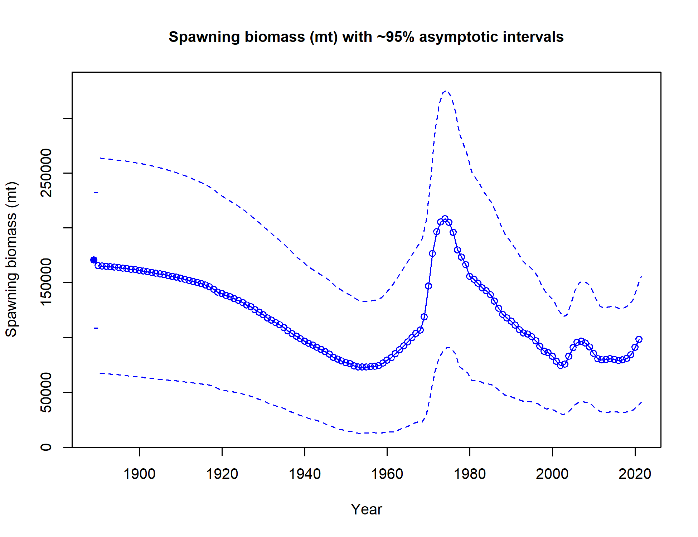

<!--chapter:end:00a.Rmd-->

---
author:
  - name: Maia S. Kapur
    code: 1
    first: M
    middle: S
    family: Kapur
  - name: Lee Qi
    code: 1
    first: Qi
    middle: 
    family: Lee
  - name: Melissa A. Haltuch
    code: 1
    first: Melissa
    middle: A
    family: Haltuch
  - name: Owen Hamel
    code: 2
    first: Owen
    middle: 
    family: Hamel
  - name: Author No. Three
    code: 2
    first: K
    middle: E
    family: Hinton
author_list: Wetzel, C.R., B.J. Langseth, J.M. Cope, T. Tsou, K.E. Hinton
affiliation:
  - code: 1
    address: Northwest Fisheries Science Center, U.S. Department of Commerce, National
      Oceanic and Atmospheric Administration, National Marine Fisheries Service, 2725
      Montlake Boulevard East, Seattle, Washington 98112
  - code: 2
    address: Washington Department of Fish and Wildlife, 600 Capital Way North, Olympia,
      Washington 98501
address:
  - ^1^Northwest Fisheries Science Center, U.S. Department of Commerce, National Oceanic
    and Atmospheric Administration, National Marine Fisheries Service, 2725 Montlake
    Boulevard East, Seattle, Washington 98112
  - ^2^Washington Department of Fish and Wildlife, 600 Capital Way North, Olympia,
    Washington 98501
---

<!--chapter:end:00authors.Rmd-->

---
title: '00'
output: html_document
---

<!--chapter:end:00presets.Rmd-->

---
title: Status of Sablefish (_Anoplopoma fimbria_) along the US West coast in 2021
---

<!--chapter:end:00title.Rmd-->

\pagebreak
\pagenumbering{roman}
\setcounter{page}{1}

\renewcommand{\thetable}{\roman{table}}
\renewcommand{\thefigure}{\roman{figure}}

<!--chapter:end:01a.Rmd-->

# Executive Summary{-}
## Stock{-}
This assessment reports the status of sablefish (_Anoplopoma fimbria_) off the US West coast using data through 2020.  The resource is modeled as a single stock; however, sablefish disperse to and from offshore seamounts along the coastal waters of the continental U.S., Canada, and Alaska and across the Aleutian Islands to the western Pacific. Their movement is not explicitly accounted for in this analysis.

## Landings{-}
A variety of sources were used to reconstruct state-specific historical sablefish landings (i.e., fish brought to market), creating a series of landings from 1890 to present. In general, these reconstructions are more reliable than those for many other groundfish species because of the consistent identification of sablefish to the species level. Historical-landings reconstructions for sablefish have been completed for California, Oregon, and Washington, extending landings to the beginning of the U.S. West Coast sablefish fishery.

Fishery discard rates and weights were fit within the assessment model, i.e., simultaneous estimation of total catches and other model parameters. This internal estimation can result in model estimates of total mortality that differ between stock assessments even when the landings inputs remain unchanged due to changes in fixed and estimated parameter values, priors, or parameterizations. Model estimates of fishery discards resulted in model estimated total dead catches that were an average of 1.84% larger than the landings input into the stock assessment model over the last decade.

Historically, sablefish landings were just below recent landings (<4,000 mt) until the end of the 1960s and were primarily harvested by fixed gear. Large catches (24,395 mt) by foreign vessels fishing pot gear in 1976 resulted in the largest landings reported in a single-year. A rapid rise in domestic pot and trawl landings followed this peak removal, such that, on average, nearly 8,400 mt of sablefish were landed per year between 1976 and 1990. Subsequently, annual landings have remained below 9,000 mt and been divided approximately 67%/33% between fixed and trawl gears, respectively, during the most recent decade. An Individual Fishing Quota (IFQ) program, referred to as catch shares, was implemented for the U.S. West Coast trawl fleet beginning in 2011. Gear switching is allowed within the program such that fixed gear can be used to catch sablefish under trawl IFQ. This has resulted in changes in fleet behavior, the distribution of fishing effort, and discarding rates. Complete observer coverage on all vessels fishing IFQ quota became mandatory at the start of the program, while coverage in the other sectors remained stratified by port. The lack of historical observer coverage, and consequently information on total catch and age and length compositions, thus contributes to uncertainty regarding selectivity and retention during the historical period.

{width=100% height=100% alt="Catches by Fleet, all years"}

\begingroup\fontsize{10}{12}\selectfont
\begingroup\fontsize{10}{12}\selectfont

\begin{longtable}[t]{r>{\centering\arraybackslash}p{1.83cm}>{\centering\arraybackslash}p{1.83cm}>{\centering\arraybackslash}p{1.83cm}>{\centering\arraybackslash}p{1.83cm}>{\centering\arraybackslash}p{1.83cm}}
\caption{\label{tab:removalsES}Recent landings by fleet, total landings summed across fleets, and the total mortality including discards.}\\
\toprule
Year & FIX & TWL & Total Catch & Total Dead\\
\midrule
\endfirsthead
\caption[]{Recent landings by fleet, total landings summed across fleets, and the total mortality including discards. \textit{(continued)}}\\
\toprule
Year & FIX & TWL & Total Catch & Total Dead\\
\midrule
\endhead

\endfoot
\bottomrule
\endlastfoot
2009 & 3889.01 & 3061.45 & 6950.46 & 7367.40\\
2010 & 4054.53 & 2539.32 & 6593.85 & 7003.43\\
2011 & 4420.85 & 1728.40  & 6149.25 & 6253.97\\
2012 & 3670.22 & 1514.58 & 5184.80 & 5283.59\\
2013 & 2585.07 & 1402.13 & 3987.20 & 4050.48\\
2014 & 2924.26 & 1292.20 & 4216.46 & 4294.90\\
2015 & 3554.94 & 1470.29 & 5025.23 & 5105.53\\
2016 & 3829.86 & 1475.95 & 5305.81 & 5401.39\\
2017 & 3680.67 & 1669.97 & 5350.64 & 5465.75\\
2018 & 3648.68 & 1478.26 & 5126.94 & 5220.23\\
2019 & 3568.27 & 1625.44 & 5193.71 & 5372.81\\
2020 & 2660.03 & 1102.72 & 3762.75 & 3882.70\\*
\end{longtable}
\endgroup{}
\endgroup{}

## Data and Assessment{-}
The last benchmark stock assessment for sablefish took place during 2019, preceded by an update assessment during 2015.  The present update assessment used the most recent version of the Stock Synthesis modeling platform (3.30, released 2019-03-09), and bridged between the sub-version used in the Benchmark (v3.30.09) and the latest release (v3.30.16, accessed Jan 2021). Primary data sources include landings and age-composition data from the retained catch. In recent years, data on the discarded portion of commercial catch are available, including discard lengths, rates, and mean observed individual body weight of the discarded catch. The relative index of abundance estimated from the National Marine Fisheries Service (NMFS) Northwest Fisheries Science Center (NWFSC) West Coast Groundfish Bottom Trawl (WCGBT) Survey, which includes depths from 55 - 1,280 m, represents the primary source of information on the stock’s trend and was updated to include the most recent data, covering the period 2003-2019. Note that the WCGBT Survey does not access the closed Cowcod Conservation areas in southern California, and was not performed in 2020 due to the global SARS-CoV-2 pandemic. Other, discontinued, survey indices contribute information on trend and sablefish demographics: (a) NWFSC Slope Survey conducted from 1998-2002, (b) Alaska Fisheries Science Center (AFSC) Slope Survey (1997-2001), and (c) AFSC/NWFSC Triennial Shelf Survey (1980-2004). Additionally, an environmental time-series of sea level was used as a survey index of recruitment in the base model.

Of the externally estimated model parameters, (a) weight-length relationship, (b) maturity schedule, and (c) fecundity relationships, only the fecundity relationship was not updated. As in previous assessments, growth and natural mortality were estimated using sex-specific relationships. Uncertainty in recruitment was included by estimating a full time-series of deviations from the stock-recruitment curve. The ‘one-way-trip’ nature of the time-series does not facilitate estimation of the steepness parameter (h) of the stock-recruitment relationship. Therefore, h was fixed at 0.7, similar to values used on other groundfish stock assessments, and explored via sensitivity analyses.

During the 2019 assessment, a vast number of historical management actions were evaluated and condensed to a subset that were most likely to have had a direct influence on fishery behavior (either sorting and retention, selectivity, or both). These time periods were used to define time blocks to reduce the complexity of selectivity and retention parameterizations. The 2019 Benchmark assessment utilized the same general structure as the 2011 assessment, with the addition of full retention for the trawl fishery after the implementation of the IFQ program. 

During the addition of new data for this update assessment, modelers identified a large influx of younger, small fish observable in the age compositions of commercially landed catch, as well as the discard length compositions of those commercial fleets. This latter dataset was not used in the benchmark, nor were any commercial length compositions due to conflicts between the age and length data. Absent the data or flexibility to account for increased discarding, a model which conformed to the Terms of Reference was unable to satisfactorily fit to the composition data from the two commercial fleets nor the WCGBTS survey, and greatly over-estimated the 2019 index. We rectify this issue by re-introducing the discard length compositions and time-blocking the retention curve to include a new block for the final two years of the model period (2019-2020; the benchmark model's terminal period ran from 2011-2017). This adjustment resolved the model fit issues described above.

Aging error, both precision and accuracy, was extensively investigated during the 2011 assessment but remains unresolved given the lack of an age validation study for sablefish. The age error analysis for this assessment used the same software and methods as the 2019 assessment, and the 2011 assessment before it. The larger number of between-lab reads from the AFSC and the NWFSC available for this assessment showed a small amount of variability between laboratories. Therefore, this analysis uses the between-lab reads as well as the double reads from the NWFSC, treating them both as unbiased but potentially non-linearly variable. The age imprecision was such that by age 50 observed ages could differ from true ages by up to 16-17 years. Therefore, the potential for underestimating or overestimating the age of the oldest fish still remains, and thus, the potential for aging bias remains a source of uncertainty.

## Stock Biomass{-}
During the first half of the 20th century it is estimated that sablefish were exploited at relatively modest levels. Modest catches continued until the 1960s, along with a higher frequency of above average, but uncertain, estimates of recruitment through the 1970s. The spawning stock biomass increased during the 1940s to 1970s. Subsequently, biomass is estimated to have declined between the mid-1970s and the early 2010s, with the largest peaks in harvests during the 1970s followed by harvests that were, on average, higher than pre-1970s harvest through the 2000s. At the same time, there were a higher frequency of generally lower than average recruitments from the 1980s forward. Despite estimates of harvest rates that were largely below overfishing rates from the 1990s forward and a few high recruitments from the 1980s forward, the spawning biomass has only recently begun to increase. This stock assessment does suggest spawner per recruitment rates higher than the target during some years from the 1990s forward for two reasons. First, there have been many years with lower than expected recruitment. Second, stock assessment estimates of unfished spawning biomass have been steadily declining in each subsequent assessment since 2007. Estimates of unfished biomass scale catch advice.
Although the relative trend in spawning biomass is robust to uncertainty in the leading model parameters, the productivity of the stock is uncertain due to confounding of natural mortality, absolute stock size, and productivity. The estimates of uncertainty around the point estimate of unfished stock size are large across the range of models explored within this assessment, suggesting that the unfished spawning biomass could range from just under 100,000 mt to over 200,000 mt. The point estimate of 2019 spawning biomass from the base model is 57,444 mt, however, the ∼95% interval ranges broadly from 32,776 to 82,112 mt. The point estimate of 2019 spawning biomass relative to an unfished state (i.e., depletion) from the base model is 39% of unexploited levels (∼95% interval: 26-52%).

\begingroup\fontsize{10}{12}\selectfont
\begingroup\fontsize{10}{12}\selectfont

\begin{longtable}[t]{r>{\centering\arraybackslash}p{1.57cm}>{\centering\arraybackslash}p{1.57cm}>{\centering\arraybackslash}p{1.57cm}>{\centering\arraybackslash}p{1.57cm}>{\centering\arraybackslash}p{1.57cm}>{\centering\arraybackslash}p{1.57cm}}
\caption{\label{tab:ssbES}Estimated recent trend in spawning biomass and the fraction unfished and the 95 percent intervals.}\\
\toprule
Year & Spawning Biomass (mt) & Lower Interval & Upper Interval & Fraction Unfished & Lower Interval & Upper Interval\\
\midrule
\endfirsthead
\caption[]{Estimated recent trend in spawning biomass and the fraction unfished and the 95 percent intervals. \textit{(continued)}}\\
\toprule
Year & Spawning Biomass (mt) & Lower Interval & Upper Interval & Fraction Unfished & Lower Interval & Upper Interval\\
\midrule
\endhead

\endfoot
\bottomrule
\endlastfoot
2009 & 91280.1 & 38636.45 & 143923.8 & 0.53 & 0.37 & 0.70\\
2010 & 85335.6 & 35192.67 & 135478.5 & 0.50 & 0.34 & 0.66\\
2011 & 80565.1 & 32441.71 & 128688.5 & 0.47 & 0.31 & 0.63\\
2012 & 79436.4 & 31632.68 & 127240.1 & 0.47 & 0.31 & 0.62\\
2013 & 79820.2 & 31852.63 & 127787.8 & 0.47 & 0.31 & 0.63\\
2014 & 80404.2 & 32355.29 & 128453.1 & 0.47 & 0.31 & 0.63\\
2015 & 79890.3 & 32239.85 & 127540.8 & 0.47 & 0.31 & 0.63\\
2016 & 78846.1 & 31618.02 & 126074.2 & 0.46 & 0.30 & 0.62\\
2017 & 79544.6 & 31764.21 & 127325.0 & 0.47 & 0.31 & 0.63\\
2018 & 80911.2 & 32291.94 & 129530.5 & 0.47 & 0.31 & 0.64\\
2019 & 84162.1 & 33717.92 & 134606.3 & 0.49 & 0.32 & 0.66\\
2020 & 91018.1 & 36905.26 & 145130.9 & 0.53 & 0.35 & 0.72\\
2021 & 98084.7 & 40559.37 & 155610.0 & 0.57 & 0.38 & 0.77\\*
  \end{longtable}
\endgroup{}
\endgroup{}

{width=100% height=100% alt="Relative SPR vs B Ratio"}

## Recruitment{-}

Sablefish recruitment is estimated to be quite variable with large amounts of uncertainty in individual recruitment events. A period with generally higher frequencies of strong recruitments spans from the early 1950s through the 1970s, followed by a lower frequency of large recruitments during 1980 forward, contributing to stock declines. The period with a higher frequency of high recruit- ments contributed to a large increase in stock biomass that has subsequently declined throughout much of the 1970s forward. Less frequent large recruitments during the mid-1980s through 1990 slowed the rate of stock decline, with another series of large recruitments during 1999 and 2000 leading to a leveling off in the stock decline. The above-average cohorts from 2008, 2010, 2013, and 2016 are contributing to a slightly increasing spawning stock size. 

{width=100% height=100% alt="Recruitment Deviates"}

{width=100% height=100% alt="Relative SPR vs B Ratio"}

## Exploitation Status{-}

Equilibrium yield at the fishing mortality that leads to the maximum sustainable yield (FMSY) is 8,077 mt (4,684-11,470, ∼95% interval).
Although the estimated productivity and absolute scale of the stock are poorly informed by the available data and are, therefore, sensitive to changes in model structure and treatment of data, all sensitivity or alternate models evaluated showed a declining trend in biomass since the 1970s followed by a recent increase in biomass. The spawner potential ratio (SPR) exceeded the fishing mortality target/overfishing level (SPR45%) that stabilizes the stock at the target (i.e., 1−SPR/[1− SPR45%]) during the late 2000s and early 2010s, while since 2015 it has been between 83 and 95%.

\begingroup\fontsize{10}{12}\selectfont
\begingroup\fontsize{10}{12}\selectfont

\begin{longtable}[t]{r>{\centering\arraybackslash}p{1.57cm}>{\centering\arraybackslash}p{1.57cm}>{\centering\arraybackslash}p{1.57cm}>{\centering\arraybackslash}p{1.57cm}>{\centering\arraybackslash}p{1.57cm}>{\centering\arraybackslash}p{1.57cm}}
\caption{\label{tab:exploitES}Estimated recent trend in the spawning potential ratio (SPR), (1-SPR)/(1-SPR 45) , the exploitation rate, along with the 95 percent intervals.}\\
\toprule
Year & (1-SPR)/(1-SPR 45) & Lower Interval & Upper Interval & Exploitation Rate & Lower Interval & Upper Interval\\
\midrule
\endfirsthead
\caption[]{Estimated recent trend in the spawning potential ratio (SPR),(1-SPR)/(1-SPR 45), the exploitation rate, along with the 95 percent intervals. \textit{(continued)}}\\
\toprule
Year & (1-SPR)/(1-SPR 45) & Lower Interval & Upper Interval & Exploitation Rate & Lower Interval & Upper Interval\\
\midrule
\endhead

\endfoot
\bottomrule
\endlastfoot
2009 & 82.26 & 46.14 & 118.37 & 0.03 & 0.01 & 0.05\\
2010 & 86.98 & 49.59 & 124.37 & 0.03 & 0.01 & 0.05\\
2011 & 96.80 & 59.64 & 133.96 & 0.03 & 0.01 & 0.05\\
2012 & 74.86 & 40.98 & 108.74 & 0.02 & 0.01 & 0.04\\
2013 & 60.88 & 30.31 & 91.45 & 0.02 & 0.01 & 0.03\\
2014 & 61.02 & 30.17 & 91.86 & 0.02 & 0.01 & 0.03\\
2015 & 71.01 & 37.14 & 104.87 & 0.02 & 0.01 & 0.04\\
2016 & 75.40 & 40.49 & 110.30 & 0.03 & 0.01 & 0.04\\
2017 & 68.13 & 35.48 & 100.78 & 0.02 & 0.01 & 0.04\\
2018 & 66.12 & 34.03 & 98.21 & 0.02 & 0.01 & 0.04\\
2019 & 61.49 & 30.75 & 92.24 & 0.02 & 0.01 & 0.04\\
2020 & 40.23 & 17.98 & 62.48 & 0.01 & 0.01 & 0.02\\*
\end{longtable}
\endgroup{}
\endgroup{}

{width=100% height=100% alt="Relative SPR vs B Ratio"}

{width=100% height=100% alt="Relative SPR vs B Ratio"}

## Reference Points{-}
Unfished spawning biomass was estimated to be 147,729 mt (109,022-186,436, ∼95% interval). The abundance of sablefish was estimated to have dropped below the target reference point of 40% of this estimated value of unfished spawning biomass during the 2000s and generally remained below the target through 2018. The estimate of the target spawning stock biomass was 59,092 (43,609-74,574, ∼95% interval), which gives a catch of 7,363 mt (4,269-10,456, ∼95% interval). The stock was estimated to be just below the target stock size in the beginning of 2019 at 57,444 mt (32,776-82,112, ∼95% interval). The stock was estimated to be above the depletion level that would lead to maximum yield. The estimate of the stock’s current level of depletion was 38.9%.

{width=100% height=100% alt="RelSBnoforecast"}

## Management Performance{-}

Sablefish management includes a rich history of seasons, size-limits, trip-limits, and a complex permit system. Managers divide coast-wide yield targets from sablefish stock assessment among the fleets, fishery sectors (including both limited entry and open access), as well as north and south of 36◦ N latitude. Peak catches occurred during the late 1970s just prior to the imposition of the first catch limits. Over the last decade, the total estimated dead catch has been 55% of the sum of the overfishing limits (previously termed ABCs) and 65% of the annual catch limits (previously termed OYs).

\begingroup\fontsize{10}{12}\selectfont
\begingroup\fontsize{10}{12}\selectfont

\begin{longtable}[t]{r>{\centering\arraybackslash}p{1.83cm}>{\centering\arraybackslash}p{1.83cm}>{\centering\arraybackslash}p{1.83cm}>{\centering\arraybackslash}p{1.83cm}>{\centering\arraybackslash}p{1.83cm}}
\caption{\label{tab:referenceES}Recent trend in the overfishing limits (OFL), the acceptable biological catches (ABCs),
  the annual catch limits (ACLs), and the total catch and landings (mt).}\\
\toprule
Year & OFL & ABC & ACL & Landings & Total Dead\\
\midrule
\endfirsthead
\caption[]{Recent trend in the overfishing limits (OFL), the acceptable biological catches (ABC \textit{(continued)}}\\
\toprule
Year & OFL & ABC & ACL & Landings & Total Dead\\
\midrule
\endhead

\endfoot
\bottomrule
\endlastfoot
2009 & fill in & fill in & fill in & 6,950.46 & 7,367.40\\
2010 & fill in & fill in & fill in & 6,593.85 & 7,003.43\\
2011 & fill in & fill in & fill in & 6,149.25 & 6,253.97\\
2012 & fill in & fill in & fill in & 5,184.80 & 5,283.59\\
2013 & fill in & fill in & fill in & 3,987.20 & 4,050.48\\
2014 & fill in & fill in & fill in & 4,216.46 & 4,294.90\\
2015 & fill in & fill in & fill in & 5,025.23 & 5,105.53\\
2016 & fill in & fill in & fill in & 5,305.81 & 5,401.39\\
2017 & fill in & fill in & fill in & 5,350.64 & 5,465.75\\
2018 & fill in & fill in & fill in & 5,126.94 & 5,220.23\\
2019 & fill in & fill in & fill in & 5,193.71 & 5,372.81\\
2020 & fill in & fill in & fill in & 3,762.75 & 3,882.70\\*
  \end{longtable}
\endgroup{}
\endgroup{}

## Unresolved Problems and Major Uncertainties{-}

The data available for sablefish off the U.S. West Coast are not informative with respect to abso- lute size and productivity. This is, in part, due to the one-way-trip nature of the historical series (i.e., a slow and steady decline in spawning biomass), which can be consistent with a larger less productive stock, a smaller more productive stock, or many combinations in between. While the historical catches provide some information about the minimum stock size necessary to remove the catches from the population, there is limited information in the data regarding the upper limit of the stock size. The above factors are also confounded by movement of sablefish between the region included in this assessment and regions to the north. Likelihood profiles, parameter es- timates, and general model behavior illustrate that small changes in many parameters can result in different management reference points. However, because leading model parameters, such as natural mortality, selectivity, and historical recruitments, are estimated within the stock assessment model, the uncertainty about these estimates remains large and typically overlapped among the in- vestigated models. The uncertainty will remain until a more informative time-series, better quality demographic and biological information are accumulated, or a range-wide analysis is completed for sablefish.

Uncertainty in the current aging methods (both bias and imprecision), as well as relatively sparse fishery sampling, result in age data that potentially variable. Furthermore, because sablefish grow rapidly, nearing asymptotic length in their first decade of life, length data is not particularly inFormative about historical patterns in recruitment. The patterns observed in historical sablefish recruitment suggest that the stock trajectory (via shifts in recruitment strength) is closely linked to productivity regimes in the California Current. Uncertainty in future environmental conditions, changes in the timing, dynamics, and productivity of the California Current ecosystem via cli- mate change or cycles similar to the historical period should be considered a significant source of uncertainty in all projections of stock status.

The ongoing WCGBT Survey is a fairly precise relative index of abundance over a broad demo- graphic component of the stock, but it does not survey the entire stock as sablefish reside in waters deeper than 1280 m, the survey limit, and to the north. Therefore, a portion of the stock is un- observed. This index has the potential to inform future stock assessments about the scale of the population relative to catches being removed, however such information will require contrast in the observed survey trend.

## Harvest Projections{-}
Previous sablefish stock assessments have been designated as Category 1 stock assessments. Thus, projections and decision tables are based on P∗=0.4 and the values of sigma adopted by the Pacific Fisheries Management Council for stock projections. The time series of multiplicative buffer fractions that are a function of P∗ and the time series of sigmas provide the multipliers on the over- fishing limit, these values are all less than 1. The multipliers are combined with the 40-10 harvest control rule to calculate overfishing limits, acceptable biological catches, and annual catch limits. The total catches in 2021 and 2022 were set at the Pacific Fisheries Management Council Groundfish Management Team requested values, just below that Pacific Fisheries Management Council annual catch limits for sablefish. The average 2017-2020 catches were used to distribute catches among the fisheries.

Current medium-term projections from the base model under the Pacific Fisheries Management Council 40-10 harvest control rule estimate that the stock will remain above the target stock size of 40% of the estimated unfished spawning biomass during the projection period. Projections are provided through 2032 (Table \ref{referenceES}).

Forecasts from the 2019 benchmark assessment projected the spawning biomass to increase by 27.63%
from 2017 to 2021given specified harvests, whereas the current assessment estimated the increase at 23.31%. Estimates of unexploited spawning biomass are 13.42% higher than that estimated in 2019 and 19% lower than the 2011 estimate. Percent of unfished biomass in 2021 was estimated at 0.57, while the 2019 benchmark assessment forecasted it to be  0.46.

## Decision Table{-}
The decision table reports 12-year projections for alternate states of nature (columns) and management options (rows). The results of this table are conditioned on the Groundfish Management Team specified catches for 2021 and 2022, which are just below the already-specified annual catch limits approved by the Pacific Fisheries Management Council.

Uncertainty in management quantities for the decision table was characterized using the asymptotic standard deviation for the 2021 spawning biomass from the base model. Specifically, the 2021 spawning biomass for the high and low states of nature are given by the base model mean ±1.15·standard deviation (i.e., the 12.5th and 87.5th percentiles). A search across fixed values of $R_0$ was used to attain the 2021 spawning biomass values for the high and low states of nature. The mid-level catch streams were based on the 40-10 harvest control rule. At the request of the Groundfish Management Team representative at the STAR panel, the high and low catch streams were set using the Category 1 values of P∗ = 0.45 and P∗ = 0.35, respectively.

Spawning stock biomass in 2021 ranges across the three states of nature from 42,968 to 71,915 mt, with corresponding stock status between 38% to 41% of the unfished stock size. The decision table suggests that all catch scenarios under both the base and high state of nature result in increases in stock size such that the stock remains either at or above the target stock size at the end of the projection period. However, all catch scenarios under the low state of nature result in declines in stock size throughout the projection period, maintaining the stock within the precautionary zone.

## Research and Data Needs{-}
Most of the research needs listed below entail investigations that need to take place outside of the routine assessment cycle and require additional resources to be completed.

1. Not all of the available sablefish otoliths were aged for this stock assessment because of time constraints resulting from the federal government furlough, and, in some cases, the sample sizes of aged fish are lower than what would be ideal. Resources should be provided to age otolith samples from years with missing age data or small sample sizes.

2. A transboundary stock assessment and the management framework to support such assess- ments would be beneficial given the migratory nature and broad distribution of sablefish along the Pacific Rim. A transboundary assessment would likely improve the ability to estimate the scale of the population, particularly during the early modeled period.

3. Investigation of environmental covariates for recruitment on a stock-wide, northeast Pacific scale.

4. Continuation of the annual WCGBT Survey will provide information on stock trends and incoming recruitments. A longer survey time series may improve the precision of estimates of absolute stock size and productivity into the future.

5. Age validation is needed to verify the level of age bias present in the data, if any.

6. Investigate aging methods that could prove more precise than current break-and-burn methods. More accurate age data would facilitate tracking cohorts to older ages, improving estimates of historical year-class strengths.

7. Research on understanding the interactions between spatial patterns in sablefish growth, fishery size selectivity, and movement across the Northeast Pacific began during 2019 and are ongoing. The results of this research should be considered in future benchmark stock assessments.

8. Anecdotal information, such as the large 1947 recruitment reported by central California sport fisherman, along with historical records could be investigated to provide additional information on historical patterns of recruitment.

<!--chapter:end:01executive.Rmd-->

\pagebreak
\setlength{\parskip}{5mm plus1mm minus1mm}
\pagenumbering{arabic}
\setcounter{page}{1}
\renewcommand{\thefigure}{\arabic{figure}}
\renewcommand{\thetable}{\arabic{table}}
\setcounter{table}{0}
\setcounter{figure}{0}

<!--chapter:end:10a.Rmd-->

# Introduction
## Basic Information
This assessment reports the status of sablefish (_Anoplopoma fimbria_) off the US West coast using data through 2020.  The resource is modeled as a single stock; however, sablefish disperse to and from offshore seamounts along the coastal waters of the continental U.S., Canada, and Alaska and across the Aleutian Islands to the western Pacific. Their movement is not explicitly accounted for in this analysis.
Sablefish (Anoplopoma fimbria, or 'black cod') are distributed in the northeastern Pacific Ocean from the southern tip of Baja California northward to the north-central Bering Sea and in the northwestern Pacific Ocean from Kamchatka southward to the northeastern coast of Japan @hart1973, @eschmeyer1983. U.S. West Coast sablefish are modeled as a single stock. Thus, this stock assessment does not explicitly account for movement between offshore sea mounts {@shaw1997, @morita2012envbiofishsex, @hanselman2015cjfasmove, @rogers2020, regions to the north of the U.S. west coast, or to the western Pacific @fujioka1988docdescription, @heifetz1991fishresmovement, @hanselman2015cjfasmove, @rogers2020}.

While previous analyses suggest the existence of several stocks of sablefish in the eastern Pacific Ocean that are largely delineated by management boundaries (@schirripa2007sablefish}; and earlier assessments), more recent genetic analyses found that sablefish in the northeastern Pacific Ocean are a single panmictic population @jasonowicz2017cjfaslove}. Additional support for a panmictic population stems from tag recoveries that show sablefish move between the regions currently used for management {@hanselman2015cjfasmove, @sogard2017, @rogers2020}. Analyses of length-at-age data has found spatial variation in von Bertalanffy growth parameters across the northeastern Pacific Ocean {@mcdevitt1987sablefish, @echave2012fishbullinterdecadal, @head2014fishres, @gertseva2017icesjmsspatial, @kapur2020}. While geographic break points at approximately 1. $36^{\circ}$N between Point Conception and Monterey, California at the start of the southern California Bight and 2. $50^{\circ}$N where the North Pacific Current bifurcates suggest zones of growth variation, generally with increasing maximum body size and decreasing growth rates with increasing latitude, they do not indicate regions with separate populations.

Smaller sablefish are generally found in shallower waters, but the demographics appears to be fully mixed (adult and juvenile) near the shelf-slope break (i.e., 100-300 m). Beyond the shelf-slope break, the adult population is dominated by older individuals @methot1994  and younger fish become increasingly rare (see Section \ref{data:surveys}). Fish in the deepest areas sampled tend to be the oldest individuals, but not the largest individuals, suggesting that age rather than size dictates depth distribution. However, the interaction between environmental conditions and seasonal movements that produce an increase in age with depth are largely unknown. The stock is distributed beyond the greatest depth sampled by any of the surveys and beyond the deepest commercial fishing areas. Research in these deeper habitats occupied by sablefish is potentially difficult because they extend across the boundary of the exclusive economic zone and sea mounts and ridges around the Pacific. There are relatively fewer sablefish in the Puget Sound and the Strait of Georgia than in coastal U.S. waters. Therefore, connectivity among these areas and the open coast is likely of less importance to this stock assessment than movement along the coast.

## Life History
@tolimieri2018 provide a thorough review of the literature on spawning and early life history of sablefish in the California Current. Briefly, sablefish off the U.S. West Coast exhibit a protracted spawning period from December through March, with peak in February @guzman2017. This winter-time spawning may result in reduced availability to the commercial fishery during the winter months. Spawning occurs along the continental shelf-slope break in waters deeper than 300 m. Eggs ($\sim$2.1 mm in diameter) are buoyant and rise in the water column before hatching and sinking to deeper waters. Pelagic juveniles are present in off-shore surface waters and settle to the benthos as age-0 recruits during the late summer to fall, with most newly settled fish at depths of less than 250 m. 
sablefish reach full size and maturity in their first decade of life, reaching nearly asymptotic size and beginning to mature after 5-7 years. Female sablefish generally reach larger sizes than males. However, the sex-ratio tends to be skewed toward males at the oldest ages implying a lower natural mortality rate for males relative to females. The oldest sablefish on record was captured in 2006 off Washington and aged (with observation error) at 102 years. This female was only 68 cm long, nowhere near the longest individual (117 cm).
Adult sablefish are fast-swimming and capable of feeding on a diverse array of prey species including fishes, cephalopods, and crustaceans @low1976. The cohabitation of adult and juvenile sablefish may result in some cannibalism, and large changes in predator biomass (such as the recent rebuilding of lingcod, \emph{Ophiodon elongatus}) could have a feedback on juvenile survival and, therefore, stock productivity.

## Ecosystem Considerations

The National Oceanic and Atmospheric Administration (NOAA) document titled 'Implementing a Next Generation Stock Assessment Enterprise, An update to the NOAA Fisheries Stock Assessment Improvement Plan' {@lynch2018} calls for bringing an ecosystem perspective into the assessment process. Moreover, introducing this perspective to the assessment process is a key component of the NOAA Fisheries Ecosystem-Based Fisheries Management (EBFM) Policy @noaa2016, which calls for incorporation of ecosystem considerations into the management of living marine resources. Uptake of EBFM principles and tools into the assessment process can be accomplished through including ecosystem information in assessments, harvest control rules, and management decisions that are coordinated across species-specific management plans and account for diverse trade-offs {@noaa2016, @lynch2018}. Guidelines for incorporating ecosystem considerations into fisheries management advice form the core of Guiding Principle 5 for implementing the NOAA EBFM Policy.

This assessment includes ecological factors based on the idea that research focused on the linkages within a social-ecological system (SES) and how they increase or decrease sustainability can help inform the management of natural resources {@ostrom2009}. The SES framework requires consideration of extractive goals and human activities at a level that allows for ecological sustainability while also considering human well-being. Thus, the SES framework facilitates the consideration of environmental and human impacts on  sablefish as well as sablefish impacts on the ecosystem and humans (e.g., @levin2016).

A detailed summary of SES analyses, the Climate Vulnerability Assessment, and environmental drivers of sablefish recruitment is available in the 2019 Benchmark Assessment report {@Haltuch2019b}, and truncated from this update document.

\begin{comment}
### Summary of SES analysis
The sablefish CVA @mcclure2020} suggests that processes affecting recruitment are sensitive to climatic and, therefore, oceanic drivers. Given high climate vulnerability, changes in the abundance, productivity, and spatial distribution of sablefish are likely, and these changes are likely to impact fishing fleets and communities because of the high value of this fishery. The CVA also suggests that sablefish are likely to shift their distribution in response to climate variability.
Strong coast-wide recruitment appears to be associated with good recruitment north of Cape Mendocino ($\sim 40^{\circ}$N). Modeling work shows that strong recruitment is correlated with transport and temperature in the northern portion ($40^{\circ}-48^{\circ}$N) of the U.S. West Coast, specifically with the northern transport of yolk-sac larvae @tolimieri2018}. A re-analysis of the relationship between sea level and recruitment found that variation around the stock-recruitment curve was negatively correlated with sea level north of Cape Mendocino. Reliable sea-level data are available back to 1925; the ability to produce an environment-recruitment index with this time series may allow for both hindcasting to better represent stock dynamics during data-poor time periods and nowcasting of recruitment with robust estimates of uncertainty.
The sablefish stock has experienced latitudinal shifts in the center of the distribution of stock biomass within the California Current, which has affected fishing opportunities to individual ports @selden2020}. The population centroid shifted to the north from 1980 to 1992 then south by 2013. More recently, the distribution of stock biomass shifted north, illustrated by an increase in trawl survey biomass in the north, but not as far north as in the 1990s.
Whale entanglements with pot gear has the potential to limit effort in the pot-gear sectors due to protections for marine mammals. The estimated fleet-wide entanglements were consistently above the 5-year running average threshold during 2002 to 2017 in the combined Limited Entry sablefish and Open Access Fixed Gear pot sectors @hanson2019}. This result was largely due to the Open Access Fixed Gear pot sector, which had entanglements consistently above the 5-year running average threshold, while entanglements in the Limited Entry sablefish pot sector were consistently below the threshold.

### Climate Vulnerability Assessment
sablefish appear to be a good candidate for the analysis of the ecological and socioeconomic conditions relevant to their ecology and management @mcclure2020}. Overall, they have moderate biological sensitivity to climate variability but high climate exposure (Figure \ref{ecocons1}). sablefish showed sensitivity to factors affecting early life history and settlement requirements, population growth rate, and the spawning cycle. sablefish ranked very high in their likelihood of experiencing distributional shifts due to climate effects. That is, high adult mobility, high dispersal of early life stages, and lack of habitat specificity suggest that sablefish may respond to climate variability by shifting distribution, which may affect the fishery's access to the stock.

### Environmental drivers of recruitment
Year-class strength plays a fundamental role in marine species setting age structure and abundance trends. Strong year classes in sablefish appear to be associated with ecosystem processes occurring in the northern portion of the U.S. West Coast (north of Cape Mendocino, $\sim 40^{\circ}$N; {@schirripa2006, tolimieri2018}). This conclusion is supported by the following three lines of evidence: 
1. the distribution of age-0 recruits, 
2. results from stage-specific and spatiotemporal models using oceanic variables to predict recruitment, and 
3. a reanalysis of the relationship between sea level and recruitment.

### Distribution and abundance of age-0 recruits
Age-0 sablefish captured by the Northwest Fisheries Science Center (NWFSC) West Coast Groundfish Bottom Trawl (WCGBT) Survey were most abundant in shelf and upper-slope waters around San Francisco Bay and from Cape Mendocino to the mouth of the Columbia River (Figure \ref{ecocons2}). The abundance of age-0 recruits varied through time with peaks in recruitment in 2004, 2008, 2010, 2013, and 2016. However, most strong recruitment years, with the exception of 2010, were associated with high recruitment north of Cape Mendocino. Recent modeling work suggests that strong age-0 recruitment is associated, in part, with the northerly transport of yolk-sac larvae at depths between 1000-1200 m @tolimieri2018}, which may lead to better overlap between feeding larvae and copepod prey than when the larvae transport is not as defined.

### Oceanographic drivers of recruitment
Recent stage-specific and spatiotemporal modeling @tolimieri2018} using Regional Ocean Modeling System (ROMS) output for the northern California Current area ($40-48^{\circ}$N) was able to predict 57\% of the of the variation in age-0 recruitment not accounted for by the stock-recruitment relationship (i.e., residuals around the stock-recruitment curve) for years 1981 to 2010. Residuals around the stock-recruitment relationship were correlated with 
1. colder conditions at 50-1200 m during the spawner preconditioning period, 
2. warmer water temperatures at 300-825 m during the egg stage, 
3. stronger cross-shelf transport at 300-825 m to near-shore nursery habitats during the egg stage, 
4. stronger long-shore transport at 1000-1200 m to the north during the yolk-sac stage, and 
5. cold surface-water temperatures during the larval stage (Appendix \ref{app:env}).
Cooler temperatures (quantified as degree days) during the pre-spawning period may result in lower metabolic costs for females, allowing the availability of more energy for reproduction or may be indicative of good feeding conditions. Onshore transport during the egg stage averts advection of eggs and larvae and maintains them near settlement habitat, while warmer water leads to faster development. Transport to the north during the yolk-sac stage likely moves larvae to better feeding conditions once they rise to the surface, and cold water during the larval stage may be associated with both better feeding conditions and reduced starvation risk due to lowered metabolic costs. Likewise, transport to the north may give age-0 fish access to a larger region of shelf habitat. In conjunction with the analysis of the distribution of age-0 fish, this work suggests that oceanic processes in the northern portion of the California Current are important for determining recruitment success.

### Sea level and recruitment
Research and assessments during recent decades have examined the relationship between sea level, measured via tide gauges, and sablefish recruitment @schirripa2001sablefish, schirripa2005sablefish, schirripa2006, schirripa2007sablefish, schirripa2009icesjms, stewart2011sablefish, johnson2016sablefish}. Prior to sea level, relationships between copepods and sablefish were investigated because copepods are an important food source for sablefish larvae and juveniles @grover1986, grover1987, grover1990, mcfarlane1990}. Changes in sea level serve as a proxy for large-scale climate forcing that drives regional changes in alongshore and cross-shelf ocean transport. These changes directly impact the transport of water masses, nutrients, and organisms @schirripa2006, dilorenzo2013}. Historically, the sea-level index evaluated within the stock assessment modeling context consisted of a spatiotemporal (April, May, and June) average using data from four tide-gauge stations in the northern California Current. During early research, a number of covariates at several temporal and regional aggregations were tested, resulting in a total of almost 900 unique combinations @stewart2011sablefish}. Not all of these time series were independent. Sea level was selected, in part, as a replacement for the copepod index because their correlation and the increased temporal coverage of the sea-level data. The 2011 assessment @stewart2011sablefish} suggested there is little chance of selecting a randomly generated time-series with the observed $R^2$ between recruitment and sea level, supporting the hypothesis that the relationship between sablefish recruitment and sea level is not spurious, but noted that repeated testing of these types of relationships remains necessary.

While biologically meaningful, the sea level-recruitment relationship is weak ($\sim R^2=0.35$), and use of the index in recent years has not had a large effect on assessments because much of the variation in recruitment is captured in the age-structure data @stewart2011sablefish. Additionally, previous analyses (e.g., @schirripa2007sablefish) have selected tide-gauge locations based on the strength of the resulting relationship with recruitment, potentially biasing the results. ROMS models have had some success explaining sablefish recruitment @tolimieri2018}, but the available time-series cover a limited period (1980-2010). While the ROMS models can be updated, limited environmental-forcing data means that the models cannot necessarily be projected back in time with much confidence. Thus, ROMS-based indicators cannot be used to hindcast recruitment to better incorporate recruitment dynamics for early periods.

The ROMS-based recruitment analysis showed higher recruitment with stronger poleward transport at depth, while the sea-level analysis showed more successful recruitment with lower sea level in the northern California Current. This lower sea level is typically correlated with stronger upwelling and southern alongshore surface flow @connolly2014}. However, lower sea level in the northern California Current is also related to a stronger alongshore sea-level/pressure gradient (higher in the south, lower in the north), which drives a stronger poleward deep current. This undercurrent is strongest between 100 m and 500 m, but poleward flows extend deeper. Thus the ROMS analysis and the sea level analysis corroborate each other.

Section \ref{chap:data} and Appendix \ref{app:env} contain a re-analysis of the relationship between sea level and recruitment conducted for and used in this assessment. This relationship has been modeled in the sablefish stock assessment both via the internal population dynamics as a direct offset to the expected value for recruitment @maunder2003, schirripa2005sablefish} and as a survey index of age-0 recruitment deviations @schirripa2007sablefish, stewart2011sablefish, johnson2016sablefish}. The former method makes it difficult to determine the appropriate degree of recruitment variability for the deviations themselves and requires that the environmental series be treated as if it is known without error. The latter method, which was used in this assessment, allows for observation error in the environmental series.

The topic of model-selection, robustness, and validation for the relationship between sea level and recruitment was a recurrent theme in STAR panels and with the Pacific Fisheries Management Council (PFMC) Science and Statistical Committee between 2002 and 2007. Prior to 2011, the use of the sea-level index was contentious. During 2011, the sea-level data were used as an index of recruitment in a sensitivity analysis using the data from 1970 forward, although the sea-level data start in 1925. Using only the data from 1970 forward did not influence model results because the information in the length- and age- composition data largely agreed with the information in the sea-level data @stewart2011sablefish, @johnson2016sablefish.

### Distributional shifts in stock biomass and availability to ports

Shifting stock biomass may affect the availability of sablefish to fishers operating out of specific ports (adapted from @selden2020) conditioned on the idea that sablefish landings largely reflect local stock availability, such that more sablefish are caught when local availability is high than when it is low. Sablefish biomass has declined by 
54%
since its high in 1972, contributing to varying sablefish availability to ports across the coast. The population centroid first shifted north during 1980 to 1992 then south by 2013. The centroid of biomass then began shifting north, as illustrated in the trawl-survey data, but has not moved as far north as in the 1990s. Declines in sablefish biomass in conjunction with northward distribution shifts during 1980-1992 led to particularly strong losses in availability to southern ports like Morro Bay and Fort Bragg, California, while availability was maintained at more northern ports like Coos Bay and Astoria, Oregon (Figure \ref{ecocons5}). Southward shifts of sablefish from 1992-2013, coincident with further declines in biomass, led to dramatic declines in availability for northern ports and a stabilization or increase in availability to southern ports.

### Whale entanglements

Whale entanglements in fisheries using pot gears have the potential to limit effort due to protections for marine mammals. Coincident with the anomalous warming of the California Current in 2014-2016, observations of whales entangled in fishing gear occurred at levels far greater than that observed in the preceding decade (Figure \ref{ecocons6}). Observed entanglements were most numerous in 2015 and 2016, with the majority involving humpback whales (\emph{Megaptera novaeangliae}). Based on preliminary data, observed entanglements appear to have declined in 2017 but were still greater than those observed during 2000 to 2013. Of the portion of whale entanglements that can be identified by fishery in California Current waters, most entanglements appear to be with gear targeting Dungeness crab (\emph{Metacarcinus magister}).
There have been two documented takes of humpback whales in the sablefish fisheries, one in the Limited Entry sablefish pot sector in 2014 and one in the Open Access Fixed Gear pot sector in 2016. However, model estimated fleet-wide entanglements were consistently above the 5-year running average threshold from 2002-2017 in the combined Limited Entry sablefish and Open Access Fixed Gear pot sectors @hanson2019}. This result was largely due to the Open Access Fixed Gear pot sector, while entanglements in the Limited Entry sablefish pot sector were consistently below the threshold.

\end{comment}

## Historical and Current Fishery Information

Historical sablefish landings, beginning in 1890, have been reconstructed by the states (Washington, Oregon, and California) using a variety of sources. Generally, historical sablefish landings were more reliable than those for many other groundfish species because of their consistent species-level identification. While sablefish landings were recorded back to the beginning of the 20th century, appreciable quantities were not landed until 1916-1919, with landings remaining below 5,000 mt through the late 1960s (Table \ref{catch.wide}; Figure \ref{catchstacked}). 
Landings prior to 1960 were primarily harvested by hook-and-line gear. The peak around World War II was likely due to a relaxed degree of species sorting rather than a dramatic increase in fishing effort (grey literature notes a decrease in manpower with the onset of the war), where increases in demand were fueled by the need for domestic sources of protein @browning1980.
The sablefish fishery increased dramatically during the 1970s, first from a combination of foreign vessels @lynde1986, @mcdevitt1987sablefish, followed by an increase in the domestic fleet. Increases correspond to the introduction of a pot fishery followed by an increase in the catch coming from the trawl sector, with only minor increases in the hook-and-line sector until the mid-1980s, after the peak removals from the other sectors. Large catches by foreign vessels, fishing pot gear, in 1976 resulted in the largest single-year removal of over 25,000 mt from U.S. West Coast waters. A rapid rise in domestic pot and trawl landings followed this peak removal, such that on average, nearly 14,000 mt of sablefish were landed per year between 1976 and 1990. During the most recent decade, annual landings have remained below 10,000 mt, composed of approximately 2499 from fixed gear and 1780 from trawl gear during the most recent decade. The decline in domestic landings through the 1980s was likely due to a combination of declining stock size, many years with below average recruitment, reduced Asian-market strength, and increasing fishery regulations.

## Summary of Management History and Performance

Between 2003 and 2010 the trawl logbook and WCGOP observer data show the fishery was distributed widely across the continental shelf from approximately 40$^{\circ}$N to the U.S. Canadian border, with fishing effort distributed towards deeper waters south of the 40$^{\circ}$ line and limited effort south of the 36$^{\circ}$ management line (Figure \ref{footprint_twl}). With the beginning of the catch shares program in 2011, the trawl logbook and WCGOP data show the fishery shifted its distribution towards deeper waters with greatly decreased effort in California.
During 2003 through 2017 WCGOP observer program data show the non-catch shares fixed-gear fishery had a more patchy distribution compared to the trawl fishery (data from logbooks), with hook-and-line fishing effort extending into waters south of Point Conception while pot fishing effort was largely concentrated off of the coasts of Washington and Oregon (Figures \ref{footprint_hkl} and \ref{footprint_pot}). Since the inception of the catch shares program in 2011, the WCGOP observer program data show that catch shares vessel fishing with hook-and-line gears are distributed to the north and focused on limited spatial regions with little effort in waters south of 40$^{\circ}$N, while catch shares vessels fishing with pots have expanded into waters south of 36$^{\circ}$N. Note that the catch shares sectors, and the pre-catch shares bottom trawl sectors are the only ones were data are near complete. Maps for  the hook-and-line and pot gears, show catch shares (right panel) and non-catch shares (left panel) sectors separately. Non-catch shares trips continue into the more recent period, but in contrast to catch shares, the non-catch shares trips are not all observed. The West Coast Groundfish Observer Program data, 2003-2017, was downloaded on 6/5/2019. Coverage rates of all sectors can be found at https://www.nwfsc.noaa.gov/research/divisions/fram/observation/data\_products/sector\_products.cfm.
In 2018, the ex-vessel value of the sablefish fishery was estimated at 25.3 million dollars (pers. comm., E. Steiner). This represents a five-year low, where the previous year, 2017, represented the five-year high at 35.0 million dollars.
From the early 1900s to the early 1980s, management of the sablefish fishery was the responsibility of the individual coastal states (California, Oregon, and Washington). Since the adoption of the Groundfish Fishery Management Plan by the Pacific Fisheries Management Council in 1982, responsibility has rested with the federal government and the Council. From 1977 to the mid-1980s, U.S. commercial fishermen took advantage of their newly protected fishing grounds (i.e., the enactment of the 'Fishery Conservation and Management Act', which occurred in in 1976, later to be renamed 'Magnuson Stevens Fishery Conservation and Management Act') recording high catches of sablefish to meet the demands of flourishing export (primarily Asian countries) and domestic markets.
The first coast-wide regulations off the U.S. Pacific Coast for the sablefish fishery were implemented as trip limits in October 1982, followed by a rich history of management via seasons, size-limits, trip-limits, and a complex permit system (Table \ref{management}; See Appendix \ref{app:man} for a comprehensive list of management actions). Beginning in 1983, additional trip limits were imposed on landings of sablefish less than 22 in in length, considered incidental catch. In 1987, allocations between the trawl and non-trawl fleets were implemented.
Beginning in the late-1980s, the fixed-gear sablefish fishery was managed as a `derby' fishery, characterized by increasing reductions in season lengths. In 1991, the fully open season lasted seven weeks, from April 1 through May 23. In 1992, approximately 1,300 mt were landed under early season trip limits of up to 1,500 lb/day, and the fully open season lasted from May 12 through May 26. In 1993, there was a 250 lb/day trip limit prior to the open season which extended from May 12 through June 1. In 1994, the fully open season was shorted to May 15 through June 3. In 1995, the open season lasted one week, from August 3 to August 13. The open season spanned only six days in 1996, from September 1 to September 6. In 1997, nine days (August 25 to September 3) were set aside for the open season, with a mop-up period from October 1-15. In the more recent period, the Limited Entry Fixed Gear sector has been managed primarily through the use of tiered cumulative limits (allocated on the basis of historical landings) which can be landed throughout the 7-month season. The remaining open-access fishery and some limited-entry non-trawl vessels are allowed to make smaller landings that are subject to daily/weekly limits and two-month cumulative caps.
Additionally, sablefish are harvested by the trawl fishery in association with a variety of other species that are distributed to domestic and foreign markets. Prior to 2011, the trawl fishery was managed primarily through the use of trip limits. These evolved from simple per-trip limits in the 1980s to cumulative periodic (monthly or bi-monthly) limits by the mid-1990s. In addition to sablefish-specific limits, various limits were in place for the overall landings of deep-water complex species @stewart2011sablefish}.
Coast-wide yield-targets are divided among the different gears, fishery sectors (including both limited entry and open access) as well as north and south of 36$^{\circ}$ latitude. The overfishing level (OFL, formerly the allowable biological catch, i.e., ABC) for sablefish has ranged from
`mantable[which.min(mantable$OFL), ]$OFL) (mantable[which.min(mantable$OFL), ]$Year, bigmark = "")`
to `mantable[which.max(mantable$OFL), ]$OFL` mt `mantable[which.max(mantable$OFL), ]$Year` during the last decade (Table \ref{mantable}).
Catch targets (ACLs, formerly OYs) ranged
from `mantable[which.min(mantable$ACL), ]$ACL) (mantable[which.min(mantable$ACL), ]$Year)` to `(mantable[which.max(mantable$ACL), ]$ACL)` mt `mantable[which.max(mantable$ACL), ]$Year` over the same period. Landings were estimated to be below the ACLs in all years. Total mortality (including discards predicted to not survive) in the context of management limits and targets is discussed in Section \ref{rp} below.(Table \ref{catchesbyfleet}).

## Foreign Fisheries (Canada and Alaska)
Similarly to the U.S. West Coast, sablefish fisheries in Alaska and British Columbia waters began in the late 1800s, with generally low catches until after World War II. Foreign fisheries began exploiting sablefish in the northeastern Pacific Ocean during the late 1950s in the Bering Sea leading to rapidly increasing catches in the region through the 1980s. 
Historically, Alaskan landings were much larger than those off the U.S. West Coast, rising to over 20,000 mt during the early 1960s, with many years above this level until the mid 1990s. In the most recent decade, Alaskan landings, including those taken from inside waters under the management of the Alaska Department of Fish and Game, have averaged just over 12,000 mt (pers. comm., B. Williams; see Table \ref{akcatches} and @hanselman2018} for a full account of sablefish fisheries in Alaska).
The sablefish fishery in British Columbian waters has a similar history to those in U.S. waters (Table \ref{akcatches}). The fishery primarily uses pots, with a lesser amount landed using long lines and trawls. Landings ranged up to just over 7,000 mt during the mid-1970s, followed by a variable but generally declining trend through the present (@kronlund2010}; pers. comm., B. Connors). In the most recent decade, average landings have been just over 2,100 mt, with the 2014 landings representing the lowest since the the mid 1960s (pers. comm., B. Connors).

<!--chapter:end:11introduction.Rmd-->

# Data

A brief description of each data source is provided below (Figure \ref{fig:data-plot}). The following sources of data were used in building this assessment, and data preparations were unchanged from the 2019 Benchmark, with the exception of implementing the latest version of PacFINUtils. 
* Fishery-independent data, including relative abundance indices and length and age data from the 
Northwest Fisheries Science Center (NWFSC) West Coast Groundfish Bottom Trawl (WCGBT) Survey 2003-2019, and relative abundance indices and age data from the NWFSC slope survey 1998-2002,the Alaska Fisheries Science Center (AFSC) Slope Survey 1997-2001, and the Triennial Shelf Survey 1980-2004. Input sample sizes were based on the number of tows length and marginal age compositions, whereas CAAL input sample sizes were based on the number of fish sampled. 

*  Estimates of fecundity, maturity, weight-length relationships, and ageing imprecision.There were no changes to the input growth, fecundity, or natural mortality values from the benchmark assessment.

*  Informative sex-specific priors on natural mortality based upon meta-analytical 
relationships with other life-history parameters derived from data across a number of fish stocks 
(Figure \ref{naturalmortalityprior}). This update assessment used the same value as was implemented in the 2019 benchmark assessment.

*  Reported commercial and reconstructed landings 1889-2020.

*  Biological data (ages) from the commercial port sampling programs
1983-2020. Input sample sizes for the composition data were based on the number of port samples.

*  Estimates of commercial discard length and mean weight and fraction discarded in the fishery obtained from the West Coast Groundfish Observer Program (WCGOP; 
2002-2019 and 
1986-1988
from @pikitch1988usdoc}. Input sample sizes for discard length compositions were based on the number of observed trips. 

*  Environmental index of age-0 recruitment derived from tide-gauge measurements of sea level (Figure \ref{ecocons3}).

## Fishery-Independent data
### Northwest Fisheries Science Center West Coast Groundfish Bottom Trawl Survey

The WCGBT Survey has maintained a consistent stratified random-grid survey design over the period 2003-2019, including depths from 55-1,280 m @bradburn_2003_2011. WCGBT data are used to estimate a relative index of abundance for several groundfish species including sablefish, which are captured in a high proportion of survey hauls over most of the west coast shelf and slope depths (Table \ref{surveycompn}; Figure \ref{databyyearWCGBT1}).
The survey design divides the U.S. West Coast into $\sim$ 13,000 adjacent cells of equal area. Typically, four chartered industry vessels conduct tows in randomly selected grid cells as they travel from north to south during one of two passes from late-May to early-October. The design therefore incorporates both vessel-to-vessel differences in catchability and variability associated with selecting a relatively small number ($\sim$ 700) of cells from the large population of possible cells. Note that the WCGBT Survey is not permitted to access the Cowcod Conservation areas in southern California.  
The data were analyzed using Vector-Autoregressive spatiotemporal Model @thorson_comparing_2017, @thorson_guidance_2019 available within the
[https://github.com/James-Thorson-NOAA/VAST](VAST) R package following the same procedure as was done in 2019. 
\begin{comment}
VAST allows for the estimation of the variation in density for multiple locations across time and categories (e.g., species or age classes) and has been reviewed, endorsed, and recommended by the Pacific Fishery Management Council's Scientific and Statistical Committee for estimating abundance indices. Spatial and spatiotemporal variation is specifically included in both model components, i.e., encounter probabilities and positive catch rates, which are modeled using logit- and log-links, respectively. Gamma and log-normal error structures were investigated for the positive catch-rate component of the model to allow for skewness in the estimated distribution @maunder2004fishresadjusting. Vessel-year effects were included for each unique combination of vessel and year to account for the random selection of commercial vessels from those that were available @helser_generalized_2004, @thorson_accounting_2014. In summary, the survey biomass density (weight per area swept) was a function of year, latitude, longitude, and vessel-year. Spatial variation was approximated using 500 knots and the results were corrected for transformation bias @thorson_implementing_2016 using an algorithm in Template Model Builder @kristensen_tmb_2016. Further details regarding the structure of the spatiotemporal model available in VAST are available in the [https://github.com/James-Thorson-NOAA/VAST/tree/master/vignettes](user manual).

Specific details of how VAST was configured to estimate an index of abundance from WCGBT Survey data are available at[https://github.com /nwfsc-assess/VASTWestCoast](VASTWestCoast), which contains scripts specific to fitting VAST to data from surveys operating off of the U.S. West Coast. For example, a covariate was included for survey pass (i.e., 'first' or 'second') to account for the incomplete sampling during the second pass of the 2013 WCGBT Survey when the survey was cut short and no stations south of $37^\circ$N were sampled (Figure \ref{databyyearWCGBT3}) or seasonal, latitudinal movement.
\end{comment}
Model convergence and fit were evaluated using the matrix of second-order partial derivatives ('Hessian matrix') and quantile-quantile ('Q-Q') plots of the predicted distribution versus the expectation under a null model (i.e., uniform distribution). Positive definite Hessian matrices were indicative of a model that had reached a local minimum and, thus, converged. Q-Q plots that largely followed a 1:1 relationship suggested that the distributional form used to fit the positive catch-rate data captured the shape of the dispersion present in the data. Histograms of the quantiles were also used to inspect for over- and under-estimated probability of encounter rates, which can suggest a lack of fit. Finally, plots of Pearson residuals across space and time were investigated for spatial and spatiotemporal patterns suggesting model misspecification. Additional tables and a comparison with the design based index are available in Appendix \ref{app:vast}.
The estimated index shows a relatively precise and strong declining trend from 2003-2008, stabilization from 2008 through 2016, and an increasing trend between 2017 and 2018 and a slight decrease in 2019  (Figure \ref{WCGBTindexest}). The increase in the most recent years is largely due to increases in densities off of the coast of Washington.
Q-Q plots suggested that the gamma distribution (Figures \ref{WCGBTQQ} and \ref{QQhistWCGBT}) fit the data better than a log-normal distribution (results not shown). The lowest densities per year were predicted off of the southern coast of California (Figures \ref{surveydensWCGBT1} - \ref{surveydensWCGBT4}). No spatial or spatiotemporal patterns were found in the Pearson residuals (Figures \ref{surveyresid1WCGBT1}-\ref{surveyresid2WCGBT4}).

Sampled lengths were binned into 37 bins from  18 (cm) to $\geq$ 90(cm) to summarize the sex- and year-specific length data. Unsexed fish were assigned to males and females using a 50:50 ratio. sablefish were well sampled (Table \ref{surveycompn}), and the data broadly show modes for age-0 fish 10 cm), age-1 fish ` r min(model$lendbase$Bin)+10-min(model$lendbase$Bin)+20` cm, and adults to $\sim$` r max(model$lendbase$Bin)-10` cm (Figure \ref{lcaggregate}). Large cohorts are visible beginning in 2008, 2010, and 2013 showing clear progress in the length-composition data over time (Figure \ref{WCGBTlendat}).
\begin{comment}
Age structures are generally collected from a subset of the fish that have been measured for length. Thus, it is common to include these data as conditional age-at-length (CAAL) compositions. Summarizing the data in this way consists of tabulating the ages within a given length category, where marginal compositions perform the additional step of summing age tabulations across all lengths. Thus, CAAL compositions treat the distribution of ages for each length category as separate observations, conditioned on the lengths from which they came. When a data set is representative of the population, utilizing CAAL data can be beneficial. However, recent research has called into question using CAAL data when they are not representative of the population because it can lead to bias and imprecise estimates of the population age structure and derived model quantities @lee2019fishresone}. When CAAL are representative of the population, three benefits may be realized by using CAAL compositions compared to using standard marginal age compositions. 

First, including CAAL data in the model-fitting process incorporates uncertainty due to sampling and missing data, whereas externally created age-length keys are often input without error.

Second, CAAL data tabulated for each length bin removes the problem of double counting information on sex ratios and year-class strengths such as when marginal age-compositions are used along with length compositions and the same fish are contributing to two likelihood components, which are assumed to be independent. CAAL compositions thus allow only additional information provided by the age data (relative to the generally far more numerous length observations) to be captured.

Third, CAAL observations facilitate internal estimation of basic growth parameters (length at age and $K$) and distribution of lengths at a given age, usually governed by two parameters, the coefficient of variation of length at a specified young age and the coefficient of variation of length at a much older age. Without CAAL data, coefficient of variation's can only be derived from accurately aged and measured marginal age- and length-composition observations where strong and well-separated cohorts exist. Estimating the growth specifications within the stock assessment model facilitates the inclusion of this major source of uncertainty in the assessment results. 

\end{comment}
Conditional age-at-length (CAAL) data from the WCGBT Survey are used in the base model because these are the most representative source of sablefish age and length data from the U.S. West Coast. 

Age distributions included 51 bins from age ` r min(model$agedbase$Bin)` to age ` r max(model$agedbase$Bin)` and older. Approximately one-quarter as many fish were aged as were measured for length, but these fish were collected from a similar number of tows (Table \ref{surveycompn}). CAAL compositions confirm cohorts seen in the length compositions, although, signals are dominated largely by age-1 fish (Figures \ref{wcgbtfitcaal}-\ref{wcgbtfitcaal3}). An appreciable number of fish are also observed in age classes above age 10. Data confirm the the rapid growth trajectory over the first several years of life, with growth slowing rapidly after 10 years old. Dimorphic growth is also pronounced, with virtually all sablefish above 70 cm being female.

\begin{comment}
### Northwest Fisheries Science Center Slope Survey
The NWFSC Slope survey preceded the WCGBT Survey, starting in1998 and ending in 2002. However, the southern and shallow areas were not sampled during this survey as they are in the WCGBT Survey (Figure \ref{databyyearNWFSCSLP1}). The survey covered depths ranging from 183 - 1,280 m and used small (i.e., 93 ft) chartered commercial fishing vessels. This survey consists of fewer tows than the WCGBT Survey and the fraction of tows that sampled ages is much lower (Table \ref{nnwfscslope}).
VAST was used in a similar fashion to that specified for fitting the WCGBT Survey data to estimate a relative index of abundance (see Appendix \ref{app:vast} for details). No random component for vessel-year was included for this survey. The estimated index shows a relatively flat trajectory over the survey period except for the increase in 2000 (Figure \ref{NWFSCSLPindexest}). Q-Q plots suggested that the gamma distribution (Figures \ref{NWFSCSLPQQ} and \ref{QQhistNWFSCSLP}) fit the data, better than a log-normal distribution (results not shown). The highest densities for this survey were predicted off of the coast of Oregon and northern California (Figures \ref{surveydensNWFSCSLP1} - \ref{surveydensNWFSCSLP2}) No spatial or spatiotemporal patterns were found in the Pearson residuals (Figures \ref{surveyresid1NWFSCSLP1}-\ref{surveyresid2NWFSCSLP3}). 
The length-compositions for the NWFSC Slope Survey showed the 1999 cohort as age-1, -2, and -3, but did not observe them at age-0 (Figure \ref{NWFSCSLPlendat}); this is expected because generally age-0 fish are present only over shallower depths. Dimorphic growth is visible in the data. The marginal age distributions corroborate the strong 1999 year-class and show some evidence for a strong 1995 cohort, as well as a protracted distribution of ages above age 10 (Figure \ref{NWFSCSLPagedat}).
### Alaska Fisheries Science Center Slope Survey
The Alaska Fisheries Science Center (AFSC) Slope Survey was conducted over depths from 183-1,280 m, north of $34.5^\circ$N in 1997-2001 (Figure \ref{databyyearAFSCSLP1}). Limited sampling in earlier years covered only relatively small and inconsistent portions of the coast and are therefore insufficient to provide an index of abundance. This survey had a very high degree of both positive tows and biological sampling (Table \ref{nafscslope}).
A relative index of abundance was estimated using VAST. The parameterization differed from that used for the WCGBT Survey in the following three ways (see Appendix \ref{app:vast} for more details): no random component for vessel-year was included, 150 knots were used for the spatial component, and the encounter probability was fixed at one for any year where all tows encountered the species. The estimated index shows an increase from 1999 to 2001 (Figure \ref{AFSCSLPindexest}). Q-Q plots suggested that the gamma distribution (Figures \ref{AFSCSLPQQ} and \ref{QQhistAFSCSLP}) fit the data, better than a log-normal distribution (results not shown). The highest densities for this survey were predicted off the coast of Washington (Figure \ref{surveydensAFSCSLP1}). No spatial or spatiotemporal patterns were found in the Pearson residuals
(Figures \ref{surveyresid1AFSCSLP1} and \ref{surveyresid2AFSCSLP1}).
Similar to the NWFSC Slope Survey biological data, the length compositions for the AFSC Slope Survey show a strong 1999 cohort, a few age-0 fish in 2000 and 2001, and dimorphic growth (Figure \ref{AFSCSLPlendat}). The marginal age compositions are similar as well, with the exception of a seemingly anomalous number of males at the largest sizes (Figure \ref{AFSCSLPagedat}).

### Triennial Shelf Survey

Prior to the 2015 update, the Triennial Shelf Surveys conducted by the AFSC in 1980, 1983, 1986, 1989, 1992, 1995, 1998, and 2001 and by the NWFSC in 2004 provided the longest time series of information regarding abundance of sablefish, especially for younger fish occurring at the shallowest depths (@weinberg2002noaa; Figure \ref{databyyearTriennial1}). Sampling occurred over depths from 55 to 366 m (500 m after 1992) and from $36.5^\circ$N ($34.5^\circ$N after 1992) to the Canadian border.
An estimated index was modeled using VAST. The parameterization differed from that used for the WCGBT Survey in the following two ways (see Appendix \ref{app:vast} for more details): no random component for vessel-year was included because it was estimated at zero and 250 knots were used for the spatial component. The estimated index shows an overall increase and an increase from 1995 to 2004 (Figure \ref{Triennialindexest}). However, the overall trend may not be reliable because of changes in timing, with the surveys occurring much earlier in 1995 and after, as well as movement of the survey into deeper waters between 1992 and 1995. To address this change in timing, sablefish assessments since 2007 have estimated catchability separately for the two portions of the time-series. Q-Q plots suggested that the gamma distribution (Figures \ref{TriennialQQ} and \ref{QQhistTriennial}) fit the data, better than a log-normal distribution (results not shown). The highest densities for this survey were predicted off the coasts of Oregon and northern California (Figures \ref{surveydensTriennial1} - \ref{surveydensTriennial3}). No spatial or spatiotemporal patterns were found in the Pearson residuals (Figures \ref{surveyresid1Triennial1}-\ref{surveyresid2Triennial3}).
Lengths were collected for a large number of fish; however, age-sampling was relatively sparse (Table \ref{nafsctri}). Length compositions were variable and conspicuously missing age-0 fish in the early years of the survey (Figure \ref{Trienniallendat}). The age compositions show a truncated age structure (Figure \ref{Triennialagedat}) despite the survey sampling large individuals. This can be expected given the very limited depth range covered by the survey.

### Other fishery-independent data

Pot surveys were conducted by the National Marine Fisheries Service (NMFS) in 1979, 1980, 1981, 1983, 1985, 1987, and 1989 in northern International North Pacific Fisheries Commission (INPFC) areas (U.S. Vancouver and Columbia) and in 1984, 1986, 1988, and 1991 in southern (Eureka, Monterey, and Conception) INPFC areas @parks1981, parks1983, parks1985, parks1987, parks1989, kimura1985}. The number of fish per pot and biological data were collected according to the following grade-specific categories: large (\textgreater68 cm); medium (62-67 cm); small (52-61 cm); and extra-small (51 cm) fish. Early sablefish stock assessments had little choice but to use the geographically limited and variable pot surveys as indices of abundance. Over time, growing time-series of trawl-survey indices, conflicting abundance trends, and incomplete spatial coverage within the pot surveys have led to their exclusion from all recent stock assessments. These indices have not been revisited for this assessment, but future work could re-evaluate the possibility that there is some useful information in these data through updated analysis or modeling methods.

\end{comment}

### Environmental indices
Research and assessments during recent decades have examined the relationship between sea level, measured via tide gauges, and sablefish recruitment {@schirripa2001sablefish, @schirripa2005sablefish, @schirripa2006, @schirripa2007sablefish, @schirripa2009icesjms, @stewart2011sablefish, @johnson2016sablefish}. Changes in sea level serve as a proxy for large-scale climate forcing that drives regional changes in alongshore and cross-shelf ocean transport. A re-analysis of the sea level-recruitment relationship was conducted for this assessment that included all available tide-gauge data available for the U.S. West Coast through 2020, using the same approach as in the benchmark assessment. The resultant values are nearly identical to those used in the previous assessment (Figure \ref{ssh-plot}).

\begin{comment}
 These changes directly impact the transport of water masses, nutrients, and organisms @schirripa2006, @dilorenzo2013. The sea-level index evaluated within the stock assessment modeling context consisted of a spatiotemporal (April, May, and June) average using data from 4 tide-gauge stations in the northern California Current. Earlier assessments tested a number of covariates at several temporal and regional aggregations, resulting in a total of almost 900 unique possible combinations @stewart2011sablefish. Not all of these time series were independent. Additionally, the previous selection of sea level was, in part, to replace the copepod index on the basis of the correlation between the two indices, with sea level providing a more complete time series @stewart2011sablefish. Copepods are an important food source for larvae and juveniles @grover1987, @mcfarlane1990. The 2011 assessment @stewart2011sablefish suggested that there is little chance of selecting a randomly generated time-series with the observed $R^2$ between recruitment and sea level, supporting the hypothesis that the relationship between sablefish recruitment and sea level is not spurious. However, repeated testing of these types of relationships remains necessary.

While biologically meaningful, the sea level-recruitment relationship is weak ($\sim R^2=0.35$ from the Schirripa studies), and use of the index in recent years has not had a large effect on assessments because much of the variation in recruitment is already captured in the age-structure data @stewart2011sablefish}. Additionally, previous analyses have selected tide-gauge locations based on the strength of the resulting relationship with recruitment, potentially biasing the results @schirripa2007sablefish, johnson2016sablefish. ROMS models have had some success explaining of sablefish recruitment @tolimieri2018, but the available time-series cover a limited period (1980-2010). While the ROMS models can be updated, limited environmental-forcing data means that the models cannot necessarily be projected back in time with much confidence. Thus the ROMS-based indicators cannot be used to hindcast recruitment to better incorporate recruitment dynamics for early periods.

A re-analysis of the sea level-recruitment relationship was conducted for this assessment that included all tide-gauge data available for the U.S. West Coast (see Appendix \ref{app:env} for full details including model selection, validation, and testing). The goals of this analysis were to 
1. re-examine the sea level-recruitment relationship to develop a stronger predictive relationship, 
2. produce a more statistically justifiable sea-level index, and 
3. extend the time span of any environmental sea-level index to allow for both hindcasting and forecasting of sablefish recruitment. Even a weakly correlated index might allow for qualitative forecasting, while hindcasting recruitment would better describe recruitment dynamics in early model periods when size and age data were not available to inform the assessment.
The re-analysis had two steps.  
First, dynamic factor analysis (DFA; @zuur2003environmetrics, zuur2003cjfas}) was used to find common trends in mean second quarter sea level at sixteen stations spanning Neah Bay to San Diego along the U.S. West Coast (Figure \ref{app:env}33).
Second, model selection was then used to find the combination of dynamic factors that best explained residuals around the stock-recruitment relationship from the 2015 assessment (Johnson et al. 2016). This approach describes coast-wide sea level and avoids \emph{a priori} selection of locations.
The best DFA model had five dynamic factors (Figure \ref{app:env}37). The time series available at each tide-gauge location varied (Figure \ref{app:env}34), but DFA can combine time series with missing data and of unequal length. The resulting dynamic factors span \textcolor{red} {1925-2018 (second quarter data for 2019 were not available the time of this analysis)}. The first dynamic factor was positively correlated with sea level with the strongest correlations north of Cape Mendocino (Figure \ref{app:env}35). The second dynamic factor was negatively correlated with sea level, most strongly at central stations. The third dynamic factor was negatively correlated with sea level with the strongest correlations south of Cape Mendocino and especially south of Monterey Bay. The remaining factors showed no particular pattern.
The best-fit linear model (Table \ref{app:env}2), which explained 35\% of the variation in recruitment around the stock-recruit curve (Figure \ref{ecocons4}), was 
$$
Stock-recruitment~residuals \sim DF1 + DF3 + DF3^2,
$$
where $DF1$ and $DF3$ are the first and third dynamic factors (Figure \ref{app:env}35). The DF1 alone, explained 25\% of the variation in recruitment around the stock-recruit curve, and was evaluated within the stock assessment model as DF1 is most similar to what has been used in previous stock assessments. This analysis included the years 1975--2015 because of a paucity of size and age data prior to 1975 and because assessment-based biomass and recruitment estimates were available through 2015 @johnson2016sablefish}. sablefish recruitment was negatively correlated with sea level north of Cape Mendocino ($DF1$), while the relationship was somewhat more complex in the south ($DF3$) due to the inclusion the quadratic term for $DF3$.
\textcolor{red}{Comparison of predicted recruitment residuals from the best-fit model with those from the stock-recruitment relationship in the 2015 assessment show a good overall fit (Figure \ref{app:env}36). However, the relationship was weak ($R^2$ = 0.35), largely because the model failed to predict lower than expected recruitments in 2005, 2006, and 2009 and underestimated the strength of the higher than predicted recruitments in 1976, 1979, 1999, and 2013. Nevertheless, the model did predict peaks in the recruitment residuals in these four years. Thus, the relationship functions as a conservative indicator of sablefish recruitment success.

The years 2016-2018 extend beyond the recruitment and biomass estimates in the last sablefish stock assessment, so we cannot compare them directly to assessment estimates. However, they can be compared to estimates of sablefish recruitment from the WCGBT Survey (Figure \ref{app:env}7). The index predicted higher than expected (based on the stock-recruitment relationship) recruitment for 2016, which is corroborated by a peak in the abundance of age-0 sablefish in the trawl survey in this year. However, while the index also suggests higher than expected recruitment in 2018, this prediction is not observed in the trawl data. Good recruitment for sablefish appears related, in part, to cooler temperatures during the female pre-conditioning period prior to spawning @tolimieri2018}. The 2018 year class follows several years of a marine heat wave (i.e., `the blob'), which may have reduced female condition and resulted in lower realized recruitment than that expected by the sea-level index.}
Comparing the distribution of age-0 recruits (Figure \ref{app:env}7) to the model performance (Figure \ref{app:env}39) suggests that strong over predictions (more than 1.0 standard deviation above the assessment derived stock recruitment residual) may be due to failure to account for processes in the south in some way, regardless of the fact that $DF3$ does account for sea level south of Cape Mendocino. For example, the model over predicted recruitment in 2005-2007, 2009, and 2011.  All of these years, with the exception of 2011, saw lower recruitment in the area around San Francisco Bay. For 2011, the model predicted recruitment fairly close to that expected by the stock-recruitment relationship, and actual age-0 abundance was somewhat lower. Conversely, the model predictions were underestimates of the recruitment peaks in 2010 and 2013 when there were strong recruitments around San Francisco Bay and Point Conception.

Appendix \ref{app:env} provides a more comprehensive analysis of the sea-level index.
The sea level-recruitment relationship has been modeled both via the internal population dynamics as a direct offset to the expected value for recruitment @maunder2003, @schirripa2005sablefish and as a survey index of age-0 recruitment deviations @schirripa2007sablefish, @stewart2011sablefish, @johnson2016sablefish. The former method makes it difficult to determine the appropriate degree of recruitment variability for the deviations themselves and also requires that the environmental series be treated as if it is known without error. The latter method allows for observation error in the environmental series.
The topic of model-selection, robustness, and validation for the sea level-recruitment relationship was a recurrent theme in STAR panels and with the Pacific Fisheries Management Council Science and Statistical Committee between 2002 and 2007. Prior to 2011, the use of the sea-level index was contentious. During 2011, the sea-level data were used as a survey index of recruitment in a sensitivity using the data from 1970 forward, although the sea-level data begin during 1925. Using only the data from 1970 forward did not influence model results because the information in the length- and age-composition data largely agreed with the information in the sea-level data @stewart2011sablefish, johnson2016sablefish}. This assessment uses the DF1 and associated uncertainty, spanning 1925 through 2018, from the analysis above as a survey index of age-0 recruitment. Using the sea level time series prior to 1970, rather than limiting the data to the period in which length- and age-composition data inform recruitment strength as was done in during 2011, provides the opportunity to allow for both hindcasting recruitment and nowcasting of recruitment in the absence of survey data during the current assessment year, or in future 'catch only'assessments conducted for management. Both hindcasting during historically data poor periods and nowcasting in the absence of current survey data may better represent stock dynamics.

\end{comment}

## Fishery-Dependent data
### Historical commercial landings
Historical commercial landings remained unchanged from the 2019 Benchmark Assessment. Landings data were extracted for the period 1982-2020 and are generally the same as those used in the Benchmark assessment (Figure \ref{catch_comparison})
\begin{comment}
The historical commercial catch reconstruction used for this assessment is the same as that used in the last assessment for Oregon and California (Table \ref{catch.wide}; Figure \ref{catchstacked}). A new reconstruction was available from Washington that extended the catch history back to 1890. The most recent historical catches (from 1986 to present for Oregon and from 1981 to present for California and Washington) were extracted from Pacific Fisheries Information Network (PacFIN) during late February (26 Feb 2020).
For California, 1916--1968 commercial landings rely on estimates from the reconstruction efforts by the Southwest Fisheries Science Center and California Department of Fish and Game (CDFG; @ralston2010). Reconstructions utilized spatial information regarding groundfish landings back to 1931. This method is probably reliable for sablefish because they are identified as a separate market category. Landings estimates for 1916-1931 were available from published CDFG Bulletins. Fisheries statistics of the U.S., published by the U.S. Fish Commission, extended the series back to 1908. Catch from 1908 was estimated to be less than 16 mt and was linearly extrapolated to zero in the first year of the model. The cumulative catch during this period was relatively small, and although there is uncertainty in apportionment to gear type, catches were split between fixed-gear and trawl fleets based on the earliest ratio recorded.
Oregon reconstruction efforts extend historical catches back to 1927 @karnowski2014. @low1976 provided total landings from 1915-1926. Information prior to 1915 remains undocumented. Thus, a linear extrapolation from 10 to 0 mt between 1915 and the first year of the model was applied.
Washington completed a historical catch reconstruction for this 2019 assessment (pers comm., Tien-Shui Tsou). These catches represent the best available landed catch information and are highly similar to the historical catches used in past sablefish stock assessments. The following information sources were included in the reconstruction:

- 1890-1908: U.S. Fish Commission bulletin, 

-  1915-1952: PMFC bulletin 3, appendix (page 130, using a conversion factor of 1.75 for dressed fish), 

-  1953-1969: Washington Statistical bulletin, and

-  1970-1980: Washington fish ticket database. 
Catch area assignments were based on Seattle market reports and Washington Statistical bulletins. Gear type was based on PMFC bulletin 3 (page 44, Table 2) and Washington Statistical bulletins. During this reconstruction, it was found that catches during approximately 1935 to 1950 were slightly higher than those used previously because dressed fish were erroneously treated as whole fish rather than being expanded using the Washington Department of Fish and Wildlife (WDFW) conversion factor for that period.

### Foreign catches
Foreign catches are included in the state-specific reconstructions (Tables \ref{catch.wide} and \ref{app.table.catchbystate}) and were large in the late 1970s. Reconstructions for foreign catches were performed in 2007, based on records in the HAL data base and have since remained unchanged @lynde1986}.

### Fishery catch-per-unit-effort
Trawl fishery logbook data, collected by CDFG, Oregon Department of Fish and Wildlife, and WDFW, date back to the 1970s. Records provide tow-by-tow information regarding groundfish species including sablefish The 1997 sablefish assessment @crone1997sablefish} considered the use of a time series of standardized catch per unit effort (CPUE) based on the analyses described in Brodziak (1997), filtering the raw tow data for a 'deep-water' catch strategy (Dover, thornyheads, and sablefish, i.e., DTS; @brodziak1997; @crone1997sablefish). Variable patterns were observed, and these were speculatively linked to management changes. Given the varied management history, inherent uncertainties associated with the use of fishery-dependent CPUE, and conflicting trends identified in earlier analyses, a commercial CPUE series has not been included in any recent sablefish stock assessment. The topic was not revisited for this assessment.
Another potential source of fishery-dependent information is the bycatch of sablefish in the mid-water whiting fishery @sampson1997. Anecdotal reports indicated that bycatch includes many small fish in years of above average recruitment. During the 2011 assessment, a preliminary investigation revealed that the length compositions from this source showed small fish associated with the 1999 and 2008 cohorts. Inclusion of these data (catch and length compositions) are included as a model  sensitivity.

\end{comment}
### Fishery biological data
Data for all states were extracted from PacFIN's Biological Data System (BDS). Broadly, the weighting of commercial biological samples was conducted via the following method using the R package 
[https://github.com/nwfsc-assess/PacFIN.Utilities](PacFIN.Utilities).
*  Expand the sample weight of lengths (or ages) from the state recorded subsample, consisting of one or more baskets of fish, to the estimated total catch in that market category (or trip for ungraded samples). This step accounts for differences in the fraction of each landing (or market category) that was actually sampled and is important during periods where there are some differences in the number of baskets or fish that comprise a `sample'. When sample weights were unavailable, as is always the case for fish landed in Washington, gender-specific weight-length relationships were used to approximate the weight of the sample. 
*  Sum the trip-expanded values within gear and state combinations. Data sampled from larger landings thus account for more weight in the sum to better reflect the total catch.
*  Expand the values to the reconstructed gear-specific landings, ensuring that if one state sampled landings very heavily but is responsible for only a small fraction of the total landings it will not be weighted too heavily.
*  Sum the number of port-side samples included in the compositions by year and gear for the input sample size.

Length compositions were aggregated without regard to sex, as was done in the previous assessment, to limit the exclusion of data and allow for a longer time series of length data than what would be available if all unsexed fish were removed (Table \ref{fisherycompn}). State-specific dorsal-to-fork length conversions were applied when appropriate. Sex-specific marginal age-compositions were calculated assigning unsexed fish to males and females using a 50:50 ratio. Generally, far more trips (and fish) have been sampled for length than for age (Table \ref{fisherycompn}), and the number of biological fishery samples is relatively small when compared to the sampling of other groundfish species. Year and fleet combinations with less than three tows were removed from the analysis.

Across time, length-compositions for each gear show differing distributions (Figure \ref{lcaggregate}). The fixed-gear fishery captures the broadest size spectrum (Figure \ref{lcaggregate}). The fixed-gear fishery retained almost no small fish (40 cm) in the early years (Figure \ref{fixlendat1} ), with small fish only being landed recently (Figure \ref{fixlendat2}). An apparent increase in the average size of fish caught by pots led to changes in the average length distribution landed by fixed gears between the late 2002 and roughly 2010. For the trawl fishery, the early years are quite variable due to small sample-sizes (Figure \ref{twllendat1}). This gear type appears to routinely land a much larger fraction of fish <40 cm, giving a very slight indication of the 1999, 2008, 2013, and 2015 cohorts as age-1 and age-2 fish (Figures \ref{twllendat1} and \ref{twllendat2}).

The WCGOP provided information regarding length-compositions of discarded sablefish from 2002-2019. These samples were analyzed using a weighting method consistent with that applied to port samples described above. In aggregate, these samples reflect the sorting out of smaller fish from the retained catch, with all gears discarding sablefish at age-1 and several observations of age-0 fish as well ( Figures \ref{fixlendat1}-\ref{twllendat2}).

Annual distributions from all fleets are highly variable due to limited sample sizes and probably only informative about the general size ranges that are discarded. It is important to note that all fleets have at some time discarded some sablefish 50-60$^+$ cm in length. These fish are large enough to be valuable (and at least as large as the average retained \ sablefish), implying that size-based sorting is not the only reason for discarding and that no size or age is likely to be completely retained under all conditions. With the implementation of the trawl catch share program, discarding is now directly accounted for and more than likely different than years prior to 2011.

In aggregate, generally more females are observed in the fishery age compositions than males (Figure \ref{acaggregate}); however, the male distributions contain relatively more of the oldest sablefish (Figures \ref{lc48}-\ref{lc50b}). The annual fishery age distributions provide a reasonably clear picture of several prominent cohorts identified in other data sets despite the lack of very young fish. For example, the strong 2008 cohort can be tracked fairly clearly in both the male and female fixed-gear age compositions starting in 2010 as two year olds (Figures \ref{lc48} and \ref{lc48b}). The same is true for subsequent strong cohorts in 2013 and 2016. The fixed-gear fishery also shows evidence of a strong cohort beginning in the early 1990s (Figures \ref{lc48} and \ref{lc48b}). Age-composition data from the fixed-gear fishery is subject to more inter-annual variability, potentially attributable to spatial and depths changes in where the fishery was concentrated during different periods of time (anecdotally, the fishery operated in relatively deep water during the late 1980s when the oldest fish were observed). Tracking cohorts in the age data for the trawl fishery provides the clearest picture of the above-average year-classes common to all series because this sector has tended to retain the smallest fish of all sectors (Figures \ref{lc50} and \ref{lc50b}).
Also available from the WCGOP program were mean body weight observations from the discarded catch between 2002-2019. These were available for some hauls where length data were not collected. Fixed-gear annual body weight values were the larger than those from trawl gear (Figure \ref{bodywtfit}).

### Discard ratio estimates
The WCGOP estimates commercial fishery discard ratios for the period between 2003 to present using data collected by gear type, fishery (e.g., open access, limited entry), and species/management units. The discard ratios were computed as the total estimated discarded weight (lbs) on observed trips divided by the estimated total catch (discarded and retained). To aggregate these ratios into the gear types modeled in this assessment, each state, fishery, and gear combination was weighted by the total estimated catch (discarded and retained weight). Thus, the discard rates represent weighted estimates from each contributing segment within each gear type. Uncertainty in these values was quantified via bootstrapping the individual observations and then aggregating to the total estimate, providing a distribution of the discard rate. From this distribution, a standard error associated with year specific discard ratio estimate was also estimated. Note that these methods are different than those used by WCGOP to estimate total discards but explicitly consider differences in catch by sector, state, and gear.

Additional years of data were available for the trawl fleet from the 'Pikitch study' conducted from 1985-1987 @pikitch1988usdoc} and the Enhanced Data Collection Program (EDCP; @sampson2002}) conducted from 1996-2000. Discard rates and their corresponding standard errors for 1986-1988 were taken from a re-analysis completed by the NWFSC during 2017 (pers comm., John Wallace).
Discard rates ranged from 0.06-0.22 for the fixed gear fishery over the period 2002-2019 (Figure \ref{discard_fit}). The early estimates of discard rates for the trawl fishery from the 1980s averaged 36.33. More recent trawl estimates peaked in 2002 at 58.64. After the implementation of the catch share program in 2011, discard rate estimates for the trawl fleet have dropped as low as 0.5 in 2012, with the highest recent observed rate of 6.62 in 2019.

### Discard mortality estimates
Discard mortality rates have been the subject of numerous research studies. sablefish, lacking a swim-bladder (and therefore the propensity for severe barotrauma), may survive after capture, depending on the specific conditions that they experience during the process. Warmer water results in higher mortality because the physiological stress of transitioning from very cold bottom temperatures to warmer surface water and air temperatures can be great @davis2001}. Furthermore, fixed gears are less physically damaging to sablefish compared to fish that spend an extended period in a trawl cod-end with a large catch volume. Treatment and handling of captured fish, including time-on-deck are also likely to be important for subsequent survival.
Analysis of discard mortality is hampered by the lack of available temperature information. Substantial efforts as part of the 2005 assessment resulted in a detailed model-based approach that used seasonal average water temperatures to predict variable annual discard mortality rates over the historical time- series, corrected for estimated differences among gear types @schirripa2005sablefish. Ultimately the approach was too complex to be supported by the available data with which to assign temperature and other individual fishing trip variables.
In 2011, discard mortality estimates were corrected to be consistent with those used by the Pacific Fisheries Management Council's Groundfish Management Team (GMT) in predicting in-season total mortality and the National Oceanic and Atmospheric Administration's annual calculation of total mortality for comparison with harvest regulations. These values are 20\% discard mortality for sablefish captured with fixed gear and 50\% discard mortality for sablefish captured with trawls. An exception to this is age-0 fish for which discard mortality is assumed to be 100\%. These rates were used in this assessment.

##Biological data

A number of biological parameters were estimated outside the 2019 assessment model. These values are treated as fixed in that model and the present update(Table \ref{biopars}), and therefore, uncertainty reported for the stock assessment results does not include any uncertainty associated with these quantities. 

\begin{comment}
The estimation methods are described below.

### Weight-Length relationship
The weight-length relationship is based on the WCGBT Survey data collected from 2003 through 2019. Male and female curves were fit separately using the assumption of normally distributed residuals about the log-linear relationship $W = aL^b$. Parameter estimates derived from this analysis (Table \ref{biopars}) are consistent with published studies and previous sablefish assessments. Estimated sex-specific relationships fit the data well and indicate little differences between males and females (Figure \ref{lc31}).

### Maturity schedule
Maturity is modeled as a logistic function of length, where the probability that individual $i$ is mature is based on the length of individual $i$ ($L_i$), length at 50\% maturity ($L_{50\%}$), and a rate parameter ($\beta$). Most studies report estimates of $L_{50\%}$, while fewer report estimates of $\beta$. Although several studies exist for Alaska, Canada, and the U.S. West Coast, the results are variable. In general, $L_{50\%}$ is greater for sablefish in Alaska and Canada than off the U.S. West Coast @parks1983, mcfarlane1990}. Estimates of $L_{50\%}$ are smaller for sablefish in deeper waters @fujiwara1988} and for older individuals @methot1994}; these latter effects are linked due to the likely ontogenetic movement of mature individuals offshore. Additionally, stressed individuals (such as those with tags) appear to have higher $L_{50\%}$ @mcfarlane1990}. In general, studies from similar areas @parks1987, parks1988}, time-frames @parks1983}, and designs @mcfarlane1990} estimate considerable variability in $L_{50\%}$. Variability could represent sampling error or variability in the biological processes influencing maturity, or both. In aggregate, variability among areas, years, and studies appears to represent a range of 2-4 cm between lower and upper estimates of $L_{50\%}$.

Historical estimates of $L_{50\%}$ for female sablefish off the U.S. West Coast range from approximately 56 cm @parks1983, fujiwara1988, methot1994} to 60 cm @hunter1989}. @fujiwara1988} report an estimate of 0.13 for $\beta$. A recent study, which included 477 female sablefish, found $L_{50\%}$ to decrease from north to south and with increasing depth (Head et al. 2014). Coast-wide estimates of $L_{50\%}$ were somewhat smaller than historical estimates at 54.64 cm. Here, we used a combination of data published during 2014 as well as additional coast wide samples collected and analyzed between 2014 and 2019 by NWFSC staff (pers. comm., M. Head), $L_{50\%}$ = ` r model$MGparmAdj$L_at_Amin_Fem_GP_1[model$MGparmAdj$Yr == 2019]` cm (Table \ref{biopars}) and $\beta$ = -0.421. The maturity schedule suggests a slightly more protracted size range over which sablefish mature than has been estimated in recent assessments (Figure \ref{lc32}).

### Fecundity
Available data suggests that sablefish are determinate spawners (i.e., total oocytes at the beginning of the spawning season is equivalent to total annual spawning output) and spawn 3-4 times per year @hunter1989, @macewicz1994}. The total number of oocytes at the beginning of the spawning season appears to be linearly proportional to weight @hunter1989}, implying that spawning output for a mature female is also proportional to weight. This assumption has been used in previous sablefish stock assessments and is retained here (Table \ref{biopars}) in the absence of new information. Data on skipped spawning are unavailable, as are data on environmental effects or other factors that could cause fecundity to vary nonlinearly with weight.

### Natural mortality
From 1992 to 2007 a single fixed value for natural mortality ($M$) of 0.07 was assumed in all sablefish stock assessments @schirripa2007sablefish}. Improvements in the understanding of the importance of $M$ estimates on stock assessment model uncertainty, and the growing number of assessments identifying differences in $M$ among male and female groundfish, make a fixed value approach undesirable. Furthermore, the maximum aged sablefish on record is over 100 years.
This assessment, as well as the 2011 assessment, uses prior probability distributions for males and females based on a hybrid method including both the @Hoenig1983} method using maximum observed age and the @pauly1980} meta-analysis of $M$ for a wide range of fish species. The method calculates prediction intervals, using input information including the maximum observed age, average temperature, and growth parameters @hamel2015icesjms, then2015}. Results of the analysis, from which the priors for $M$ were developed, were relatively insensitive to the choice of specific input parameters and generally quite uncertain, 
$ln(M)$ = -2.93857,0.438

` for females and
$ln(M)$ = -2.89857,0.438` for males 
(Figure \ref{naturalmortalityprior}).
Both priors resulted in a substantial probability density over the range 0.02 to 0.12. The upper bound is higher than might be expected given that sablefish are long-lived fish, but they also grow rapidly relative to most other long-lived fish.

### Growth
Range-wide investigations of sablefish growth suggest that growth varies across the northeastern Pacific, with a generally increasing cline in length-at-age with latitude @echave2012fishbullinterdecadal, gertseva2017icesjmsspatial, mcdevitt1987sablefish, kapur2020}. Break points in growth have been identified at around $50^\circ$N (approximately the northern end of Vancouver Island, Canada), where north of this breakpoint female asymptotic-length estimates were consistently over 70 cm and south of this breakpoint female asymptotic-length estimates were below 66 cm @kapur2020}. A second break point was identified by @kapur2020} at $36^\circ$N (approximately Monterey, California), where asymptotic size for females and males to the south were 60.43 cm and 55 cm, respectively. 

Female sablefish generally reach larger sizes and older ages than males. For example, a female sablefish can grow larger than 100 cm and have a maximum age greater than 100 years old, while the largest and oldest male sablefish observed was about 90 cm and 90 years old, respectively. However, relatively few sablefish reach these large sizes and old ages. Estimates of the maximum size of sablefish in the California Current have declined since the 1980s, likely due to both sustained fishing pressure over time and the use of the early pot survey data that selected larger and older fish to fit growth curves. For example, survey data used in the 1988 assessment were from the 1983 and 1985 pot surveys that selected larger and older fish, leading to von Bertalanffy estimates of asymptotic length of 77.5 cm for females and 64.5 cm for males. Subsequent assessments resulted in a decline in the estimated maximum size as more size-at-age data from other surveys and fisheries were included. For example, growth in the 2005 assessment estimated asymptotic length at 66.2 cm (females) and 55.8 cm (males). The most recent assessment produced similar estimates (Table \ref{tab.growthstudies}).

### Ageing bias and imprecision
Observed sablefish ages are derived from visually counting rings on otoliths using 'break-and-burn' methods. These counts can be large because sablefish are long-lived and the reproducibility of individual age estimates is imperfect, especially for older fish. Age-reading staff have indicated that sablefish can be difficult to age. The observed age can differ (sometimes substantially) from the true age of a fish (i.e., 'reading error'). Aging error can be decomposed into the difference between true age and average-read age (bias) and variability around that average read age (precision). The bias and precision for aging methods or labs for west coast groundfish is estimated as a hierarchical model using readily available software @punt2008} and data consisting of comparisons among and within methods or labs ('cross-reads' or `double-reads').
A large number of double age reads were available for estimating sablefish age error, thousands of samples, including a large number of reasonably old (\textgreater 40 years) sablefish (Figures \ref{age_HistData}-\ref{age_Error}). While sablefish lack a true age validation study, data from the AFSC include   30 individuals with known ages (i.e., no bias and perfect precision), with most fish   age 20, obtained from tag-recapture studies in Alaska. Between laboratory reads from the NWFSC, AFSC, Alaska Department of Fish and Game, and Fisheries and Oceans Canada were also available. The age-error analyses pooled samples within a laboratory, estimating a single vector of precision and bias across the age bins.
In 2011, initial inspection of the data revealed that NWFSC ages were biased (low) by one to three years relative to the small sample of tagged fish, which appeared to be aged more accurately by the AFSC. Data were then analyzed using the ageing-error model from @punt2008}, which estimates (1) the true proportion-at-age in the sample and (2) the bias and precision for each of four laboratories. This model treats the `true' age for each otolith as a random effect and estimates the marginal likelihood of all other fixed effects while integrating across these random effects. Stepwise (i.e., forward and backward) model selection was used to select among all combinations of three precision models (i.e., linear and a Holling's-form for either standard deviation or coefficient of variation for precision) and two bias models (i.e., linear or Holling's-form) for each laboratory, as well as the maximum age for which a proportion-at-age parameter was estimated (possibly ranging from 2 to 80 years).
Model comparisons were conducted using the Akaike Information Criterion. Stepwise model selection identified a model with Holling's-form bias and Holling's-form standard deviation of precision for each laboratory. Biases were very large and negative (i.e., reads were lower than the true age) and the standard deviation was increasing with true age for all laboratories (Figure \ref{age_DoubleReadData}). Initial modeling during the 2011 assessment suggested that ages were both highly imprecise and very biased. However, these model runs suggested that the degree of bias estimated from initial ageing error analyses was incompatible with observed cohorts moving through the population and produced poor residual patterns and unrealistically low estimates of natural mortality. Based on these findings the information used to estimate ageing error properties was re-evaluated.
The 2011 comparison of the larger sample of otoliths, containing older fish, collected during trawl survey operations revealed that there was likely a much greater consistency among labs for west coast fish (Figure \ref{age_HistData}). It was concluded that the `perfect' ages derived from the tagging experiment were not broadly representative of the aging methods for the fishery and survey samples available and that the initial analysis of bias was heavily influenced by these few fish. Therefore, the 2011 assessment estimated age error using only the NWFSC double-reads. This analysis assumed that the ages were unbiased but estimated the age imprecision such that by age 50 observed ages could differ from true ages by up to 11-12 years (Figure \ref{age_Error}).
The age error analysis for this assessment used the same software and methods as the 2011 assessment. Given that a large number of between lab reads from the AFSC and the NWFSC were available for this assessment, this age error analysis uses the between laboratory reads for the AFSC and NWFSC as well as the double reads from the NWFSC and treats both AFSC and NWFSC ages as unbiased but potentially non-linearly variable. The age imprecision was such that by age 50 observed ages could differ from true ages by up to 16-17 years (Figure \ref{age_Error}).

\end{comment}

<!--chapter:end:20data.Rmd-->

## Fishery-Dependent Data

<!--chapter:end:21f-.Rmd-->

## Fishery-Independent Data

<!--chapter:end:21s-.Rmd-->

### \acrlong{s-aslope}

The \gls{s-aslope} operated during the months of October to November aboard the R/V _Miller Freeman_.
Partial survey coverage of the US west coast occurred during the years 1988-1996 and complete coverage (north of 34\textdegree 30\textquotesingle S) during the years 1997 and 1999-2001.
Typically, only these four years that are seen as complete surveys are included in assessments.

<!--chapter:end:21s-aslope.Rmd-->

### \acrlong{s-ccfrp}

Since 2007, the \Gls{s-ccfrp} has monitored several areas in California to evaluate the performance of \Gls{mpa}s
and understand nearshore fish populations
[@Wendt2009; @Starr2015].
In 2017, the survey expanded beyond the four \Gls{mpa}s in central California
(A&ntilde;o Nuevo, Point Lobos, Point Buchon, and Piedras Blancas)
to include the entire California coast.
Fish are collected by volunteer anglers aboard \Gls{cpfv}s guided by one of the following academic institutions based on proximity to fishing location:
Humboldt State University;
Bodega Marine Laboratories;
Moss Landing Marine Laboratories;
Cal Poly San Luis Obispo;
University of California, Santa Barbara; and
Scripps Institution of Oceanography.

Surveys consist of fishing with hook-and-line gear for 30-45 minutes within randomly chosen 500 by 500 m grid cells within and outside \Gls{mpa}s.
Prior to 2017, all fish were measured for length and release or descended to depth;
since then, some were sampled for otoliths and fin clips.

<!--chapter:end:21s-ccfrp.Rmd-->

### \acrlong{s-tri}

The \gls{s-tri} was first conducted by the \gls{afsc} in 1977, and the survey continued until 2004 [@weinberg_2001_2002].
Its basic design was a series of equally-spaced east-to-west transects across the continential shelf from which searches for tows in a specific depth range were initiated.
The survey design changed slightly over time.
In general, all of the surveys were conducted in the mid summer through early fall.
The 1977 survey was conducted from early July through late September.
The surveys from 1980 through 1989 were conducted from mid-July to late September.
The 1992 survey was conducted from mid July through early October.
The 1995 survey was conducted from early June through late August.
The 1998 survey was conducted from early June through early August.
Finally, the 2001 and 2004 surveys were conducted from May to July.

Haul depths ranged from 91-457 m during the 1977 survey with no hauls shallower than 91 m.
Due to haul performance issues and truncated sampling with respect to depth, the data from 1977 were omitted from this analysis.
The surveys in 1980, 1983, and 1986 covered the US West Coast south to 36.8\textdegree N latitude and a depth range of 55-366 m.
The surveys in 1989 and 1992 covered the same depth range but extended the southern range to 34.5\textdegree N (near Point Conception).
From 1995 through 2004, the surveys covered the depth range 55-500 m and surveyed south to 34.5\textdegree N.
In 2004, the final year of the \gls{s-tri} series, the \gls{nwfsc} \gls{fram} conducted the survey following similar protocols to earlier years.

<!--chapter:end:21s-tri.RMd-->

### \acrlong{s-wcgbt}

The \Gls{s-wcgbt} is based on a random-grid design;
covering the coastal waters from a depth of 55-1,280 m [@bradburn_2003_2011].
This design generally uses four industry-chartered vessels per year assigned to a roughly equal number of randomly selected grid cells and divided into two 'passes' of the coast.
Two vessels fish from north to south during each pass between late May to early October.
This design therefore incorporates both vessel-to-vessel differences in catchability,
as well as variance associated with selecting a relatively small number (approximately 700) of possible cells from a very large set of possible cells spread from the Mexican to the Canadian borders.

<!--chapter:end:21s-wcgbts.Rmd-->

## Biological Data

### Natural Mortality

### Maturation and Fecundity

### Sex Ratio

### Length-Weight Relationship

### Growth (Length-at-Age)

### Ageing Precision and Bias

<!--chapter:end:22biology.Rmd-->

## Environmental and Ecosystem Data

<!--chapter:end:23enviro.Rmd-->

# Assessment Model 
## Previous assessments
The first sablefish stock assessment was completed in 1984 {@francis1984sablefish}, followed by frequent assessments since then (e.g., {@francis1985sablefish, mcdevitt1987sablefish, methot1988sablefish, methot1989sablefish, methot1990sablefish, methot1992, methot1994, crone1997sablefish, methot1998sablefish, schirripa2001sablefish, schirripa2002sablefish, schirripa2005sablefish, schirripa2007sablefish, stewart2011sablefish, johnson2016sablefish}). The 1984 assessment examined CPUE data from the 1979 to 1983 NMFS pot survey {@francis1984sablefish}. Subsequent stock assessments were based on age-structured frameworks of varying complexity.

The 1985 age-structured assessment utilized a simulation model, estimating $M$, average weight-at-age, recruitment, and relative age-specific catchability, to examine maximum sustainable yield ($MSY$). The model relied on NMFS trawl and pot surveys as well as parameter estimates generated from independent research. The 1987 sablefish assessment extended the NMFS survey time-series and primarily consisted of a modified yield-per-recruitment analysis focusing on the minimum size limit (22 in) implemented in 1983.

In 1988, a catch-at-age analysis using an early version of the Stock Synthesis (SS) modeling framework, which is the basis for all subsequent assessments, was implemented {@methot1988sablefish}. This model included two fleets, fixed gear and trawl, and two years of fishery biological data. NMFS trawl and pot surveys provided indices of abundance, and estimates of exploitation rate were based on tag-recapture information generated from a tagging study that began in 1971. The 1989 sablefish stock assessment followed a similar approach; revisions in the age-determination criteria for sablefish caused an increase in the observed proportion of old fish and a decrease in the estimate of $M$ from 0.15 to 0.09. The 1990 sablefish assessment {@methot1990sablefish} explicitly modeled stock structure with a northern population (U.S. Vancouver and Columbia INPFC areas) and a southern population (Eureka, Monterey, and Conception INPFC areas). Including spatial structure was motivated by differences in growth rates and the perception of low migration rates. The spatial models facilitated comparisons between and amongst areas with signals in the raw data.

In 1992, the assessment reverted to a single stock area, excluding the Conception INPFC area {@methot1992}. Data from the Triennial Shelf trawl survey were used to extrapolate survey estimates to the entire assessment area (Monterey through U.S. Vancouver INPFC areas). Analysis focused on exploring the trade-off in fitting the trawl-survey biomass and the trend from the pot survey. The depth stratified age- and length-composition data suggested that movement of sablefish into deep water was more closely related to their age than size. The 1994 sablefish assessment {@methot1994} was similar to the 1992 analysis. The survey was used as an absolute measure of biomass after extrapolation to the coast-wide level. The 1997 assessment {@crone1997sablefish} added CPUE data. No single model was found that fit all indices well. The 1998 assessment {@methot1998sablefish}focused on the inclusion and exclusion of the pot survey index and the use of commercial logbook CPUE.

The 2001 assessment {@schirripa2001sablefish} focused on evaluating the sensitivity of the results to the treatment of the survey data and trade-offs among pot survey and logbook indices of abundance. This assessment was the first to introduce the possibility that sablefish recruitment may be linked to environmental factors. The 2002 assessment {@schirripa2002sablefish} was an update to {@schirripa2001sablefish} and focused mainly on newly available data from existing sources. It was the first assessment to detect the strong 1999 and 2000 cohorts in the 2001 data, following many years of below average recruitment. A significant relationship between recruitment and sea level was identified.

Several important changes were made to the sablefish assessment in 2005 {@schirripa2005sablefish}. Landings (and the modeled time-period) were extended back to the year 1900. Separate selectivity curves were implemented for the trawl surveys, and years with limited geographic coverage in the Triennial Shelf Survey were eliminated. Discard data from the relatively new observer program were included and discard mortality was investigated. Sea level was used as an explicit offset in the population dynamics to expected recruitment.

The 2007 assessment {@schirripa2007sablefish} included newly available data and changed the treatment of the sea level index of recruitment within the stock assessment model to be a survey index of recruitment with observation error, rather than an explicit offset in the population dynamics to expected recruitment. The assessment made the explicit assumption that catchability for the WCGBT Survey was equal to 0.56, which was modeled by using only the shelf region. Uncertainty was investigated and reported primarily through alternate values for catchability.

The 2011 stock assessment {@stewart2011sablefish} reduced the number of parameters used to model fishery dynamics. Historical management actions were condensed to those that had a strong influence on fishery behavior (sorting and retention, selectivity, or both). Previously fixed leading parameters, $M$ and trawl survey catchability, were estimated or used analytical solutions. Changes lead to increased, more realistic, estimates of uncertainty around stock size estimates. Repeated testing of the correlation between sea level and recruitment continued to find a significant relationship that explained approximately 35% of the variability in recruitment deviations. The sea-level data was used from 1970 forward, a period with length- and age-composition data, and was not retained in the base model because the index provided a recruitment signal largely consistent with that provided by the composition data. Finally, the large number of deviations about annual growth and annual selectivity curves estimated in the 2007 model were reduced, with the net effect that uncertainty was increased. The sensitivity of model results to ($M$), equilibrium recruitment, and steepness ($h$), which was estimated prior to 2011, was investigated via likelihood profiles. The 2015 stock assessment {@johnson2016sablefish} was an update to the 2011 stock assessment, maintaining the same model structure and focused on adding the new data and re-tuning the model given the new data.
In summary, assessments have largely drawn the similar conclusions regarding historical trends. Since the 1970s, the sablefish resource has show a rapid, persistent decline due to many years with low recruitment and high fishing intensity during 1970s and 1980s (Figure \ref{ts11}). Uncertainty regarding the absolute scale of the sablefish population has remained high, with previous assessment models suggesting that unfished spawning biomass ranges between just under 100,000 mt up to approximately 250,000 mt, which matches the scale of the uncertainty in this model.

## Response to previous STAR panel recommendations
The 2019 STAR Panel recommendations, and responses, follow. In general, few of the
recommendations have been fully addressed in this update assessment.
The 2011 STAR panel and 2015 update stock assessment review identified a number of future assessment recommendations. Progress on each issue as of the 2019 Benchmark Assessment is summarized below.

\begin{enumerate}
\item \emph{Complete and review the Washington catch reconstruction and review the California and Oregon catch reconstructions.}

The California and Oregon historical catch reconstructions were reviewed and approved by the Pacific Fishery Management Council's Science and Statistical Committee. The WDFW catch reconstruction for sablefish was presented at the 2019 pre-stock assessment workshop and was agreed as the best available catch reconstruction for Washington sablefish.

\item \emph{Conduct new studies of maturity by length and age based on more comprehensive coastwide and depth-based sampling and using histological techniques for determining maturity stage.}

A recent study by {@head2014fishres} provided new estimates of critical life-history parameters for sablefish based on data specific to the U.S. West Coast. Additional coast-wide maturity data have been collected and analyzed using histological techniques to produce a revised maturity relationship for this stock assessment.

\item \emph{Conduct new studies on maturity and age-reading error.}

While backlogged samples have been aged and additional between-lab reads have been completed, no additional studies on ageing error were performed. The estimation of ageing error was updated for this assessment using new data. The most accurate histological methods have been used to produce sablefish maturity data.

\item \emph{Use commercial size-graded market categories for commercial length- and age-composition expansion.}

 The \texttt{PacFIN-Utilities} code has been improved to use all available commercial size graded market category available. Past assessments may not have appropriately used size grades, or size grades may not have been available in PacFIN. Additionally, in the process of revising the PacFIN code a number of errors in the PacFIN database were identified and corrected by the states. For example, biological samples for research that were entered incorrectly into PacFIN as random port samples were corrected, and therefore removed from the data used to build commercial compositions. The \texttt{PacFIN-Utilities} code was also improved such that the age data expansions used only the weights of the aged fish, as opposed to the weights of all fish in a biological sample, as was done previously.

\item \emph{Evaluate methods to capture information regarding environmental and ecosystem variability in stock assessments.}

This stock assessment provides an improved re-analysis of the sea-level data coast-wide. Additionally, this document provides information on ecological and social considerations with respect to the sablefish fishery (see Appendix \ref{app:env}).

\item \emph{Explore alternative error distribution assumptions for compositional data within SS. }

This 2019 stock assessment compares the use of the multinomial and Dirichlet-Multinomial error distributions; the Harmonic mean and Francis approaches were investigated for weighting multinomial distributions.

\item \emph{Develop guidelines for use of the Lorenzen model for age-dependent
$M$. }

A post-doc began working with NWFSC staff on this topic during January 2019. However, there is no simulation work on implementing a Lorenzen curve within SS to provide the basis for new guidance for this stock assessment. It remains unclear how to scale the Lorenzen curve for a given species given noisy data or limited contrast in $F$ needed to precisely estimate age-specific $M$. This assessment does provide a set of sensitivity model runs with respect to alternative treatment of $M$.

\item \emph{Modify the SS code to allow changes to the plus-group age without data restructuring.}

While a good idea, it is outside of the scope of this analysis to modify SS. Alternative data plus-group specifications continue to require restructuring the data.

\item \emph{Further investigate potential inaccuracy in using maximum likelihood estimates and the normal distribution to approximate confidence limits for estimates of spawning biomass. It may be feasible to conduct a full Bayesian analysis of uncertainty.}

This request is largely outside of the scope of this stock assessment. Although SS can operate using Monte Carlo Markov Chain (MCMC) methods, time did not permit the use of MCMC. Alternatively, asymptotic uncertainty estimates, model sensitivity runs, and likelihood profiles are provided.

\item \emph{Consider joint assessments with Canadian and Alaskan scientists.}

This is a long standing request of many stock assessments for transboundary stocks that is outside of the scope of the stock assessments routinely provided for management decisions. However, collaborative research activities among northeast Pacific sablefish scientists are ongoing since 2017 and have gathered momentum during 2019 with the hiring of a post-doctoral researcher at Department of Fisheries and Oceans Canada and a PhD student at the University of Washington. Current analyses are focused on northeast Pacific-wide synthesis of basic biological data and tagging data needed to parameterize operating models for management strategy evaluation.

\end{enumerate}

# Description of new modeling approaches

The 2019 update stock assessment model was transitioned into SS version 3.30.13-safe, released 2019/03/09. Our transitioned model matched the time series of spawning biomass and stock depletion estimated in the 2019 stock assessment (Figure \ref{bridgingcomparison}). 
\begin{comment}
The 2019 Benchmark model implements the following structural model changes:

\begin{enumerate}

\item Fixing stock-recruitment $h$ at ` r model$parameters[grep("steep", model$parameters$Label), "Value"]} to be consistent with the current understanding of the productivity of groundfish in the California Current. All of the other stock assessments approved by the Pacific Fisheries Management Coundil for groundfish off the U.S. West Coast either report an estimated value of $h$ or rely upon a fixed $h$. Typically, $h$ is fixed at values larger than 0.6, which is what it was fixed at in {@stewart2011sablefish, johnson2016sablefish}. Note that likelihood profiles from both this assessment as well as past assessments show that the data are uninformative with respect to $h$ for sablefish.

\item Concerns regarding bycatch of sablefish in the Pacific hake fishery were raised early in the stock assessment process. Therefore, the inclusion of an additional fleet to account for sablefish bycatch in the hake fishery is evaluated as a sensitivity.

\item For this assessment, similar to the 2011 stock assessment, a concerted effort was put forth to reduce the number of estimated parameters. The cubic spline used for age-based fisheries selectivity in the 2011 assessment required 15-17 parameters. In this assessment, a double-normal parameterization was implemented for age-based fishery selectivity, which requires 6-10 parameters. The double-normal parameterization fit the age-composition data from the fisheries better or similarly to the previously used cubic spline parameterization in all comparisons. 

\item Sea-level data were not included in the 2011 or 2015 base models but were rather investigated as a sensitivity. Including this time series of data, which began in 1970, did not add any new information to the model due to a similar recruitment signal available from the length- and age-composition data. The sea-level time series has since been reanalyzed to start in 1925 and is now included in the base model to inform historical recruitment rather than assuming that recruitments directly relate to the stock-recruitment curve. Recruitment deviations for sablefish are rarely close to the stock-recruitment curve, and thus, using the weakly predictive sea-level data is an improvement from using the fit of the stock-recruitment curve. In the future, sea level could be used to inform recruitment in the absence of other data sources. If available, ROMs data based on {@tolimieri2018} could also be used as a predictor for future recruitment.

\item The bin structure for the smallest bin included for length data changed from 20 to 18 cm to capture fish in 18 cm bin that were previously aggregated into the 20 cm bin. The bin structure for the largest bin included for the age data changed from 35 to 50 years. The use of 35 years as the beginning of the age plus group resulted in large amounts of ages in the plus groups for all surveys except the Triennial Shelf Survey. In some cases, the proportion of ages in the plus group was larger than the peak of the distribution of ages of young fish. Therefore, the plus group was changed to 50, a value that resulted in a small proportion of ages in the plus groups for survey data. To accommodate the increase in the plus group for the age data, the plus group for age in the population dynamics was changed from 50 to 70 years.

\item This assessment combined the hook-and-line and pot gears into a single fixed-gear fleet. This consolidation of two fleets into one was done because both of these fleets both catch larger fish, were subject to the same regulatory rules, and because catches from pot gears dominated the fixed-gear landings only for a few years during the 1970s and early 1980s. Consequently, the number of selectivity parameters, which are are difficult, was reduced. 

\item The STAR panel reviewers noted that the likelihood profiles for female $M$ showed a strong conflict between the length data and age data with respect to plausible values of $M$. Therefore, all length data sets except the WCGBT Survey were removed from the model, allowing for only the ages and most recent survey data to inform the estimation of $M$. 

\item Estimates from the sablefish model are sensitive to data weighting. Iterative data weighting using the Harmonic Mean or Francis methods, as well as the estimation of the Dirichlet-Multinomial data weighting parameters, was implemented for comparison purposes. For models that estimated the Dirichlet-Multinomial parameters, weighting parameters that were estimated at the upper bound of 7.0 were fixed at 5.0 giving full weight to those data sets. While the estimates from STAR panel draft model, with all length data, were largely insensitive to the method of data weighting used, estimates from the post-STAR model, with only length data from the WCGBT Survey, showed some differences between the iterative weighting methods and the Dirichlet-Multinomial method. Largely, estimates of the index of abundance from the most recent years of the WCGBT Survey under fit the data when estimating the Dirichlet-Multinomial parameters.
The Francis method was agreed for use at the STAR panel because this method led to a better fit to the WCGBT Survey index than estimating the Dirichlet-Multinomial parameters. Estimating the Dirichlet-Multinomial parameters when only one length data set was used to fit the model led to less down weighting of the WCGBT Survey length data relative to the iterative data-weighting methods.

\end{enumerate}

Many routes from the 2015 update stock assessment to a base model were explored in preliminary analyses. Results of each transitional step were path dependent. Thus, it was decided to systematically add all the new data before appreciably changing the model configuration (Figure \ref{modelcomparison}). 

# General model specifications

This stock assessment uses SS version 3.30.16.00, released on 2020/09/03. SS has a broad suite of structural options available for each application. There are no true `default' settings for most of these options; each application must be customized to best represent the life-history, dynamics, data-complexity, and estimation approach (Bayesian or maximum likelihood) most appropriate.

This stock assessment encompasses the U.S. West Coast and assumes a closed population. The first modeled year is 1890, the start of sablefish landings in Washington. The population is assumed to be at equilibrium at the start of the modeling period because data from a full catch reconstruction for sablefish back to the inception of the fishery is used to fit the model.

Fishery removals were divided among two fleets, (1) fixed gears and (2) trawl gears. Selectivity schedules are treated separately for each fleet. In the base model, retention parameters were fixed at values estimated from earlier exploratory model runs. Each trawl survey is treated as a separate survey with independently estimated selectivity parameters reflecting differences in depth and latitudinal coverage, survey design, methods, and equipment.

This assessment is sex-specific with growth curves for males and females but only tracks the spawning biomass of females for calculating management quantities (Table \ref{priors}). Growth parameters describing the von Bertalanffy growth equation, as well as the spread of lengths for a given age, were estimated for each sex. The parameterization used for the estimation of growth by SS allows the user to specify the age for the two growth parameters (rather than the length at age zero and the implied length at infinite age). Ages 0.5 and 30 were selected to be close to the ranges found in the observed data. Sex-specific $M$ was estimated, with the informative priors based on the maximum aged fish in the composition data (102 years old for females from the fishery in 2006 and 91 years old for males from the survey in 2016).

Ages bins for the internal population dynamics range from 0-70 years, with the accumulator age of 70 specifying the plus group. This age was necessary to ensure that the plus group did not have a large number of fish.

Recruitment dynamics are governed by a Beverton-Holt stock-recruitment function. This relationship is parameterized to include two estimated quantities, the log of unexploited equilibrium recruitment ($R_0$) and $h$. A full time-series of recruitment deviations, including the initial age-structure at the start of the model are estimated to adequately propagate uncertainty in the historical period and avoid imparting the perception of information through overly rigid conditions prior to the most recent time-period informed by length- and age-composition data.

The model calculates quantities using an annual time step. Thus, data collection is assumed to be relatively continuous throughout the year. Fishery removals occur instantaneously at the mid-point of each year and recruitment occurs on the 1st of January. The sex-ratio at birth is fixed at 1:1. Although, sex-specific $M$ and selectivity can result in significant departures from equality due to differential $M$ over age and sex.

Model files including the SS executable, data, control, starter, and forecast files are archived with the Pacific Fisheries Management Council.

##Priors
Uniform (non-informative) priors were applied to all estimated parameters in the base model with the following exceptions:
  (a) male and female $M$ and
(b) $h$.
Parameter bounds were selected to be sufficiently wide to avoid truncating the search procedure during maximum likelihood estimation (Table \ref{priors}).

The base model fixed $h$ at 0.7. Like many assessments, this assessment is unable to estimate $h$, likely due to the largely one-way trip nature of the time-series during the period with good data collections and the high degree of confounding between population scale (via equilibrium recruitment), $M$, and $h$. Likelihood profiles for $h$ in past sablefish assessments suggest that there is little information in the data to determine $h$. The use of a fixed value under estimates the uncertainty in $MSY$ and equilibrium yield. However, the importance of this reduced uncertainty is somewhat reduced because both and $F$ and $SB_{proxy}$ are used for management rather than $MSY$.

##Data weighting 
Sample weighting was used to achieve consistency between the degree of uncertainty in each data set and the fit of model estimates to those data. Variances and sample sizes were first derived from the raw data sources and then re-weighted using the Francis method ensure consistency between the input sample sizes (or standard errors) and the effective sample sizes (root mean square error, RMSE) based on model fit. This approach reduces the potential for particular data sources to have a disproportionate effect on total model fit, while creating estimates of uncertainty that are commensurate with the uncertainty inherent in the data.

For comparison, re-weighting using both the Harmonic Mean and Dirichlet-Multinomial methods was applied to the length and age compositions (Figure \ref{harmonicandfrancis}). For all methods, input sample sizes were based on the number of port-side samples, the number of observed trips, or the number of tows. Input sample sizes were multiplied by either a constant or an estimated parameter specific to each combination of data type (i.e., age or length) and fleet/survey. Multipliers enabled the mean input sample size to roughly equal the effective sample size based on model fit.

Added variances for discard rates and mean body weights were set using values calculated iteratively using the RMSE of differences between input and estimated values derived from SS. Variances were parameterized in terms of standard deviation and coefficient of variation, respectively. 

Variance estimates from the standardization of abundance information from the trawl surveys can be reasonably considered minimum estimates at best. Thus, an additive constant was freely estimated for each survey. Estimating additional variance components speeds the process of iterative re-weighting among data sources and propagates the uncertainty about the true survey index variance into the model results.
## Recruitment variation
Data on $\sigma_R$ will never be precise, even in years with data. Therefore, the estimation of recruitment deviations exhibits a compromise between fitting information in the data and the central tendency to pull estimates of log(recruitment) deviations towards zero. Simulation results show that utilizing a bias-adjustment procedure can improve estimates of $\sigma_R$ {@MethotTaylor2011}. Here, first the bias adjustment procedure within SS was updated to include the most recent data. Second, the RMSE of recruitment deviations was used to inform the $\sigma_R$, making the model internally consistent. $\sigma_R$ was capped at a value of 1.4, the point at which the bias correction is no longer expected to perform well {@MethotTaylor2011}.
## Estimated and fixed parameters

A total of ` r nrow(model$parameters)` parameters were specified in the base model and `R  max(model$parameters$Active_Cnt, na.rm = T)` of them were estimated (Table \ref{priors}). Female and male $M$ were estimated, as is commonly done for groundfish stocks that exhibit dimorphic growth such as sablefish. Time-invariant, sex-specific growth was also estimated.

The log of the unexploited recruitment level, $ln(R_0)$, for the Beverton-Holt stock-recruitment function was estimated, as were annual recruitment deviations beginning at the model start, 1890. The main period of recruitment deviation estimation was chosen based on the first year of available sea-level data (i.e., 
                                                                                                                                                                                                                                                                                                                                    ` r min(model$cpue[model$cpue$Fleet_name == "ENV", "Yr"])`. The years in which mean bias was corrected for was based on methods developed by {@MethotTaylor2011} that estimates the residual variability in the recruitment deviations for years in which data are available to inform the stock-recruitment curve. Survey catchability parameters were calculated analytically (set as scaling factors) such that the estimate is median unbiased, which is how $q$ is treated in most groundfish assessments approved by the Pacific Fisheries Management Council.
                                                                                                                                                                                                                                                                                                                                    
                                                                                                                                                                                                                                                                                                                                    Age selectivities were estimated using a double normal parameterization (SS pattern 24) for all fleets and surveys. The double normal allows for either dome-shaped or logistic selectivity, allowing for easy exploration of alternative selectivity assumptions. Sex-specific age selectivity was estimated for the fixed-gear fishery and the Triennial Shelf Survey because females are more selected to the gear than males. A single set of age selectivity parameters was estimated for females and males for the trawl fleet and all other surveys. Initially, parameters for the width at the peak (P2) and initial selectivity (P5) were fixed at values that fit the data to allow for the estimation of dome-shaped selectivity. Dome-shaped selectivity was estimated by estimating the final selectivity parameters (P6) for all patterns except for the selectivities associated with the fixed-gear fleet and the WCGBT Survey, which was fixed based on a likelihood profile. The width of the descending limb parameters (P4) were estimated for all fleets except for the trawl fleet, which was fixed at a value that fit the data. Surveys covering the shelf depths (WCGBT Survey and Triennial Shelf Survey) captured a large fraction of age-0 and age-1 sablefish, with peak ages of the catch less at young ages ($\sim$\textless 2 years). Selectivity was lower for older individuals.
                                                                                                                                                                                                                                                                                                                                    
                                                                                                                                                                                                                                                                                                                                    Time blocks for fishery selectivity and retention schedules were based on previous research with respect to influential management `milestones' and the recent introduction of catch shares within the trawl fishery (Table \ref{tab:tvretentionslxdates}). Milestones include
(a) full retention of age-1$^+$ sablefish during WWII, rapid post-war fishery development, and introduction of trip-limit induced discarding (not just size-sorting) for the trawl fleet in 1982 and for fixed-gear fleets in 1997;
(b) a change in selectivity during the post-war groundfish fishery development in 2003 resulting from large scale movements of all fleets in response to large spatial closures (Rockfish Conservation Areas; RCAs); and
(c) full retention all sablefish within the trawl fishery with the implementation of the 2011 catch share program.

Parameters and time periods that indicated little change over time upon initial evaluation were not included in the base model. Length-based retention is defined for the commercial fishing fleets via a length-based logistic curve defined by an inflection, slope, and asymptote. The main retention curve parameters in the base model main were fixed at values estimated in using models that fit to the discard length data. Ultimately, time-varying retention was implemented for the inflection and asymptote parameters for the fisheries to enable fitting of the discard-rate data. Full retention of small fish during World War II was assumed by fixing the inflection at 25 cm, implying retention of all fish greater than age-0, then this inflection parameter was permitted to vary through time. Full fishery retention was assumed prior to the institution of fishery trip limits (by fixing the asymptote parameter), then was permitted to vary until the most recent time period in the trawl fishery. Full retention in the most recent time period was assumed in the trawl fishery due to the requirement of full catch accounting with the implementation of the catch shares program. Peak fishery selectivity and the ascending limb of selectivity was permitted to vary among the time blocks for the fixed-gear fleet. The width of the descending limb of the trawl fleet was permitted to vary among the time blocks. Finally, time-varying selectivity was estimated using P4 of the Triennial Shelf Survey from 1995 forward to allow for changes in survey design.

Discarded mortality was assumed to be 100% for age-0 (less than 28 cm) sablefish and decline rapidly to 20% for the fixed-gear fleet and 50% for the trawl fleet (for 29 cm and above, while splitting the difference at 28 cm). These values are consistent with those used by the Pacific Fisheries Management Council for management purposes.

# Base model selection and evaluation

All structural choices for stock assessment models are likely to be important under some circumstances. Therefore, these choices are generally made to
(1) be as objective as possible and
(2) follow generally accepted methods of approaching similar models and data.

Sources of structural uncertainty in this assessment include:
(1) the fixed value used for $h$,
(2) the fixed parameter values for the descending limb of dome shaped age selectivity in the fixed gear fleet (fixed by using likelihood profiles),
(3) the assumption of a closed stock within the U.S. California Current, and
(4) the use of a time- and age-invariant (but sex-specific) $M$.

In reality, unmodeled spatiotemporal variation in $M$, growth, and movement may impact sablefish and the perception of the stock size and status. Predation, availability of food resources, or environmental factors may have directional instead of random effects on survival, growth, or movement during the modeled period. However, this degree of complexity is beyond the information content of the available data. Residual patterns in the length data could be due to unmodeled time-varying processes or reflect different growth trajectories among cohorts. sablefish in the California Current do not exist independently of the population that occurs in British Columbia and Alaskan waters to the north. The degree to which recruitment linkages and adult movement may be contributing to the observed dynamics of the U.S. West Coast stock is unknown. Potential shifts in spatial distribution in response to changes in density outside our waters or climate impacts could substantially reduce our ability to model and predict current and future trends. Efforts to synthesize existing data for northeast Pacific sablefish with the aim of stock-wide modeling are underway.

# Base-Case Model results

## Convergence status

To test for convergence, 100 trials of the base model were ran using randomly generated alternative initial values for each estimated parameter. A value of 0.1 was used to define the uniform distribution that is transformed into cumulative normal space and subsequently used to calculate these initial values based on the parameter bounds. Thus, each trial perturbs the initial values used for minimization with the intention of causing the search to traverse a broader region of the likelihood surface {@MethotWetzel2013}. The same (i.e., difference in likelihood of less than or equal to 0.5) or worse likelihood was found for *FROM LEE QI* and *FROM LEE QI*} trials, respectively. The trial with a lower negative log likelihood was unstable. Thus, none of the trial runs were used to replace the base model.

The biological parameters (growth and $M$) estimated using the base model and alternate models were reasonable. Growth parameters were consistent with those from previous sablefish stock assessments and commensurate with the raw data (Table \ref{bioparest}). Female and male sablefish showed similar rapid growth trajectories; with females growing to a slightly larger size at age 30 62.51 cm) than males 56.31 cm) and showing a broader distribution of length at a given age (Figure \ref{bio_53}). $M$ for females (0.08) and males (0.07) were similar to values estimated in previous assessments (2011: 0.08 and 0.065 respectively; 2015: 0.076 and 0.062, 2019: 0.06 and  0.06, respectively; Figure \ref{naturalmortalityprior}).

This assessment did not include time-varying growth. Differences were seen in the estimated weight-at-age compared to empirical weight at age collected by the WCGBT Survey (Figure \ref{fig:weightatageWCGBT}). These differences were more prominent in the most recent years, which might be a cohort effect. Future research could investigate methods for modeling time varying growth. 

Estimated selectivity curves for the trawl surveys varied, with the surveys that sample the continental slope sampling the broadest demographic of the sablefish population and the Triennial Shelf Survey the most limited (Tables \ref{qparest} and \ref{selparest}; Figure \ref{selectivityatage}). The proportion of the spawning output that is unavailable to the surveys and fleets, which are all modeled using dome-shaped selectivity, has slightly decreased over time (Figure \ref{fig:unavailablessb}). The fixed gear fisheries showed males were less selected than females, individuals of approximately age 20 and older were much less available to the fishery on a relative basis (Figure \ref{selectivityatage}). The trawl fishery selected younger fish than the fixed gear fleet and showed little difference between males and females (Figure \ref{selectivityatage}). Retention schedules (Table \ref{selparest}) showed rapidly increasing retention of age-1 fish for the fixed gear fishery but less than full retention of the largest individuals, likely due to some trip-limit based discarding or depredation of large fish during gear retrieval (Figure \ref{sel_HKL}). Full retention of the largest individuals was assumed since the beginning of the 2011 catch-shares program for the trawl fishery (Figure \ref{sel_TWL}).

The base model fit the trend (decline, then stabilization, and increase) in the WCGBT Survey well (Figure \ref{ind_NWFSC}), such that the added variance parameter was set to zero. Fits to the NWFSC Slope Survey were generally flat (Figure \ref{ind_NWFSCslope}), as might be expected for such short time-series. Fits to the AFSC Slope Survey suggest a decreasing trend during the late 1990s followed by and increase into the early 2000s (Figure \ref{ind_AFSCslope}). Estimates of added variance were ` r model$parameters[model$parameters$Label =="Q_extraSD_NWSLP(7)","Value"],2)` and ` r model$parameters[model$parameters$Label =="Q_extraSD_AKSLP(6)","Value"],2)`, respectively (Table \ref{selparest}). Given the time change in the estimate of $q$ for the Triennial Shelf Survey beginning in 1995, predicted survey values were also relatively flat over this period until the last two years of the survey (Figure \ref{ind_AFSC}), although the estimated extra variance of \Sexpr{pnt(q5$Value)} suggested a relatively poor fit to these data compared to other surveys. 
\begin{comment}
% I think that we should leave this out, the information can be found in a table. Catchability values for the most fully selected ages ($\sim$0.33-3 years old) in each survey ranged from \Sexpr{pnt(index5, sigdiffs = 2)} (early Triennial Shelf Survey) to ` r round(index7,2)` (NWFSC Slope). 
\end{comment}

The fit to the sea-level index of recruitment was noisy, as expected, due to the relatively weak but persistent sea-level recruitment relationship, showing periods where the model was able to fit the data well, as well as periods with a lack of fit. The estimated added standard deviation was0.42, thus the sea-level index provided limited information regarding historical recruitment during model periods without other data.

The base model fit the length distributions from the WCGBT Survey well given that selectivity was modeled as age based, with residual patterns (Figures \ref{comp_lenfit_8} and \ref{comp_lenfit_8_resid}) primarily generated through small mismatches in the model structure, likely due differences in growth, environmental conditions, or timing rather than misspecification of year-classes. The fits to the WCGBT Survey conditional-age-at-length distributions were good (Figures \ref{acomp_resid_caal1}-\ref{acomp_resid_caal3}). The slope survey fits to the marginal-age distributions also showed no glaring residual patterns in the age data (Figures \ref{acomp_resid_6} and \ref{acomp_resid_7}). The selection of younger sablefish was evident for the Triennial Shelf Survey, with a larger residuals from 1995 forward (Figure \ref{acomp_resid_5}).

Fits to the marginal age compositions for the fisheries were good (Figure \ref{acaggregate}). All fisheries show relatively small residuals, with patterns of large cohorts moving through the population at some point (Figures \ref{acomp_resid_1} and \ref{acomp_resid_3}). Residual patterns might partially be the result of spatial differences in fishing, growth or movement. As requested by the STAR panel, spatially explicit composition data north and south of $36^{\circ}$ N lat is provded in Appendix \ref{app:comp}.

The model was able to fit the mean body weights of the fishery discards and discard fractions well (Figures \ref{bodywtfit} and \ref{discard_fit}).

Deviations about the estimated stock-recruitment function generally had high uncertainty prior to the mid-1970s, when the age-composition data first become informative about cohort strengths (Figure \ref{recdevs_bias}). This stock assessment was able to estimate cohort strengths further back in time due to the increased plus group, extended to 50 years. The NWFSC and AFSC Slope Surveys, as well as the WCGBT Survey, all catch older fish that provided some information with respect to recruitment prior to the mid-1970s (the informative period for recruitment in past assessments). Including the sea level as a survey index of recruitment strength informs recruitment estimates in a limited fashion prior to the mid-1970s. The recruitment bias adjustment was set as recommended by {@MethotTaylor2011}.

Sablefish recruitment was estimated to be highly variable with large amounts of uncertainty in individual recruitment events. Within this variability, there were sets of years with recruitment estimated consistently higher or lower than the long term mean (Figure \ref{ts11}), with both the lowest and highest estimates occurring during the past 20 years.  Given a relatively high degree of recruitment variability, the estimated stock-recruitment function predicted a wide range of cohort sizes over the observed range of spawning biomass (Figure \ref{SR_curve}).

Catches were estimated from the beginning of the time series (Table \ref{tssummaryFtable}). The estimates of uncertainty around the point estimate of unfished biomass are large across the range of models explored within this assessment, suggesting that the unfished spawning biomass could range from just under 100,000 mt to over 200,000 mt. This uncertainty is largely due to the confounding of natural mortality, absolute stock size, and productivity. The point estimate of 2020 spawning biomass from the base model is ` r round(aa$Value)` mt; however, the $\sim$95% interval ranges broadly from ` r round(aa$Value - 1.96 * aa$StdDev)` to ` r round(aa$Value + 1.96 * aa$StdDev)` mt. The relative trend in spawning biomass is robust to uncertainty in the leading model parameters. The 2020 point estimate of spawning stock biomass is 53% of the unfished state ($\sim$95% interval: ` r paste0(round(bb$Value - 1.96 * bb$StdDev,2)*100,"%")` to` r paste0(round(bb$Value +1.96 * bb$StdDev,2)*100,"%")`. Estimates indicate that the spawning biomass was near the target (Figure \ref{ts9}). The estimated time-series of total, age-4+ (Figure \ref{ts1_4}), and spawning biomass (Figure \ref{ts7}) track one another closely (Table \ref{tssummarybiotable}). 

\begin{comment}
Forecasts from the 2015 assessment update projected the spawning biomass to increase by 9.3% from 2015 to 2019 given specified harvests, whereas the current assessment estimated the increase at \Sexpr{pnt(abs(spbdecline), sigdiffs = 1)}%. Estimates of unexploited spawning biomass are \Sexpr{pnt(ssb0belowlastyear[1], 0)}% lower than that estimated in 2015 and \Sexpr{pnt(ssb0belowlastyear[2], 0)}% lower than the 2011 estimate. Percent of unfished biomass in 2019 was estimated at \Sexpr{pnt(depl, 0)}%, while the 2015 stock assessment forecasted it to be 38%.
\end{comment}

## Data weighting

Indices of relative abundance all had variance estimates generated as part of the analysis of raw catch data. These variances were converted to standard deviations in log space for use in the model; additional variances for the indices of abundance were estimated inside the model. Estimated variances for the surveys were within reasonable ranges, except for the WCGBT Survey, for which the estimated added variance near zero, so it was fixed at zero.

Additional variances were added to mean body weight of the fishery discard data as well as to the discard rates (Table \ref{fleetvar}). The weighting of age- and length-composition data attempted to reduce the potential for particular data sources to have a disproportionate effect on total model fit, while creating estimates of uncertainty that were commensurate with the uncertainty inherent in the input data. 
Input age- and length-composition data were weighted via the Francis method. Sensitivity to the iterative re-weighting approaches for developing consistency between the input composition sample sizes (or standard errors) and the effective sample sizes based on model fit using the Harmonic Mean {@McAllisterIanelli1997} and {@Francis2011} methods, and the Dirichlet-multinomial was completed. The Harmonic Mean method consisted of comparing the mean input sample size for compositional data with the mean effective sample size based on model fit. The Francis method considers the influence of compositional weights on fits to average lengths or average lengths-at-age. Composition data weighting via the Harmonic mean and Francis methods were similar, while the Dirichlet-multinomial method suggested slightly different results.

The value of the parameter controlling recruitment variability was determined using an iterative procedure with the aim of ensuring that the value of assumed by the assessment model and the empirical variance in recruitment were self-consistent. This involved setting to an initial value, fitting the model and calculating the variance of the recruitment deviations for the years for which recruitments are estimated, then replacing the assumed value of by the calculated value. The recruitment variability was tuned up to and capped at a value of 1.4, the maximum value at which the bias correction was expected to provide reliable results.

# Uncertainty and sensitivity analyses

Sensitivity analyses were performed to determine the sensitivity of the model results to a range of alternative assumptions. While the recent stock trend and estimates of stock depletion were similar among model sensitivities, a common theme is that the size of the unfished spawning biomass was highly uncertain. The available data for sablefish were largely uninformative about the absolute stock size and productivity. This stock assessment model, given the data, was unable to discriminate between a larger, less productive stock and a smaller more productive stock, or many combinations in between. This could be due to the largely 'one-way-trip' during the period with the most informative data or the fact that northeast Pacific sablefish are a single stock that exhibit movement throughout their range.
Historical catches provide some information about the minimum stock size needed to have supported the observed time-series but there is less information about the upper bound on stock size. Likelihood profiles, parameter estimates, and general model behavior illustrate that small changes in many parameters can result in differing point estimates for management reference points, however the uncertainty about these estimates remains large unless leading model parameters, such as $M$ and $h$, are fixed. This uncertainty will remain until a more informative time-series and better quality demographic and biological information are accumulated for the stock, and potentially until a range wide northeast Pacific sablefish analysis is available.

Uncertainty in the properties of current aging methods (both potential bias and imprecision), as well as relatively sparse fishery sampling, result in potentially noisy age data. Similarly, because sablefish grow very rapidly and reach near-asymptotic length in their first decade of life, length-composition data were not particularly informative about historical patterns in recruitment. The patterns observed in historical sablefish recruitment suggest that the stock trajectory (via shifts in recruitment strength) was linked to productivity regimes in the California Current. Uncertainty in future environmental conditions, changes in the timing, dynamics, and productivity of the California current ecosystem, via climate change or cycles similar to the historical period, should be considered as a significant source of uncertainty in projections of stock status.

The WCGBT Survey was an excellent relative index of abundance over a broad demographic component of the sablefish stock (although not the entire stock, as some of it occurs in deep water and was therefore unobserved).  This index, as well as stock assessments that better capture the dynamics of sablefish across the NE Pacific, may inform future stock assessments about the scale of the sablefish population relative to the catches being removed. 

# Sensitivity analysis
Sensitivity analyses were chosen to provide more information about relatively obvious questions for any stock assessment such as sensitivity to key structural choices, potential information in the data, and potentially conflicting signals among data sources. The results are by no means meant to be a comprehensive comparison of all possible aspects of model uncertainty, nor do they reflect even the full range of models considered in developing the base model. The order in which they are presented was not intended to reflect their importance; each run included here provided important information for developing or evaluating the base model and alternate states of nature. 

The following model changes to data or parameter estimation had little impact on
the base model.
\begin{enumerate}
\item Parameter phasing.
\item Estimating autocorrelation in the recruitment deviations.
\end{enumerate}

Removing the sea level index of recruitment from the base model resulted in a stock trajectory that was highly similar to, and within, the range of uncertanty estimated in the base model (Table \ref{tab:sensitivity_nosealevel}; Figure \ref{sensitivity_nosealevel}).   Small differences in model estimates were driven by differences in recruitment estimates, largely those prior to 1980 before age-composition data are available (Figure \ref{sensitivity_nosealevel})
Results from a model run using the 2015 selectivity patterns were within the range of uncertainty estimated in the base model, although estimates of both unfished spawing biomass and stock status were lower (Table \ref{tab:sensitivity_nosealevel}; Figure \ref{sensitivity_nosealevel_rec}).
Removing the WCGBT Survey index resulted in greater estimates of uncertainty around time series of spawning biomass and stock status, but more optimistic estimates of stock size and status at the end of the time series (Table \ref{tab:sensitivity_nosealevel}; Figure \ref{sensitivity_nosealevel}). 

A model runs implementing the following changes were largely withing the range of uncertainty estimated in the base model: 1) adding a hake bycatch fleet, 2) beginning the model in 1970 (a STAR panel request), and 3) estimating a single sex combined value for natural mortality (Table \ref{tab:ashop} and Figure \ref{fig:ashop}). 
In the pre-STAR model draft adding information about sablefish abundance gained from the Pacific hake (\emph{Merluccius productus}) fishery did not lead to significant changes relative to the base model. In the post-STAR model adding a hake bycatch fleet resulted in a lower estimate of unfished spawning biomass. This difference is likely due to the removal of all other length composition data except for the WCGBTS data and, in this sensitivity run, the hake discard length compositions. Young (i.e., age-0) fish are caught in this mid-water trawl fishery as bycatch and it was hypothesized that including sablefish lengths sampled by the hake fishery would be informative about recruitment. However, the time series does not appear to be long enough relative to the modeled period to be informative and the ongoing WCGBT Survey samples age-0 sablefish. Estimates of unfished spawning biomass and stock status in the single M run were lower than the base model value, while the estimate of unfished biomass and stock status were higher in the run that began during 1970.

The scale of the estimated unfished spawning biomass is uncertain. To get a ball-park estimate of the scale of the northeast Pacific sablefish population, conditioned on the California Current assumptions and biology, a model run adding all northeast Pacific landings was completed. This model run suggests a northeast Pacific sablefish population that follows a similar stock trajectory and results in a similar stock status compared to the base model, but that unfished spawning biomass could have ranged from about 250,000 mt to about 1,500,000 mt (Table \ref{tab:sensitivity_nepacific}; Figure \ref{sensitivity_nepacific}). This model sensitivity addresses, in a limited way, the long standing request for investigations into transboundary stock issues.

Models with a range of specifications for the age that defines the beginning of the plus group for the age data agreed regarding the strong increase in the spawning biomass during the 1960s to mid-1970s, followed by stock declines until recent years (Figures \ref{modelcomparison_dataage_ssb} and \ref{modelcomparison_dataage_rec}). The ages largely agreed regarding a period of high recruitments that drive this stock increase. This pattern was evident but less extreme in the 2011 and 2015 models due to the plus group being set at age 35. A similar pattern in spawning biomass trends was present in the AFSC stock assessment {@hanselman2018}. Extending the plus group to age 50 allows for fish aged 35 to 50 to better inform what historical recruitment may have been during periods that previous models assumed there was no information regarding recruitment as well as provides the potential to track truncation or expansion of the 'old growth' population age structure due to changes in fishing pressure or recruitment. 

In aggregate, these sensitivity analyses reflect the uncertainty in absolute stock size in this sablefish assessment. Hopefully, they also provide a basis for future investigations, as well as a method for prioritizing potential research studies.

## Retrospective analysis

A retrospective analysis was conducted by running the base model with
data removed for the past 5 years. All retrospective model runs fall within the uncertainty estimates from the base model. There was limited evidence of a
retrospective pattern in estimates of spawning biomass and stock status, such that the view of the stock becomes more pessimistic as data are removed (Figure \ref{retro}). The retrospective pattern in stock status is largely driven by some of the largest recruitments observed for sablefish during 2013 and 2016. 
\begin{comment}
## Historical analysis
Estimates of the current stock size and relative depletion were highly consistent with prior stock assessments, particlarly from the 1970s forward, the period of time with good data for sablefish (Figure \ref{histassess}). Estimates of stock size prior to the mid-1970s are greater in the 2005 and 2007 assessments, however there were limited data to inform the pre-1970 model period. 
\end{comment}
## Likelihood profiles
Likelihood profiles were used to elucidate conflicting information among various data sources, to determine how asymmetric the likelihood surfaces surrounding point estimates may be, and to provide an additional evaluation of how precisely parameters are being estimated. Likelihood profiles were completed for three key model parameters: female $M$, unexploited equilibrium recruitment ($R_0$), and $h$. For a single parameter (loosely interpreting an iteratively re-weighted stock assessment objective function in terms of true likelihood) an increase in negative log-likelihood of more than two units indicates a statistically significant degradation in fit.

Female $M$ (male mortality is highly correlated with female mortality, so it is not included in this discussion) was found to be moderately informed across a relatively wide range of values. Data from the surveys appears to be the most influential for this parameter. Differences in total negative log likelihood was less than two across approximately 0.060-0.095 for female sablefish $M$ (Table \ref{profile_table_M}; Figures \ref{sens_m_like}-\ref{sens_m_like_surv}). However, this is not a trivial parameter range and the assessment results vary considerably among these values in absolute scale (Figures \ref{sens_m_ssb} and \ref{sens_m_depl}).

Unexploited equilibrium recruitment ($R_0$) was found to be insignificantly different over 9.2-10.2, values which led to a broad range of stock sizes (Table \ref{profile_table_R0}; Figures \ref{sens_R0_like}-\ref{sens_R0_ssb}). The range of values explored led to little differences in the current level of depletion the stock is facing but large differences in depletion from 1935 to 1970 where there is little information during a period with fishing (Figure \ref{sens_R0_depl}).

In the base model, $h$ is fixed at 0.7, making it an important profile to evaluate as its uncertainty is not explicitly included in the base-model results. In 2011, the maximum likelihood estimate for $h$ was 0.2, which implies zero surplus production, which is biologically implausible. This assessment found no support in the data over a broad range of explored values (Table \ref{profile_table_h}; Figure \ref{sens_h_like}). Most of the values included in the profile led to similar trajectories of spawning biomass (Figure \ref{sens_h_ssb}). The relative strengths of recent cohorts were also not strongly influenced by the value for $h$ (Figure \ref{sens_h_rec}), and the relative depletion level is quite robust as well (Figure \ref{sens_h_depl}). Uncertainty from $h$ was well inside the global estimation uncertainty captured via the asymptotic intervals about the maximum likelihood estimates.

In aggregate, these profiles explain why the asymptotic uncertainty about historical and current stock size is so broad and underscore the lack of information in the data regarding scale for this stock assessment.

# Reference points

Unfished spawning biomass was estimated to be
\ensuremath{1.70633\times 10^{5}} mt \ensuremath{1.0869563\times 10^{5}}-\ensuremath{2.3257037\times 10^{5}}, $\sim$95% interval).
The abundance of \spp was estimated to have dropped below the target reference point of 40% of this estimated value of unfished spawning biomass during the mid 1940s through 1960.
The estimate of the target spawning biomass was \ensuremath{6.82533\times 10^{4}}, ` r derived_quants[derived_quants$Label == "SSB_Btgt", "lci"]`-` r derived_quants[derived_quants$Label == "SSB_Btgt", "uci"]`, $\sim$95%  interval), which gives a catch of ` r derived_quants[derived_quants$Label == "Dead_Catch_Btgt", "Value"]` mt 3898.5664-\ensuremath{1.2729974\times 10^{4}}, $\sim$95% interval). The stock was estimated to be just below the target stock size in the beginning of \Sexpr{myyear} at \ensuremath{9.10181\times 10^{4}} mt ` r derived_quants[derived_quants$Label == paste0("SSB_", model$endyr), "lci"]`-\ensuremath{1.4513194\times 10^{5}}, $\sim$95% interval). 
The stock was estimated to be above the depletion level that would lead to maximum yield
0.25; Figures \ref{yield1} and \ref{SPR4_phase}). The estimate of the stock's current level of depletion was 0.53.

Equilibrium yield at the fishing mortality that leads to the maximum sustainable yield ($F_{MSY}$) is 9140 mt (4288-\ensuremath{1.3992\times 10^{4}}, $\sim$95% interval). 

Although the estimated productivity and absolute scale of the stock are poorly informed by the available data and are, therefore, sensitive to changes in model structure and treatment of data, all sensitivity or alternate models evaluated showed a declining trend in biomass since the 1970s followed by a recent increase.
(Figures \ref{SPR3} and \ref{ts_summaryF}).
The spawner potential ratio ($SPR$) exceeded the fishing mortality target/overfishing level ($SPR_{45\%}$) that stabilizes the stock at the target (i.e., $1-SPR/[1-SPR_{45\%}]$) during the late 2000s and early 2010s, while since 2015 it has been between ` r paste0(round(range(derived_quants[derived_quants$Label %in% paste0("SPRratio_", 2015:2018), "Value"])*100, 0 ), collapse = " and ")` %. The phase plot shows the interaction of fishing intensity and biomass targets (Figure \ref{SPR4_phase}).

# Harvest projections and decision tables

Previous stock assessments have been designated as Category 1 stock assessments. Thus, projections and decision tables are based on $P^*$=0.4 and the values of sigma adopted by the Pacific Fisheries Management Council for stock projections. The time series of multiplicative buffer fractions that are a function of $P^*$ and the time series of sigmas provide the multipliers on the overfishing limit, these values are all less than 1. The multipliers are combined with the 40-10 harvest control rule to calculate overfishing limits, acceptable biological catches, and annual catch limits. The total catches in 2019 and 2020 were set at the Pacific Fisheries Management Council Groundfish Management Team requested values, just below that Pacific Fisheries Management Council annual catch limits. The average 2017-2020 catches were used to distribute catches among the fisheries. All forecasts of catches are of total dead biomass, i.e., dead discard plus catch.}

Current medium-term projections from the base model under the Pacific Fisheries Management Council 40-10 harvest control rule estimate that the stock will remain above the target stock size of 40% of the estimated unfished spawning biomass during the projection period.

# Regional management considerations

Recent sablefish management has relied upon apportionment of the ACL north and south of $36^\circ$ N latitude using the average estimated differences in biomass from the WCGBT Survey. This historical management line corresponds with a recent data-driven analysis of sablefish growth that suggests a difference in growth rates north and south of $36^\circ$ N latitude {@kapur2020}. The estimates represent the relative distribution of the sablefish population observed by the survey, not the entire population. Additionally, it is likely that fish from more northerly regions are migrating into U.S. West Coast waters (pers. comm., L. Rogers), which may bias the survey estimates of the distribution of fish in each region. Thus, these results should be interpreted with caution.

The average survey biomass, from 2003 to 2019, that has been distributed south of $36^\circ$N, is 54.4%. The average survey biomass, from 2003 to 2018, that has been distributed north of $36^\circ$N, is45.6%. The 2015 and 2019 assessments estimated that  26.2% and 26.3%  of the biomass was found south of Point Conception and 73.8% and 73.7% of the biomass was found to the north, respectively. The estimates from the WCGBT Survey show that the spatial distribution of sablefish along the U.S. West Coast appears to be relatively stable, particularly from 2008 to 2014 (Table \ref{splitstable}).

<!--chapter:end:30model.Rmd-->

## Summary of Previous Assessments and Reviews

### History of Modeling Approaches (not required for an update assessment)

### Most Recent STAR Panel and SSC Recommendations (not required for an update assessment)

### Response to Groundfish Subcommittee Requests (not required in draft)

<!--chapter:end:31summary.Rmd-->

## Model Structure and Assumptions

### Model Changes from the Last Assessment (not required for an update assessment)

### Modeling Platform and Structure
General model specifications (e.g., executable version, model structure, definition of fleets and areas)

### Model Parameters
Describe estimated vs. fixed parameters, priors

### Key Assumptions and Structural Choices

<!--chapter:end:32structure.Rmd-->

## Base Model Results

### Parameter Estimates

### Fits to the Data

### Population Trajectory

### Reference Points

<!--chapter:end:33results.Rmd-->

## Model Diagnostics
Describe all diagnostics

### Convergence

### Sensitivity Analyses

### Retrospective Analysis

### Likelihood Profiles

### Unresolved Problems and Major Uncertainties

<!--chapter:end:34diagnostics.Rmd-->

# Management 

## Reference Points

## Unresolved Problems and Major Uncertainties

## Harvest Projections and Decision Tables

## Evaluation of Scientific Uncertainty

## Research and Data Needs

<!--chapter:end:40management.Rmd-->

# Acknowledgments
Here are all the mad props!

<!--chapter:end:41acknowledgments.Rmd-->

\clearpage

# References
<!-- If you want to references to appear somewhere before the end, add: -->

<!-- where you want it to appear -->
<!-- The following sets the appropriate indentation for the references
  but it cannot be used with bookdown and the make file because it leads
  to a bad pdf.
\noindent
\vspace{-2em}
\setlength{\parindent}{-0.2in}
\setlength{\leftskip}{0.2in}
\setlength{\parskip}{8pt}
 -->

<!--chapter:end:49bibliography.Rmd-->

\clearpage
# Tables

\begingroup\fontsize{10}{12}\selectfont
\begingroup\fontsize{10}{12}\selectfont

\begin{longtable}[t]{r>{\centering\arraybackslash}p{1.83cm}>{\centering\arraybackslash}p{1.83cm}>{\centering\arraybackslash}p{1.83cm}>{\centering\arraybackslash}p{1.83cm}>{\centering\arraybackslash}p{1.83cm}}
\caption{\label{tab:removalsES}Recent landings by fleet, total landings summed across fleets, and the total mortality including discards.}\\
\toprule
Year & FIX & NONE & TWL & Total Catch & Total Dead\\
\midrule
\endfirsthead
\caption[]{Recent landings by fleet, total landings summed across fleets, and the total mortality including discards. \textit{(continued)}}\\
\toprule
Year & FIX & NONE & TWL & Total Catch & Total Dead\\
\midrule
\endhead

\endfoot
\bottomrule
\endlastfoot
2009 & 3889.01 & 0 & 3061.45 & 6950.46 & 7367.40\\
2010 & 4054.53 & 0 & 2539.32 & 6593.85 & 7003.43\\
2011 & 4420.85 & 0 & 1728.40 & 6149.25 & 6253.97\\
2012 & 3670.22 & 0 & 1514.58 & 5184.80 & 5283.59\\
2013 & 2585.07 & 0 & 1402.13 & 3987.20 & 4050.48\\
2014 & 2924.26 & 0 & 1292.20 & 4216.46 & 4294.90\\
2015 & 3554.94 & 0 & 1470.29 & 5025.23 & 5105.53\\
2016 & 3829.86 & 0 & 1475.95 & 5305.81 & 5401.39\\
2017 & 3680.67 & 0 & 1669.97 & 5350.64 & 5465.75\\
2018 & 3648.68 & 0 & 1478.26 & 5126.94 & 5220.23\\
2019 & 3568.27 & 0 & 1625.44 & 5193.71 & 5372.81\\
2020 & 2660.03 & 0 & 1102.72 & 3762.75 & 3882.70\\*
\end{longtable}
\endgroup{}
\endgroup{}

\begingroup\fontsize{10}{12}\selectfont
\begingroup\fontsize{10}{12}\selectfont

\begin{longtable}[t]{r>{\centering\arraybackslash}p{1.57cm}>{\centering\arraybackslash}p{1.57cm}>{\centering\arraybackslash}p{1.57cm}>{\centering\arraybackslash}p{1.57cm}>{\centering\arraybackslash}p{1.57cm}>{\centering\arraybackslash}p{1.57cm}}
\caption{\label{tab:ssbES}Estimated recent trend in spawning biomass and the fraction unfished and the 95 percent intervals.}\\
\toprule
Year & Spawning Biomass (mt) & Lower Interval & Upper Interval & Fraction Unfished & Lower Interval & Upper Interval\\
\midrule
\endfirsthead
\caption[]{Estimated recent trend in spawning biomass and the fraction unfished and the 95 percent intervals. \textit{(continued)}}\\
\toprule
Year & Spawning Biomass (mt) & Lower Interval & Upper Interval & Fraction Unfished & Lower Interval & Upper Interval\\
\midrule
\endhead

\endfoot
\bottomrule
\endlastfoot
2009 & 91280.1 & 38636.45 & 143923.8 & 0.53 & 0.37 & 0.70\\
2010 & 85335.6 & 35192.67 & 135478.5 & 0.50 & 0.34 & 0.66\\
2011 & 80565.1 & 32441.71 & 128688.5 & 0.47 & 0.31 & 0.63\\
2012 & 79436.4 & 31632.68 & 127240.1 & 0.47 & 0.31 & 0.62\\
2013 & 79820.2 & 31852.63 & 127787.8 & 0.47 & 0.31 & 0.63\\
2014 & 80404.2 & 32355.29 & 128453.1 & 0.47 & 0.31 & 0.63\\
2015 & 79890.3 & 32239.85 & 127540.8 & 0.47 & 0.31 & 0.63\\
2016 & 78846.1 & 31618.02 & 126074.2 & 0.46 & 0.30 & 0.62\\
2017 & 79544.6 & 31764.21 & 127325.0 & 0.47 & 0.31 & 0.63\\
2018 & 80911.2 & 32291.94 & 129530.5 & 0.47 & 0.31 & 0.64\\
2019 & 84162.1 & 33717.92 & 134606.3 & 0.49 & 0.32 & 0.66\\
2020 & 91018.1 & 36905.26 & 145130.9 & 0.53 & 0.35 & 0.72\\
2021 & 98084.7 & 40559.37 & 155610.0 & 0.57 & 0.38 & 0.77\\*
\end{longtable}
\endgroup{}
\endgroup{}

<!--chapter:end:52tables.Rmd-->

<!--chapter:end:53figures.Rmd-->

